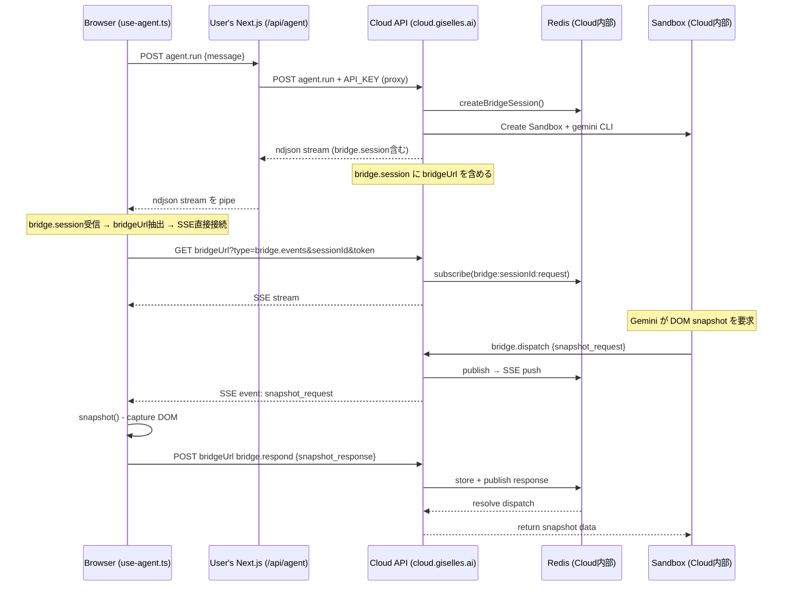
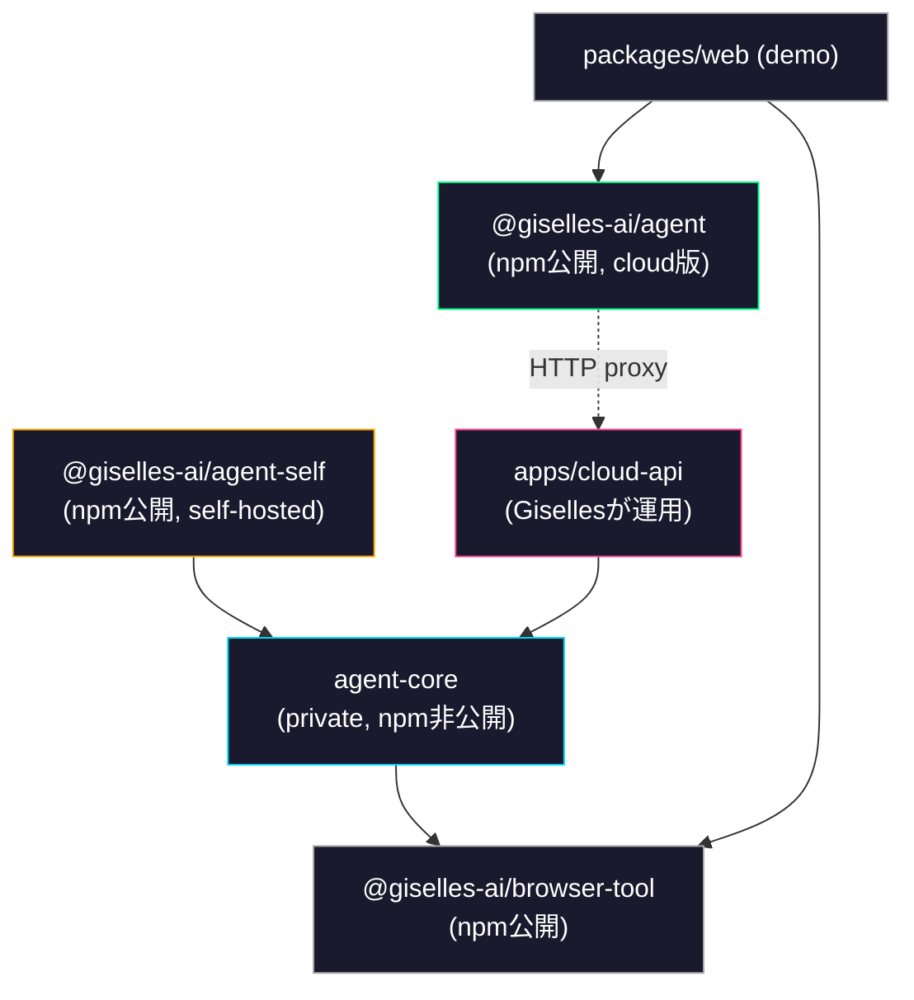

# Cloud Service 化 実装プラン

## 概要

agent-container の API を Giselles Cloud Service として提供し、ユーザーが `GISELLE_SANDBOX_AGENT_API_KEY` のみで利用可能にする。

### Before / After

| 項目 | Before (現状) | After (Cloud Service) |
|---|---|---|
| ユーザーが設定する環境変数 | `GEMINI_API_KEY`, `BROWSER_TOOL_SANDBOX_SNAPSHOT_ID`, `REDIS_URL` | `GISELLE_SANDBOX_AGENT_API_KEY` |
| 必要な外部アカウント | Google AI Studio, Vercel, Redis Cloud | なし (Giselles のみ) |
| API handler のインポート | `@giselles-ai/agent` | `@giselles-ai/agent` (同名だがcloud版) |
| route.ts に export する HTTP method | `GET`, `POST` | `POST` のみ |

---

## 意思決定サマリー (5つの検討ポイント)

### 1. SSE bridge handling × API分離レベル → **Hybrid方式 (Option B)**

`agent.run` POST のみユーザーの Next.js を経由（proxy）。SSE (`bridge.events`) と `bridge.respond` はブラウザから Cloud API へ直接接続する。

**理由:**
- Vercel Functions の実行時間制限 (Hobby: 10秒, Pro: 60秒) で SSE の長時間接続をプロキシ不可
- 20秒タイムアウト内での DOM 操作完了に 2 ホップ増は致命的
- ユーザー側実装は `agent.run` の fetch forward + stream pipe のみで済む
- CORS は `Access-Control-Allow-Origin: *` で解決 (bridge session token が認証)

### 2. パッケージ構成 → **別パッケージに分離**

npm 公開時に cloud 版ユーザーの `package.json` に `ioredis`, `@vercel/sandbox` が含まれるのは不自然なため、subpath export ではなく別パッケージにする。

### 3. API shape → **Cloud版は `{ POST }` のみ、Self-hosted版は `{ GET, POST }`**

Cloud版は SSE が `bridgeUrl` 経由で直接 Cloud API に行くため GET handler 不要。

### 4. API Key → **Giselle Cloud (studio.giselles.ai) の既存 API KEY 機能を再利用**

新規の API Key 管理基盤は作らない。

### 5. Self-hosted → **`@giselles-ai/agent-self` として維持、専用サポート窓口は用意しない**

---

## アーキテクチャ

### 現状

```
Browser (use-agent.ts)
  └─ /api/agent (User's Next.js)
       ├─ Gemini API (GEMINI_API_KEY)
       ├─ Vercel Sandbox (BROWSER_TOOL_SANDBOX_SNAPSHOT_ID)
       └─ Redis (REDIS_URL)
```

### Cloud Service 化後

```
Browser (use-agent.ts)
  ├─ POST agent.run → /api/agent (User's Next.js) → Cloud API
  ├─ GET bridge.events → Cloud API (直接)     ← bridgeUrl から取得
  └─ POST bridge.respond → Cloud API (直接)   ← bridgeUrl から取得
```

### シーケンス図



---

## パッケージ構成

### Before (現状)

```
packages/
  agent/            → @giselles-ai/agent
  │ src/
  │   index.ts          handleAgentRunner() → { GET, POST }
  │   internal/
  │     bridge-broker.ts   Redis pub/sub
  │     chat-handler.ts    Sandbox + Gemini CLI
  │   react/
  │     index.ts
  │     use-agent.ts       useAgent hook
  │     provider.tsx       BrowserToolProvider
  │     prompt-panel.tsx
  │     use-browser-tool.ts
  │ package.json        deps: ioredis, @vercel/sandbox, zod
  │
  browser-tool/     → @giselles-ai/browser-tool
  web/              → demo app (Next.js)
```

### After (Cloud Service 化後)

```
packages/
  agent-core/           ← NEW: 内部パッケージ (npm非公開, private: true)
  │ src/
  │   index.ts              re-export bridge-broker, chat-handler
  │   bridge-broker.ts      現 packages/agent/src/internal/bridge-broker.ts を移動
  │   chat-handler.ts       現 packages/agent/src/internal/chat-handler.ts を移動
  │ package.json            deps: ioredis, @vercel/sandbox, zod, @giselles-ai/browser-tool
  │
  agent/                ← MODIFY: @giselles-ai/agent (npm公開, cloud版)
  │ src/
  │   index.ts              handleAgentRunner({ apiKey }) → { POST }
  │   react/
  │     index.ts            既存 exports (変更なし)
  │     use-agent.ts        bridgeUrl 対応を追加
  │     provider.tsx        変更なし
  │     prompt-panel.tsx    変更なし
  │     use-browser-tool.ts 変更なし
  │ package.json            deps: zod のみ (ioredis, @vercel/sandbox 削除)
  │
  agent-self/           ← NEW: @giselles-ai/agent-self (npm公開, self-hosted版)
  │ src/
  │   index.ts              handleAgentRunner({ tools }) → { GET, POST }
  │   react/
  │     index.ts            → re-export from @giselles-ai/agent/react
  │ package.json            deps: @giselles-ai/agent-core
  │
  browser-tool/         → @giselles-ai/browser-tool (変更なし)
  │
  web/                  → demo app (cloud版を使うように変更)

apps/
  cloud-api/            ← NEW: Cloud API サービス本体
  │ src/
  │   index.ts              HTTP server (Hono or Next.js)
  │   routes/
  │     agent.ts            GET (SSE) + POST (agent.run, dispatch, respond)
  │ package.json            deps: @giselles-ai/agent-core
```

### パッケージ依存関係



---

## 各パッケージの詳細仕様

### 1. `packages/agent-core` (NEW)

内部パッケージ。`agent-self` と `apps/cloud-api` が使う。npm 非公開。

#### package.json

```jsonc
{
  "name": "@giselles-ai/agent-core",
  "version": "0.1.0",
  "private": true,
  "type": "module",
  "sideEffects": false,
  "exports": {
    ".": {
      "types": "./dist/index.d.ts",
      "import": "./dist/index.js"
    }
  },
  "dependencies": {
    "@giselles-ai/browser-tool": "workspace:*",
    "@google/gemini-cli-core": "^0.28.2",
    "@vercel/sandbox": "^1.0.0",
    "ioredis": "^5.9.2",
    "zod": "4.3.6"
  }
}
```

#### exports

現在の `packages/agent/src/internal/` のファイルをそのまま移動して re-export:

```ts
// src/index.ts
export {
  assertBridgeSession,
  BRIDGE_SSE_KEEPALIVE_INTERVAL_MS,
  bridgeRequestChannel,
  createBridgeSession,
  createBridgeSubscriber,
  dispatchBridgeRequest,
  markBridgeBrowserConnected,
  resolveBridgeResponse,
  toBridgeError,
  touchBridgeBrowserConnected,
} from "./bridge-broker";

export { createGeminiChatHandler } from "./chat-handler";
```

#### ファイル移動

| From | To |
|---|---|
| `packages/agent/src/internal/bridge-broker.ts` | `packages/agent-core/src/bridge-broker.ts` |
| `packages/agent/src/internal/chat-handler.ts` | `packages/agent-core/src/chat-handler.ts` |

---

### 2. `packages/agent` (MODIFY — Cloud版)

npm 公開パッケージ。ユーザーが cloud mode で使う薄い proxy。

#### package.json 変更点

```jsonc
{
  "name": "@giselles-ai/agent",
  "version": "0.2.0",   // ← バージョンアップ
  "dependencies": {
    "@giselles-ai/browser-tool": "workspace:*",
    "zod": "4.3.6"
    // ioredis 削除
    // @vercel/sandbox 削除
  },
  "peerDependencies": {
    "react": ">=19.0.0",
    "react-dom": ">=19.0.0"
  }
}
```

#### `src/index.ts` — Cloud版 `handleAgentRunner`

**入力型:**

```ts
type AgentRunnerOptions = {
  apiKey: string;
  cloudApiUrl?: string; // default: "https://cloud.giselles.ai"
};
```

**出力型:**

```ts
type AgentRunnerHandler = {
  POST: (request: Request) => Promise<Response>;
  // GET は不要 (SSE は bridgeUrl 経由で Cloud API に直接行く)
};
```

**実装の要点:**

1. `agent.run` POST のみを受け付ける
2. リクエストボディをパースし、Cloud API に forward
3. Cloud API からの ndjson レスポンスをそのまま pipe して返す
4. `Authorization: Bearer ${apiKey}` ヘッダーを付与

```ts
// 疑似コード
export function handleAgentRunner(options: AgentRunnerOptions): AgentRunnerHandler {
  const cloudApiUrl = options.cloudApiUrl ?? "https://cloud.giselles.ai";

  return {
    POST: async (request: Request): Promise<Response> => {
      const payload = await request.json();
      const parsed = agentRunSchema.safeParse(payload);
      if (!parsed.success) {
        return Response.json({ ok: false, error: "Invalid request" }, { status: 400 });
      }

      const cloudResponse = await fetch(`${cloudApiUrl}/api/agent`, {
        method: "POST",
        headers: {
          "content-type": "application/json",
          "authorization": `Bearer ${options.apiKey}`,
        },
        body: JSON.stringify(parsed.data),
      });

      // ndjson stream をそのまま pipe
      return new Response(cloudResponse.body, {
        status: cloudResponse.status,
        headers: {
          "Content-Type": "application/x-ndjson; charset=utf-8",
          "Cache-Control": "no-cache, no-transform",
        },
      });
    },
  };
}
```

#### route.ts (ユーザー側の使い方)

```ts
// Cloud版 route.ts
import { handleAgentRunner } from "@giselles-ai/agent";

const handler = handleAgentRunner({
  apiKey: process.env.GISELLE_SANDBOX_AGENT_API_KEY!,
});

export const POST = handler.POST;
// GET は不要
```

#### `src/react/use-agent.ts` — `bridgeUrl` 対応

**変更箇所1: `handleStreamEvent` 内の `bridge.session` イベント処理**

現状:
```ts
if (event.type === "bridge.session") {
  const sessionId = asString(event.sessionId);
  const token = asString(event.token);
  // ...
  sessionRef.current = { sessionId, token, expiresAt };
  connect();
}
```

変更後:
```ts
if (event.type === "bridge.session") {
  const sessionId = asString(event.sessionId);
  const token = asString(event.token);
  const bridgeUrl = asString(event.bridgeUrl); // ← NEW
  // ...
  sessionRef.current = { sessionId, token, expiresAt, bridgeUrl }; // ← bridgeUrl追加
  connect();
}
```

**変更箇所2: `BridgeSession` 型**

```ts
type BridgeSession = {
  sessionId: string;
  token: string;
  expiresAt: number;
  bridgeUrl: string | null; // ← NEW: null = self-hosted mode
};
```

**変更箇所3: `connect` 関数の EventSource URL**

現状:
```ts
const source = new EventSource(
  `${normalizedEndpoint}?type=bridge.events&sessionId=...&token=...`
);
```

変更後:
```ts
const bridgeBase = currentSession.bridgeUrl ?? normalizedEndpoint;
const source = new EventSource(
  `${bridgeBase}?type=bridge.events&sessionId=...&token=...`
);
```

**変更箇所4: `handleBridgeResponse` の fetch URL**

現状:
```ts
const response = await fetch(normalizedEndpoint, {
  method: "POST",
  body: JSON.stringify({
    type: "bridge.respond",
    // ...
  }),
});
```

変更後:
```ts
const bridgeBase = currentSession.bridgeUrl ?? normalizedEndpoint;
const response = await fetch(bridgeBase, {
  method: "POST",
  body: JSON.stringify({
    type: "bridge.respond",
    // ...
  }),
});
```

**判定ロジック:**

| `bridgeUrl` の値 | 動作 |
|---|---|
| `"https://cloud.giselles.ai/api/agent"` (文字列) | Cloud mode — SSE/respond は bridgeUrl へ直接 |
| `null` / `undefined` | Self-hosted mode — SSE/respond は normalizedEndpoint へ (従来通り) |

この変更により、**同じ `useAgent` hook が Cloud版・Self-hosted版 両方で動作する。**

---

### 3. `packages/agent-self` (NEW)

npm 公開パッケージ。self-hosted mode 用。現在の `packages/agent` の server-side ロジックをそのまま引き継ぐ。

#### package.json

```jsonc
{
  "name": "@giselles-ai/agent-self",
  "version": "0.1.0",
  "type": "module",
  "sideEffects": false,
  "exports": {
    ".": {
      "types": "./dist/index.d.ts",
      "import": "./dist/index.js"
    },
    "./react": {
      "types": "./dist/react/index.d.ts",
      "import": "./dist/react/index.js"
    }
  },
  "dependencies": {
    "@giselles-ai/agent-core": "workspace:*",
    "@giselles-ai/browser-tool": "workspace:*",
    "zod": "4.3.6"
  },
  "peerDependencies": {
    "react": ">=19.0.0",
    "react-dom": ">=19.0.0"
  }
}
```

#### `src/index.ts`

現在の `packages/agent/src/index.ts` をほぼそのまま移動。`@giselles-ai/agent-core` から import するように変更。

```ts
import { createGeminiChatHandler } from "@giselles-ai/agent-core";
import {
  assertBridgeSession,
  BRIDGE_SSE_KEEPALIVE_INTERVAL_MS,
  bridgeRequestChannel,
  createBridgeSession,
  createBridgeSubscriber,
  dispatchBridgeRequest,
  markBridgeBrowserConnected,
  resolveBridgeResponse,
  toBridgeError,
  touchBridgeBrowserConnected,
} from "@giselles-ai/agent-core";

// ... 現状の handleAgentRunner() をそのまま配置
// 戻り値は { GET, POST }
```

#### `src/react/index.ts`

`@giselles-ai/agent/react` から re-export するだけ:

```ts
export {
  PromptPanel,
  BrowserToolProvider,
  useAgent,
  useBrowserTool,
  type AgentHookState,
  type AgentMessage,
  type AgentStatus,
  type ToolEvent,
  type UseAgentOptions,
} from "@giselles-ai/agent/react";
```

#### route.ts (self-hosted ユーザーの使い方)

```ts
// Self-hosted版 route.ts
import { handleAgentRunner } from "@giselles-ai/agent-self";

const handler = handleAgentRunner({ tools: { browser: true } });

export const GET = handler.GET;
export const POST = handler.POST;
```

---

### 4. `apps/cloud-api` (NEW)

Giselles が運用する Cloud API サービス本体。

#### 責務

1. `agent.run` POST を受け、`agent-core` の `createGeminiChatHandler` で Sandbox + Gemini CLI を実行
2. SSE (`bridge.events` GET) を提供
3. `bridge.dispatch` / `bridge.respond` POST を処理
4. `Authorization: Bearer <API_KEY>` の検証 (Giselle Cloud の API Key)
5. CORS ヘッダー設定 (`Access-Control-Allow-Origin: *`)

#### package.json

```jsonc
{
  "name": "cloud-api",
  "version": "0.1.0",
  "private": true,
  "dependencies": {
    "@giselles-ai/agent-core": "workspace:*",
    "@giselles-ai/browser-tool": "workspace:*",
    "zod": "4.3.6"
    // + HTTP framework (Hono, Next.js, etc. — 要決定)
  }
}
```

#### ルーティング

| Method | Path | 処理 | 認証 |
|---|---|---|---|
| `POST` | `/api/agent` | `agent.run` — bridge session 作成 + Sandbox起動 + ndjson stream | API Key |
| `GET` | `/api/agent` | `bridge.events` — SSE ストリーム | bridge session token |
| `POST` | `/api/agent` | `bridge.dispatch` — MCP server からの要求 | bridge session token |
| `POST` | `/api/agent` | `bridge.respond` — ブラウザからの応答 | bridge session token |
| `OPTIONS` | `/api/agent` | CORS preflight | なし |

#### `bridge.session` イベントに `bridgeUrl` を追加

`agent.run` の ndjson ストリームの先頭に含まれる `bridge.session` イベントに `bridgeUrl` フィールドを追加:

**現状の bridge.session イベント:**
```json
{
  "type": "bridge.session",
  "sessionId": "uuid-1234",
  "token": "token-5678",
  "expiresAt": 1740000000000
}
```

**変更後:**
```json
{
  "type": "bridge.session",
  "sessionId": "uuid-1234",
  "token": "token-5678",
  "expiresAt": 1740000000000,
  "bridgeUrl": "https://cloud.giselles.ai/api/agent"
}
```

`bridgeUrl` は Cloud API のオリジン + パスで、ブラウザが SSE 接続と `bridge.respond` POST に使う URL。

#### CORS 設定

```ts
// すべてのレスポンスに付与
{
  "Access-Control-Allow-Origin": "*",
  "Access-Control-Allow-Methods": "GET, POST, OPTIONS",
  "Access-Control-Allow-Headers": "Content-Type, Authorization",
}
```

CORS を `*` にしても安全な理由:
- bridge session の `token` 自体が認証として機能
- Cookie ベースの認証は不使用
- `agent.run` のみ API Key が必要だが、これはユーザーの Next.js server-side から呼ばれるためブラウザに露出しない

---

## `mergeBridgeSessionStream` の変更 (Cloud API 側)

Cloud API の `agent.run` ハンドラーで、`bridge.session` イベントに `bridgeUrl` を注入する:

**現状 (packages/agent/src/index.ts L258-263):**
```ts
const bridgeSessionEvent = `${JSON.stringify({
  type: "bridge.session",
  sessionId: input.session.sessionId,
  token: input.session.token,
  expiresAt: input.session.expiresAt,
})}\n`;
```

**Cloud API 版:**
```ts
const bridgeSessionEvent = `${JSON.stringify({
  type: "bridge.session",
  sessionId: input.session.sessionId,
  token: input.session.token,
  expiresAt: input.session.expiresAt,
  bridgeUrl: `${cloudApiOrigin}/api/agent`,  // ← NEW
})}\n`;
```

Self-hosted 版 (`@giselles-ai/agent-self`) では `bridgeUrl` を含めない (= `undefined`)。これにより `use-agent.ts` は `normalizedEndpoint` にフォールバックする。

---

## 環境変数の整理

### Cloud版ユーザー (packages/web/.env)

```env
GISELLE_SANDBOX_AGENT_API_KEY=gsl_xxxxxxxxxxxxx
```

### Self-hosted版ユーザー

```env
GEMINI_API_KEY=
BROWSER_TOOL_SANDBOX_SNAPSHOT_ID=
REDIS_URL=
# Optional
# BROWSER_TOOL_BRIDGE_BASE_URL=
# GISELLE_PROTECTION_PASSWORD=
# VERCEL_PROTECTION_BYPASS=
```

### Cloud API サービス (apps/cloud-api/.env)

```env
GEMINI_API_KEY=
BROWSER_TOOL_SANDBOX_SNAPSHOT_ID=
REDIS_URL=
CLOUD_API_ORIGIN=https://cloud.giselles.ai
# API Key 検証用 (Giselle Cloud の既存機能を利用)
GISELLE_CLOUD_API_ENDPOINT=https://studio.giselles.ai/api/...
```

---

## 実装ステップ (順序付き)

### Phase 1: パッケージ分離 (Breaking Change なし)

| Step | 作業 | 影響範囲 |
|---|---|---|
| 1-1 | `packages/agent-core/` を作成 | 新規パッケージ |
| 1-2 | `packages/agent/src/internal/bridge-broker.ts` → `packages/agent-core/src/bridge-broker.ts` にコピー | 新規ファイル |
| 1-3 | `packages/agent/src/internal/chat-handler.ts` → `packages/agent-core/src/chat-handler.ts` にコピー | 新規ファイル |
| 1-4 | `packages/agent-core/src/index.ts` で re-export | 新規ファイル |
| 1-5 | `packages/agent-core/package.json`, `tsconfig.json`, `tsup.ts` を作成 | 新規ファイル |
| 1-6 | `pnpm-workspace.yaml` に `packages/agent-core` が含まれることを確認 (既に `packages/*` で含まれる) | 確認のみ |
| 1-7 | ビルド確認 (`pnpm build` が通ること) | — |

### Phase 2: `agent-self` パッケージ作成

| Step | 作業 | 影響範囲 |
|---|---|---|
| 2-1 | `packages/agent-self/` を作成 | 新規パッケージ |
| 2-2 | `packages/agent/src/index.ts` の `handleAgentRunner` + 関連コードを `packages/agent-self/src/index.ts` にコピー | 新規ファイル |
| 2-3 | import 元を `./internal/bridge-broker` → `@giselles-ai/agent-core` に変更 | agent-self のみ |
| 2-4 | `packages/agent-self/src/react/index.ts` で `@giselles-ai/agent/react` を re-export | 新規ファイル |
| 2-5 | `packages/agent-self/package.json`, `tsconfig.json`, `tsup.ts` を作成 | 新規ファイル |
| 2-6 | ビルド確認 | — |

### Phase 3: `packages/agent` を Cloud版に変換

| Step | 作業 | 影響範囲 |
|---|---|---|
| 3-1 | `packages/agent/src/internal/` を削除 | agent パッケージ |
| 3-2 | `packages/agent/src/index.ts` を Cloud 版 proxy に書き換え | agent パッケージ |
| 3-3 | `packages/agent/package.json` から `ioredis`, `@vercel/sandbox` を削除 | agent パッケージ |
| 3-4 | `packages/agent/src/react/use-agent.ts` に `bridgeUrl` 対応を追加 | agent パッケージ |
| 3-5 | ビルド確認 | — |

### Phase 4: `apps/cloud-api` 作成

| Step | 作業 | 影響範囲 |
|---|---|---|
| 4-1 | `apps/cloud-api/` を作成 | 新規アプリ |
| 4-2 | HTTP server + ルーティング実装 | 新規ファイル |
| 4-3 | `agent.run` ハンドラー: API Key 検証 + `agent-core` の `createGeminiChatHandler` 呼び出し + `bridgeUrl` 注入 | 新規ファイル |
| 4-4 | SSE (`bridge.events`) ハンドラー: 現 `createBridgeEventsRoute` を移植 | 新規ファイル |
| 4-5 | `bridge.dispatch` / `bridge.respond` ハンドラー: 現行ロジックを移植 | 新規ファイル |
| 4-6 | CORS middleware 追加 | 新規ファイル |
| 4-7 | API Key 検証ミドルウェア (Giselle Cloud 既存 API を呼ぶ) | 新規ファイル |

### Phase 5: Demo app (packages/web) を Cloud版に移行

| Step | 作業 | 影響範囲 |
|---|---|---|
| 5-1 | `packages/web/app/api/agent/route.ts` を Cloud版に書き換え | 1ファイル |
| 5-2 | `packages/web/.env.example` を更新 | 1ファイル |
| 5-3 | `packages/web/package.json` から不要な deps を整理 | 1ファイル |
| 5-4 | 動作確認 | — |

---

## ファイル変更の全量サマリー

### 新規作成

| ファイル | 概要 |
|---|---|
| `packages/agent-core/package.json` | 内部パッケージ設定 |
| `packages/agent-core/tsconfig.json` | TypeScript 設定 |
| `packages/agent-core/tsup.ts` | ビルド設定 |
| `packages/agent-core/src/index.ts` | re-export |
| `packages/agent-core/src/bridge-broker.ts` | Redis bridge (移動元のコピー) |
| `packages/agent-core/src/chat-handler.ts` | Sandbox + Gemini CLI (移動元のコピー) |
| `packages/agent-self/package.json` | self-hosted パッケージ設定 |
| `packages/agent-self/tsconfig.json` | TypeScript 設定 |
| `packages/agent-self/tsup.ts` | ビルド設定 |
| `packages/agent-self/src/index.ts` | handleAgentRunner → { GET, POST } |
| `packages/agent-self/src/react/index.ts` | re-export from @giselles-ai/agent/react |
| `apps/cloud-api/package.json` | Cloud API サービス設定 |
| `apps/cloud-api/src/index.ts` | HTTP server エントリポイント |
| `apps/cloud-api/src/routes/agent.ts` | agent ルートハンドラー |

### 変更

| ファイル | 変更内容 |
|---|---|
| `packages/agent/src/index.ts` | 全面書き換え: Cloud proxy 版に |
| `packages/agent/src/react/use-agent.ts` | `bridgeUrl` 対応 (BridgeSession型 + connect + handleBridgeResponse) |
| `packages/agent/package.json` | `ioredis`, `@vercel/sandbox` 削除 |
| `packages/web/app/api/agent/route.ts` | Cloud版 handler に変更、GET export 削除 |
| `packages/web/.env.example` | `GISELLE_SANDBOX_AGENT_API_KEY` のみに |
| `packages/web/package.json` | 不要な deps 削除 |

### 削除

| ファイル | 理由 |
|---|---|
| `packages/agent/src/internal/bridge-broker.ts` | `agent-core` に移動済み |
| `packages/agent/src/internal/chat-handler.ts` | `agent-core` に移動済み |

---

## 検証チェックリスト

- [ ] `pnpm build` が全パッケージで通ること
- [ ] `pnpm typecheck` が全パッケージで通ること
- [ ] Cloud版: `packages/web` が `GISELLE_SANDBOX_AGENT_API_KEY` のみで動作すること
- [ ] Cloud版: ブラウザから Cloud API への SSE 直接接続が CORS エラーなく動作すること
- [ ] Cloud版: `bridge.respond` POST が Cloud API に直接届くこと
- [ ] Cloud版: DOM snapshot → execute のフル往復が 20 秒以内に完了すること
- [ ] Self-hosted版: `@giselles-ai/agent-self` で従来通り `{ GET, POST }` が動作すること
- [ ] React hook: `bridgeUrl` あり(Cloud) / なし(Self-hosted) の両方で正しく動作すること
