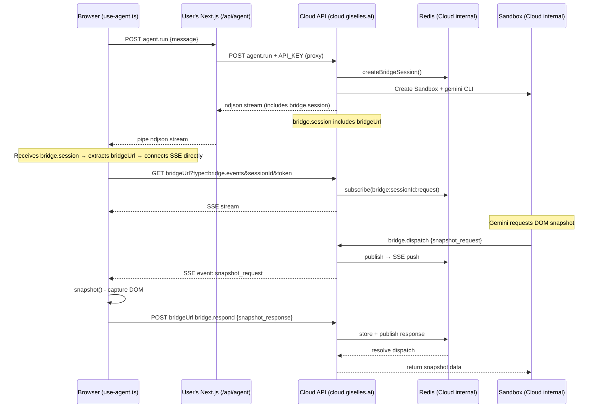
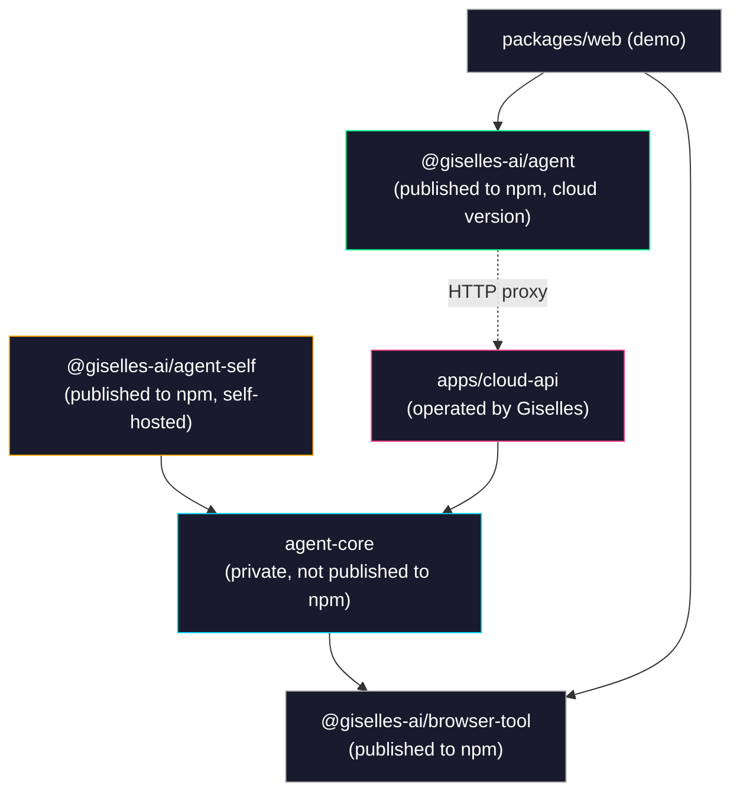

# Cloud Service Implementation Plan

## Overview

Provide the agent-container API as a Giselles Cloud Service, enabling users to get started with only `GISELLE_SANDBOX_AGENT_API_KEY`.

### Before / After

| Item | Before (Current) | After (Cloud Service) |
|---|---|---|
| Env vars set by user | `GEMINI_API_KEY`, `SANDBOX_SNAPSHOT_ID`, `REDIS_URL` | `GISELLE_SANDBOX_AGENT_API_KEY` |
| Required external accounts | Google AI Studio, Vercel, Redis Cloud | None (Giselles only) |
| API handler import | `@giselles-ai/agent` | `@giselles-ai/agent` (same name but cloud version) |
| HTTP methods exported in route.ts | `GET`, `POST` | `POST` only |

---

## Decision Summary (5 discussion points)

### 1. SSE bridge handling × API separation level → **Hybrid approach (Option B)**

Only `agent.run` POST goes through the user's Next.js (proxy). SSE (`bridge.events`) and `bridge.respond` connect directly from the browser to the Cloud API.

**Rationale:**
- Vercel Functions execution time limits (Hobby: 10s, Pro: 60s) make it impossible to proxy long-lived SSE connections
- Adding 2 extra hops to DOM operations that must complete within a 20-second timeout is critical
- User-side implementation only requires fetch forwarding + stream piping for `agent.run`
- CORS is resolved with `Access-Control-Allow-Origin: *` (bridge session token serves as authentication)

### 2. Package structure → **Separate into a different package**

It would be unnatural for cloud-mode users to have `ioredis` and `@vercel/sandbox` in their `package.json` when published to npm, so a separate package is preferred over subpath exports.

### 3. API shape → **Cloud version exports `{ POST }` only, Self-hosted exports `{ GET, POST }`**

The cloud version doesn't need a GET handler since SSE goes directly to the Cloud API via `bridgeUrl`.

### 4. API Key → **Reuse existing API KEY functionality from Giselle Cloud (studio.giselles.ai)**

No new API Key management infrastructure is needed.

### 5. Self-hosted → **Maintained as `@giselles-ai/agent-self`, no dedicated support channel**

---

## Architecture

### Current

```
Browser (use-agent.ts)
  └─ /api/agent (User's Next.js)
       ├─ Gemini API (GEMINI_API_KEY)
       ├─ Vercel Sandbox (SANDBOX_SNAPSHOT_ID)
       └─ Redis (REDIS_URL)
```

### After Cloud Service

```
Browser (use-agent.ts)
  ├─ POST agent.run → /api/agent (User's Next.js) → Cloud API
  ├─ GET bridge.events → Cloud API (direct)     ← obtained from bridgeUrl
  └─ POST bridge.respond → Cloud API (direct)   ← obtained from bridgeUrl
```

### Sequence Diagram



---

## Package Structure

### Before (Current)

```
packages/
  agent/            → @giselles-ai/agent
  │ src/
  │   index.ts          handleAgentRunner() → { GET, POST }
  │   internal/
  │     bridge-broker.ts   Redis pub/sub
  │     chat-handler.ts    Sandbox + Gemini CLI
  │   react/
  │     index.ts
  │     use-agent.ts       useAgent hook
  │     provider.tsx       BrowserToolProvider
  │     prompt-panel.tsx
  │     use-browser-tool.ts
  │ package.json        deps: ioredis, @vercel/sandbox, zod
  │
  browser-tool/     → @giselles-ai/browser-tool
  web/              → demo app (Next.js)
```

### After (Cloud Service)

```
packages/
  agent-core/           ← NEW: Internal package (not published to npm, private: true)
  │ src/
  │   index.ts              re-export bridge-broker, chat-handler
  │   bridge-broker.ts      Moved from packages/agent/src/internal/bridge-broker.ts
  │   chat-handler.ts       Moved from packages/agent/src/internal/chat-handler.ts
  │ package.json            deps: ioredis, @vercel/sandbox, zod, @giselles-ai/browser-tool
  │
  agent/                ← MODIFY: @giselles-ai/agent (published to npm, cloud version)
  │ src/
  │   index.ts              handleAgentRunner({ apiKey }) → { POST }
  │   react/
  │     index.ts            Existing exports (unchanged)
  │     use-agent.ts        Add bridgeUrl support
  │     provider.tsx        Unchanged
  │     prompt-panel.tsx    Unchanged
  │     use-browser-tool.ts Unchanged
  │ package.json            deps: zod only (ioredis, @vercel/sandbox removed)
  │
  agent-self/           ← NEW: @giselles-ai/agent-self (published to npm, self-hosted version)
  │ src/
  │   index.ts              handleAgentRunner({ tools }) → { GET, POST }
  │   react/
  │     index.ts            → re-export from @giselles-ai/agent/react
  │ package.json            deps: @giselles-ai/agent-core
  │
  browser-tool/         → @giselles-ai/browser-tool (unchanged)
  │
  web/                  → demo app (changed to use cloud version)

apps/
  cloud-api/            ← NEW: Cloud API service
  │ src/
  │   index.ts              HTTP server (Hono or Next.js)
  │   routes/
  │     agent.ts            GET (SSE) + POST (agent.run, dispatch, respond)
  │ package.json            deps: @giselles-ai/agent-core
```

### Package Dependency Graph



---

## Detailed Specifications per Package

### 1. `packages/agent-core` (NEW)

Internal package. Used by `agent-self` and `apps/cloud-api`. Not published to npm.

#### package.json

```jsonc
{
  "name": "@giselles-ai/agent-core",
  "version": "0.1.0",
  "private": true,
  "type": "module",
  "sideEffects": false,
  "exports": {
    ".": {
      "types": "./dist/index.d.ts",
      "import": "./dist/index.js"
    }
  },
  "dependencies": {
    "@giselles-ai/browser-tool": "workspace:*",
    "@google/gemini-cli-core": "^0.28.2",
    "@vercel/sandbox": "^1.0.0",
    "ioredis": "^5.9.2",
    "zod": "4.3.6"
  }
}
```

#### exports

Move and re-export the files from `packages/agent/src/internal/` as-is:

```ts
// src/index.ts
export {
  assertBridgeSession,
  BRIDGE_SSE_KEEPALIVE_INTERVAL_MS,
  bridgeRequestChannel,
  createBridgeSession,
  createBridgeSubscriber,
  dispatchBridgeRequest,
  markBridgeBrowserConnected,
  resolveBridgeResponse,
  toBridgeError,
  touchBridgeBrowserConnected,
} from "./bridge-broker";

export { createGeminiChatHandler } from "./chat-handler";
```

#### File moves

| From | To |
|---|---|
| `packages/agent/src/internal/bridge-broker.ts` | `packages/agent-core/src/bridge-broker.ts` |
| `packages/agent/src/internal/chat-handler.ts` | `packages/agent-core/src/chat-handler.ts` |

---

### 2. `packages/agent` (MODIFY — Cloud version)

Published npm package. A thin proxy for users in cloud mode.

#### package.json changes

```jsonc
{
  "name": "@giselles-ai/agent",
  "version": "0.2.0",   // ← version bump
  "dependencies": {
    "@giselles-ai/browser-tool": "workspace:*",
    "zod": "4.3.6"
    // ioredis removed
    // @vercel/sandbox removed
  },
  "peerDependencies": {
    "react": ">=19.0.0",
    "react-dom": ">=19.0.0"
  }
}
```

#### `src/index.ts` — Cloud version `handleAgentRunner`

**Input type:**

```ts
type AgentRunnerOptions = {
  apiKey: string;
  cloudApiUrl?: string; // default: "https://cloud.giselles.ai"
};
```

**Output type:**

```ts
type AgentRunnerHandler = {
  POST: (request: Request) => Promise<Response>;
  // GET is not needed (SSE goes directly to Cloud API via bridgeUrl)
};
```

**Implementation key points:**

1. Accepts only `agent.run` POST
2. Parses the request body and forwards it to the Cloud API
3. Pipes the ndjson response from the Cloud API as-is
4. Adds `Authorization: Bearer ${apiKey}` header

```ts
// Pseudo-code
export function handleAgentRunner(options: AgentRunnerOptions): AgentRunnerHandler {
  const cloudApiUrl = options.cloudApiUrl ?? "https://cloud.giselles.ai";

  return {
    POST: async (request: Request): Promise<Response> => {
      const payload = await request.json();
      const parsed = agentRunSchema.safeParse(payload);
      if (!parsed.success) {
        return Response.json({ ok: false, error: "Invalid request" }, { status: 400 });
      }

      const cloudResponse = await fetch(`${cloudApiUrl}/api/agent`, {
        method: "POST",
        headers: {
          "content-type": "application/json",
          "authorization": `Bearer ${options.apiKey}`,
        },
        body: JSON.stringify(parsed.data),
      });

      // Pipe ndjson stream as-is
      return new Response(cloudResponse.body, {
        status: cloudResponse.status,
        headers: {
          "Content-Type": "application/x-ndjson; charset=utf-8",
          "Cache-Control": "no-cache, no-transform",
        },
      });
    },
  };
}
```

#### route.ts (user-side usage)

```ts
// Cloud version route.ts
import { handleAgentRunner } from "@giselles-ai/agent";

const handler = handleAgentRunner({
  apiKey: process.env.GISELLE_SANDBOX_AGENT_API_KEY!,
});

export const POST = handler.POST;
// GET is not needed
```

#### `src/react/use-agent.ts` — `bridgeUrl` support

**Change 1: `bridge.session` event handling in `handleStreamEvent`**

Before:
```ts
if (event.type === "bridge.session") {
  const sessionId = asString(event.sessionId);
  const token = asString(event.token);
  // ...
  sessionRef.current = { sessionId, token, expiresAt };
  connect();
}
```

After:
```ts
if (event.type === "bridge.session") {
  const sessionId = asString(event.sessionId);
  const token = asString(event.token);
  const bridgeUrl = asString(event.bridgeUrl); // ← NEW
  // ...
  sessionRef.current = { sessionId, token, expiresAt, bridgeUrl }; // ← added bridgeUrl
  connect();
}
```

**Change 2: `BridgeSession` type**

```ts
type BridgeSession = {
  sessionId: string;
  token: string;
  expiresAt: number;
  bridgeUrl: string | null; // ← NEW: null = self-hosted mode
};
```

**Change 3: EventSource URL in `connect` function**

Before:
```ts
const source = new EventSource(
  `${normalizedEndpoint}?type=bridge.events&sessionId=...&token=...`
);
```

After:
```ts
const bridgeBase = currentSession.bridgeUrl ?? normalizedEndpoint;
const source = new EventSource(
  `${bridgeBase}?type=bridge.events&sessionId=...&token=...`
);
```

**Change 4: fetch URL in `handleBridgeResponse`**

Before:
```ts
const response = await fetch(normalizedEndpoint, {
  method: "POST",
  body: JSON.stringify({
    type: "bridge.respond",
    // ...
  }),
});
```

After:
```ts
const bridgeBase = currentSession.bridgeUrl ?? normalizedEndpoint;
const response = await fetch(bridgeBase, {
  method: "POST",
  body: JSON.stringify({
    type: "bridge.respond",
    // ...
  }),
});
```

**Decision logic:**

| `bridgeUrl` value | Behavior |
|---|---|
| `"https://cloud.giselles.ai/api/agent"` (string) | Cloud mode — SSE/respond goes directly to bridgeUrl |
| `null` / `undefined` | Self-hosted mode — SSE/respond goes to normalizedEndpoint (as before) |

With this change, **the same `useAgent` hook works for both Cloud and Self-hosted versions.**

---

### 3. `packages/agent-self` (NEW)

Published npm package. For self-hosted mode. Inherits the server-side logic from the current `packages/agent` as-is.

#### package.json

```jsonc
{
  "name": "@giselles-ai/agent-self",
  "version": "0.1.0",
  "type": "module",
  "sideEffects": false,
  "exports": {
    ".": {
      "types": "./dist/index.d.ts",
      "import": "./dist/index.js"
    },
    "./react": {
      "types": "./dist/react/index.d.ts",
      "import": "./dist/react/index.js"
    }
  },
  "dependencies": {
    "@giselles-ai/agent-core": "workspace:*",
    "@giselles-ai/browser-tool": "workspace:*",
    "zod": "4.3.6"
  },
  "peerDependencies": {
    "react": ">=19.0.0",
    "react-dom": ">=19.0.0"
  }
}
```

#### `src/index.ts`

Move the current `packages/agent/src/index.ts` mostly as-is. Change imports to use `@giselles-ai/agent-core`.

```ts
import { createGeminiChatHandler } from "@giselles-ai/agent-core";
import {
  assertBridgeSession,
  BRIDGE_SSE_KEEPALIVE_INTERVAL_MS,
  bridgeRequestChannel,
  createBridgeSession,
  createBridgeSubscriber,
  dispatchBridgeRequest,
  markBridgeBrowserConnected,
  resolveBridgeResponse,
  toBridgeError,
  touchBridgeBrowserConnected,
} from "@giselles-ai/agent-core";

// ... place the current handleAgentRunner() as-is
// Return type is { GET, POST }
```

#### `src/react/index.ts`

Simply re-export from `@giselles-ai/agent/react`:

```ts
export {
  PromptPanel,
  BrowserToolProvider,
  useAgent,
  useBrowserTool,
  type AgentHookState,
  type AgentMessage,
  type AgentStatus,
  type ToolEvent,
  type UseAgentOptions,
} from "@giselles-ai/agent/react";
```

#### route.ts (self-hosted user usage)

```ts
// Self-hosted version route.ts
import { handleAgentRunner } from "@giselles-ai/agent-self";

const handler = handleAgentRunner({ tools: { browser: true } });

export const GET = handler.GET;
export const POST = handler.POST;
```

---

### 4. `apps/cloud-api` (NEW)

The Cloud API service operated by Giselles.

#### Responsibilities

1. Receive `agent.run` POST and execute Sandbox + Gemini CLI via `agent-core`'s `createGeminiChatHandler`
2. Provide SSE (`bridge.events` GET)
3. Handle `bridge.dispatch` / `bridge.respond` POST
4. Validate `Authorization: Bearer <API_KEY>` (Giselle Cloud API Key)
5. Set CORS headers (`Access-Control-Allow-Origin: *`)

#### package.json

```jsonc
{
  "name": "cloud-api",
  "version": "0.1.0",
  "private": true,
  "dependencies": {
    "@giselles-ai/agent-core": "workspace:*",
    "@giselles-ai/browser-tool": "workspace:*",
    "zod": "4.3.6"
    // + HTTP framework (Hono, Next.js, etc. — TBD)
  }
}
```

#### Routing

| Method | Path | Handler | Auth |
|---|---|---|---|
| `POST` | `/api/agent` | `agent.run` — create bridge session + start Sandbox + ndjson stream | API Key |
| `GET` | `/api/agent` | `bridge.events` — SSE stream | bridge session token |
| `POST` | `/api/agent` | `bridge.dispatch` — request from MCP server | bridge session token |
| `POST` | `/api/agent` | `bridge.respond` — response from browser | bridge session token |
| `OPTIONS` | `/api/agent` | CORS preflight | None |

#### Add `bridgeUrl` to `bridge.session` event

Add a `bridgeUrl` field to the `bridge.session` event included at the head of the `agent.run` ndjson stream:

**Current bridge.session event:**
```json
{
  "type": "bridge.session",
  "sessionId": "uuid-1234",
  "token": "token-5678",
  "expiresAt": 1740000000000
}
```

**After change:**
```json
{
  "type": "bridge.session",
  "sessionId": "uuid-1234",
  "token": "token-5678",
  "expiresAt": 1740000000000,
  "bridgeUrl": "https://cloud.giselles.ai/api/agent"
}
```

`bridgeUrl` is the Cloud API origin + path, the URL that the browser uses for SSE connections and `bridge.respond` POST.

#### CORS configuration

```ts
// Applied to all responses
{
  "Access-Control-Allow-Origin": "*",
  "Access-Control-Allow-Methods": "GET, POST, OPTIONS",
  "Access-Control-Allow-Headers": "Content-Type, Authorization",
}
```

Why `*` is safe for CORS:
- The bridge session `token` itself serves as authentication
- Cookie-based authentication is not used
- Only `agent.run` requires an API Key, and it is called from the user's Next.js server-side so it is never exposed to the browser

---

## `mergeBridgeSessionStream` Changes (Cloud API side)

In the Cloud API's `agent.run` handler, inject `bridgeUrl` into the `bridge.session` event:

**Current (packages/agent/src/index.ts L258-263):**
```ts
const bridgeSessionEvent = `${JSON.stringify({
  type: "bridge.session",
  sessionId: input.session.sessionId,
  token: input.session.token,
  expiresAt: input.session.expiresAt,
})}\n`;
```

**Cloud API version:**
```ts
const bridgeSessionEvent = `${JSON.stringify({
  type: "bridge.session",
  sessionId: input.session.sessionId,
  token: input.session.token,
  expiresAt: input.session.expiresAt,
  bridgeUrl: `${cloudApiOrigin}/api/agent`,  // ← NEW
})}\n`;
```

The self-hosted version (`@giselles-ai/agent-self`) does not include `bridgeUrl` (= `undefined`). This causes `use-agent.ts` to fall back to `normalizedEndpoint`.

---

## Environment Variable Summary

### Cloud version user (packages/web/.env)

```env
GISELLE_SANDBOX_AGENT_API_KEY=[REDACTED:api-key]
```

### Self-hosted version user

```env
GEMINI_API_KEY=
SANDBOX_SNAPSHOT_ID=
REDIS_URL=
# Optional
# BROWSER_TOOL_BRIDGE_BASE_URL=
# GISELLE_PROTECTION_PASSWORD=
# VERCEL_PROTECTION_BYPASS=
```

### Cloud API service (apps/cloud-api/.env)

```env
GEMINI_API_KEY=
SANDBOX_SNAPSHOT_ID=
REDIS_URL=
CLOUD_API_ORIGIN=https://cloud.giselles.ai
# For API Key verification (uses existing Giselle Cloud functionality)
GISELLE_CLOUD_API_ENDPOINT=https://studio.giselles.ai/api/...
```

---

## Implementation Steps (Ordered)

### Phase 1: Package separation (No Breaking Changes)

| Step | Task | Scope |
|---|---|---|
| 1-1 | Create `packages/agent-core/` | New package |
| 1-2 | Copy `packages/agent/src/internal/bridge-broker.ts` → `packages/agent-core/src/bridge-broker.ts` | New file |
| 1-3 | Copy `packages/agent/src/internal/chat-handler.ts` → `packages/agent-core/src/chat-handler.ts` | New file |
| 1-4 | Re-export in `packages/agent-core/src/index.ts` | New file |
| 1-5 | Create `packages/agent-core/package.json`, `tsconfig.json`, `tsup.ts` | New files |
| 1-6 | Confirm `pnpm-workspace.yaml` includes `packages/agent-core` (already covered by `packages/*`) | Verification only |
| 1-7 | Build verification (`pnpm build` passes) | — |

### Phase 2: Create `agent-self` package

| Step | Task | Scope |
|---|---|---|
| 2-1 | Create `packages/agent-self/` | New package |
| 2-2 | Copy `handleAgentRunner` + related code from `packages/agent/src/index.ts` to `packages/agent-self/src/index.ts` | New file |
| 2-3 | Change import source from `./internal/bridge-broker` → `@giselles-ai/agent-core` | agent-self only |
| 2-4 | Re-export `@giselles-ai/agent/react` in `packages/agent-self/src/react/index.ts` | New file |
| 2-5 | Create `packages/agent-self/package.json`, `tsconfig.json`, `tsup.ts` | New files |
| 2-6 | Build verification | — |

### Phase 3: Convert `packages/agent` to Cloud version

| Step | Task | Scope |
|---|---|---|
| 3-1 | Delete `packages/agent/src/internal/` | agent package |
| 3-2 | Rewrite `packages/agent/src/index.ts` to Cloud version proxy | agent package |
| 3-3 | Remove `ioredis`, `@vercel/sandbox` from `packages/agent/package.json` | agent package |
| 3-4 | Add `bridgeUrl` support to `packages/agent/src/react/use-agent.ts` | agent package |
| 3-5 | Build verification | — |

### Phase 4: Create `apps/cloud-api`

| Step | Task | Scope |
|---|---|---|
| 4-1 | Create `apps/cloud-api/` | New app |
| 4-2 | Implement HTTP server + routing | New files |
| 4-3 | `agent.run` handler: API Key validation + call `agent-core`'s `createGeminiChatHandler` + inject `bridgeUrl` | New files |
| 4-4 | SSE (`bridge.events`) handler: port existing `createBridgeEventsRoute` | New files |
| 4-5 | `bridge.dispatch` / `bridge.respond` handler: port existing logic | New files |
| 4-6 | Add CORS middleware | New files |
| 4-7 | API Key validation middleware (calls existing Giselle Cloud API) | New files |

### Phase 5: Migrate demo app (packages/web) to Cloud version

| Step | Task | Scope |
|---|---|---|
| 5-1 | Rewrite `packages/web/app/api/agent/route.ts` to Cloud version | 1 file |
| 5-2 | Update `packages/web/.env.example` | 1 file |
| 5-3 | Clean up unnecessary deps from `packages/web/package.json` | 1 file |
| 5-4 | Verification | — |

---

## Complete File Change Summary

### New files

| File | Description |
|---|---|
| `packages/agent-core/package.json` | Internal package config |
| `packages/agent-core/tsconfig.json` | TypeScript config |
| `packages/agent-core/tsup.ts` | Build config |
| `packages/agent-core/src/index.ts` | re-export |
| `packages/agent-core/src/bridge-broker.ts` | Redis bridge (copy from original) |
| `packages/agent-core/src/chat-handler.ts` | Sandbox + Gemini CLI (copy from original) |
| `packages/agent-self/package.json` | Self-hosted package config |
| `packages/agent-self/tsconfig.json` | TypeScript config |
| `packages/agent-self/tsup.ts` | Build config |
| `packages/agent-self/src/index.ts` | handleAgentRunner → { GET, POST } |
| `packages/agent-self/src/react/index.ts` | re-export from @giselles-ai/agent/react |
| `apps/cloud-api/package.json` | Cloud API service config |
| `apps/cloud-api/src/index.ts` | HTTP server entry point |
| `apps/cloud-api/src/routes/agent.ts` | agent route handler |

### Modified files

| File | Change |
|---|---|
| `packages/agent/src/index.ts` | Full rewrite: Cloud proxy version |
| `packages/agent/src/react/use-agent.ts` | `bridgeUrl` support (BridgeSession type + connect + handleBridgeResponse) |
| `packages/agent/package.json` | Remove `ioredis`, `@vercel/sandbox` |
| `packages/web/app/api/agent/route.ts` | Change to Cloud version handler, remove GET export |
| `packages/web/.env.example` | Only `GISELLE_SANDBOX_AGENT_API_KEY` |
| `packages/web/package.json` | Remove unnecessary deps |

### Deleted files

| File | Reason |
|---|---|
| `packages/agent/src/internal/bridge-broker.ts` | Moved to `agent-core` |
| `packages/agent/src/internal/chat-handler.ts` | Moved to `agent-core` |

---

## Verification Checklist

- [ ] `pnpm build` passes for all packages
- [ ] `pnpm typecheck` passes for all packages
- [ ] Cloud version: `packages/web` works with only `GISELLE_SANDBOX_AGENT_API_KEY`
- [ ] Cloud version: Direct SSE connection from browser to Cloud API works without CORS errors
- [ ] Cloud version: `bridge.respond` POST reaches Cloud API directly
- [ ] Cloud version: Full round trip of DOM snapshot → execute completes within 20 seconds
- [ ] Self-hosted version: `@giselles-ai/agent-self` works with `{ GET, POST }` as before
- [ ] React hook: Works correctly with both `bridgeUrl` present (Cloud) and absent (Self-hosted)
