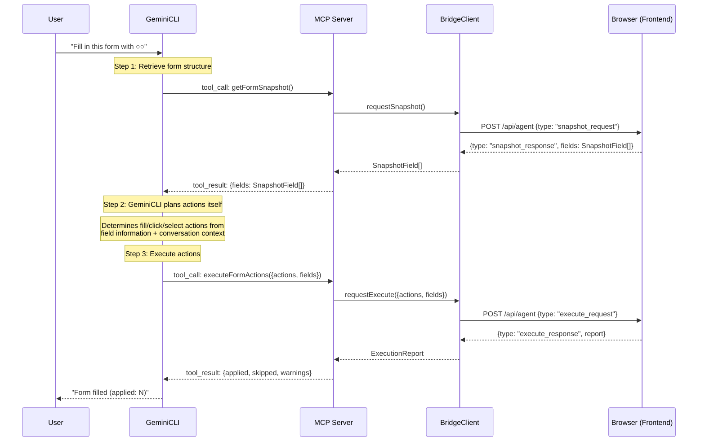

# RFC: Remove Planner (gpt-4o-mini) and Split fillForm into getFormSnapshot + executeFormActions

> Discussion: https://github.com/route06/giselle-division/discussions/5313

## 1. Background

### Current Architecture

The MCP server in `packages/browser-tool` provides a single tool called `fillForm` to GeminiCLI.
`fillForm` internally executes 3 steps:

```
GeminiCLI
  │
  │  MCP tool_call: fillForm({ instruction, document? })
  ▼
MCP Server (giselles-browser-tool-mcp-server)
  │
  ├─ Step 1: BridgeClient.requestSnapshot()
  │    → Retrieves form field list (SnapshotField[]) from the browser
  │
  ├─ Step 2: Planner (gpt-4o-mini)
  │    → Generates BrowserToolAction[] from instruction + fields   ← ★ Double LLM invocation
  │
  └─ Step 3: BridgeClient.requestExecute()
       → Executes BrowserToolAction[] in the browser and returns ExecutionReport
```

### Problems

- **Double LLM invocation**: Despite GeminiCLI itself being an LLM, it internally calls gpt-4o-mini as well
- **Increased cost and latency**: Unnecessary LLM calls add extra cost and time
- **Insufficient context**: Planner only knows `instruction` and `fields`, while GeminiCLI has the full conversation history with the user and can make better decisions

## 2. Proposal: Desired State

### New Architecture

Remove `fillForm` and split it into 2 MCP tools. Planning is done by GeminiCLI itself.

```
GeminiCLI
  │
  │  MCP tool_call: getFormSnapshot()
  ▼
MCP Server
  │  BridgeClient.requestSnapshot()
  │  → Returns SnapshotField[]
  ▼
GeminiCLI
  │  ★ GeminiCLI itself plans actions based on field information
  │
  │  MCP tool_call: executeFormActions({ actions, fields })
  ▼
MCP Server
  │  BridgeClient.requestExecute()
  │  → Returns ExecutionReport
  ▼
GeminiCLI
  │  Reports results to the user
```

### Sequence Diagram



## 3. Detailed Implementation Plan

### 3.1 Files to Change

| File | Change |
|---|---|
| `packages/browser-tool/src/mcp-server/tools/fill-form.ts` | **Delete** |
| `packages/browser-tool/src/mcp-server/tools/get-form-snapshot.ts` | **Create** |
| `packages/browser-tool/src/mcp-server/tools/execute-form-actions.ts` | **Create** |
| `packages/browser-tool/src/mcp-server/index.ts` | Change tool registration |
| `packages/browser-tool/src/planner/index.ts` | **Delete** |
| `packages/browser-tool/tsup.ts` | Remove planner entry |
| `packages/browser-tool/package.json` | Remove planner export, remove `ai` dependency |
| `packages/browser-tool/src/index.ts` | Clean up planner-related exports |
| `packages/browser-tool/src/types.ts` | Remove `PlanResult`, `PlanActionsInput`, `planActionsInputSchema`, etc. |
| `packages/agent/src/internal/chat-handler.ts` | Remove planner dist path check |
| `packages/agent/src/react/provider.tsx` | Update `PlanResult` type reference |

### 3.2 Implementation of New Files

#### `packages/browser-tool/src/mcp-server/tools/get-form-snapshot.ts`

```typescript
import type { SnapshotField } from "../../types";
import type { BridgeClient } from "../bridge-client";

export type GetFormSnapshotOutput = {
  fields: SnapshotField[];
};

export async function runGetFormSnapshot(
  bridgeClient: BridgeClient,
): Promise<GetFormSnapshotOutput> {
  const fields = await bridgeClient.requestSnapshot({
    instruction: "snapshot",
  });
  return { fields };
}
```

#### `packages/browser-tool/src/mcp-server/tools/execute-form-actions.ts`

```typescript
import { z } from "zod";
import {
  type ExecutionReport,
  browserToolActionSchema,
  snapshotFieldSchema,
} from "../../types";
import type { BridgeClient } from "../bridge-client";

export const executeFormActionsInputShape = {
  actions: z.array(browserToolActionSchema),
  fields: z.array(snapshotFieldSchema),
};

const executeFormActionsInputSchema = z.object(executeFormActionsInputShape);

export type ExecuteFormActionsInput = z.infer<typeof executeFormActionsInputSchema>;

export async function runExecuteFormActions(
  input: ExecuteFormActionsInput,
  bridgeClient: BridgeClient,
): Promise<ExecutionReport> {
  const parsed = executeFormActionsInputSchema.parse(input);
  return await bridgeClient.requestExecute({
    actions: parsed.actions,
    fields: parsed.fields,
  });
}
```

#### `packages/browser-tool/src/mcp-server/index.ts` (after change)

```typescript
import { McpServer } from "@modelcontextprotocol/sdk/server/mcp.js";
import { StdioServerTransport } from "@modelcontextprotocol/sdk/server/stdio.js";
import { createBridgeClientFromEnv } from "./bridge-client";
import { runGetFormSnapshot } from "./tools/get-form-snapshot";
import {
  executeFormActionsInputShape,
  runExecuteFormActions,
} from "./tools/execute-form-actions";

const server = new McpServer({
  name: "giselles-browser-tool-mcp-server",
  version: "0.2.0",
});

server.tool("getFormSnapshot", {}, async () => {
  try {
    const bridgeClient = createBridgeClientFromEnv();
    const output = await runGetFormSnapshot(bridgeClient);
    return {
      content: [{ type: "text", text: JSON.stringify(output) }],
      structuredContent: output,
    };
  } catch (error) {
    const message =
      error instanceof Error ? error.message : "Failed to get form snapshot.";
    console.error(`[mcp getFormSnapshot] ${message}`);
    return {
      isError: true,
      content: [{ type: "text", text: message }],
    };
  }
});

server.tool(
  "executeFormActions",
  executeFormActionsInputShape,
  async (input) => {
    try {
      const bridgeClient = createBridgeClientFromEnv();
      const output = await runExecuteFormActions(input, bridgeClient);
      return {
        content: [{ type: "text", text: JSON.stringify(output) }],
        structuredContent: output,
      };
    } catch (error) {
      const message =
        error instanceof Error
          ? error.message
          : "Failed to execute form actions.";
      console.error(`[mcp executeFormActions] ${message}`);
      return {
        isError: true,
        content: [{ type: "text", text: message }],
      };
    }
  },
);

const transport = new StdioServerTransport();
await server.connect(transport);
```

### 3.3 `tsup.ts` (after change)

Remove the planner entry point:

```typescript
import { defineConfig } from "tsup";

export default defineConfig([
  {
    entry: ["src/index.ts"],
    outDir: "dist",
    format: ["esm"],
    dts: true,
    clean: true,
  },
  {
    entry: ["src/dom/index.ts"],
    outDir: "dist/dom",
    format: ["esm"],
    dts: true,
    clean: false,
  },
  {
    entry: ["src/mcp-server/index.ts"],
    outDir: "dist/mcp-server",
    format: ["esm"],
    dts: true,
    clean: false,
  },
]);
```

### 3.4 package.json Changes

- Remove `./planner` and `./planner/runtime` from `exports`
- Remove `"ai"` package from `dependencies` (only used by planner)

### 3.5 `packages/agent/src/internal/chat-handler.ts` Changes

- Remove `plannerDistPath` variable (L140)
- Remove `PLANNER_DIST_PATH` check in `checkDistReady` function (L148, L155)
- Remove planner references from build verification error messages (L203)
- Change log message at L173 to `"Building browser-tool (mcp-server) in sandbox"`

### 3.6 Deletions from `packages/browser-tool/src/types.ts`

The following types/schemas are planner-only and should be removed:

- `PlanResult` type (L42-46)
- `planActionsInputSchema` (L113-117)
- `PlanActionsInput` type (L118)

### 3.7 Deletions from `packages/browser-tool/src/index.ts`

Remove exports for `PlanActionsInput`, `PlanResult`, and `planActionsInputSchema`.

### 3.8 `packages/agent/src/react/provider.tsx` Changes

Remove the `PlanResult` import and either define an equivalent type locally or expand it to `SnapshotField[]` + `BrowserToolAction[]` + `string[]`.

## 4. Unchanged Files

| File | Reason |
|---|---|
| `packages/browser-tool/src/mcp-server/bridge-client.ts` | `requestSnapshot` and `requestExecute` are reused as-is |
| `packages/browser-tool/src/types.ts` (most of it) | Types like `SnapshotField`, `BrowserToolAction`, `ExecutionReport` remain |
| `packages/browser-tool/src/dom/` | Browser-side snapshot/execute logic needs no changes |

## 5. Verification

```bash
# Build check
pnpm --filter @giselles-ai/browser-tool run build

# Type check
pnpm --filter @giselles-ai/browser-tool run typecheck

# Verify no remaining planner references
grep -r "planner\|planActions\|PlanResult\|PlanActionsInput" packages/browser-tool/src/ --include="*.ts"

# Agent package type check
pnpm --filter @giselles-ai/agent run typecheck
```
