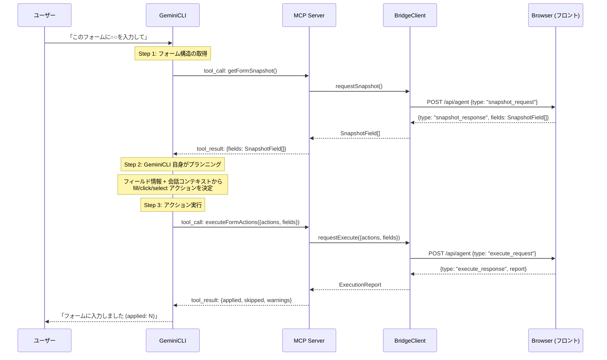

# RFC: Planner(gpt-4o-mini) を廃止し fillForm を getFormSnapshot + executeFormActions に分割する

> Discussion: https://github.com/route06/giselle-division/discussions/5313

## 1. 背景

### 現在のアーキテクチャ

`packages/browser-tool` の MCP サーバーは `fillForm` という単一のツールを GeminiCLI に提供している。
`fillForm` は内部で 3 ステップを実行する:

```
GeminiCLI
  │
  │  MCP tool_call: fillForm({ instruction, document? })
  ▼
MCP Server (giselles-browser-tool-mcp-server)
  │
  ├─ Step 1: BridgeClient.requestSnapshot()
  │    → ブラウザからフォームフィールド一覧 (SnapshotField[]) を取得
  │
  ├─ Step 2: Planner (gpt-4o-mini)
  │    → instruction + fields を入力に BrowserToolAction[] を生成   ← ★ LLM の二重呼び出し
  │
  └─ Step 3: BridgeClient.requestExecute()
       → BrowserToolAction[] をブラウザ上で実行し ExecutionReport を返却
```

### 問題

- **LLM の二重呼び出し**: GeminiCLI 自体が LLM であるにもかかわらず、内部でさらに gpt-4o-mini を呼んでいる
- **コスト・レイテンシの増加**: 不要な LLM 呼び出し分のコストと時間が発生
- **コンテキスト不足**: Planner は `instruction` と `fields` しか知らないが、GeminiCLI はユーザーとの会話履歴全体を持っており、より適切な判断ができる

## 2. 提案: あるべき姿

### 新しいアーキテクチャ

`fillForm` を廃止し、2 つの MCP ツールに分割する。プランニングは GeminiCLI 自身が行う。

```
GeminiCLI
  │
  │  MCP tool_call: getFormSnapshot()
  ▼
MCP Server
  │  BridgeClient.requestSnapshot()
  │  → SnapshotField[] を返却
  ▼
GeminiCLI
  │  ★ GeminiCLI 自身がフィールド情報を見てアクションを計画
  │
  │  MCP tool_call: executeFormActions({ actions, fields })
  ▼
MCP Server
  │  BridgeClient.requestExecute()
  │  → ExecutionReport を返却
  ▼
GeminiCLI
  │  結果をユーザーに報告
```

### シーケンス図



## 3. 具体的な実装計画

### 3.1 変更対象ファイル一覧

| ファイル | 変更内容 |
|---|---|
| `packages/browser-tool/src/mcp-server/tools/fill-form.ts` | **削除** |
| `packages/browser-tool/src/mcp-server/tools/get-form-snapshot.ts` | **新規作成** |
| `packages/browser-tool/src/mcp-server/tools/execute-form-actions.ts` | **新規作成** |
| `packages/browser-tool/src/mcp-server/index.ts` | ツール登録を変更 |
| `packages/browser-tool/src/planner/index.ts` | **削除** |
| `packages/browser-tool/tsup.ts` | planner エントリ削除 |
| `packages/browser-tool/package.json` | planner export 削除、`ai` 依存削除 |
| `packages/browser-tool/src/index.ts` | planner 関連の export 整理 |
| `packages/browser-tool/src/types.ts` | `PlanResult`, `PlanActionsInput`, `planActionsInputSchema` 等の削除 |
| `packages/agent/src/internal/chat-handler.ts` | planner dist パスのチェック削除 |
| `packages/agent/src/react/provider.tsx` | `PlanResult` 型の参照を更新 |

### 3.2 新規ファイルの実装イメージ

#### `packages/browser-tool/src/mcp-server/tools/get-form-snapshot.ts`

```typescript
import type { SnapshotField } from "../../types";
import type { BridgeClient } from "../bridge-client";

export type GetFormSnapshotOutput = {
  fields: SnapshotField[];
};

export async function runGetFormSnapshot(
  bridgeClient: BridgeClient,
): Promise<GetFormSnapshotOutput> {
  const fields = await bridgeClient.requestSnapshot({
    instruction: "snapshot",
  });
  return { fields };
}
```

#### `packages/browser-tool/src/mcp-server/tools/execute-form-actions.ts`

```typescript
import { z } from "zod";
import {
  type ExecutionReport,
  browserToolActionSchema,
  snapshotFieldSchema,
} from "../../types";
import type { BridgeClient } from "../bridge-client";

export const executeFormActionsInputShape = {
  actions: z.array(browserToolActionSchema),
  fields: z.array(snapshotFieldSchema),
};

const executeFormActionsInputSchema = z.object(executeFormActionsInputShape);

export type ExecuteFormActionsInput = z.infer<typeof executeFormActionsInputSchema>;

export async function runExecuteFormActions(
  input: ExecuteFormActionsInput,
  bridgeClient: BridgeClient,
): Promise<ExecutionReport> {
  const parsed = executeFormActionsInputSchema.parse(input);
  return await bridgeClient.requestExecute({
    actions: parsed.actions,
    fields: parsed.fields,
  });
}
```

#### `packages/browser-tool/src/mcp-server/index.ts` (変更後)

```typescript
import { McpServer } from "@modelcontextprotocol/sdk/server/mcp.js";
import { StdioServerTransport } from "@modelcontextprotocol/sdk/server/stdio.js";
import { createBridgeClientFromEnv } from "./bridge-client";
import { runGetFormSnapshot } from "./tools/get-form-snapshot";
import {
  executeFormActionsInputShape,
  runExecuteFormActions,
} from "./tools/execute-form-actions";

const server = new McpServer({
  name: "giselles-browser-tool-mcp-server",
  version: "0.2.0",
});

server.tool("getFormSnapshot", {}, async () => {
  try {
    const bridgeClient = createBridgeClientFromEnv();
    const output = await runGetFormSnapshot(bridgeClient);
    return {
      content: [{ type: "text", text: JSON.stringify(output) }],
      structuredContent: output,
    };
  } catch (error) {
    const message =
      error instanceof Error ? error.message : "Failed to get form snapshot.";
    console.error(`[mcp getFormSnapshot] ${message}`);
    return {
      isError: true,
      content: [{ type: "text", text: message }],
    };
  }
});

server.tool(
  "executeFormActions",
  executeFormActionsInputShape,
  async (input) => {
    try {
      const bridgeClient = createBridgeClientFromEnv();
      const output = await runExecuteFormActions(input, bridgeClient);
      return {
        content: [{ type: "text", text: JSON.stringify(output) }],
        structuredContent: output,
      };
    } catch (error) {
      const message =
        error instanceof Error
          ? error.message
          : "Failed to execute form actions.";
      console.error(`[mcp executeFormActions] ${message}`);
      return {
        isError: true,
        content: [{ type: "text", text: message }],
      };
    }
  },
);

const transport = new StdioServerTransport();
await server.connect(transport);
```

### 3.3 `tsup.ts` (変更後)

planner エントリポイントを削除:

```typescript
import { defineConfig } from "tsup";

export default defineConfig([
  {
    entry: ["src/index.ts"],
    outDir: "dist",
    format: ["esm"],
    dts: true,
    clean: true,
  },
  {
    entry: ["src/dom/index.ts"],
    outDir: "dist/dom",
    format: ["esm"],
    dts: true,
    clean: false,
  },
  {
    entry: ["src/mcp-server/index.ts"],
    outDir: "dist/mcp-server",
    format: ["esm"],
    dts: true,
    clean: false,
  },
]);
```

### 3.4 `package.json` の変更ポイント

- `exports` から `./planner` と `./planner/runtime` を削除
- `dependencies` から `"ai"` パッケージを削除（planner でのみ使用されていた）

### 3.5 `packages/agent/src/internal/chat-handler.ts` の変更ポイント

- `plannerDistPath` 変数を削除 (L140)
- `checkDistReady` 関数内の `PLANNER_DIST_PATH` チェックを削除 (L148, L155)
- ビルド確認のエラーメッセージから planner への言及を削除 (L203)
- L173 のログメッセージを `"Building browser-tool (mcp-server) in sandbox"` に変更

### 3.6 `packages/browser-tool/src/types.ts` の削除対象

以下の型・スキーマは planner 専用なので削除:

- `PlanResult` 型 (L42-46)
- `planActionsInputSchema` (L113-117)
- `PlanActionsInput` 型 (L118)

### 3.7 `packages/browser-tool/src/index.ts` の削除対象

`PlanActionsInput`, `PlanResult`, `planActionsInputSchema` の export を削除。

### 3.8 `packages/agent/src/react/provider.tsx` の変更ポイント

`PlanResult` の import を削除し、同等の型をローカルに定義するか、`SnapshotField[]` + `BrowserToolAction[]` + `string[]` に展開する。

## 4. 変更しないもの

| ファイル | 理由 |
|---|---|
| `packages/browser-tool/src/mcp-server/bridge-client.ts` | `requestSnapshot`, `requestExecute` はそのまま活用 |
| `packages/browser-tool/src/types.ts` (大部分) | `SnapshotField`, `BrowserToolAction`, `ExecutionReport` 等の型はそのまま |
| `packages/browser-tool/src/dom/` | ブラウザ側の snapshot/execute ロジックは変更不要 |

## 5. 検証方法

```bash
# ビルド確認
pnpm --filter @giselles-ai/browser-tool run build

# 型チェック
pnpm --filter @giselles-ai/browser-tool run typecheck

# planner の残存参照がないことを確認
grep -r "planner\|planActions\|PlanResult\|PlanActionsInput" packages/browser-tool/src/ --include="*.ts"

# agent パッケージの型チェック
pnpm --filter @giselles-ai/agent run typecheck
```
