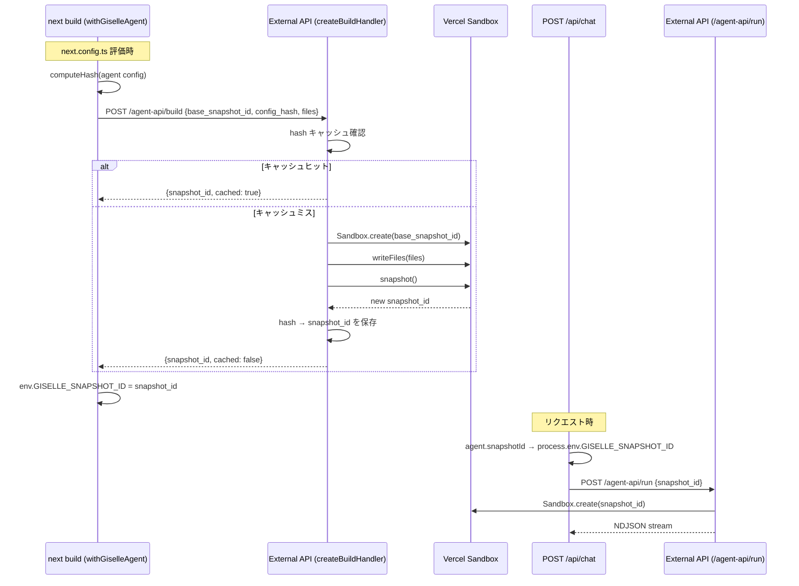
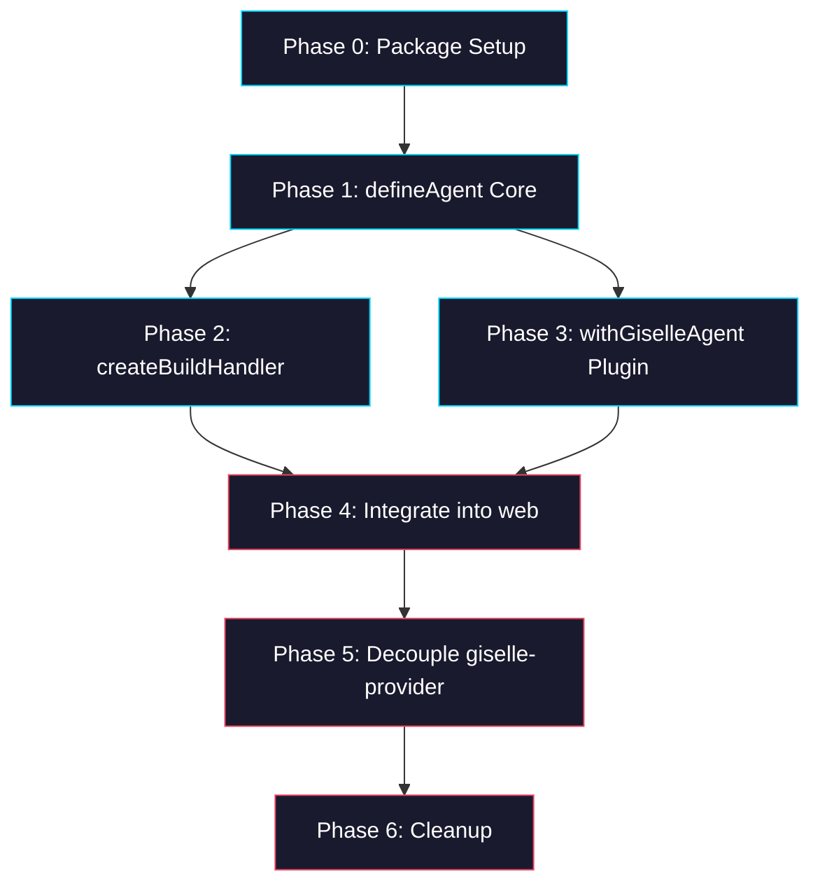

# Epic: `@giselles-ai/agent-builder` — Build-time Snapshot & Sandbox 操作の External API 集約

> **GitHub Discussion:** [#5356](https://github.com/route06/giselle-division/discussions/5356)

## Goal

agent-container から `@vercel/sandbox` への直接通信を廃止し、Sandbox 操作を external API に集約する。新パッケージ `@giselles-ai/agent-builder` を作成し、`defineAgent` による Agent 定義の一元管理、`withGiselleAgent` による Next.js build 時の snapshot 作成、`createBuildHandler` による external API 側の Sandbox 操作ハンドラを提供する。

## Why

- Vercel Sandbox の snapshot は **Team-scoped** であり、agent-container と external API が別 Vercel Team にデプロイされると snapshot を参照できない
- 現在 `Agent.prepare()` が agent-container 側で Sandbox.create → writeFiles → runCommand → snapshot を実行しているが、実際に sandbox を起動するのは external API 側であるべき
- agent-container の責務を UI + メッセージ中継に限定し、Sandbox 操作を external API に閉じ込めることでデプロイの柔軟性を確保する

## Architecture Overview



## Package / Directory Structure

```
packages/
├── agent-builder/                       ← NEW (this epic)
│   ├── src/
│   │   ├── index.ts                     ← defineAgent, AgentConfig type
│   │   ├── next/
│   │   │   └── index.ts                 ← withGiselleAgent
│   │   └── next-server/
│   │       └── index.ts                 ← createBuildHandler
│   ├── package.json
│   ├── tsconfig.json
│   └── tsup.ts
├── giselle-provider/                    ← EXISTING (modify)
│   ├── src/
│   │   ├── types.ts                     ← agent property type change
│   │   └── giselle-agent-model.ts       ← remove Agent.prepare() call
│   └── package.json                     ← remove @giselles-ai/sandbox-agent dep
├── sandbox-agent/                       ← EXISTING (modify)
│   └── src/
│       └── agent.ts                     ← Agent class kept for external API use
├── web/                                 ← EXISTING (modify)
│   ├── lib/
│   │   └── agent.ts                     ← NEW: defineAgent configuration
│   ├── next.config.ts                   ← modify: wrap with withGiselleAgent
│   ├── app/api/chat/route.ts            ← modify: use agent from lib/agent.ts
│   └── package.json                     ← add agent-builder, remove sandbox-agent & @vercel/sandbox
```

## Task Dependency Graph



- **Phase 2 and Phase 3** can run in parallel (both depend on Phase 1 only).
- **Phase 4** depends on both Phase 2 and Phase 3.
- **Phase 5–6** are sequential.

## Task Status

| Phase | Task File | Status | Description |
|---|---|---|---|
| 0 | [phase-0-package-setup.md](./phase-0-package-setup.md) | ✅ DONE | Create `packages/agent-builder` with multi-export structure |
| 1 | [phase-1-define-agent.md](./phase-1-define-agent.md) | ✅ DONE | `defineAgent` function and `AgentConfig` type |
| 2 | [phase-2-build-handler.md](./phase-2-build-handler.md) | ✅ DONE | `createBuildHandler` — Sandbox 操作 + hash キャッシュ |
| 3 | [phase-3-next-plugin.md](./phase-3-next-plugin.md) | ✅ DONE | `withGiselleAgent` — build 時 fetch + env 注入 |
| 4 | [phase-4-web-integration.md](./phase-4-web-integration.md) | 🔲 TODO | web パッケージの統合: `lib/agent.ts`, `next.config.ts`, `route.ts` |
| 5 | [phase-5-decouple-provider.md](./phase-5-decouple-provider.md) | 🔲 TODO | `giselle-provider` から `sandbox-agent` / `Agent.prepare()` を除去 |
| 6 | [phase-6-cleanup.md](./phase-6-cleanup.md) | 🔲 TODO | web から `@vercel/sandbox` と `@giselles-ai/sandbox-agent` 依存を除去 |

> **How to work on this epic:** Read this file first to understand the full architecture.
> Then check the status table above. Pick the first `🔲 TODO` task whose dependencies
> (see dependency graph) are `✅ DONE`. Open that task file and follow its instructions.
> When done, update the status in this table to `✅ DONE`.

## Key Conventions

- **Monorepo:** pnpm workspaces, `tsup` for building, `biome` for formatting
- **TypeScript:** `strict`, target `ES2022`, module `ESNext`, moduleResolution `Bundler`
- **Zod version:** `4.3.6` (used throughout the monorepo)
- **Package exports:** Use `exports` field in `package.json` for multi-entry packages (see pattern below)
- **tsup:** Single `tsup.ts` config with multiple entries
- **Existing pattern:** Follow `packages/giselle-provider` for package structure

## Existing Code Reference

| File | Relevance |
|---|---|
| `packages/sandbox-agent/src/agent.ts` | Current `Agent` class with `prepare()` — the Sandbox logic to migrate to `createBuildHandler` |
| `packages/sandbox-agent/src/chat-run.ts` | `runChat` uses `Sandbox.create` / `Sandbox.get` — shows Sandbox SDK patterns |
| `packages/giselle-provider/src/types.ts` | `GiselleProviderOptions` — `agent: Agent` property to be changed |
| `packages/giselle-provider/src/giselle-agent-model.ts` L362-374 | `Agent.prepare()` call in `runStream()` — to be removed |
| `packages/giselle-provider/src/giselle-agent-model.ts` L797-823 | `connectCloudApi` — sends `snapshotId` to Cloud API |
| `packages/web/app/api/chat/route.ts` | Current `resolveAgent()` — to be replaced with `defineAgent` import |
| `packages/web/next.config.ts` | Current minimal config — to be wrapped with `withGiselleAgent` |
| `packages/web/scripts/create-browser-tool-snapshot.mjs` | Existing snapshot creation script — shows Sandbox.create + writeFiles + snapshot pattern |
| `packages/giselle-provider/package.json` | Has `@giselles-ai/sandbox-agent` dependency — to be removed |
| `packages/web/package.json` | Has `@vercel/sandbox` and `@giselles-ai/sandbox-agent` deps — to be removed |
