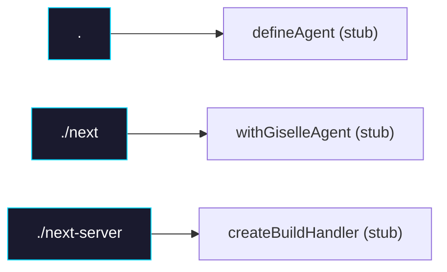

# Phase 0: Package Setup

> **Epic:** [AGENTS.md](./AGENTS.md)
> **Dependencies:** None
> **Blocks:** Phase 1

## Objective

Create the `packages/agent-builder` package with multi-export structure (`/`, `/next`, `/next-server`), build config, and TypeScript setup. No business logic — just the scaffolding.

## What You're Building



## Deliverables

### 1. `packages/agent-builder/package.json`

```json
{
  "name": "@giselles-ai/agent-builder",
  "version": "0.1.0",
  "type": "module",
  "sideEffects": false,
  "license": "Apache-2.0",
  "repository": {
    "type": "git",
    "url": "https://github.com/giselles-ai/agent-container.git",
    "directory": "packages/agent-builder"
  },
  "files": ["dist"],
  "exports": {
    ".": {
      "types": "./dist/index.d.ts",
      "import": "./dist/index.js",
      "default": "./dist/index.js"
    },
    "./next": {
      "types": "./dist/next/index.d.ts",
      "import": "./dist/next/index.js",
      "default": "./dist/next/index.js"
    },
    "./next-server": {
      "types": "./dist/next-server/index.d.ts",
      "import": "./dist/next-server/index.js",
      "default": "./dist/next-server/index.js"
    }
  },
  "scripts": {
    "build": "pnpm clean && tsup --config tsup.ts",
    "clean": "rm -rf dist *.tsbuildinfo",
    "typecheck": "tsc -p tsconfig.json --noEmit",
    "test": "pnpm exec vitest run",
    "format": "pnpm exec biome check --write ."
  },
  "dependencies": {},
  "devDependencies": {
    "@types/node": "25.3.0",
    "tsup": "8.5.1",
    "typescript": "5.9.3"
  },
  "peerDependencies": {
    "next": ">=15.0.0"
  },
  "peerDependenciesMeta": {
    "next": {
      "optional": true
    }
  }
}
```

Note: `@vercel/sandbox` will be added in Phase 2 as a dependency for the `/next-server` entry.

### 2. `packages/agent-builder/tsconfig.json`

Follow the pattern from `packages/giselle-provider/tsconfig.json`:

```json
{
  "extends": "../../tsconfig.base.json",
  "compilerOptions": {
    "outDir": "dist",
    "rootDir": "src"
  },
  "include": ["src"],
  "exclude": ["node_modules", "dist"]
}
```

### 3. `packages/agent-builder/tsup.ts`

Multi-entry config for the three exports:

```ts
import { defineConfig } from "tsup";

export default defineConfig([
  {
    entry: [
      "src/index.ts",
      "src/next/index.ts",
      "src/next-server/index.ts",
    ],
    outDir: "dist",
    format: ["esm"],
    dts: true,
  },
]);
```

### 4. Stub source files

Create minimal stub files that export nothing meaningful yet (business logic comes in Phase 1–3):

**`packages/agent-builder/src/index.ts`**
```ts
export type { AgentConfig } from "./types";
export { defineAgent } from "./define-agent";
```

**`packages/agent-builder/src/types.ts`**
```ts
export type AgentConfig = {
  agentType?: "gemini" | "codex";
  agentMd?: string;
};

export type DefinedAgent = AgentConfig & {
  readonly snapshotId: string;
};
```

**`packages/agent-builder/src/define-agent.ts`**
```ts
import type { AgentConfig, DefinedAgent } from "./types";

export function defineAgent(config: AgentConfig): DefinedAgent {
  return {
    ...config,
    get snapshotId(): string {
      const id = process.env.GISELLE_SNAPSHOT_ID;
      if (!id) {
        throw new Error(
          "GISELLE_SNAPSHOT_ID is not set. Ensure withGiselleAgent is configured in next.config.ts.",
        );
      }
      return id;
    },
  };
}
```

**`packages/agent-builder/src/next/index.ts`**
```ts
export { withGiselleAgent } from "./with-giselle-agent";
```

**`packages/agent-builder/src/next/with-giselle-agent.ts`**
```ts
// Placeholder — implementation in Phase 3
export function withGiselleAgent(): never {
  throw new Error("Not implemented");
}
```

**`packages/agent-builder/src/next-server/index.ts`**
```ts
export { createBuildHandler } from "./create-build-handler";
```

**`packages/agent-builder/src/next-server/create-build-handler.ts`**
```ts
// Placeholder — implementation in Phase 2
export function createBuildHandler(): never {
  throw new Error("Not implemented");
}
```

## Verification

1. **Build passes:**
   ```bash
   cd packages/agent-builder && pnpm install && pnpm build
   ```
   Confirm `dist/index.js`, `dist/next/index.js`, `dist/next-server/index.js` and corresponding `.d.ts` files exist.

2. **Typecheck passes:**
   ```bash
   cd packages/agent-builder && pnpm typecheck
   ```

3. **Import resolution works:** From another package in the monorepo, verify these imports resolve:
   ```ts
   import { defineAgent } from "@giselles-ai/agent-builder";
   import { withGiselleAgent } from "@giselles-ai/agent-builder/next";
   import { createBuildHandler } from "@giselles-ai/agent-builder/next-server";
   ```

## Files to Create/Modify

| File | Action |
|---|---|
| `packages/agent-builder/package.json` | **Create** |
| `packages/agent-builder/tsconfig.json` | **Create** |
| `packages/agent-builder/tsup.ts` | **Create** |
| `packages/agent-builder/src/index.ts` | **Create** |
| `packages/agent-builder/src/types.ts` | **Create** |
| `packages/agent-builder/src/define-agent.ts` | **Create** |
| `packages/agent-builder/src/next/index.ts` | **Create** |
| `packages/agent-builder/src/next/with-giselle-agent.ts` | **Create** (stub) |
| `packages/agent-builder/src/next-server/index.ts` | **Create** |
| `packages/agent-builder/src/next-server/create-build-handler.ts` | **Create** (stub) |

## Done Criteria

- [ ] `packages/agent-builder` directory exists with all files above
- [ ] `pnpm build` produces `dist/` with three entry points
- [ ] `pnpm typecheck` passes
- [ ] Update the status in [AGENTS.md](./AGENTS.md) to `✅ DONE`
