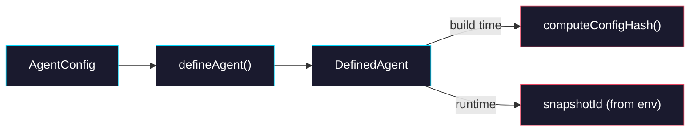

# Phase 1: defineAgent Core

> **Epic:** [AGENTS.md](./AGENTS.md)
> **Dependencies:** Phase 0 (package scaffolding must exist)
> **Parallel with:** None
> **Blocks:** Phase 2, Phase 3

## Objective

Implement the `defineAgent` function and `AgentConfig` / `DefinedAgent` types as the single source of truth for agent configuration. This is the core export of `@giselles-ai/agent-builder` and is used by both `withGiselleAgent` (build time) and `route.ts` (runtime).

## What You're Building



## Deliverables

### 1. `packages/agent-builder/src/types.ts`

Replace the stub with the full type definitions:

```ts
export type AgentFile = {
  path: string;
  content: string;
};

export type AgentConfig = {
  /** Agent type. Defaults to "gemini". */
  agentType?: "gemini" | "codex";
  /** Content for AGENTS.md in the sandbox. */
  agentMd?: string;
  /** Additional files to write into the sandbox. */
  files?: AgentFile[];
};

export type DefinedAgent = {
  readonly agentType: "gemini" | "codex";
  readonly agentMd?: string;
  readonly files: AgentFile[];
  /** Snapshot ID resolved from env at runtime. Throws if not set. */
  readonly snapshotId: string;
};
```

### 2. `packages/agent-builder/src/define-agent.ts`

```ts
import type { AgentConfig, DefinedAgent } from "./types";

const SNAPSHOT_ENV_KEY = "GISELLE_SNAPSHOT_ID";

export function defineAgent(config: AgentConfig): DefinedAgent {
  return {
    agentType: config.agentType ?? "gemini",
    agentMd: config.agentMd,
    files: config.files ?? [],
    get snapshotId(): string {
      const id = process.env[SNAPSHOT_ENV_KEY];
      if (!id) {
        throw new Error(
          `${SNAPSHOT_ENV_KEY} is not set. Ensure withGiselleAgent is configured in next.config.ts.`,
        );
      }
      return id;
    },
  };
}
```

### 3. `packages/agent-builder/src/hash.ts`

Compute a deterministic hash from agent configuration for caching:

```ts
import { createHash } from "node:crypto";

import type { AgentConfig } from "./types";

export function computeConfigHash(
  config: AgentConfig,
  baseSnapshotId: string,
): string {
  const payload = JSON.stringify({
    baseSnapshotId,
    agentType: config.agentType ?? "gemini",
    agentMd: config.agentMd ?? null,
    files: (config.files ?? []).map((f) => ({
      path: f.path,
      content: f.content,
    })),
  });

  return createHash("sha256").update(payload).digest("hex").slice(0, 16);
}
```

### 4. `packages/agent-builder/src/index.ts`

Update exports:

```ts
export type { AgentConfig, AgentFile, DefinedAgent } from "./types";
export { defineAgent } from "./define-agent";
export { computeConfigHash } from "./hash";
```

### 5. Tests — `packages/agent-builder/src/__tests__/define-agent.test.ts`

```ts
import { describe, expect, it } from "vitest";
import { defineAgent } from "../define-agent";

describe("defineAgent", () => {
  it("returns a DefinedAgent with defaults", () => {
    const agent = defineAgent({});
    expect(agent.agentType).toBe("gemini");
    expect(agent.files).toEqual([]);
    expect(agent.agentMd).toBeUndefined();
  });

  it("preserves provided config", () => {
    const agent = defineAgent({
      agentType: "codex",
      agentMd: "test prompt",
      files: [{ path: "/test", content: "hello" }],
    });
    expect(agent.agentType).toBe("codex");
    expect(agent.agentMd).toBe("test prompt");
    expect(agent.files).toHaveLength(1);
  });

  it("throws when snapshotId is accessed without env", () => {
    const agent = defineAgent({});
    expect(() => agent.snapshotId).toThrow("GISELLE_SNAPSHOT_ID is not set");
  });

  it("returns snapshotId from env", () => {
    process.env.GISELLE_SNAPSHOT_ID = "snap_test123";
    try {
      const agent = defineAgent({});
      expect(agent.snapshotId).toBe("snap_test123");
    } finally {
      delete process.env.GISELLE_SNAPSHOT_ID;
    }
  });
});
```

### 6. Tests — `packages/agent-builder/src/__tests__/hash.test.ts`

```ts
import { describe, expect, it } from "vitest";
import { computeConfigHash } from "../hash";

describe("computeConfigHash", () => {
  it("produces a 16-char hex string", () => {
    const hash = computeConfigHash({}, "snap_base");
    expect(hash).toMatch(/^[0-9a-f]{16}$/);
  });

  it("produces same hash for same input", () => {
    const config = { agentType: "gemini" as const, agentMd: "test" };
    const a = computeConfigHash(config, "snap_1");
    const b = computeConfigHash(config, "snap_1");
    expect(a).toBe(b);
  });

  it("produces different hash for different baseSnapshotId", () => {
    const config = { agentMd: "test" };
    const a = computeConfigHash(config, "snap_1");
    const b = computeConfigHash(config, "snap_2");
    expect(a).not.toBe(b);
  });

  it("produces different hash for different agentMd", () => {
    const a = computeConfigHash({ agentMd: "a" }, "snap_1");
    const b = computeConfigHash({ agentMd: "b" }, "snap_1");
    expect(a).not.toBe(b);
  });
});
```

## Verification

1. **Build:**
   ```bash
   cd packages/agent-builder && pnpm build
   ```

2. **Typecheck:**
   ```bash
   cd packages/agent-builder && pnpm typecheck
   ```

3. **Tests:**
   ```bash
   cd packages/agent-builder && pnpm test
   ```

## Files to Create/Modify

| File | Action |
|---|---|
| `packages/agent-builder/src/types.ts` | **Modify** (replace stub with full types) |
| `packages/agent-builder/src/define-agent.ts` | **Modify** (replace stub with implementation) |
| `packages/agent-builder/src/hash.ts` | **Create** |
| `packages/agent-builder/src/index.ts` | **Modify** (add hash export) |
| `packages/agent-builder/src/__tests__/define-agent.test.ts` | **Create** |
| `packages/agent-builder/src/__tests__/hash.test.ts` | **Create** |

## Done Criteria

- [ ] `defineAgent` returns a `DefinedAgent` with correct defaults
- [ ] `snapshotId` getter reads from `process.env.GISELLE_SNAPSHOT_ID`
- [ ] `computeConfigHash` produces deterministic hashes
- [ ] All tests pass
- [ ] Build and typecheck pass
- [ ] Update the status in [AGENTS.md](./AGENTS.md) to `✅ DONE`
