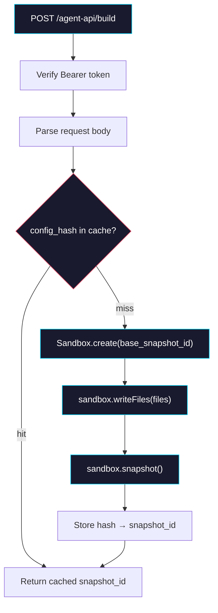

# Phase 2: createBuildHandler

> **Epic:** [AGENTS.md](./AGENTS.md)
> **Dependencies:** Phase 1 (types and hash must exist)
> **Parallel with:** Phase 3
> **Blocks:** Phase 4

## Objective

Implement `createBuildHandler` in `@giselles-ai/agent-builder/next-server`. This is a request handler that receives agent configuration from the `withGiselleAgent` plugin, performs Sandbox operations (create → writeFiles → snapshot), and returns the snapshot ID. It includes hash-based caching to skip redundant builds.

## What You're Building



## Deliverables

### 1. `packages/agent-builder/src/next-server/types.ts`

```ts
export type BuildHandlerConfig = {
  /**
   * Function to verify the Bearer token from the Authorization header.
   * Return `true` if valid, `false` to reject with 401.
   * If not provided, no auth check is performed.
   */
  verifyToken?: (token: string) => boolean | Promise<boolean>;
};

export type BuildRequest = {
  base_snapshot_id: string;
  config_hash: string;
  agent_type: "gemini" | "codex";
  files: Array<{ path: string; content: string }>;
};

export type BuildResponse = {
  snapshot_id: string;
  cached: boolean;
};
```

### 2. `packages/agent-builder/src/next-server/snapshot-cache.ts`

In-memory cache for hash → snapshot_id mapping. This runs in the external API process and persists across requests within the same instance.

```ts
const cache = new Map<string, string>();

export function getCachedSnapshotId(configHash: string): string | undefined {
  return cache.get(configHash);
}

export function setCachedSnapshotId(
  configHash: string,
  snapshotId: string,
): void {
  cache.set(configHash, snapshotId);
}
```

Note: In-memory is sufficient for now. The cache is populated on first build and reused within the same process. If the external API restarts, the snapshot will be rebuilt (acceptable because Vercel Sandbox snapshots persist independently).

### 3. `packages/agent-builder/src/next-server/create-build-handler.ts`

Replace the stub with the full implementation:

```ts
import { Sandbox } from "@vercel/sandbox";
import type { BuildHandlerConfig, BuildRequest, BuildResponse } from "./types";
import { getCachedSnapshotId, setCachedSnapshotId } from "./snapshot-cache";

function extractBearerToken(request: Request): string | undefined {
  const header = request.headers.get("authorization");
  if (!header?.startsWith("Bearer ")) {
    return undefined;
  }
  return header.slice(7).trim() || undefined;
}

function jsonResponse(body: unknown, status = 200): Response {
  return Response.json(body, { status });
}

function errorResponse(message: string, status: number): Response {
  return jsonResponse({ ok: false, message }, status);
}

function parseBuildRequest(body: unknown): BuildRequest | null {
  if (!body || typeof body !== "object" || Array.isArray(body)) {
    return null;
  }

  const record = body as Record<string, unknown>;
  const baseSnapshotId = record.base_snapshot_id;
  const configHash = record.config_hash;
  const agentType = record.agent_type;
  const files = record.files;

  if (typeof baseSnapshotId !== "string" || !baseSnapshotId.trim()) {
    return null;
  }
  if (typeof configHash !== "string" || !configHash.trim()) {
    return null;
  }
  if (agentType !== "gemini" && agentType !== "codex") {
    return null;
  }
  if (!Array.isArray(files)) {
    return null;
  }

  for (const file of files) {
    if (
      !file ||
      typeof file !== "object" ||
      typeof file.path !== "string" ||
      typeof file.content !== "string"
    ) {
      return null;
    }
  }

  return {
    base_snapshot_id: baseSnapshotId.trim(),
    config_hash: configHash.trim(),
    agent_type: agentType,
    files: files as BuildRequest["files"],
  };
}

export function createBuildHandler(config?: BuildHandlerConfig) {
  return async (request: Request): Promise<Response> => {
    // Auth check
    if (config?.verifyToken) {
      const token = extractBearerToken(request);
      if (!token) {
        return errorResponse("Missing authorization token.", 401);
      }
      const valid = await config.verifyToken(token);
      if (!valid) {
        return errorResponse("Invalid authorization token.", 401);
      }
    }

    // Parse body
    const body = await request.json().catch(() => null);
    const parsed = parseBuildRequest(body);
    if (!parsed) {
      return errorResponse("Invalid build request.", 400);
    }

    // Cache check
    const cached = getCachedSnapshotId(parsed.config_hash);
    if (cached) {
      console.log(
        `[agent-builder] cache hit: hash=${parsed.config_hash} → snapshot=${cached}`,
      );
      const response: BuildResponse = { snapshot_id: cached, cached: true };
      return jsonResponse(response);
    }

    // Build snapshot
    try {
      const sandbox = await Sandbox.create({
        source: { type: "snapshot", snapshotId: parsed.base_snapshot_id },
      });
      console.log(
        `[agent-builder] sandbox created: ${sandbox.sandboxId} from ${parsed.base_snapshot_id}`,
      );

      if (parsed.files.length > 0) {
        await sandbox.writeFiles(
          parsed.files.map((f) => ({
            path: f.path,
            content: Buffer.from(f.content),
          })),
        );
        console.log(
          `[agent-builder] wrote ${parsed.files.length} file(s)`,
        );
      }

      const snapshot = await sandbox.snapshot();
      console.log(
        `[agent-builder] snapshot created: ${snapshot.snapshotId}`,
      );

      setCachedSnapshotId(parsed.config_hash, snapshot.snapshotId);

      const response: BuildResponse = {
        snapshot_id: snapshot.snapshotId,
        cached: false,
      };
      return jsonResponse(response);
    } catch (error) {
      const message =
        error instanceof Error ? error.message : String(error);
      console.error(`[agent-builder] build failed: ${message}`);
      return errorResponse(`Build failed: ${message}`, 500);
    }
  };
}
```

### 4. `packages/agent-builder/src/next-server/index.ts`

```ts
export { createBuildHandler } from "./create-build-handler";
export type {
  BuildHandlerConfig,
  BuildRequest,
  BuildResponse,
} from "./types";
```

### 5. Add `@vercel/sandbox` dependency

In `packages/agent-builder/package.json`, add to `dependencies`:

```json
{
  "dependencies": {
    "@vercel/sandbox": "1.6.0"
  }
}
```

### 6. Tests — `packages/agent-builder/src/__tests__/create-build-handler.test.ts`

Test the handler with mocked Sandbox:

```ts
import { describe, expect, it, vi, beforeEach } from "vitest";

// Mock @vercel/sandbox before importing the handler
vi.mock("@vercel/sandbox", () => ({
  Sandbox: {
    create: vi.fn(),
  },
}));

import { Sandbox } from "@vercel/sandbox";
import { createBuildHandler } from "../next-server/create-build-handler";

const mockCreate = vi.mocked(Sandbox.create);

function makeRequest(body: unknown, token?: string): Request {
  const headers: Record<string, string> = {
    "content-type": "application/json",
  };
  if (token) {
    headers.authorization = `Bearer ${token}`;
  }
  return new Request("http://localhost/agent-api/build", {
    method: "POST",
    headers,
    body: JSON.stringify(body),
  });
}

describe("createBuildHandler", () => {
  beforeEach(() => {
    vi.clearAllMocks();
  });

  it("returns 401 when auth is required but token missing", async () => {
    const handler = createBuildHandler({
      verifyToken: () => true,
    });
    const res = await handler(makeRequest({}));
    expect(res.status).toBe(401);
  });

  it("returns 400 for invalid body", async () => {
    const handler = createBuildHandler();
    const res = await handler(makeRequest({ invalid: true }));
    expect(res.status).toBe(400);
  });

  it("builds snapshot and returns snapshot_id", async () => {
    const mockSandbox = {
      sandboxId: "sb_123",
      writeFiles: vi.fn(),
      snapshot: vi.fn().mockResolvedValue({ snapshotId: "snap_new" }),
    };
    mockCreate.mockResolvedValue(mockSandbox as any);

    const handler = createBuildHandler();
    const res = await handler(
      makeRequest({
        base_snapshot_id: "snap_base",
        config_hash: "abc123",
        agent_type: "gemini",
        files: [{ path: "/test.md", content: "hello" }],
      }),
    );

    expect(res.status).toBe(200);
    const body = await res.json();
    expect(body.snapshot_id).toBe("snap_new");
    expect(body.cached).toBe(false);
  });

  it("returns cached snapshot on second call with same hash", async () => {
    const mockSandbox = {
      sandboxId: "sb_123",
      writeFiles: vi.fn(),
      snapshot: vi.fn().mockResolvedValue({ snapshotId: "snap_cached" }),
    };
    mockCreate.mockResolvedValue(mockSandbox as any);

    const handler = createBuildHandler();
    const body = {
      base_snapshot_id: "snap_base",
      config_hash: "cache_test_hash",
      agent_type: "gemini",
      files: [],
    };

    // First call — builds
    await handler(makeRequest(body));

    // Second call — cached
    const res = await handler(makeRequest(body));
    const result = await res.json();
    expect(result.cached).toBe(true);
    expect(result.snapshot_id).toBe("snap_cached");
    // Sandbox.create should only be called once
    expect(mockCreate).toHaveBeenCalledTimes(1);
  });
});
```

## Verification

1. **Build:**
   ```bash
   cd packages/agent-builder && pnpm build
   ```
   Confirm `dist/next-server/index.js` exists and contains `createBuildHandler`.

2. **Typecheck:**
   ```bash
   cd packages/agent-builder && pnpm typecheck
   ```

3. **Tests:**
   ```bash
   cd packages/agent-builder && pnpm test
   ```

## Files to Create/Modify

| File | Action |
|---|---|
| `packages/agent-builder/src/next-server/types.ts` | **Create** |
| `packages/agent-builder/src/next-server/snapshot-cache.ts` | **Create** |
| `packages/agent-builder/src/next-server/create-build-handler.ts` | **Modify** (replace stub) |
| `packages/agent-builder/src/next-server/index.ts` | **Modify** (add type exports) |
| `packages/agent-builder/package.json` | **Modify** (add `@vercel/sandbox` dep) |
| `packages/agent-builder/src/__tests__/create-build-handler.test.ts` | **Create** |

## Done Criteria

- [ ] `createBuildHandler` performs Sandbox.create → writeFiles → snapshot
- [ ] Hash-based caching skips redundant builds
- [ ] Auth verification via `verifyToken` callback
- [ ] All tests pass with mocked Sandbox
- [ ] Build and typecheck pass
- [ ] Update the status in [AGENTS.md](./AGENTS.md) to `✅ DONE`
