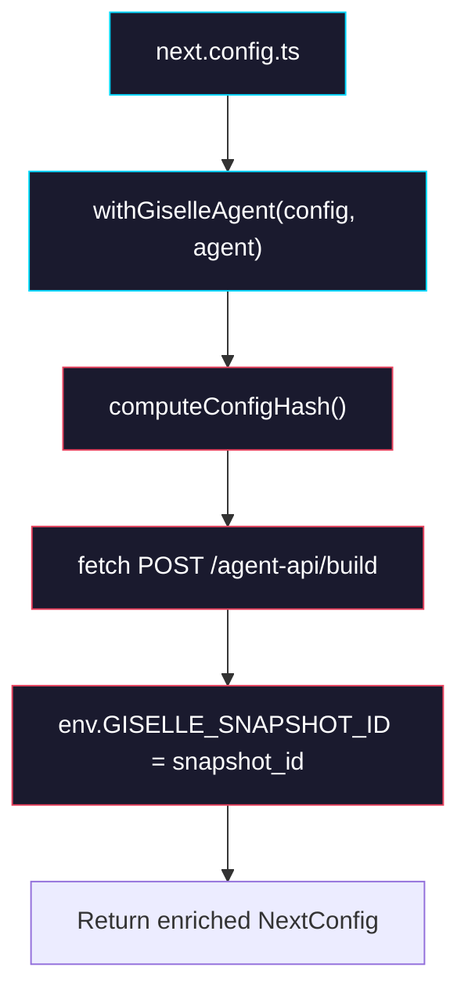

# Phase 3: withGiselleAgent Plugin

> **Epic:** [AGENTS.md](./AGENTS.md)
> **Dependencies:** Phase 1 (defineAgent and hash must exist)
> **Parallel with:** Phase 2
> **Blocks:** Phase 4

## Objective

Implement `withGiselleAgent` in `@giselles-ai/agent-builder/next`. This is a Next.js config wrapper that, during `next build`, calls the external API's build endpoint to create a snapshot, then injects the resulting `snapshot_id` into `process.env.GISELLE_SNAPSHOT_ID` via Next.js `env` config.

## What You're Building



## Deliverables

### 1. `packages/agent-builder/src/next/types.ts`

```ts
export type GiselleAgentPluginOptions = {
  /** External API URL. Default: process.env.GISELLE_API_URL ?? "https://studio.giselles.ai" */
  apiUrl?: string;
  /** Bearer token. Default: process.env.EXTERNAL_AGENT_API_BEARER_TOKEN */
  token?: string;
  /** Base snapshot ID. Default: process.env.SANDBOX_SNAPSHOT_ID */
  baseSnapshotId?: string;
};
```

### 2. `packages/agent-builder/src/next/with-giselle-agent.ts`

Replace the stub:

```ts
import type { NextConfig } from "next";
import { computeConfigHash } from "../hash";
import type { AgentConfig } from "../types";
import type { GiselleAgentPluginOptions } from "./types";

const SNAPSHOT_ENV_KEY = "GISELLE_SNAPSHOT_ID";

function trimTrailingSlash(url: string): string {
  return url.replace(/\/+$/, "");
}

export function withGiselleAgent(
  nextConfig: NextConfig,
  agent: AgentConfig,
  options?: GiselleAgentPluginOptions,
): () => Promise<NextConfig> {
  return async () => {
    const apiUrl = trimTrailingSlash(
      options?.apiUrl ??
        process.env.GISELLE_API_URL ??
        "https://studio.giselles.ai",
    );
    const token =
      options?.token ?? process.env.EXTERNAL_AGENT_API_BEARER_TOKEN;
    const baseSnapshotId =
      options?.baseSnapshotId ?? process.env.SANDBOX_SNAPSHOT_ID;

    if (!token || !baseSnapshotId) {
      console.warn(
        "[withGiselleAgent] Skipped snapshot build: missing token or baseSnapshotId.",
      );
      return nextConfig;
    }

    const configHash = computeConfigHash(agent, baseSnapshotId);

    // Resolve files: agentMd becomes a file entry
    const files: Array<{ path: string; content: string }> = [
      ...(agent.files ?? []),
    ];
    if (agent.agentMd) {
      files.push({
        path: "/home/vercel-sandbox/.codex/AGENTS.md",
        content: agent.agentMd,
      });
    }

    console.log(
      `[withGiselleAgent] Building snapshot: hash=${configHash}, base=${baseSnapshotId}, files=${files.length}`,
    );

    const response = await fetch(`${apiUrl}/agent-api/build`, {
      method: "POST",
      headers: {
        "content-type": "application/json",
        authorization: `Bearer ${token}`,
      },
      body: JSON.stringify({
        base_snapshot_id: baseSnapshotId,
        config_hash: configHash,
        agent_type: agent.agentType ?? "gemini",
        files,
      }),
    });

    if (!response.ok) {
      const body = await response.text().catch(() => "");
      throw new Error(
        `[withGiselleAgent] Build failed (${response.status}): ${body}`,
      );
    }

    const result = (await response.json()) as {
      snapshot_id: string;
      cached: boolean;
    };

    console.log(
      `[withGiselleAgent] Snapshot ready: ${result.snapshot_id} (cached: ${result.cached})`,
    );

    return {
      ...nextConfig,
      env: {
        ...nextConfig.env,
        [SNAPSHOT_ENV_KEY]: result.snapshot_id,
      },
    };
  };
}
```

### 3. `packages/agent-builder/src/next/index.ts`

```ts
export { withGiselleAgent } from "./with-giselle-agent";
export type { GiselleAgentPluginOptions } from "./types";
```

### 4. Add `next` as optional peer dependency

Already configured in Phase 0. Verify `peerDependencies` in `package.json`:

```json
{
  "peerDependencies": {
    "next": ">=15.0.0"
  },
  "peerDependenciesMeta": {
    "next": { "optional": true }
  }
}
```

### 5. Tests — `packages/agent-builder/src/__tests__/with-giselle-agent.test.ts`

```ts
import { describe, expect, it, vi, beforeEach, afterEach } from "vitest";
import { withGiselleAgent } from "../next/with-giselle-agent";

const fetchSpy = vi.spyOn(globalThis, "fetch");

describe("withGiselleAgent", () => {
  const savedEnv = { ...process.env };

  beforeEach(() => {
    vi.clearAllMocks();
  });

  afterEach(() => {
    process.env = { ...savedEnv };
  });

  it("skips when token is missing", async () => {
    process.env.SANDBOX_SNAPSHOT_ID = "snap_base";
    delete process.env.EXTERNAL_AGENT_API_BEARER_TOKEN;

    const factory = withGiselleAgent({ reactStrictMode: true }, {});
    const config = await factory();

    expect(config.reactStrictMode).toBe(true);
    expect(config.env?.GISELLE_SNAPSHOT_ID).toBeUndefined();
    expect(fetchSpy).not.toHaveBeenCalled();
  });

  it("skips when baseSnapshotId is missing", async () => {
    process.env.EXTERNAL_AGENT_API_BEARER_TOKEN = "test-token";
    delete process.env.SANDBOX_SNAPSHOT_ID;

    const factory = withGiselleAgent({}, {});
    const config = await factory();

    expect(config.env?.GISELLE_SNAPSHOT_ID).toBeUndefined();
    expect(fetchSpy).not.toHaveBeenCalled();
  });

  it("calls build API and sets env", async () => {
    process.env.EXTERNAL_AGENT_API_BEARER_TOKEN = "test-token";
    process.env.SANDBOX_SNAPSHOT_ID = "snap_base";

    fetchSpy.mockResolvedValue(
      new Response(
        JSON.stringify({ snapshot_id: "snap_built", cached: false }),
        { status: 200 },
      ),
    );

    const factory = withGiselleAgent(
      { reactStrictMode: true },
      { agentType: "gemini", agentMd: "test" },
    );
    const config = await factory();

    expect(config.env?.GISELLE_SNAPSHOT_ID).toBe("snap_built");
    expect(config.reactStrictMode).toBe(true);
    expect(fetchSpy).toHaveBeenCalledTimes(1);

    const [url, init] = fetchSpy.mock.calls[0];
    expect(url).toBe("https://studio.giselles.ai/agent-api/build");
    expect(init?.method).toBe("POST");
  });

  it("uses custom apiUrl from options", async () => {
    process.env.EXTERNAL_AGENT_API_BEARER_TOKEN = "test-token";
    process.env.SANDBOX_SNAPSHOT_ID = "snap_base";

    fetchSpy.mockResolvedValue(
      new Response(
        JSON.stringify({ snapshot_id: "snap_custom", cached: true }),
        { status: 200 },
      ),
    );

    const factory = withGiselleAgent({}, {}, {
      apiUrl: "https://custom-api.example.com/",
    });
    const config = await factory();

    expect(config.env?.GISELLE_SNAPSHOT_ID).toBe("snap_custom");
    const [url] = fetchSpy.mock.calls[0];
    expect(url).toBe("https://custom-api.example.com/agent-api/build");
  });

  it("throws on non-200 response", async () => {
    process.env.EXTERNAL_AGENT_API_BEARER_TOKEN = "test-token";
    process.env.SANDBOX_SNAPSHOT_ID = "snap_base";

    fetchSpy.mockResolvedValue(
      new Response("Internal Server Error", { status: 500 }),
    );

    const factory = withGiselleAgent({}, {});
    await expect(factory()).rejects.toThrow("Build failed (500)");
  });
});
```

## Verification

1. **Build:**
   ```bash
   cd packages/agent-builder && pnpm build
   ```
   Confirm `dist/next/index.js` exists.

2. **Typecheck:**
   ```bash
   cd packages/agent-builder && pnpm typecheck
   ```

3. **Tests:**
   ```bash
   cd packages/agent-builder && pnpm test
   ```

## Files to Create/Modify

| File | Action |
|---|---|
| `packages/agent-builder/src/next/types.ts` | **Create** |
| `packages/agent-builder/src/next/with-giselle-agent.ts` | **Modify** (replace stub) |
| `packages/agent-builder/src/next/index.ts` | **Modify** (add type export) |
| `packages/agent-builder/src/__tests__/with-giselle-agent.test.ts` | **Create** |

## Done Criteria

- [ ] `withGiselleAgent` fetches `/agent-api/build` and injects `GISELLE_SNAPSHOT_ID`
- [ ] Graceful skip when credentials are missing
- [ ] Custom `apiUrl` support
- [ ] Error thrown on failed build
- [ ] All tests pass
- [ ] Build and typecheck pass
- [ ] Update the status in [AGENTS.md](./AGENTS.md) to `✅ DONE`
