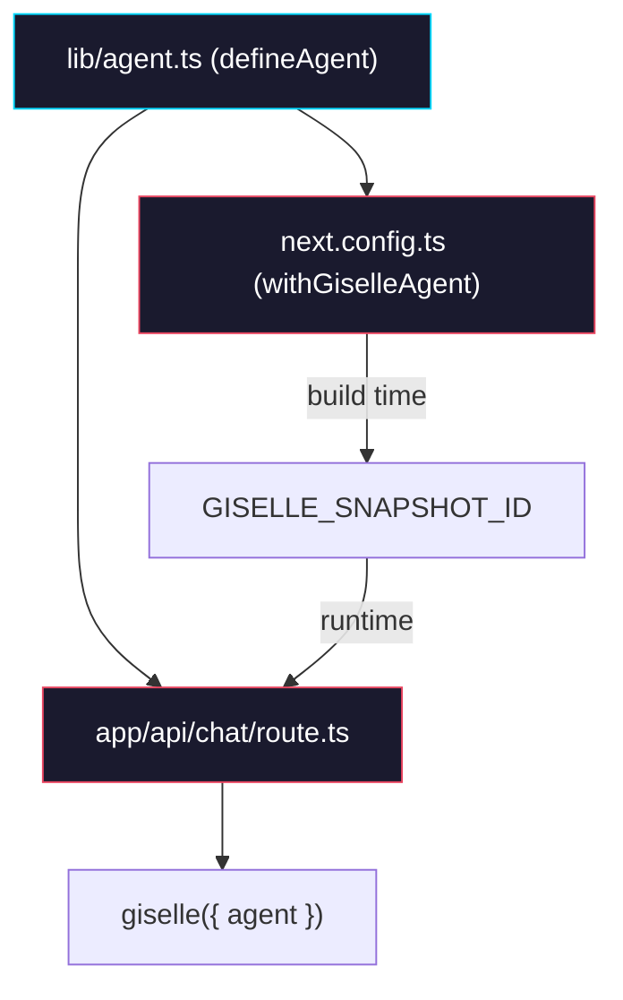

# Phase 4: Integrate into web

> **Epic:** [AGENTS.md](./AGENTS.md)
> **Dependencies:** Phase 2 (build handler), Phase 3 (plugin)
> **Blocks:** Phase 5

## Objective

Wire up `@giselles-ai/agent-builder` into the `packages/web` application. Create `lib/agent.ts` as the single agent definition, update `next.config.ts` to use `withGiselleAgent`, and update `route.ts` to import the agent from `lib/agent.ts` instead of constructing it from request body.

## What You're Building



## Deliverables

### 1. Add dependency

In `packages/web/package.json`, add:

```json
{
  "dependencies": {
    "@giselles-ai/agent-builder": "workspace:*"
  }
}
```

### 2. `packages/web/lib/agent.ts` — NEW

```ts
import { defineAgent } from "@giselles-ai/agent-builder";

export const agent = defineAgent({
  agentType: "gemini",
});
```

Note: `agentMd` is not set here because the prompt is fixed in the base snapshot. If a custom prompt is needed in the future, add `agentMd: "..."` here.

### 3. `packages/web/next.config.ts` — MODIFY

Change from:

```ts
import type { NextConfig } from "next";

const nextConfig: NextConfig = {
  transpilePackages: ["@giselles-ai/browser-tool"],
};

export default nextConfig;
```

To:

```ts
import type { NextConfig } from "next";
import { withGiselleAgent } from "@giselles-ai/agent-builder/next";
import { agent } from "./lib/agent";

const nextConfig: NextConfig = {
  transpilePackages: ["@giselles-ai/browser-tool"],
};

export default withGiselleAgent(nextConfig, agent);
```

### 4. `packages/web/app/api/chat/route.ts` — MODIFY

Remove the `resolveAgent` function and related helpers. Import `agent` from `lib/agent.ts` instead.

**Remove these functions:**
- `resolveAgentType`
- `resolveAgentSnapshotId`
- `resolveAgent`

**Remove this import:**
```ts
import { Agent } from "@giselles-ai/sandbox-agent";
```

**Add this import:**
```ts
import { agent } from "../../../lib/agent";
```

**Change the `POST` handler** — remove `resolveAgent(body)` call:

Before:
```ts
const agent = resolveAgent(body);

const result = streamText({
  model: giselle({
    agent,
    headers: {
      authorization: `Bearer ${requiredEnv("EXTERNAL_AGENT_API_BEARER_TOKEN")}`,
    },
  }),
  ...
});
```

After:
```ts
const result = streamText({
  model: giselle({
    agent,
    headers: {
      authorization: `Bearer ${requiredEnv("EXTERNAL_AGENT_API_BEARER_TOKEN")}`,
    },
  }),
  ...
});
```

The `agent` is now imported from `lib/agent.ts` at module scope. Its `snapshotId` getter reads from `process.env.GISELLE_SNAPSHOT_ID` which is set by the plugin at build time.

**Important:** At this point, `giselle()` still expects an `Agent` instance (from `@giselles-ai/sandbox-agent`), not a `DefinedAgent`. This type mismatch will be resolved in Phase 5 when `giselle-provider` is updated. For now, you may need a temporary adapter or type assertion:

```ts
const result = streamText({
  model: giselle({
    agent: agent as any, // temporary — resolved in Phase 5
    headers: {
      authorization: `Bearer ${requiredEnv("EXTERNAL_AGENT_API_BEARER_TOKEN")}`,
    },
  }),
  ...
});
```

## Verification

1. **Typecheck:**
   ```bash
   cd packages/web && pnpm typecheck
   ```
   Note: May have type errors due to the `agent as any` — this is acceptable until Phase 5.

2. **Build (with mock/skip):**
   Without the external API build endpoint running, the plugin will skip with a warning if `EXTERNAL_AGENT_API_BEARER_TOKEN` or `SANDBOX_SNAPSHOT_ID` are not set:
   ```bash
   cd packages/web && pnpm build
   ```
   Verify the warning `[withGiselleAgent] Skipped snapshot build` appears in build output.

3. **Import verification:**
   Ensure `lib/agent.ts` is correctly imported in both `next.config.ts` and `route.ts`.

## Files to Create/Modify

| File | Action |
|---|---|
| `packages/web/package.json` | **Modify** (add `@giselles-ai/agent-builder` dep) |
| `packages/web/lib/agent.ts` | **Create** |
| `packages/web/next.config.ts` | **Modify** (wrap with `withGiselleAgent`) |
| `packages/web/app/api/chat/route.ts` | **Modify** (remove `resolveAgent`, import from `lib/agent.ts`) |

## Done Criteria

- [ ] `packages/web/lib/agent.ts` exists with `defineAgent` call
- [ ] `next.config.ts` uses `withGiselleAgent` wrapper
- [ ] `route.ts` imports agent from `lib/agent.ts` instead of constructing it
- [ ] `resolveAgent`, `resolveAgentType`, `resolveAgentSnapshotId` functions removed from `route.ts`
- [ ] `Agent` import from `@giselles-ai/sandbox-agent` removed from `route.ts`
- [ ] Build runs (plugin skips gracefully without credentials)
- [ ] Update the status in [AGENTS.md](./AGENTS.md) to `✅ DONE`
