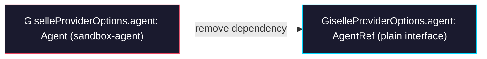

# Phase 5: Decouple giselle-provider

> **Epic:** [AGENTS.md](./AGENTS.md)
> **Dependencies:** Phase 4 (web integration complete)
> **Blocks:** Phase 6

## Objective

Remove the `@giselles-ai/sandbox-agent` dependency from `giselle-provider`. Replace the `Agent` class reference with a simple interface matching `DefinedAgent`. Remove the `Agent.prepare()` call from `runStream()`.

## What You're Building



## Deliverables

### 1. `packages/giselle-provider/src/types.ts` — MODIFY

Remove the `Agent` import and replace with a plain interface:

Before:
```ts
import type { Agent } from "@giselles-ai/sandbox-agent";

// ...

export type GiselleProviderOptions = {
  cloudApiUrl?: string;
  headers?: Record<string, string>;
  agent: Agent;
  deps?: Partial<GiselleProviderDeps>;
};
```

After:
```ts
// No import from @giselles-ai/sandbox-agent

/**
 * Minimal agent reference for the provider.
 * Compatible with DefinedAgent from @giselles-ai/agent-builder.
 */
export type AgentRef = {
  readonly type: string;
  readonly snapshotId: string;
};

export type GiselleProviderOptions = {
  cloudApiUrl?: string;
  headers?: Record<string, string>;
  agent: AgentRef;
  deps?: Partial<GiselleProviderDeps>;
};
```

### 2. `packages/giselle-provider/src/giselle-agent-model.ts` — MODIFY

**Remove the `Agent.prepare()` block** in `runStream()` (lines ~362-374):

Remove:
```ts
// --- NEW: Materialize pending Agent mutations before streaming ---
// ...
if (this.options.agent.dirty) {
  await this.options.agent.prepare();
}
```

**Update `connectCloudApi`** to use `AgentRef` fields:

Before (line ~811):
```ts
agentType: this.options.agent.type,
snapshotId: this.options.agent.snapshotId,
```

After:
```ts
agentType: this.options.agent.type,
snapshotId: this.options.agent.snapshotId,
```

This line stays the same because `AgentRef` has the same `type` and `snapshotId` properties. The key change is removing the `dirty` / `prepare()` usage above.

### 3. `packages/giselle-provider/package.json` — MODIFY

Remove `@giselles-ai/sandbox-agent` from dependencies:

Before:
```json
{
  "dependencies": {
    "@ai-sdk/provider": "3.0.7",
    "@ai-sdk/provider-utils": "4.0.13",
    "@giselles-ai/sandbox-agent": "workspace:*",
    "ioredis": "5.9.3",
    "zod": "4.3.6"
  }
}
```

After:
```json
{
  "dependencies": {
    "@ai-sdk/provider": "3.0.7",
    "@ai-sdk/provider-utils": "4.0.13",
    "ioredis": "5.9.3",
    "zod": "4.3.6"
  }
}
```

### 4. Ensure `DefinedAgent` is compatible with `AgentRef`

`DefinedAgent` from `@giselles-ai/agent-builder` has:
- `agentType: "gemini" | "codex"` — maps to `AgentRef.type`
- `snapshotId: string` — same

The `DefinedAgent` uses `agentType` while `AgentRef` uses `type`. To maintain compatibility, update `AgentRef` to accept either:

```ts
export type AgentRef = {
  readonly type?: string;
  readonly agentType?: string;
  readonly snapshotId: string;
};
```

And update `connectCloudApi` in `giselle-agent-model.ts`:

```ts
agentType: this.options.agent.agentType ?? this.options.agent.type,
```

Alternatively, rename `AgentRef.type` to `agentType` for consistency:

```ts
export type AgentRef = {
  readonly agentType: string;
  readonly snapshotId: string;
};
```

And update the `connectCloudApi` call:
```ts
agentType: this.options.agent.agentType,
```

Choose whichever approach keeps the diff smaller. Read the existing code in `giselle-agent-model.ts` to see all places `this.options.agent.type` is used and update accordingly.

### 5. Update existing tests

Check `packages/giselle-provider/src/__tests__/giselle-agent-model.test.ts` for any `Agent.create()` usage and replace with plain objects matching `AgentRef`:

Before:
```ts
import { Agent } from "@giselles-ai/sandbox-agent";
const agent = Agent.create("gemini", { snapshotId: "snap_test" });
```

After:
```ts
const agent = { agentType: "gemini", snapshotId: "snap_test" };
```

## Verification

1. **Build:**
   ```bash
   cd packages/giselle-provider && pnpm build
   ```

2. **Typecheck:**
   ```bash
   cd packages/giselle-provider && pnpm typecheck
   ```

3. **Tests:**
   ```bash
   cd packages/giselle-provider && pnpm test
   ```

4. **Monorepo build:**
   ```bash
   pnpm -r build
   ```

## Files to Create/Modify

| File | Action |
|---|---|
| `packages/giselle-provider/src/types.ts` | **Modify** (replace `Agent` import with `AgentRef` interface) |
| `packages/giselle-provider/src/giselle-agent-model.ts` | **Modify** (remove `Agent.prepare()` block, update `type` references) |
| `packages/giselle-provider/package.json` | **Modify** (remove `@giselles-ai/sandbox-agent` dep) |
| `packages/giselle-provider/src/__tests__/giselle-agent-model.test.ts` | **Modify** (replace `Agent.create()` with plain objects) |

## Done Criteria

- [ ] `@giselles-ai/sandbox-agent` is not in `giselle-provider/package.json`
- [ ] No import from `@giselles-ai/sandbox-agent` in `giselle-provider/src/`
- [ ] `Agent.prepare()` / `agent.dirty` calls removed from `giselle-agent-model.ts`
- [ ] `GiselleProviderOptions.agent` uses the plain `AgentRef` interface
- [ ] All existing tests pass
- [ ] Build and typecheck pass
- [ ] Update the status in [AGENTS.md](./AGENTS.md) to `✅ DONE`
