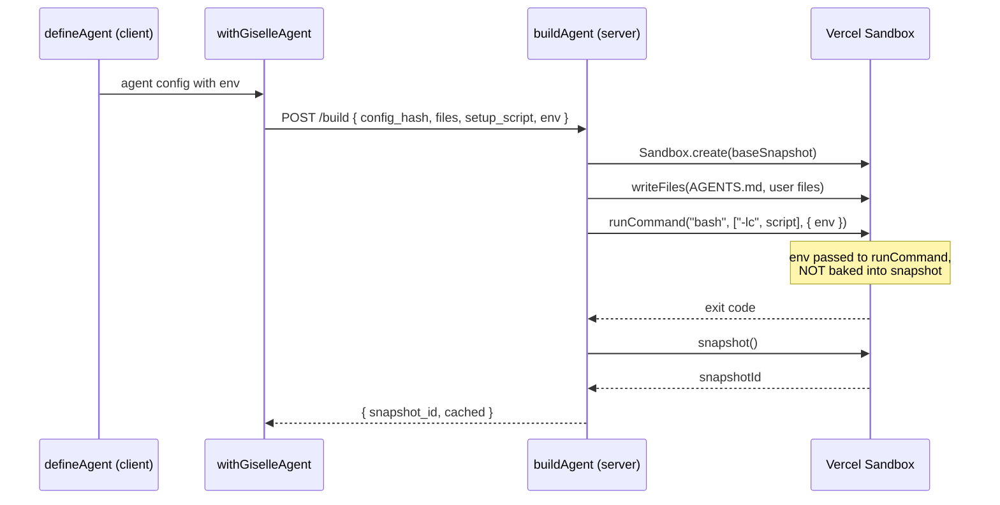
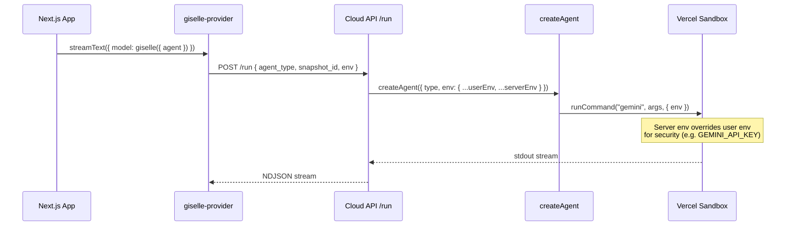
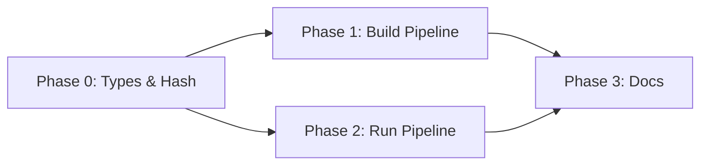

# Epic: Agent Environment Variables

## Goal

`defineAgent()` accepts an `env` field — a `Record<string, string>` of environment variables that are injected into the sandbox at both build time (setup script execution) and run time (CLI agent execution). Environment variables are **never baked into snapshots**; they are passed to `runCommand({ env })` at each invocation.

After this epic is complete, the following code works end-to-end:

```ts
export const agent = defineAgent({
  agentType: "gemini",
  agentMd: "You are a helpful assistant.",
  env: {
    GITHUB_AUTH_TOKEN: process.env.GITHUB_AUTH_TOKEN!,
    MY_CUSTOM_VAR: "hello",
  },
});
```

## Why

- Currently there is no way for developers to pass custom environment variables to the agent sandbox. Only internal keys like `GEMINI_API_KEY` are injected by the server.
- Real-world agents need environment variables for authentication tokens (GitHub, npm), API keys for custom services, and configuration flags.
- `Sandbox.create({ env })` is the newer Vercel Sandbox API, but using `runCommand({ env })` keeps secrets out of snapshots and is more secure.

## Architecture Overview

### Build Flow



### Run Flow



## Design Decisions

1. **env in config hash**: `env` values ARE included in `computeConfigHash`. Secret rotation triggers a rebuild, which is the desired behavior.
2. **Server env overrides user env**: At run time, server-side env (e.g. `GEMINI_API_KEY` from `process.env`) takes precedence over user-defined env to prevent clients from overriding security-critical values.
3. **env never in snapshots**: Both build and run pass env to `runCommand({ env })`, not `Sandbox.create({ env })`.

## Package / Directory Structure

```
packages/agent/src/
  types.ts                   ← MODIFY: add env to AgentConfig and DefinedAgent
  define-agent.ts            ← MODIFY: pass through env field
  hash.ts                    ← MODIFY: include env in config hash
  request-build.ts           ← MODIFY: include env in build request body
  build.ts                   ← MODIFY: parse env from request, pass to runCommand
  index.ts                   ← EXISTING: may need to re-export if needed
  agents/
    create-agent.ts          ← MODIFY: merge user env with server env
    gemini-agent.ts          ← MODIFY: merge user env into createCommand env
    codex-agent.ts           ← MODIFY: merge user env into createCommand env
  cloud-chat-state.ts        ← MODIFY: add env to cloudChatRunRequestSchema
  agent-api.ts               ← MODIFY: pass env from request to createAgent
  chat-run.ts                ← EXISTING: no changes (env flows through createCommand)
  __tests__/
    hash.test.ts             ← MODIFY: add env hash tests
    build.test.ts            ← MODIFY: add env in runCommand tests
packages/giselle-provider/src/
  types.ts                   ← MODIFY: add env to AgentRef and ConnectCloudApiParams
  giselle-agent-model.ts     ← MODIFY: pass env in connectCloudApi call body
docs/
  01-getting-started/
    01-01-getting-started.md ← MODIFY: add env section
  02-api-reference/
    02-01-define-agent.md    ← MODIFY: add env to API reference tables
  03-architecture/
    03-01-architecture.md    ← MODIFY: mention env in build pipeline section
```

## Task Dependency Graph



Phase 1 and Phase 2 can run in parallel after Phase 0.

## Task Status

| Phase | Task File | Status | Description |
|---|---|---|---|
| 0 | [phase-0-types-and-hash.md](./phase-0-types-and-hash.md) | ✅ DONE | Add `env` to `AgentConfig`/`DefinedAgent`, update `computeConfigHash`, update tests |
| 1 | [phase-1-build-pipeline.md](./phase-1-build-pipeline.md) | ✅ DONE | Wire env through `requestBuild` → `BuildRequest` → `buildAgent` → `runCommand({ env })` |
| 2 | [phase-2-run-pipeline.md](./phase-2-run-pipeline.md) | ✅ DONE | Wire env through `giselle-provider` → `/run` request → `agent-api` → `createAgent` → `runCommand({ env })` |
| 3 | [phase-3-docs.md](./phase-3-docs.md) | ✅ DONE | Update getting started guide, API reference, and architecture docs |

> **How to work on this epic:** Read this file first to understand the full architecture.
> Then check the status table above. Pick the first `🔲 TODO` task whose dependencies
> (see dependency graph) are `✅ DONE`. Open that task file and follow its instructions.
> When done, update the status in this table to `✅ DONE`.

## Key Conventions

- Monorepo: pnpm workspaces + Turborepo
- TypeScript strict mode, Biome for formatting/linting
- Tests: Vitest
- Build request/response uses snake_case JSON (`config_hash`, `agent_type`, `setup_script`, `env`)
- `AgentConfig` fields use camelCase TypeScript
- Config hash must be deterministic — `env` key-value pairs are sorted by key before hashing
- Server env overrides user env at merge time (`{ ...userEnv, ...serverEnv }`)

## Existing Code Reference

| File | Relevance |
|---|---|
| `packages/agent/src/types.ts` | Current `AgentConfig` and `DefinedAgent` types — add `env` field here |
| `packages/agent/src/define-agent.ts` | `defineAgent()` — pass `env` through to `DefinedAgent` |
| `packages/agent/src/hash.ts` | `computeConfigHash()` — must include `env` in hash input |
| `packages/agent/src/request-build.ts` | `requestBuild()` — must serialize `env` into build request body |
| `packages/agent/src/build.ts` | `buildAgent()` — must parse `env` and pass to `runCommand` for setup script |
| `packages/agent/src/agents/create-agent.ts` | `createAgent()` — merges env and passes to agent constructors |
| `packages/agent/src/agents/gemini-agent.ts` | `createGeminiAgent()` — `createCommand` returns env for `runCommand` |
| `packages/agent/src/agents/codex-agent.ts` | `createCodexAgent()` — same pattern as gemini |
| `packages/agent/src/cloud-chat-state.ts` | `cloudChatRunRequestSchema` — add `env` field |
| `packages/agent/src/agent-api.ts` | `handleRun()` — pass env from request to `createAgent` |
| `packages/giselle-provider/src/types.ts` | `AgentRef`, `ConnectCloudApiParams` — add env |
| `packages/giselle-provider/src/giselle-agent-model.ts` | `connectCloudApi()` — include env in request body |
| `packages/agent/src/__tests__/hash.test.ts` | Existing hash tests — pattern for new env tests |
| `packages/agent/src/__tests__/build.test.ts` | Existing build tests — pattern for env in runCommand tests |
| `docs/02-api-reference/02-01-define-agent.md` | API reference — add env property |
