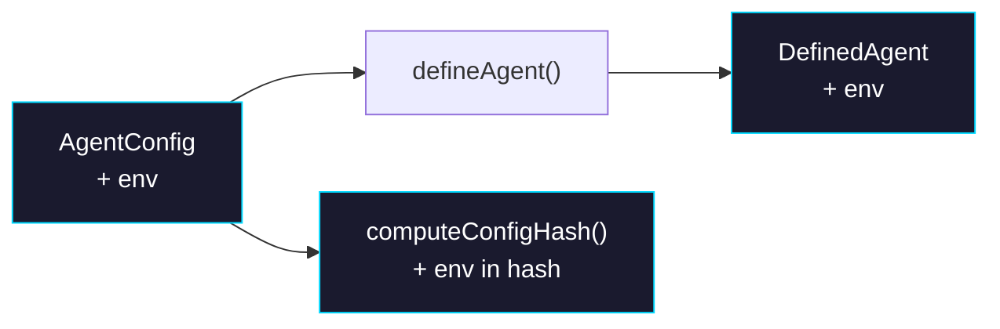

# Phase 0: Types & Hash

> **Epic:** [AGENTS.md](./AGENTS.md)
> **Dependencies:** None
> **Blocks:** Phase 1, Phase 2

## Objective

Add `env?: Record<string, string>` to `AgentConfig` and `DefinedAgent`, pass it through `defineAgent()`, include it in `computeConfigHash`, and update all related tests.

## What You're Building



## Deliverables

### 1. `packages/agent/src/types.ts`

Add `env` to both `AgentConfig` and `DefinedAgent`:

```ts
// Add to AgentConfig:
/** Environment variables passed to the sandbox at build and run time. */
env?: Record<string, string>;

// Add to DefinedAgent:
/** Environment variables. Empty record when not configured. */
readonly env: Record<string, string>;
```

### 2. `packages/agent/src/define-agent.ts`

Pass through `env` with a default of `{}`:

```ts
// Add to the returned object:
env: config.env ?? {},
```

### 3. `packages/agent/src/hash.ts`

Include `env` in the hash payload. **Sort keys** for deterministic hashing:

```ts
// Add to the JSON.stringify payload object:
env: config.env
  ? Object.fromEntries(
      Object.entries(config.env).sort(([a], [b]) => a.localeCompare(b)),
    )
  : null,
```

### 4. `packages/agent/src/__tests__/hash.test.ts`

Add these test cases (follow the existing pattern):

| Test | Description |
|---|---|
| `produces different hash when env changes` | Two configs with different env values → different hash |
| `produces same hash for same env` | Same env object → same hash |
| `produces different hash with env vs without` | Config with env vs without → different hash |
| `produces same hash regardless of env key insertion order` | `{ A: "1", B: "2" }` vs `{ B: "2", A: "1" }` → same hash (sorted) |

### 5. `packages/agent/src/__tests__/define-agent.test.ts`

Add a test case verifying `defineAgent({ env: { FOO: "bar" } })` returns `{ env: { FOO: "bar" } }` and that omitting `env` defaults to `{}`.

## Verification

1. Run type check:
   ```bash
   pnpm turbo typecheck --filter=@giselles-ai/agent
   ```

2. Run tests:
   ```bash
   pnpm turbo test --filter=@giselles-ai/agent
   ```

3. All existing tests must still pass.

## Files to Create/Modify

| File | Action |
|---|---|
| `packages/agent/src/types.ts` | **Modify** — add `env` field to `AgentConfig` and `DefinedAgent` |
| `packages/agent/src/define-agent.ts` | **Modify** — pass through `env` |
| `packages/agent/src/hash.ts` | **Modify** — include sorted env in hash payload |
| `packages/agent/src/__tests__/hash.test.ts` | **Modify** — add env hash tests |
| `packages/agent/src/__tests__/define-agent.test.ts` | **Modify** — add env default test |

## Done Criteria

- [ ] `AgentConfig` has optional `env?: Record<string, string>`
- [ ] `DefinedAgent` has `readonly env: Record<string, string>`
- [ ] `defineAgent()` passes through env, defaults to `{}`
- [ ] `computeConfigHash` includes env (sorted by key) in hash
- [ ] Hash tests pass: different env → different hash, same env → same hash, key order doesn't matter
- [ ] All existing tests still pass
- [ ] Update the status in [AGENTS.md](./AGENTS.md) to `✅ DONE`
