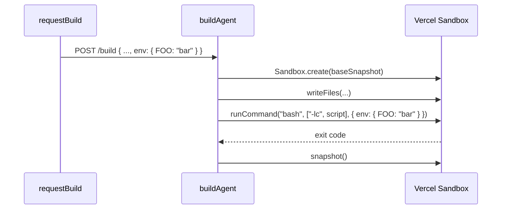

# Phase 1: Build Pipeline

> **Epic:** [AGENTS.md](./AGENTS.md)
> **Dependencies:** Phase 0
> **Parallel with:** Phase 2
> **Blocks:** Phase 3

## Objective

Wire `env` through the build pipeline so that environment variables are passed to the setup script's `runCommand({ env })` during sandbox build. The `env` is sent in the build request body and parsed server-side, but is **never** included in `Sandbox.create` or baked into the snapshot.

## What You're Building



## Deliverables

### 1. `packages/agent/src/request-build.ts`

Add `env` to the request body sent to the build API:

```ts
// In requestBuild(), add to requestBody:
const requestBody = {
  config_hash: configHash,
  agent_type: agent.agentType ?? "gemini",
  files,
  setup_script: agent.setup?.script ?? null,
  env: agent.env ?? null,  // ← ADD
};
```

### 2. `packages/agent/src/build.ts`

**Modify `BuildRequest` type** — add env field:

```ts
type BuildRequest = {
  config_hash: string;
  agent_type: "gemini" | "codex";
  files: Array<{ path: string; content: string }>;
  setup_script: string | null;
  env: Record<string, string> | null;  // ← ADD
};
```

**Modify `parseBuildRequest`** — parse and validate env:

After parsing `setupScript`, add:

```ts
let parsedEnv: Record<string, string> | null = null;

if (record.env !== undefined && record.env !== null) {
  if (typeof record.env !== "object" || Array.isArray(record.env)) {
    return null;
  }
  const envRecord = record.env as Record<string, unknown>;
  for (const value of Object.values(envRecord)) {
    if (typeof value !== "string") {
      return null;
    }
  }
  parsedEnv = envRecord as Record<string, string>;
}
```

Include `env: parsedEnv` in the returned object.

**Modify `buildAgent`** — pass env to `runCommand`:

Change the setup script execution block from:

```ts
const result = await sandbox.runCommand("bash", ["-lc", parsed.setup_script]);
```

To:

```ts
const result = await sandbox.runCommand({
  cmd: "bash",
  args: ["-lc", parsed.setup_script],
  ...(parsed.env ? { env: parsed.env } : {}),
});
```

### 3. `packages/agent/src/__tests__/build.test.ts`

Add these test cases:

| Test | Description |
|---|---|
| `passes env to runCommand when setup_script and env are provided` | Verify `runCommand` is called with `{ cmd: "bash", args: ["-lc", script], env: { FOO: "bar" } }` |
| `does not pass env when env is null` | Verify `runCommand` is called without env field |
| `returns 400 when env contains non-string values` | Request with `env: { key: 123 }` → 400 |
| `accepts request with env but no setup_script` | env is parsed but not used (no runCommand call) |

**Important:** The existing test `executes setup script with bash -lc` currently asserts:
```ts
expect(mockSandbox.runCommand).toHaveBeenCalledWith("bash", ["-lc", "npx opensrc vercel/ai"]);
```
This assertion must be updated to match the new object-form `runCommand` call:
```ts
expect(mockSandbox.runCommand).toHaveBeenCalledWith({
  cmd: "bash",
  args: ["-lc", "npx opensrc vercel/ai"],
});
```

Similarly update the `executes setup commands after file writes and before snapshot` test's `runCommandSpy` mock if it checks call args.

## Verification

1. Run type check:
   ```bash
   pnpm turbo typecheck --filter=@giselles-ai/agent
   ```

2. Run tests:
   ```bash
   pnpm turbo test --filter=@giselles-ai/agent
   ```

3. All existing tests must still pass (update assertions for the new `runCommand` call form).

## Files to Create/Modify

| File | Action |
|---|---|
| `packages/agent/src/request-build.ts` | **Modify** — add `env` to request body |
| `packages/agent/src/build.ts` | **Modify** — add `env` to `BuildRequest`, parse it, pass to `runCommand` |
| `packages/agent/src/__tests__/build.test.ts` | **Modify** — add env tests, update existing setup script assertions |

## Done Criteria

- [ ] `requestBuild` sends `env` in the build request body
- [ ] `parseBuildRequest` validates and parses `env` field
- [ ] `buildAgent` passes `env` to `runCommand` for the setup script
- [ ] `runCommand` is called with object form `{ cmd, args, env }` instead of positional args
- [ ] New tests cover env in build pipeline
- [ ] Existing setup script tests updated for new call form
- [ ] All tests pass
- [ ] Update the status in [AGENTS.md](./AGENTS.md) to `✅ DONE`
