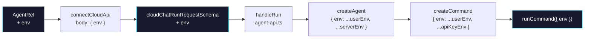

# Phase 2: Run Pipeline

> **Epic:** [AGENTS.md](./AGENTS.md)
> **Dependencies:** Phase 0
> **Parallel with:** Phase 1
> **Blocks:** Phase 3

## Objective

Wire `env` through the run pipeline so that user-defined environment variables flow from `defineAgent({ env })` through the giselle-provider → Cloud API `/run` request → `agent-api` → `createAgent` → `createCommand` → `runCommand({ env })`. Server-side env overrides user env for security.

## What You're Building



## Deliverables

### 1. `packages/giselle-provider/src/types.ts`

Add `env` to `AgentRef` and `ConnectCloudApiParams`:

```ts
// AgentRef — add:
readonly env?: Record<string, string>;

// ConnectCloudApiParams — add:
env?: Record<string, string>;
```

### 2. `packages/giselle-provider/src/giselle-agent-model.ts`

**In `connectCloudApi` (line ~278-299)** — pass `env` to the params:

```ts
// In the connectCloudApi method, add env to the params object:
return this.deps.connectCloudApi({
  endpoint: buildCloudEndpoint(...),
  chatId: params.chatId,
  message: this.extractUserMessage(options.prompt),
  toolResults: params.toolResults,
  agentType: this.options.agent.agentType ?? this.options.agent.type,
  snapshotId: this.options.agent.snapshotId,
  env: this.options.agent.env,  // ← ADD
  headers: this.mergeCloudHeaders(options.headers),
  signal: options.abortSignal,
});
```

**In `createDefaultDeps` (line ~45-88)** — include `env` in the request body:

```ts
// In the connectCloudApi default implementation, add to body:
if (params.env !== undefined) {
  body.env = params.env;
}
```

### 3. `packages/agent/src/cloud-chat-state.ts`

Add `env` to `cloudChatRunRequestSchema`:

```ts
export const cloudChatRunRequestSchema = z.object({
  type: z.literal("agent.run"),
  chat_id: z.string().min(1),
  message: z.string().min(1),
  agent_type: z.enum(["gemini", "codex"]),
  snapshot_id: z.string().min(1),
  env: z.record(z.string()).optional(),  // ← ADD
  tool_results: z
    .array(...)
    .optional(),
});
```

### 4. `packages/agent/src/agent-api.ts`

**In `handleRun` (line ~131-167)** — pass env from the request to `createAgent`:

The `agentOptions` are constructed at line ~158-162. Merge the user env:

```ts
agent: {
  ...agentOptions,
  type: parsed.data.agent_type,
  snapshotId: parsed.data.snapshot_id,
  env: {
    ...parsed.data.env,       // user env (lower priority)
    ...agentOptions.env,      // server env (higher priority)
  },
},
```

Note: `agentOptions` is `Omit<CreateAgentOptions, "type" | "snapshotId">` which already has `env?: Record<string, string | undefined>`. This merge ensures server-side env (like `GEMINI_API_KEY` from `process.env`) overrides user-provided values.

### 5. `packages/agent/src/agents/gemini-agent.ts`

**In `createCommand` (line ~175-195)** — merge user env into command env:

Currently `createCommand` returns only `{ GEMINI_API_KEY }`. Spread all user env first, then override with required keys:

```ts
createCommand({ input }) {
  // ... args construction stays the same ...

  return {
    cmd: "gemini",
    args,
    env: {
      ...env,  // all user env (already stored in closure from options.env)
      GEMINI_API_KEY: requiredEnv(env, "GEMINI_API_KEY"),
    },
  };
},
```

Filter out `undefined` values since `env` type is `Record<string, string | undefined>`:

```ts
env: Object.fromEntries(
  Object.entries({
    ...env,
    GEMINI_API_KEY: requiredEnv(env, "GEMINI_API_KEY"),
  }).filter((e): e is [string, string] => e[1] != null),
),
```

### 6. `packages/agent/src/agents/codex-agent.ts`

Same pattern as gemini-agent. Find `createCommand` and spread user env:

```ts
// In createCommand, change the returned env from just { CODEX_API_KEY }
// to include all user env:
env: Object.fromEntries(
  Object.entries({
    ...env,
    CODEX_API_KEY: requiredEnv(env, "CODEX_API_KEY"),
  }).filter((e): e is [string, string] => e[1] != null),
),
```

Read the current `createCommand` in `codex-agent.ts` first to understand its exact structure before modifying.

## Verification

1. Run type check across both packages:
   ```bash
   pnpm turbo typecheck --filter=@giselles-ai/agent --filter=@giselles-ai/giselle-provider
   ```

2. Run tests:
   ```bash
   pnpm turbo test --filter=@giselles-ai/agent --filter=@giselles-ai/giselle-provider
   ```

3. Manual verification: trace the data flow by reading the code to confirm `env` passes through each layer:
   - `AgentRef.env` → `connectCloudApi({ env })` → request body `{ env }` → `cloudChatRunRequestSchema` → `handleRun` → `createAgent({ env })` → `createCommand({ env })` → `runCommand({ env })`

## Files to Create/Modify

| File | Action |
|---|---|
| `packages/giselle-provider/src/types.ts` | **Modify** — add `env` to `AgentRef` and `ConnectCloudApiParams` |
| `packages/giselle-provider/src/giselle-agent-model.ts` | **Modify** — pass `env` in `connectCloudApi` call and request body |
| `packages/agent/src/cloud-chat-state.ts` | **Modify** — add `env` to `cloudChatRunRequestSchema` |
| `packages/agent/src/agent-api.ts` | **Modify** — merge user env with server env in `handleRun` |
| `packages/agent/src/agents/gemini-agent.ts` | **Modify** — spread user env in `createCommand` |
| `packages/agent/src/agents/codex-agent.ts` | **Modify** — spread user env in `createCommand` |

## Done Criteria

- [ ] `AgentRef` type includes optional `env`
- [ ] `ConnectCloudApiParams` includes optional `env`
- [ ] `giselle-provider` sends `env` in the `/run` request body
- [ ] `cloudChatRunRequestSchema` accepts optional `env` field
- [ ] `handleRun` merges user env with server env (server wins)
- [ ] `createGeminiAgent` spreads user env in `createCommand` return
- [ ] `createCodexAgent` spreads user env in `createCommand` return
- [ ] Type check passes for both packages
- [ ] All existing tests pass
- [ ] Update the status in [AGENTS.md](./AGENTS.md) to `✅ DONE`
