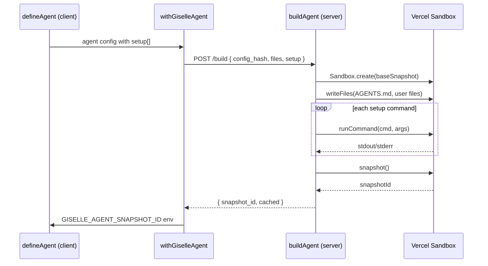
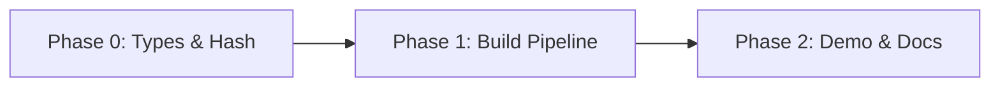

# Epic: Agent Setup Commands

## Goal

`defineAgent()` accepts a declarative `setup` array of commands that run inside the sandbox during the build phase (after file writes, before snapshot). This lets developers customize the agent's sandbox environment — install packages, fetch reference docs, clone repos — using the same familiar pattern as Dockerfile `RUN` instructions.

After this epic is complete, the following code works end-to-end:

```ts
export const agent = defineAgent({
  agentType: "gemini",
  agentMd,
  setup: [
    { command: "npx", args: ["opensrc", "vercel/ai"] },
    { command: "npm", args: ["install", "-g", "tsx"] },
  ],
});
```

## Why

- Currently `defineAgent` can only customize the agent via `agentMd` (system prompt) and `files` (static file writes). There is no way to run shell commands during build.
- Real-world agents need reference documentation, pre-installed tools, or pre-fetched data inside the sandbox. Without `setup`, developers have no escape hatch.
- A declarative command list (vs. a callback function) is serializable, hashable, and works across the client→server build boundary (`requestBuild` → `buildAgent`).

## Architecture Overview



## Usage Examples — `defineAgent` Customization Patterns

These examples illustrate the DX we're targeting. They should inform the implementation and serve as documentation test cases.

### 1. Minimal — No setup (backward compatible)

```ts
export const agent = defineAgent({
  agentType: "gemini",
  agentMd: "You are a helpful assistant.",
});
```

### 2. Reference docs — Feed the agent library documentation

```ts
export const agent = defineAgent({
  agentType: "gemini",
  agentMd: `
You are a Next.js expert. Reference documentation is available in opensrc/.
Always consult it before answering.
  `,
  setup: [
    { command: "npx", args: ["opensrc", "vercel/ai"] },
    { command: "npx", args: ["opensrc", "vercel/next.js"] },
  ],
});
```

### 3. Dev tools — Pre-install CLI tools the agent will use

```ts
export const agent = defineAgent({
  agentType: "gemini",
  agentMd: `
You are a code execution assistant. You can run TypeScript files using tsx.
  `,
  setup: [
    { command: "npm", args: ["install", "-g", "tsx"] },
  ],
});
```

### 4. Project scaffold — Clone a repo and install dependencies

```ts
export const agent = defineAgent({
  agentType: "codex",
  agentMd: `
You are a contributor to the open-source project in ~/project.
Read the CONTRIBUTING.md before making changes.
  `,
  setup: [
    { command: "git", args: ["clone", "https://github.com/owner/repo.git", "/home/vercel-sandbox/project"] },
    { command: "bash", args: ["-c", "cd /home/vercel-sandbox/project && npm install"] },
  ],
});
```

### 5. Data files — Fetch reference data at build time

```ts
export const agent = defineAgent({
  agentType: "gemini",
  agentMd: `
You are a data analyst. A CSV dataset is available at ~/data/sales.csv.
  `,
  setup: [
    { command: "mkdir", args: ["-p", "/home/vercel-sandbox/data"] },
    { command: "bash", args: ["-c", "curl -o /home/vercel-sandbox/data/sales.csv https://example.com/data/sales.csv"] },
  ],
});
```

### 6. Combined — Full customization

```ts
export const agent = defineAgent({
  agentType: "gemini",
  agentMd,
  files: [
    { path: "/home/vercel-sandbox/config.json", content: JSON.stringify({ theme: "dark" }) },
  ],
  setup: [
    { command: "npx", args: ["opensrc", "vercel/ai"] },
    { command: "npm", args: ["install", "-g", "tsx", "jq"] },
    { command: "bash", args: ["-c", "echo 'Setup complete' > /tmp/setup.log"] },
  ],
});
```

## Package / Directory Structure

```
packages/agent/src/
  types.ts                   ← MODIFY: add SetupCommand type, add setup to AgentConfig/DefinedAgent
  define-agent.ts            ← MODIFY: pass through setup field
  hash.ts                    ← MODIFY: include setup in config hash
  request-build.ts           ← MODIFY: include setup in build request body
  build.ts                   ← MODIFY: execute setup commands after file writes
  __tests__/
    hash.test.ts             ← MODIFY: add test for setup in hash
docs/
  01-getting-started/
    01-01-getting-started.md ← MODIFY: add setup section to "Next steps"
  03-architecture/
    03-01-architecture.md    ← MODIFY: update build pipeline diagram
  02-api-reference/
    02-01-define-agent.md    ← CREATE: API reference for defineAgent with all options
```

## Task Dependency Graph



## Task Status

| Phase | Task File | Status | Description |
|---|---|---|---|
| 0 | [phase-0-types-and-hash.md](./phase-0-types-and-hash.md) | ✅ DONE | Add `SetupCommand` type, update `AgentConfig`, update `computeConfigHash` |
| 1 | [phase-1-build-pipeline.md](./phase-1-build-pipeline.md) | ✅ DONE | Wire setup commands through `requestBuild` → `buildAgent` → `sandbox.runCommand` |
| 2 | [phase-2-demo-and-docs.md](./phase-2-demo-and-docs.md) | ✅ DONE | Update chat-app demo, update docs, create API reference |

> **How to work on this epic:** Read this file first to understand the full architecture.
> Then check the status table above. Pick the first `🔲 TODO` task whose dependencies
> (see dependency graph) are `✅ DONE`. Open that task file and follow its instructions.
> When done, update the status in this table to `✅ DONE`.

## Key Conventions

- Monorepo: pnpm workspaces + Turborepo
- TypeScript strict mode, Biome for formatting/linting
- Tests: Vitest
- Build request/response uses snake_case JSON (`config_hash`, `agent_type`)
- `AgentConfig` fields use camelCase TypeScript
- Sandbox commands use `runCommandOrThrow` from `packages/agent-kit/src/sandbox-utils.ts` (or equivalent `sandbox.runCommand` in `build.ts`)
- Config hash must be deterministic — `setup` commands are included as-is in the JSON payload

## Existing Code Reference

| File | Relevance |
|---|---|
| `packages/agent/src/types.ts` | Current `AgentConfig` and `DefinedAgent` types — add `setup` field here |
| `packages/agent/src/define-agent.ts` | `defineAgent()` — pass `setup` through to `DefinedAgent` |
| `packages/agent/src/hash.ts` | `computeConfigHash()` — must include `setup` in hash input |
| `packages/agent/src/request-build.ts` | `requestBuild()` — must serialize `setup` into build request body |
| `packages/agent/src/build.ts` | `buildAgent()` — must parse + execute setup commands between file writes and snapshot |
| `packages/agent/src/next/with-giselle-agent.ts` | `withGiselleAgent()` — passes `AgentConfig` through, no changes needed (setup flows via config) |
| `docs/01-getting-started/01-01-getting-started.md` | Getting Started guide — add setup mention to "Next steps" |
| `docs/03-architecture/03-01-architecture.md` | Architecture doc — update build pipeline section |
