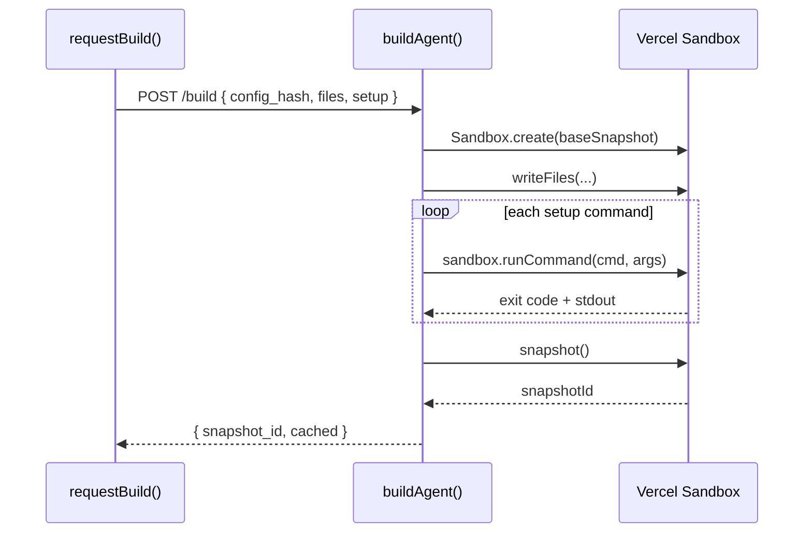

# Phase 1: Build Pipeline

> **Epic:** [AGENTS.md](./AGENTS.md)
> **Dependencies:** Phase 0 (types & hash must exist)
> **Blocks:** Phase 2

## Objective

Wire the `setup` commands through the client→server build pipeline: `requestBuild()` serializes them into the POST body, `buildAgent()` parses and executes them inside the sandbox between file writes and snapshot.

## What You're Building



## Deliverables

### 1. `packages/agent/src/request-build.ts` — Include `setup` in build request

Add `setup` to the request body sent to the build API:

```ts
const requestBody = {
  config_hash: configHash,
  agent_type: agent.agentType ?? "gemini",
  files,
  setup: (agent.setup ?? []).map((s) => ({
    command: s.command,
    args: s.args,
  })),
};
```

No other changes needed in this file — `setup` flows as a JSON array.

### 2. `packages/agent/src/build.ts` — Parse and execute setup commands

**Update `BuildRequest` type:**

```ts
type BuildRequest = {
  config_hash: string;
  agent_type: "gemini" | "codex";
  files: Array<{ path: string; content: string }>;
  setup: Array<{ command: string; args: string[] }>;
};
```

**Update `parseBuildRequest`** to parse the `setup` field:

After the `files` parsing block, add:

```ts
const setup = record.setup;
const parsedSetup: BuildRequest["setup"] = [];

// setup is optional — treat missing/non-array as empty
if (setup !== undefined) {
  if (!Array.isArray(setup)) {
    return null;
  }

  for (const cmd of setup) {
    if (!cmd || typeof cmd !== "object" || Array.isArray(cmd)) {
      return null;
    }

    const recordCmd = cmd as Record<string, unknown>;
    if (
      typeof recordCmd.command !== "string" ||
      !Array.isArray(recordCmd.args) ||
      !recordCmd.args.every((a: unknown) => typeof a === "string")
    ) {
      return null;
    }

    parsedSetup.push({
      command: recordCmd.command,
      args: recordCmd.args as string[],
    });
  }
}
```

Return `parsedSetup` in the result object:

```ts
return {
  config_hash: configHash.trim(),
  agent_type: agentType,
  files: parsedFiles,
  setup: parsedSetup,
};
```

**Update `buildAgent`** to execute setup commands after file writes and before snapshot:

```ts
// After file writes, before snapshot:
if (parsed.setup.length > 0) {
  for (const cmd of parsed.setup) {
    console.log(
      `[agent-build] setup: ${cmd.command} ${cmd.args.join(" ")}`,
    );
    const result = await sandbox.runCommand(cmd.command, cmd.args);
    if (result.exitCode !== 0) {
      const stderr = typeof result.stderr === "string" ? result.stderr : "";
      throw new Error(
        `Setup command failed: ${cmd.command} ${cmd.args.join(" ")} (exit ${result.exitCode}): ${stderr}`,
      );
    }
  }
}

const snapshot = await sandbox.snapshot();
```

### 3. Update `packages/agent/src/__tests__/build.test.ts`

**Update `createMockSandbox`** to include `runCommand`:

```ts
function createMockSandbox(overrides?: {
  snapshotId?: string;
  writeSpy?: ReturnType<typeof vi.fn>;
  snapshotSpy?: ReturnType<typeof vi.fn>;
  runCommandSpy?: ReturnType<typeof vi.fn>;
}): any {
  return {
    sandboxId: "sb_123",
    writeFiles: overrides?.writeSpy ?? vi.fn().mockResolvedValue(undefined),
    snapshot:
      overrides?.snapshotSpy ??
      vi
        .fn()
        .mockResolvedValue({ snapshotId: overrides?.snapshotId ?? "snap_new" }),
    runCommand:
      overrides?.runCommandSpy ??
      vi.fn().mockResolvedValue({ exitCode: 0, stdout: "", stderr: "" }),
  };
}
```

**Add new tests:**

```ts
it("executes setup commands after file writes and before snapshot", async () => {
  process.env.GISELLE_AGENT_SANDBOX_BASE_SNAPSHOT_ID = "snap_env";
  const callOrder: string[] = [];
  const mockSandbox = createMockSandbox({
    writeSpy: vi.fn().mockImplementation(() => {
      callOrder.push("writeFiles");
      return Promise.resolve();
    }),
    runCommandSpy: vi.fn().mockImplementation((cmd: string, args: string[]) => {
      callOrder.push(`runCommand:${cmd}:${args.join(",")}`);
      return Promise.resolve({ exitCode: 0, stdout: "", stderr: "" });
    }),
    snapshotSpy: vi.fn().mockImplementation(() => {
      callOrder.push("snapshot");
      return Promise.resolve({ snapshotId: "snap_setup" });
    }),
  });
  mockCreate.mockResolvedValue(mockSandbox);

  const res = await buildAgent({
    request: makeRequest({
      config_hash: "setup_hash",
      agent_type: "gemini",
      files: [{ path: "/x.md", content: "hello" }],
      setup: [
        { command: "npm", args: ["install", "-g", "tsx"] },
        { command: "npx", args: ["opensrc", "vercel/ai"] },
      ],
    }),
  });

  expect(res.status).toBe(200);
  expect(callOrder).toEqual([
    "writeFiles",
    "runCommand:npm:install,-g,tsx",
    "runCommand:npx:opensrc,vercel/ai",
    "snapshot",
  ]);
});

it("skips setup when setup array is empty", async () => {
  process.env.GISELLE_AGENT_SANDBOX_BASE_SNAPSHOT_ID = "snap_env";
  const mockSandbox = createMockSandbox();
  mockCreate.mockResolvedValue(mockSandbox);

  const res = await buildAgent({
    request: makeRequest({
      config_hash: "no_setup_hash",
      agent_type: "gemini",
      files: [],
      setup: [],
    }),
  });

  expect(res.status).toBe(200);
  expect(mockSandbox.runCommand).not.toHaveBeenCalled();
});

it("still works when setup field is omitted (backward compat)", async () => {
  process.env.GISELLE_AGENT_SANDBOX_BASE_SNAPSHOT_ID = "snap_env";
  const mockSandbox = createMockSandbox();
  mockCreate.mockResolvedValue(mockSandbox);

  const res = await buildAgent({
    request: makeRequest({
      config_hash: "no_setup_field_hash",
      agent_type: "gemini",
      files: [],
    }),
  });

  expect(res.status).toBe(200);
  expect(mockSandbox.runCommand).not.toHaveBeenCalled();
});

it("throws when a setup command fails", async () => {
  process.env.GISELLE_AGENT_SANDBOX_BASE_SNAPSHOT_ID = "snap_env";
  const mockSandbox = createMockSandbox({
    runCommandSpy: vi.fn().mockResolvedValue({
      exitCode: 1,
      stdout: "",
      stderr: "not found",
    }),
  });
  mockCreate.mockResolvedValue(mockSandbox);

  await expect(
    buildAgent({
      request: makeRequest({
        config_hash: "fail_setup_hash",
        agent_type: "gemini",
        files: [],
        setup: [{ command: "bad-cmd", args: [] }],
      }),
    }),
  ).rejects.toThrow("Setup command failed: bad-cmd");
});
```

## Verification

1. **Typecheck:**
   ```bash
   pnpm --filter @giselles-ai/agent exec tsc --noEmit
   ```

2. **Tests:**
   ```bash
   pnpm --filter @giselles-ai/agent test
   ```

3. **Verify backward compat:** Existing tests with no `setup` field still pass unchanged.

## Files to Create/Modify

| File | Action |
|---|---|
| `packages/agent/src/request-build.ts` | **Modify** — add `setup` to request body |
| `packages/agent/src/build.ts` | **Modify** — parse `setup` in request, execute commands in `buildAgent` |
| `packages/agent/src/__tests__/build.test.ts` | **Modify** — add `runCommand` mock, add setup execution tests |

## Done Criteria

- [ ] `requestBuild()` includes `setup` in POST body
- [ ] `buildAgent()` parses `setup` from request
- [ ] Setup commands execute after file writes, before snapshot
- [ ] Failed setup command throws with descriptive error
- [ ] Missing `setup` field is treated as empty (backward compatible)
- [ ] All existing + new tests pass
- [ ] Update the status in [AGENTS.md](./AGENTS.md) to `✅ DONE`
