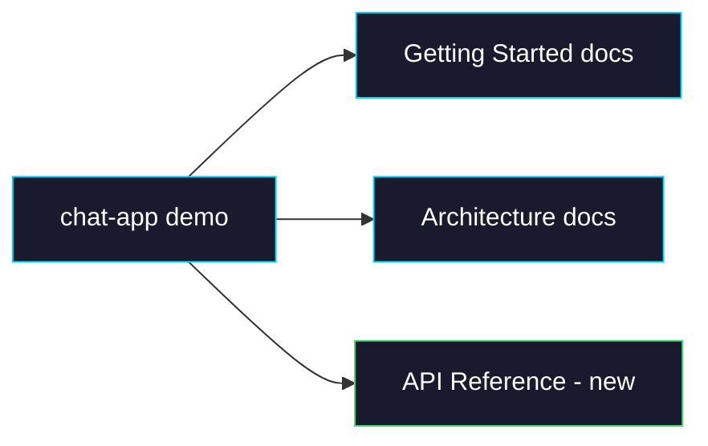

# Phase 2: Demo & Docs

> **Epic:** [AGENTS.md](./AGENTS.md)
> **Dependencies:** Phase 1 (build pipeline must be functional)
> **Blocks:** None

## Objective

Update the chat-app demo to use `setup` commands, update existing documentation to cover the new feature, and create an API reference page for `defineAgent`.

## What You're Building



## Deliverables

### 1. `apps/chat-app/lib/agent.ts` — Add setup commands to the demo

Update the chat-app to demonstrate `setup` in action:

```ts
import { defineAgent } from "@giselles-ai/agent";

const agentMd = `You are a helpful assistant`;
export const agent = defineAgent({
  agentType: "gemini",
  agentMd,
  setup: [
    { command: "npx", args: ["opensrc", "vercel/ai"] },
  ],
});
```

This is a realistic example — the agent gets Vercel AI SDK docs pre-loaded into its sandbox, making it more knowledgeable about AI SDK patterns.

### 2. `docs/01-getting-started/01-01-getting-started.md` — Add setup section

In the **"Step 3 — Define your agent"** section, add a note about `setup` after the existing code block:

```markdown
### Customizing the sandbox environment

You can run commands inside the sandbox at build time using `setup`. This is useful for pre-installing tools, fetching reference documentation, or cloning repositories:

\```ts
export const agent = defineAgent({
  agentType: "gemini",
  agentMd: `
You are a Next.js expert. Reference documentation is available in opensrc/.
  `,
  setup: [
    { command: "npx", args: ["opensrc", "vercel/ai"] },
    { command: "npm", args: ["install", "-g", "tsx"] },
  ],
});
\```

Setup commands run once during the build phase and are cached — they only re-run when your agent definition changes.
```

Also update the **"Next steps"** section to replace the generic "Add files to the sandbox" bullet:

```markdown
- **Customize the sandbox environment** — Use `setup` commands to install tools, fetch docs, or clone repos into the agent's sandbox at build time. See the [`defineAgent` API reference](../02-api-reference/02-01-define-agent.md).
```

### 3. `docs/03-architecture/03-01-architecture.md` — Update build pipeline

In the **"How a Sandbox Gets Built"** section (around line 99-115), update the build diagram to include setup commands:

Replace the existing diagram with:

```
Empty Sandbox (Node 24)
  │
  ├─ npm install -g @google/gemini-cli
  ├─ npm install -g @openai/codex
  │  ▲
  │  └─ Base Snapshot (cached — reusable across all agents)
  │
  ├─ npm install -g @giselles-ai/browser-tool
  │
  ├─ Write ~/.gemini/settings.json     ◀─ Configures MCP server for browser tools
  ├─ Write ~/.codex/config.toml        ◀─ Same, for Codex
  │
  ├─ Write AGENTS.md + user files      ◀─ From defineAgent({ agentMd, files })
  │
  ├─ Run setup commands                ◀─ From defineAgent({ setup })
  │  ├─ e.g. npx opensrc vercel/ai
  │  └─ e.g. npm install -g tsx
  │
  └─ snapshot()  →  snapshotId: "snap_abc123..."
```

In the **"The Build Pipeline — `withGiselleAgent`"** section (around line 296-316), update to mention setup:

```
next dev / next build
      │
      ▼
withGiselleAgent(nextConfig, agent)
      │
      ├─ Authenticate (POST /auth with API key)
      │
      ├─ Request build (POST /build with agent config)
      │    └─ Cloud API creates sandbox, writes files,
      │       runs setup commands, snapshots → returns snapshotId
      │
      ├─ Cache snapshotId to .next/giselle/<hash>
      │
      └─ Inject GISELLE_AGENT_SNAPSHOT_ID into Next.js env
            └─ defineAgent() reads it at runtime
```

Update the paragraph after it (line 316):

```
After the first build, the snapshot ID is cached. Subsequent `next dev` starts skip the build entirely. The content hash is computed from `agentType`, `agentMd`, `files`, and `setup` — so the snapshot is only rebuilt when your agent definition actually changes.
```

### 4. `docs/02-api-reference/02-01-define-agent.md` — Create API reference

Create a new directory and file:

```markdown
# `defineAgent`

Creates an agent definition that configures a CLI agent running inside a cloud sandbox.

## Import

\```ts
import { defineAgent } from "@giselles-ai/agent";
\```

## Signature

\```ts
function defineAgent(config: AgentConfig): DefinedAgent
\```

## `AgentConfig`

| Property | Type | Default | Description |
|---|---|---|---|
| `agentType` | `"gemini" \| "codex"` | `"gemini"` | Which CLI agent to use in the sandbox. |
| `agentMd` | `string` | — | System prompt loaded as `AGENTS.md` (Gemini) or `GEMINI.md` inside the sandbox. Write it like you're briefing a teammate. |
| `files` | `AgentFile[]` | `[]` | Additional files to write into the sandbox at build time. |
| `setup` | `SetupCommand[]` | `[]` | Commands to run inside the sandbox during build, after file writes and before snapshot. |

### `AgentFile`

| Property | Type | Description |
|---|---|---|
| `path` | `string` | Absolute path inside the sandbox (e.g. `/home/vercel-sandbox/data/config.json`). |
| `content` | `string` | File content as a string. |

### `SetupCommand`

| Property | Type | Description |
|---|---|---|
| `command` | `string` | The command to run (e.g. `"npm"`, `"npx"`, `"git"`, `"bash"`). |
| `args` | `string[]` | Arguments to pass to the command. |

## `DefinedAgent`

The return value of `defineAgent()`. Pass it to `withGiselleAgent()` and `giselle()`.

| Property | Type | Description |
|---|---|---|
| `agentType` | `"gemini" \| "codex"` | The resolved agent type. |
| `agentMd` | `string \| undefined` | The system prompt. |
| `files` | `AgentFile[]` | Files to write into the sandbox. |
| `setup` | `SetupCommand[]` | Setup commands to run during build. |
| `snapshotId` | `string` | The snapshot ID (resolved from `GISELLE_AGENT_SNAPSHOT_ID` env at runtime). Throws if not set. |

## Examples

### Minimal

\```ts
export const agent = defineAgent({
  agentType: "gemini",
  agentMd: "You are a helpful assistant.",
});
\```

### With reference documentation

\```ts
export const agent = defineAgent({
  agentType: "gemini",
  agentMd: `
You are a Next.js expert. Reference documentation is available in opensrc/.
Always consult it before answering.
  `,
  setup: [
    { command: "npx", args: ["opensrc", "vercel/ai"] },
    { command: "npx", args: ["opensrc", "vercel/next.js"] },
  ],
});
\```

### With pre-installed tools

\```ts
export const agent = defineAgent({
  agentType: "gemini",
  agentMd: `
You are a code execution assistant. You can run TypeScript files using tsx.
  `,
  setup: [
    { command: "npm", args: ["install", "-g", "tsx"] },
  ],
});
\```

### With a cloned repository

\```ts
export const agent = defineAgent({
  agentType: "codex",
  agentMd: `
You are a contributor to the open-source project in ~/project.
Read the CONTRIBUTING.md before making changes.
  `,
  setup: [
    { command: "git", args: ["clone", "https://github.com/owner/repo.git", "/home/vercel-sandbox/project"] },
    { command: "bash", args: ["-c", "cd /home/vercel-sandbox/project && npm install"] },
  ],
});
\```

### With static files and setup combined

\```ts
export const agent = defineAgent({
  agentType: "gemini",
  agentMd: "You are a data analyst.",
  files: [
    { path: "/home/vercel-sandbox/config.json", content: JSON.stringify({ theme: "dark" }) },
  ],
  setup: [
    { command: "npx", args: ["opensrc", "vercel/ai"] },
    { command: "npm", args: ["install", "-g", "tsx"] },
  ],
});
\```

## How it works

Setup commands run during the **build phase** — when `withGiselleAgent()` calls the build API:

1. A sandbox is created from the base snapshot
2. `agentMd` and `files` are written to the sandbox filesystem
3. Each `setup` command runs sequentially via `sandbox.runCommand()`
4. A snapshot is taken and its ID is cached

The snapshot is only rebuilt when the config hash changes. The hash is computed from `agentType`, `agentMd`, `files`, and `setup` — so adding or modifying a setup command triggers a fresh build.

If a setup command fails (non-zero exit code), the build throws an error with the command and stderr output.
```

## Verification

1. **Docs preview:** Read through each doc file and verify Markdown renders correctly — code blocks, tables, diagrams.

2. **Build demo app:**
   ```bash
   pnpm --filter chat-app build
   ```
   (This will trigger `withGiselleAgent` and exercise the full `setup` pipeline if API keys are configured.)

3. **Typecheck:**
   ```bash
   pnpm --filter @giselles-ai/agent exec tsc --noEmit
   ```

## Files to Create/Modify

| File | Action |
|---|---|
| `apps/chat-app/lib/agent.ts` | **Modify** — add `setup` commands |
| `docs/01-getting-started/01-01-getting-started.md` | **Modify** — add setup section + update "Next steps" |
| `docs/03-architecture/03-01-architecture.md` | **Modify** — update build diagrams to include setup |
| `docs/02-api-reference/02-01-define-agent.md` | **Create** — full API reference for `defineAgent` |

## Done Criteria

- [ ] chat-app demo uses `setup` with at least one command
- [ ] Getting Started guide mentions `setup` in Step 3 and "Next steps"
- [ ] Architecture doc build diagrams updated
- [ ] API reference page created with all types, examples, and explanation
- [ ] No broken Markdown links or formatting
- [ ] Update the status in [AGENTS.md](./AGENTS.md) to `✅ DONE`
