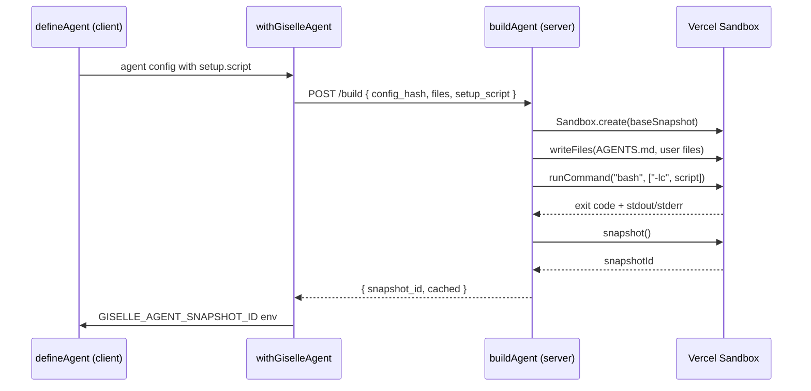
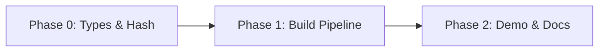

# Epic: Agent Setup Script

## Goal

`defineAgent()` accepts a `setup.script` string — a shell script that runs inside the sandbox during the build phase (after file writes, before snapshot). This lets developers customize the agent's sandbox environment using plain bash, just like Codex's setup scripts.

After this epic is complete, the following code works end-to-end:

```ts
export const agent = defineAgent({
  agentType: "gemini",
  agentMd,
  setup: {
    script: `
npx opensrc vercel/ai
npx opensrc vercel/next.js
npm install -g tsx
    `,
  },
});
```

## Why

- Currently `defineAgent` can only customize the agent via `agentMd` (system prompt) and `files` (static file writes). There is no way to run shell commands during build.
- Real-world agents need reference documentation, pre-installed tools, or pre-fetched data inside the sandbox.
- A plain shell script string (inspired by [Codex local environments](https://developers.openai.com/codex/app/local-environments/)) is the simplest possible API — no `{ command, args }` boilerplate, full shell features (pipes, variables, `&&`), and trivially serializable/hashable.

## Architecture Overview



## Usage Examples

### 1. Minimal — No setup (backward compatible)

```ts
export const agent = defineAgent({
  agentType: "gemini",
  agentMd: "You are a helpful assistant.",
});
```

### 2. Reference docs — Feed the agent library documentation

```ts
export const agent = defineAgent({
  agentType: "gemini",
  agentMd: `
You are a Next.js expert. Reference documentation is available in opensrc/.
Always consult it before answering.
  `,
  setup: {
    script: `
npx opensrc vercel/ai
npx opensrc vercel/next.js
    `,
  },
});
```

### 3. Dev tools — Pre-install CLI tools

```ts
export const agent = defineAgent({
  agentType: "gemini",
  agentMd: "You can run TypeScript files using tsx.",
  setup: {
    script: `npm install -g tsx`,
  },
});
```

### 4. Project scaffold — Clone and install

```ts
export const agent = defineAgent({
  agentType: "codex",
  agentMd: "You are a contributor to ~/project.",
  setup: {
    script: `
git clone https://github.com/owner/repo.git ~/project
cd ~/project && npm install
    `,
  },
});
```

### 5. Complex setup — Full shell features

```ts
export const agent = defineAgent({
  agentType: "gemini",
  agentMd,
  setup: {
    script: `
eval "$($HOME/.local/bin/mise activate bash --cd $PWD --shims)"
mise trust

bun i
bun x vercel link --cwd packages/web --project my-app --yes
bun x vercel env pull --cwd packages/web
bun x turbo link --scope my-org --yes
bun scripts/randomize-port.ts
    `,
  },
});
```

### 6. Combined — Files + setup

```ts
export const agent = defineAgent({
  agentType: "gemini",
  agentMd,
  files: [
    { path: "/home/vercel-sandbox/config.json", content: JSON.stringify({ theme: "dark" }) },
  ],
  setup: {
    script: `
npx opensrc vercel/ai
npm install -g tsx jq
echo "Setup complete"
    `,
  },
});
```

## Package / Directory Structure

```
packages/agent/src/
  types.ts                   ← MODIFY: add AgentSetup type, add setup to AgentConfig/DefinedAgent
  define-agent.ts            ← MODIFY: pass through setup field
  hash.ts                    ← MODIFY: include setup.script in config hash
  request-build.ts           ← MODIFY: include setup_script in build request body
  build.ts                   ← MODIFY: execute setup script via bash -lc
  index.ts                   ← MODIFY: export AgentSetup type
  __tests__/
    define-agent.test.ts     ← MODIFY: add setup tests
    hash.test.ts             ← MODIFY: add setup hash tests
    build.test.ts            ← MODIFY: add setup execution tests
docs/
  01-getting-started/
    01-01-getting-started.md ← MODIFY: add setup section
  03-architecture/
    03-01-architecture.md    ← MODIFY: update build pipeline diagrams
  02-api-reference/
    02-01-define-agent.md    ← CREATE: API reference for defineAgent
```

## Task Dependency Graph



## Task Status

| Phase | Task File | Status | Description |
|---|---|---|---|
| 0 | [phase-0-types-and-hash.md](./phase-0-types-and-hash.md) | ✅ DONE | Add `AgentSetup` type, update `AgentConfig`, update `computeConfigHash` |
| 1 | [phase-1-build-pipeline.md](./phase-1-build-pipeline.md) | ✅ DONE | Wire setup script through `requestBuild` → `buildAgent` → `bash -lc` |
| 2 | [phase-2-demo-and-docs.md](./phase-2-demo-and-docs.md) | ✅ DONE | Update chat-app demo, update docs, create API reference |

> **How to work on this epic:** Read this file first to understand the full architecture.
> Then check the status table above. Pick the first `🔲 TODO` task whose dependencies
> (see dependency graph) are `✅ DONE`. Open that task file and follow its instructions.
> When done, update the status in this table to `✅ DONE`.

## Key Conventions

- Monorepo: pnpm workspaces + Turborepo
- TypeScript strict mode, Biome for formatting/linting
- Tests: Vitest
- Build request/response uses snake_case JSON (`config_hash`, `agent_type`, `setup_script`)
- `AgentConfig` fields use camelCase TypeScript
- Config hash must be deterministic — `setup.script` is included as a string in the JSON payload
- Setup script is executed as `bash -lc` (login shell) for full env setup

## Existing Code Reference

| File | Relevance |
|---|---|
| `packages/agent/src/types.ts` | Current `AgentConfig` and `DefinedAgent` types — add `setup` field here |
| `packages/agent/src/define-agent.ts` | `defineAgent()` — pass `setup` through to `DefinedAgent` |
| `packages/agent/src/hash.ts` | `computeConfigHash()` — must include `setup.script` in hash input |
| `packages/agent/src/request-build.ts` | `requestBuild()` — must serialize `setup_script` into build request body |
| `packages/agent/src/build.ts` | `buildAgent()` — must parse + execute setup script between file writes and snapshot |
| `packages/agent/src/next/with-giselle-agent.ts` | `withGiselleAgent()` — passes `AgentConfig` through, no changes needed |
| `packages/agent/src/__tests__/build.test.ts` | Existing build tests — pattern for mock sandbox with `runCommand` |
| `docs/01-getting-started/01-01-getting-started.md` | Getting Started guide — add setup mention |
| `docs/03-architecture/03-01-architecture.md` | Architecture doc — update build pipeline section |
