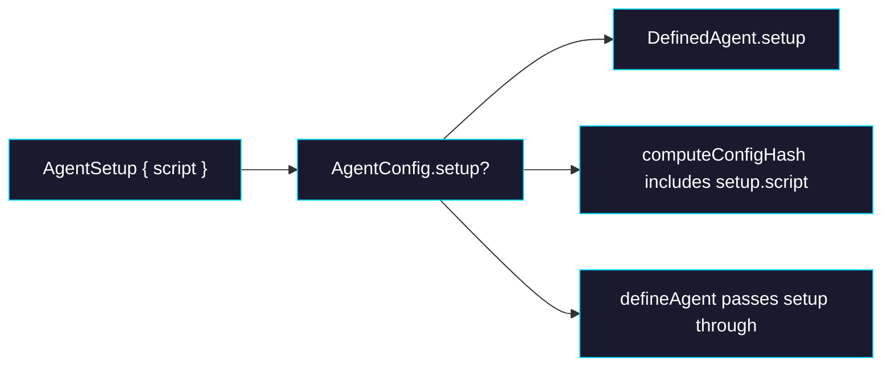

# Phase 0: Types & Hash

> **Epic:** [AGENTS.md](./AGENTS.md)
> **Dependencies:** None
> **Blocks:** Phase 1

## Objective

Add the `AgentSetup` type and `setup` field to `AgentConfig` / `DefinedAgent`, update `defineAgent()` to pass it through, and include `setup.script` in `computeConfigHash()` so that changing the setup script triggers a new build.

## What You're Building



## Deliverables

### 1. `packages/agent/src/types.ts`

Add the new type and optional field:

```ts
export type AgentSetup = {
  /** Shell script to run inside the sandbox during build. Executed as `bash -lc`. */
  script: string;
};

export type AgentConfig = {
  /** Agent type. Defaults to "gemini". */
  agentType?: "gemini" | "codex";
  /** Content for AGENTS.md in the sandbox. */
  agentMd?: string;
  /** Additional files to write into the sandbox. */
  files?: AgentFile[];
  /** Setup configuration for the sandbox build phase. */
  setup?: AgentSetup;
};

export type DefinedAgent = {
  readonly agentType: "gemini" | "codex";
  readonly agentMd?: string;
  readonly files: AgentFile[];
  /** Setup configuration. Undefined when no setup is configured. */
  readonly setup?: AgentSetup;
  /** Snapshot ID resolved from env at runtime. Throws if not set. */
  readonly snapshotId: string;
};
```

### 2. `packages/agent/src/define-agent.ts`

Pass `setup` through:

```ts
export function defineAgent(config: AgentConfig): DefinedAgent {
  return {
    agentType: config.agentType ?? "gemini",
    agentMd: config.agentMd,
    files: config.files ?? [],
    setup: config.setup,
    get snapshotId(): string {
      const id = process.env?.GISELLE_AGENT_SNAPSHOT_ID;
      if (!id) {
        throw new Error(
          `GISELLE_AGENT_SNAPSHOT_ID is not set. Ensure withGiselleAgent is configured in next.config.ts.`,
        );
      }
      return id;
    },
  };
}
```

### 3. `packages/agent/src/hash.ts`

Include `setup.script` in hash:

```ts
export function computeConfigHash(config: AgentConfig): string {
  const payload = JSON.stringify({
    agentType: config.agentType ?? "gemini",
    agentMd: config.agentMd ?? null,
    files: (config.files ?? []).map((f) => ({
      path: f.path,
      content: f.content,
    })),
    setup: config.setup?.script ?? null,
  });

  return createHash("sha256").update(payload).digest("hex").slice(0, 16);
}
```

### 4. `packages/agent/src/index.ts`

Export `AgentSetup` type:

```ts
export type { AgentConfig, AgentFile, AgentSetup, DefinedAgent } from "./types";
```

### 5. Tests

**`packages/agent/src/__tests__/define-agent.test.ts`** — Add:

```ts
it("leaves setup undefined when not provided", () => {
  const agent = defineAgent({});
  expect(agent.setup).toBeUndefined();
});

it("preserves provided setup script", () => {
  const agent = defineAgent({
    setup: { script: "npm install -g tsx" },
  });
  expect(agent.setup).toEqual({ script: "npm install -g tsx" });
});
```

**`packages/agent/src/__tests__/hash.test.ts`** — Add:

```ts
it("produces different hash when setup script changes", () => {
  const a = computeConfigHash({
    setup: { script: "npm install -g tsx" },
  });
  const b = computeConfigHash({
    setup: { script: "npm install -g jq" },
  });
  expect(a).not.toBe(b);
});

it("produces same hash for same setup script", () => {
  const config = {
    setup: { script: "npx opensrc vercel/ai" },
  };
  const a = computeConfigHash(config);
  const b = computeConfigHash(config);
  expect(a).toBe(b);
});

it("produces different hash with setup vs without", () => {
  const a = computeConfigHash({});
  const b = computeConfigHash({
    setup: { script: "echo hello" },
  });
  expect(a).not.toBe(b);
});
```

## Verification

1. **Typecheck:**
   ```bash
   pnpm --filter @giselles-ai/agent exec tsc --noEmit
   ```

2. **Tests:**
   ```bash
   pnpm --filter @giselles-ai/agent test
   ```

3. All existing tests still pass (backward compatibility).

## Files to Create/Modify

| File | Action |
|---|---|
| `packages/agent/src/types.ts` | **Modify** — add `AgentSetup` type, add `setup?` to `AgentConfig` and `DefinedAgent` |
| `packages/agent/src/define-agent.ts` | **Modify** — add `setup: config.setup` |
| `packages/agent/src/hash.ts` | **Modify** — add `setup: config.setup?.script ?? null` to hash payload |
| `packages/agent/src/index.ts` | **Modify** — export `AgentSetup` type |
| `packages/agent/src/__tests__/define-agent.test.ts` | **Modify** — add setup tests |
| `packages/agent/src/__tests__/hash.test.ts` | **Modify** — add setup hash tests |

## Done Criteria

- [ ] `AgentSetup` type exported from `@giselles-ai/agent`
- [ ] `AgentConfig.setup` is optional, `DefinedAgent.setup` is optional
- [ ] `defineAgent({})` still works (backward compatible)
- [ ] `computeConfigHash` produces different hashes when `setup.script` changes
- [ ] All existing + new tests pass
- [ ] Update the status in [AGENTS.md](./AGENTS.md) to `✅ DONE`
