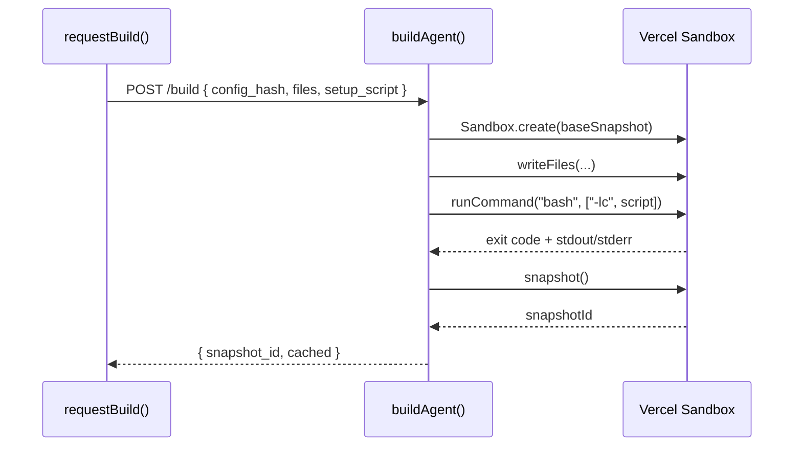

# Phase 1: Build Pipeline

> **Epic:** [AGENTS.md](./AGENTS.md)
> **Dependencies:** Phase 0 (types & hash must exist)
> **Blocks:** Phase 2

## Objective

Wire the `setup.script` through the client→server build pipeline: `requestBuild()` serializes it as `setup_script` in the POST body, `buildAgent()` parses it and executes it via `bash -lc` inside the sandbox between file writes and snapshot.

## What You're Building



## Deliverables

### 1. `packages/agent/src/request-build.ts` — Include `setup_script` in build request

Add the script to the request body. Use `setup_script` (snake_case) to match the existing JSON convention (`config_hash`, `agent_type`):

```ts
const requestBody = {
  config_hash: configHash,
  agent_type: agent.agentType ?? "gemini",
  files,
  setup_script: agent.setup?.script ?? null,
};
```

### 2. `packages/agent/src/build.ts` — Parse and execute setup script

**Update `BuildRequest` type:**

```ts
type BuildRequest = {
  config_hash: string;
  agent_type: "gemini" | "codex";
  files: Array<{ path: string; content: string }>;
  setup_script: string | null;
};
```

**Update `parseBuildRequest`** — after the files parsing block, add:

```ts
const setupScript = record.setup_script;
let parsedSetupScript: string | null = null;

if (setupScript !== undefined && setupScript !== null) {
  if (typeof setupScript !== "string") {
    return null;
  }
  parsedSetupScript = setupScript;
}
```

Return it in the result object:

```ts
return {
  config_hash: configHash.trim(),
  agent_type: agentType,
  files: parsedFiles,
  setup_script: parsedSetupScript,
};
```

**Update `buildAgent`** — after file writes, before snapshot:

```ts
if (parsed.setup_script) {
  console.log("[agent-build] running setup script...");
  const result = await sandbox.runCommand("bash", ["-lc", parsed.setup_script]);
  if (result.exitCode !== 0) {
    const stderr = typeof result.stderr === "string" ? result.stderr : "";
    throw new Error(
      `Setup script failed (exit ${result.exitCode}): ${stderr}`,
    );
  }
  console.log("[agent-build] setup script completed");
}

const snapshot = await sandbox.snapshot();
```

### 3. Update `packages/agent/src/__tests__/build.test.ts`

**Update `createMockSandbox`** to include `runCommand`:

```ts
function createMockSandbox(overrides?: {
  snapshotId?: string;
  writeSpy?: ReturnType<typeof vi.fn>;
  snapshotSpy?: ReturnType<typeof vi.fn>;
  runCommandSpy?: ReturnType<typeof vi.fn>;
}): any {
  return {
    sandboxId: "sb_123",
    writeFiles: overrides?.writeSpy ?? vi.fn().mockResolvedValue(undefined),
    snapshot:
      overrides?.snapshotSpy ??
      vi
        .fn()
        .mockResolvedValue({ snapshotId: overrides?.snapshotId ?? "snap_new" }),
    runCommand:
      overrides?.runCommandSpy ??
      vi.fn().mockResolvedValue({ exitCode: 0, stdout: "", stderr: "" }),
  };
}
```

**Add new tests:**

```ts
it("executes setup script after file writes and before snapshot", async () => {
  process.env.GISELLE_AGENT_SANDBOX_BASE_SNAPSHOT_ID = "snap_env";
  const callOrder: string[] = [];
  const mockSandbox = createMockSandbox({
    writeSpy: vi.fn().mockImplementation(() => {
      callOrder.push("writeFiles");
      return Promise.resolve();
    }),
    runCommandSpy: vi.fn().mockImplementation(() => {
      callOrder.push("runCommand");
      return Promise.resolve({ exitCode: 0, stdout: "", stderr: "" });
    }),
    snapshotSpy: vi.fn().mockImplementation(() => {
      callOrder.push("snapshot");
      return Promise.resolve({ snapshotId: "snap_setup" });
    }),
  });
  mockCreate.mockResolvedValue(mockSandbox);

  const res = await buildAgent({
    request: makeRequest({
      config_hash: "setup_hash",
      agent_type: "gemini",
      files: [{ path: "/x.md", content: "hello" }],
      setup_script: "npx opensrc vercel/ai\nnpm install -g tsx",
    }),
  });

  expect(res.status).toBe(200);
  expect(callOrder).toEqual(["writeFiles", "runCommand", "snapshot"]);
  expect(mockSandbox.runCommand).toHaveBeenCalledWith("bash", [
    "-lc",
    "npx opensrc vercel/ai\nnpm install -g tsx",
  ]);
});

it("skips setup when setup_script is null", async () => {
  process.env.GISELLE_AGENT_SANDBOX_BASE_SNAPSHOT_ID = "snap_env";
  const mockSandbox = createMockSandbox();
  mockCreate.mockResolvedValue(mockSandbox);

  const res = await buildAgent({
    request: makeRequest({
      config_hash: "no_setup_hash",
      agent_type: "gemini",
      files: [],
      setup_script: null,
    }),
  });

  expect(res.status).toBe(200);
  expect(mockSandbox.runCommand).not.toHaveBeenCalled();
});

it("still works when setup_script field is omitted (backward compat)", async () => {
  process.env.GISELLE_AGENT_SANDBOX_BASE_SNAPSHOT_ID = "snap_env";
  const mockSandbox = createMockSandbox();
  mockCreate.mockResolvedValue(mockSandbox);

  const res = await buildAgent({
    request: makeRequest({
      config_hash: "no_setup_field_hash",
      agent_type: "gemini",
      files: [],
    }),
  });

  expect(res.status).toBe(200);
  expect(mockSandbox.runCommand).not.toHaveBeenCalled();
});

it("throws when setup script fails", async () => {
  process.env.GISELLE_AGENT_SANDBOX_BASE_SNAPSHOT_ID = "snap_env";
  const mockSandbox = createMockSandbox({
    runCommandSpy: vi.fn().mockResolvedValue({
      exitCode: 127,
      stdout: "",
      stderr: "command not found",
    }),
  });
  mockCreate.mockResolvedValue(mockSandbox);

  await expect(
    buildAgent({
      request: makeRequest({
        config_hash: "fail_setup_hash",
        agent_type: "gemini",
        files: [],
        setup_script: "bad-command",
      }),
    }),
  ).rejects.toThrow("Setup script failed (exit 127)");
});
```

## Verification

1. **Typecheck:**
   ```bash
   pnpm --filter @giselles-ai/agent exec tsc --noEmit
   ```

2. **Tests:**
   ```bash
   pnpm --filter @giselles-ai/agent test
   ```

3. Existing tests with no `setup_script` field still pass unchanged.

## Files to Create/Modify

| File | Action |
|---|---|
| `packages/agent/src/request-build.ts` | **Modify** — add `setup_script` to request body |
| `packages/agent/src/build.ts` | **Modify** — parse `setup_script`, execute via `bash -lc` |
| `packages/agent/src/__tests__/build.test.ts` | **Modify** — add `runCommand` mock, add setup tests |

## Done Criteria

- [ ] `requestBuild()` includes `setup_script` in POST body
- [ ] `buildAgent()` parses `setup_script` from request
- [ ] Setup script executes via `bash -lc` after file writes, before snapshot
- [ ] Failed setup script throws with exit code and stderr
- [ ] Missing `setup_script` field is treated as no-op (backward compatible)
- [ ] All existing + new tests pass
- [ ] Update the status in [AGENTS.md](./AGENTS.md) to `✅ DONE`
