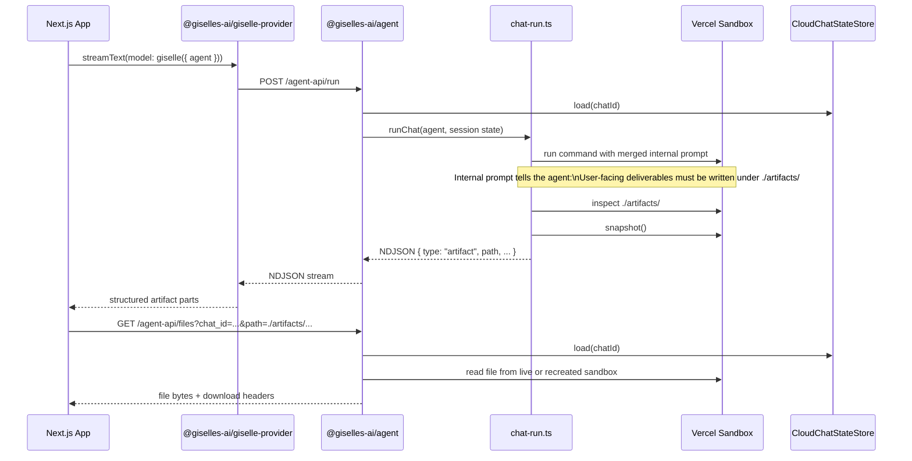
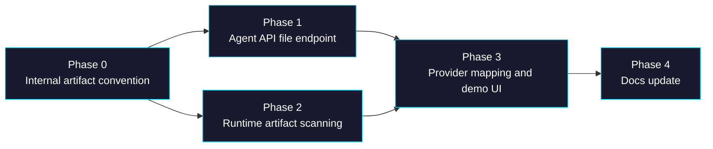

# Epic: Artifacts Directory Downloads

> **GitHub Epic:** #TBD · **Sub-issues:** #TBD–#TBD (Phases 0–4)

## Goal

After this epic is complete, agents do not need per-file artifact declarations. Instead, the runtime treats `./artifacts/` as the conventional directory for user-facing deliverables, injects that convention through an internal system prompt layered on top of the user-authored `agentMd`, scans the directory after each turn, emits structured artifact metadata into the stream, exposes a file download endpoint in `@giselles-ai/agent`, and updates the workspace demo and `docs/` so generated files become first-class downloadable outputs rather than plain text path mentions.

## Why

The previous direction of declaring artifact files ahead of time would make agents less general-purpose. A useful agent should be free to decide file names and counts at runtime. What matters is not predeclaring every file, but giving the runtime a stable convention for where user-facing deliverables live.

Benefits:
- Preserves agent generality: file names and counts can vary by request.
- Avoids adding new public `defineAgent()` configuration only for artifact discovery.
- Gives the UI a reliable source of "real downloadable files" without scraping assistant text.
- Keeps temporary files and internal scratch data outside the user-facing artifact channel.
- Makes the filesystem story coherent in docs: seed files live where the app chooses, user-facing deliverables live under `./artifacts/`.

## Architecture Overview



style App fill:#1a1a2e,stroke:#00d9ff,color:#ffffff
style Provider fill:#1a1a2e,stroke:#00d9ff,color:#ffffff
style AgentAPI fill:#1a1a2e,stroke:#00d9ff,color:#ffffff
style Runtime fill:#1a1a2e,stroke:#00d9ff,color:#ffffff
style Sandbox fill:#1a1a2e,stroke:#00d9ff,color:#ffffff
style Store fill:#1a1a2e,stroke:#00d9ff,color:#ffffff

## Package / Directory Structure

```text
packages/agent/src/
├── types.ts                        ← EXISTING (reference: no new public output policy)
├── define-agent.ts                 ← EXISTING (modify: internal prompt composition only if implemented here)
├── chat-run.ts                     ← EXISTING (modify: scan ./artifacts and emit artifact events)
├── agent-api.ts                    ← EXISTING (modify: add /files endpoint)
├── cloud-chat.ts                   ← EXISTING (reference: reuse chat/session state and snapshot recovery)
├── cloud-chat-state.ts             ← EXISTING (reference/modify: event typing if needed)
├── agents/
│   ├── create-agent.ts             ← EXISTING (reference: no new public config)
│   ├── gemini-agent.ts             ← EXISTING (reference)
│   └── codex-agent.ts              ← EXISTING (reference)
└── __tests__/...                   ← EXISTING (modify: prompt merge, artifact scan, file download)

packages/giselle-provider/src/
├── ndjson-mapper.ts                ← EXISTING (modify: map artifact NDJSON events)
├── giselle-agent-model.ts          ← EXISTING (reference/tests)
└── __tests__/...                   ← EXISTING (modify: artifact event stream coverage)

examples/workspace-report-demo/
├── lib/agent.ts                    ← EXISTING (modify: write outputs into ./artifacts and remove hardcoded output assumptions)
├── app/chat/route.ts               ← EXISTING (reference)
├── app/page.tsx                    ← EXISTING (modify: explain artifact convention)
└── app/chat-panel.tsx              ← EXISTING (modify: render downloadable artifact cards)

docs/
├── 01-getting-started/01-01-getting-started.md      ← EXISTING (modify: introduce ./artifacts convention)
├── 02-api-reference/02-01-define-agent.md           ← EXISTING (modify: explain internal prompt behavior without adding new API)
└── 03-architecture/03-01-architecture.md            ← EXISTING (modify: add artifact scan/download flow)
```

## Task Dependency Graph



Parallelism:
- Phase 1 and Phase 2 can run in parallel after Phase 0 completes.
- Phase 3 depends on both the file endpoint and artifact event emission.

## Task Status

| Phase | Task File | Status | Description |
|---|---|---|---|
| 0 | [phase-0-internal-artifact-convention.md](./phase-0-internal-artifact-convention.md) | ✅ DONE | Add the internal `./artifacts/` convention and prompt composition without changing the public API |
| 1 | [phase-1-agent-api-file-endpoint.md](./phase-1-agent-api-file-endpoint.md) | ✅ DONE | Add `GET /agent-api/files` with live sandbox and snapshot-recovery reads |
| 2 | [phase-2-runtime-artifact-scanning.md](./phase-2-runtime-artifact-scanning.md) | ✅ DONE | Scan `./artifacts/` after each turn and emit artifact NDJSON events |
| 3 | [phase-3-provider-mapping-and-demo-ui.md](./phase-3-provider-mapping-and-demo-ui.md) | ✅ DONE | Surface artifact metadata to the app and render downloads in the workspace demo |
| 4 | [phase-4-docs-update.md](./phase-4-docs-update.md) | ✅ DONE | Update `docs/` to explain the convention, event flow, and download endpoint |

> **How to work on this epic:** Read this file first to understand the full architecture.
> Then check the status table above. Pick the first `🔲 TODO` task whose dependencies
> (see dependency graph) are `✅ DONE`. Open that task file and follow its instructions.
> When done, update the status in this table to `✅ DONE`.

## Key Conventions

- Monorepo: pnpm workspaces + Turborepo
- Formatting/lint: Biome with tabs, organized imports, and recommended Next/React rules
- TypeScript strict mode throughout the repo
- Runtime sandbox continuity is store-driven via `sandboxId` and `snapshotId`
- Public `defineAgent()` API should not grow just to support artifact discovery
- Use sandbox-relative paths such as `./workspace/...` and `./artifacts/...`
- Vercel Sandbox file reads should use `readFileToBuffer()` and snapshot recovery should use `Sandbox.create({ source: { type: "snapshot", snapshotId } })`

## Existing Code Reference

| File | Relevance |
|---|---|
| `packages/agent/src/define-agent.ts` | Current prompt composition logic; likely place to layer the internal artifact convention prompt |
| `packages/agent/src/types.ts` | Confirms the current public API surface and what should remain unchanged |
| `packages/agent/src/chat-run.ts` | Owns sandbox lifecycle, stdout streaming, and snapshot emission; best place to scan `./artifacts/` |
| `packages/agent/src/agent-api.ts` | Route multiplexer for `/run`, `/build`, and future `/files` |
| `packages/agent/src/cloud-chat.ts` | Session/store orchestration already used for sandbox and snapshot reuse |
| `packages/agent/src/cloud-chat-state.ts` | Existing event/state types for run-time session persistence |
| `packages/giselle-provider/src/ndjson-mapper.ts` | Maps NDJSON events to AI SDK stream parts; artifact support lands here |
| `packages/giselle-provider/src/giselle-agent-model.ts` | End-to-end provider stream handling and tests |
| `examples/workspace-report-demo/lib/agent.ts` | Current filesystem demo prompt and seeded files |
| `examples/workspace-report-demo/app/chat-panel.tsx` | Current chat UI that needs artifact card rendering |
| `docs/02-api-reference/02-01-define-agent.md` | Must explain the convention without inventing new public API |
| `docs/03-architecture/03-01-architecture.md` | Must describe how artifact discovery and downloads actually work |

## Domain-Specific Reference

### Internal artifact convention prompt

The internal prompt should communicate all of the following:

| Rule | Purpose |
|---|---|
| User-facing deliverables go under `./artifacts/` | Gives runtime/UI one place to inspect |
| Temporary files should stay outside `./artifacts/` | Prevents noisy or unsafe downloads |
| Before finishing, verify which files exist in `./artifacts/` | Aligns the final response with reality |
| Mention created artifact paths in the assistant response | Keeps plain-text fallback useful even without UI support |

### Proposed artifact NDJSON event

```json
{
  "type": "artifact",
  "path": "./artifacts/report.md",
  "size_bytes": 1824,
  "mime_type": "text/markdown"
}
```

Optional fields such as `label` can be inferred from filename or augmented later, but the path and actual existence are the important contract.

### File endpoint sketch

| Route | Method | Query | Response |
|---|---|---|---|
| `/agent-api/files` | `GET` | `chat_id`, `path`, optional `download=1` | Raw file bytes with content headers |

### Vercel Sandbox SDK notes

| Topic | Guidance | Reference |
|---|---|---|
| Working directory | Use sandbox-relative paths like `./artifacts/report.md` | [SDK reference](https://vercel.com/docs/vercel-sandbox/sdk-reference) |
| File reads | Use `sandbox.readFileToBuffer({ path })` | [SDK reference](https://vercel.com/docs/vercel-sandbox/sdk-reference) |
| Recovery | Recreate expired sandboxes from `snapshotId` | [SDK reference](https://vercel.com/docs/vercel-sandbox/sdk-reference) |
