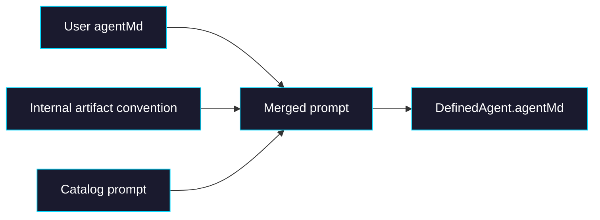

# Phase 0: Internal Artifact Convention

> **GitHub Issue:** #TBD · **Epic:** [AGENTS.md](./AGENTS.md)
> **Dependencies:** None
> **Parallel with:** None
> **Blocks:** Phase 1, Phase 2

## Objective

Introduce the `./artifacts/` convention without adding any new public `defineAgent()` options. This phase establishes how the internal prompt is composed, where that composition lives, and how tests verify that the user prompt and internal system rules are merged predictably.

## What You're Building



## Deliverables

### 1. `packages/agent/src/define-agent.ts`

Add an internal prompt fragment that is always appended to the effective prompt.

Suggested helper:

```ts
function createInternalArtifactPrompt(): string {
  return `
## Artifact Convention
- Files intended for user review or download must be written under ./artifacts/.
- Temporary files, logs, caches, and intermediate data should stay outside ./artifacts/.
- Before finishing, inspect ./artifacts/ and only mention files that actually exist there.
  `.trim();
}
```

Then compose prompts in this order:

```ts
const agentMd = [
  config.agentMd,
  createInternalArtifactPrompt(),
  config.catalog?.prompt({ mode: "inline" }),
].filter(Boolean).join("\n\n");
```

Why this order:
- preserves the user's app/domain context first
- keeps the internal runtime rule as an SDK-owned convention
- still allows catalog prompts to describe structured UI behavior afterward

### 2. `packages/agent/src/__tests__/define-agent.test.ts`

Add coverage for prompt composition:
- no user `agentMd` → internal artifact prompt still exists
- user `agentMd` present → merged prompt contains both
- catalog prompt still appends as expected

Recommended assertions:

| Scenario | Assertion |
|---|---|
| `defineAgent({})` | merged prompt includes `./artifacts/` |
| `defineAgent({ agentMd: "You are helpful." })` | prompt contains both user text and internal convention |
| `defineAgent({ catalog })` | prompt contains user/internal/catalog in the final joined output |

### 3. `packages/agent/src/types.ts`

No new public output policy should be introduced here. If comments are needed, keep them explanatory only.

This phase should explicitly avoid:
- `artifacts` config
- `outputPolicy`
- `artifactDirectory`

### 4. `examples/workspace-report-demo/lib/agent.ts`

Update the demo prompt to stop hardcoding `./workspace/output/...` as the canonical user-facing output location.

It should instead align with the internal runtime rule:
- report deliverables go in `./artifacts/`
- supporting source material stays in `./workspace/`

Concrete expectation:

```md
Write user-facing deliverables into ./artifacts/.
Use ./workspace/ for source files and scratch work.
```

## Verification

1. **Automated checks**
   - `pnpm --filter @giselles-ai/agent test`
   - `pnpm --filter @giselles-ai/agent typecheck`

2. **Manual test scenarios**
   1. `defineAgent({ agentMd: "custom" })` → inspect merged prompt → contains both `custom` and `./artifacts/`
   2. `defineAgent({ catalog })` → inspect merged prompt → still contains catalog content after the internal convention
   3. workspace demo prompt → read file → output instructions point to `./artifacts/` for user-facing deliverables

## Files to Create/Modify

| File | Action |
|---|---|
| `packages/agent/src/define-agent.ts` | **Modify** (compose internal artifact convention prompt) |
| `packages/agent/src/__tests__/define-agent.test.ts` | **Modify** (prompt merge coverage) |
| `packages/agent/src/__tests__/define-agent-catalog.test.ts` | **Modify** (catalog + internal prompt ordering if needed) |
| `examples/workspace-report-demo/lib/agent.ts` | **Modify** (align demo prompt with `./artifacts/`) |

## Done Criteria

- [ ] Internal `./artifacts/` prompt convention is composed automatically
- [ ] No new public output-specific API is introduced
- [ ] Tests cover prompt merge behavior
- [ ] Workspace report demo prompt is updated to use `./artifacts/`
- [ ] Build/typecheck commands pass
- [ ] Update the status in [AGENTS.md](./AGENTS.md) to `✅ DONE`
