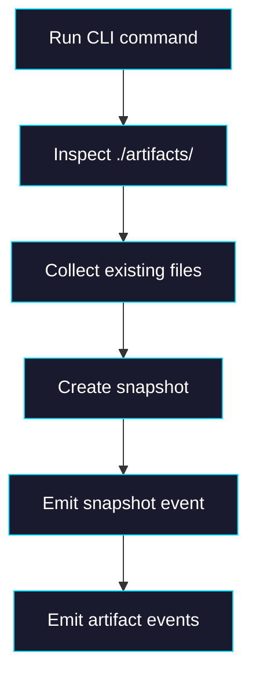

# Phase 2: Runtime Artifact Scanning

> **GitHub Issue:** #TBD · **Epic:** [AGENTS.md](./AGENTS.md)
> **Dependencies:** Phase 0
> **Parallel with:** Phase 1
> **Blocks:** Phase 3

## Objective

Teach the runtime to inspect `./artifacts/` after each successful turn, convert discovered files into artifact NDJSON events, and emit those events only for files that actually exist.

## What You're Building



## Deliverables

### 1. `packages/agent/src/chat-run.ts`

Add a helper that inspects the conventional artifact directory. The exact Sandbox SDK method can be finalized during implementation, but the behavior should be:

1. look for files under `./artifacts/`
2. ignore missing directory
3. ignore subpaths that are not regular files
4. emit artifact metadata only for real files

Expected event shape:

```json
{
  "type": "artifact",
  "path": "./artifacts/report.md",
  "size_bytes": 1824,
  "mime_type": "text/markdown"
}
```

Implementation options:

| Option | Notes |
|---|---|
| `runCommand(["bash","-lc","find ./artifacts -type f ..."])` | explicit and robust if SDK listing helpers are limited |
| SDK directory listing helper | use if available and stable in current `@vercel/sandbox` version |

Whichever route is chosen, document it in the code comments because artifact discovery becomes a core runtime behavior.

### 2. Event ordering

Emit artifact events after `snapshot`:

```ts
const discoveredArtifacts = await collectArtifacts(...);
const snapshot = await sandbox.snapshot();
enqueueEvent({ type: "snapshot", snapshot_id: snapshot.snapshotId });
for (const artifact of discoveredArtifacts) {
  enqueueEvent({ type: "artifact", ...artifact });
}
```

Reason:
- the UI should only see artifact entries for a durable post-turn filesystem state

### 3. MIME and label inference

The runtime should infer at least:

| Field | Source |
|---|---|
| `path` | actual relative path under `./artifacts/` |
| `size_bytes` | byte length from file contents or stat |
| `mime_type` | inferred from extension |
| `label` | optional, derived from basename if useful |

Do not require the agent to provide this metadata.

### 4. Tests

Add `chat-run` tests covering:
- `./artifacts/` absent → no artifact events
- one file under `./artifacts/` → one artifact event
- multiple files under nested paths → all artifact events emitted
- snapshot event occurs before artifact events

## Verification

1. **Automated checks**
   - `pnpm --filter @giselles-ai/agent test`
   - `pnpm --filter @giselles-ai/agent typecheck`

2. **Manual test scenarios**
   1. agent creates `./artifacts/report.md` → run completes → stream contains `snapshot` then `artifact`
   2. agent creates no artifact files → run completes → no artifact events
   3. agent creates multiple files under `./artifacts/` → all appear in the event stream

## Files to Create/Modify

| File | Action |
|---|---|
| `packages/agent/src/chat-run.ts` | **Modify** (artifact discovery and event emission) |
| `packages/agent/src/chat-run.test.ts` | **Modify** (artifact scanning/event coverage) |
| `packages/agent/src/cloud-chat-state.ts` | **Reference/Modify if needed** (shared typing for artifact events) |

## Done Criteria

- [ ] Runtime scans `./artifacts/` after each successful turn
- [ ] Only existing files produce artifact events
- [ ] Artifact events are emitted after snapshot creation
- [ ] Metadata includes path and file size, plus MIME when possible
- [ ] Tests cover no-artifact, single-artifact, and multi-artifact cases
- [ ] Build/typecheck commands pass
- [ ] Update the status in [AGENTS.md](./AGENTS.md) to `✅ DONE`
