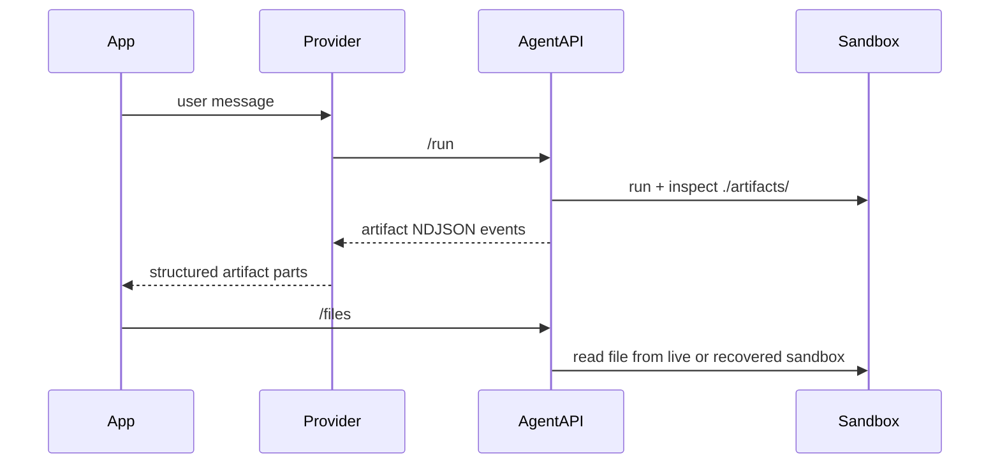

# Phase 4: Docs Update

> **GitHub Issue:** #TBD · **Epic:** [AGENTS.md](./AGENTS.md)
> **Dependencies:** Phase 3
> **Parallel with:** None
> **Blocks:** None

## Objective

Update the documentation so the public story reflects the implemented design: no new output-policy API, an internal `./artifacts/` convention, runtime artifact discovery, and downloadable files via the Agent API.

## What You're Building

## Deliverables

### 1. `docs/01-getting-started/01-01-getting-started.md`

Add a section explaining:
- files seeded by the app can live anywhere appropriate
- user-facing deliverables should be written by the agent under `./artifacts/`
- downloads are served through the Agent API file endpoint

Avoid implying a new public config such as `outputPolicy`.

### 2. `docs/02-api-reference/02-01-define-agent.md`

Update the `defineAgent` reference to explain the internal artifact convention.

Required changes:
- keep the API table unchanged unless another phase genuinely changed it
- add explanatory prose that the SDK layers an internal prompt convention telling agents to place user-facing deliverables under `./artifacts/`
- update examples to show relative sandbox paths

### 3. `docs/03-architecture/03-01-architecture.md`

Add the artifact flow:
- internal prompt layering
- runtime `./artifacts/` scan
- `artifact` NDJSON events
- `/agent-api/files` endpoint
- snapshot-backed recovery for downloads

Include a sequence diagram similar to:

### 4. Filesystem demo docs linkage

Update at least one tutorial or README so the workspace report demo is clearly positioned as the filesystem/artifact example, not just the browser-action example.

Candidates:
- `docs/01-getting-started/02-02-building-spreadsheet-agent.md`
- `examples/workspace-report-demo/README.md`

## Verification

1. **Automated checks**
   - `pnpm exec biome check docs examples/workspace-report-demo packages/agent packages/giselle-provider`

2. **Manual test scenarios**
   1. read `defineAgent` docs → confirm no new output-policy API is documented
   2. read getting started + architecture docs → confirm `./artifacts/` convention and file endpoint are explained clearly
   3. compare docs to workspace report demo → terminology matches actual code behavior

## Files to Create/Modify

| File | Action |
|---|---|
| `docs/01-getting-started/01-01-getting-started.md` | **Modify** (artifact convention and download flow) |
| `docs/02-api-reference/02-01-define-agent.md` | **Modify** (document internal convention without adding API surface) |
| `docs/03-architecture/03-01-architecture.md` | **Modify** (artifact scan/download architecture) |
| `docs/01-getting-started/02-02-building-spreadsheet-agent.md` | **Modify/Reference** (cross-link the filesystem example) |
| `examples/workspace-report-demo/README.md` | **Modify** (explain demo expectations) |

## Done Criteria

- [ ] Getting started explains the `./artifacts/` convention
- [ ] `defineAgent` docs remain accurate without introducing nonexistent API
- [ ] Architecture docs cover scan, event emission, and downloads
- [ ] Filesystem demo is linked from docs as the artifact example
- [ ] Verification commands pass
- [ ] Update the status in [AGENTS.md](./AGENTS.md) to `✅ DONE`
