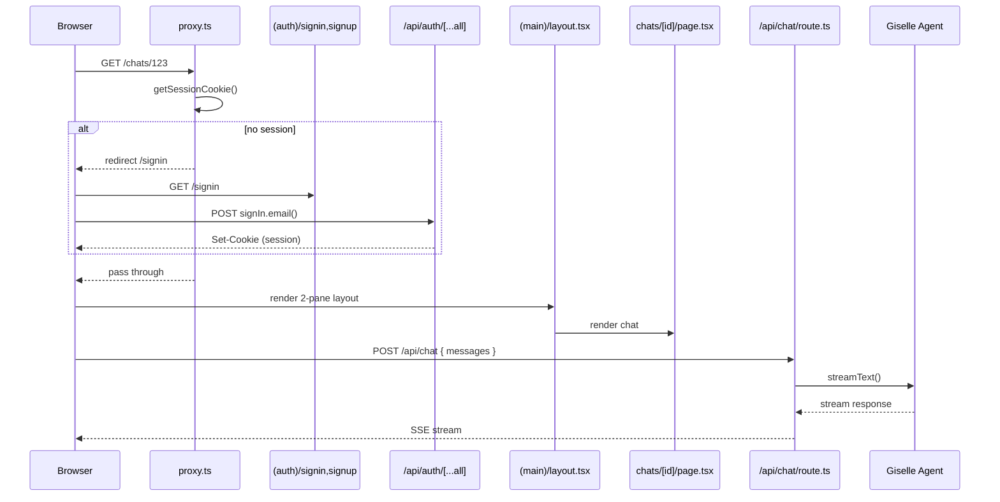
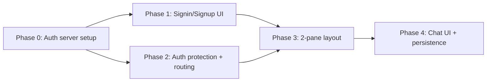

# Epic: Chat App MVP

## Goal

After this epic is complete,`apps/chat-app` は完全に動作するチャットアプリケーションになる。ユーザーは `route06.co.jp` ドメインのメールアドレスでアカウントを作成・ログインし、2ペインのChat UIでGiselle Agent（Codex）と対話できる。チャット履歴はSQLite（libSQL）に永続化され、過去のチャットを一覧・再開できる。

## Why

- Giselle Agent SDKのデモアプリとして、ChatGPT/Claudeのような体験を提供したい
- `minimum-demo` は認証なし・永続化なしの最小構成。プロダクション向けには認証とチャット永続化が必要
- better-auth + Drizzle ORMの組み合わせで、薄い認証レイヤーとDB永続化を実現する

Benefits:
- SDK利用者がフル機能のリファレンス実装を参照できる
- 認証・永続化・UIの分離されたPhaseで段階的に構築できる

## Architecture Overview



## Package / Directory Structure

```
apps/chat-app/
├── app/
│   ├── layout.tsx                          ← EXISTING (root layout)
│   ├── page.tsx                            ← MODIFY: redirect hub
│   ├── (auth)/
│   │   ├── signin/page.tsx                 ← MODIFY: signin form
│   │   └── signup/page.tsx                 ← MODIFY: signup form
│   ├── (main)/
│   │   ├── layout.tsx                      ← MODIFY: 2-pane layout with sidebar
│   │   ├── page.tsx                        ← MODIFY: new chat page
│   │   └── chats/[id]/page.tsx             ← MODIFY: chat detail page
│   └── api/
│       ├── auth/[...all]/route.ts          ← NEW: better-auth handler
│       └── chat/route.ts                   ← MOVE: from (main)/api/chat/route.ts
├── lib/
│   ├── agent.ts                            ← EXISTING
│   ├── auth.ts                             ← MODIFY: enable emailAndPassword
│   ├── auth-client.ts                      ← NEW: better-auth React client
│   └── base-url.ts                         ← EXISTING
├── db/
│   ├── client.ts                           ← EXISTING
│   ├── schemas/
│   │   ├── auth-schema.ts                  ← EXISTING
│   │   ├── app-schema.ts                   ← EXISTING (chat, messages tables)
│   │   └── index.ts                        ← MODIFY: export app-schema
│   └── relations/
│       ├── auth-relations.ts               ← EXISTING
│       ├── app-relations.ts                ← NEW: chat/messages relations
│       └── index.ts                        ← MODIFY: export app-relations
└── proxy.ts                                ← NEW: Next.js 16 auth proxy
```

## Task Dependency Graph



Phase 1 と Phase 2 は並列実行可能。Phase 3 は両方に依存。

## Task Status

| Phase | Task File | Status | Description |
|---|---|---|---|
| 0 | [phase-0-auth-server.md](./phase-0-auth-server.md) | ✅ DONE | better-auth サーバー設定、APIルートハンドラ、クライアントSDK |
| 1 | [phase-1-auth-ui.md](./phase-1-auth-ui.md) | ✅ DONE | Signin/Signup ページのTailwind UI実装 |
| 2 | [phase-2-auth-protection.md](./phase-2-auth-protection.md) | ✅ DONE | Next.js 16 proxy、ルートページリダイレクト、APIルート移動 |
| 3 | [phase-3-two-pane-layout.md](./phase-3-two-pane-layout.md) | ✅ DONE | サイドバー + メインの2ペインレイアウト |
| 4 | [phase-4-chat-ui.md](./phase-4-chat-ui.md) | ✅ DONE | Chat UI実装、メッセージ永続化、チャット一覧 |

> **How to work on this epic:** Read this file first to understand the full architecture.
> Then check the status table above. Pick the first `🔲 TODO` task whose dependencies
> (see dependency graph) are `✅ DONE`. Open that task file and follow its instructions.
> When done, update the status in this table to `✅ DONE`.

## Key Conventions

- Monorepo: pnpm workspaces + Turborepo
- Framework: Next.js 16 (App Router, React Compiler enabled)
- Auth: better-auth 1.5.4 + `@better-auth/drizzle-adapter`
- DB: SQLite via `@libsql/client` + Drizzle ORM 1.0.0-beta
- AI: `@giselles-ai/agent` + `@giselles-ai/giselle-provider` + Vercel AI SDK (`ai` 6.x)
- Styling: Tailwind CSS v4 (PostCSS plugin, `@import "tailwindcss"`)
- Formatter: Biome
- TypeScript strict mode
- Path alias: `@/*` → project root

## Existing Code Reference

| File | Relevance |
|---|---|
| `apps/chat-app/lib/auth.ts` | better-auth server config — `emailAndPassword` 有効化が必要 |
| `apps/chat-app/lib/base-url.ts` | Vercel / localhost のbaseURL解決ロジック |
| `apps/chat-app/db/client.ts` | Drizzle client — `DATABASE_URL` / `DATABASE_AUTH_TOKEN` 環境変数 |
| `apps/chat-app/db/schemas/auth-schema.ts` | user, session, account, verification テーブル定義 |
| `apps/chat-app/db/schemas/app-schema.ts` | chat, messages テーブル定義（`publicId`, `userId` FK, `UIMessage` JSON） |
| `apps/chat-app/db/relations/auth-relations.ts` | Drizzle `defineRelations` パターン |
| `apps/chat-app/app/(main)/api/chat/route.ts` | 既存のChat APIルート — `app/api/chat/route.ts` へ移動 |
| `apps/minimum-demo/app/page.tsx` | Chat UIのリファレンス実装（`useChat`, `useBrowserToolHandler`, メッセージ表示） |
| `apps/minimum-demo/app/chat/route.ts` | Chat APIルートのリファレンス |

## better-auth API Reference

| 操作 | クライアント (`better-auth/react`) | サーバー (`auth.api.*`) |
|---|---|---|
| サインアップ | `authClient.signUp.email({ name, email, password })` | `auth.api.signUpEmail({ body: { name, email, password } })` |
| サインイン | `authClient.signIn.email({ email, password })` | `auth.api.signInEmail({ body: { email, password }, headers })` |
| サインアウト | `authClient.signOut()` | `auth.api.signOut({ headers })` |
| セッション取得 | `authClient.useSession()` (hook) / `authClient.getSession()` | `auth.api.getSession({ headers: await headers() })` |
| APIルート | — | `toNextJsHandler(auth)` → `export const { GET, POST } = ...` |
| Cookie確認 | — | `getSessionCookie(request)` from `better-auth/cookies` |
