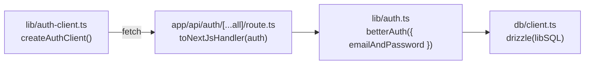

# Phase 0: Auth Server Setup

> **Epic:** [AGENTS.md](./AGENTS.md)
> **Dependencies:** なし
> **Parallel with:** —
> **Blocks:** Phase 1, Phase 2

## Objective

better-auth のサーバー設定を完成させ、APIルートハンドラとReactクライアントSDKを用意する。この Phase が終わると、`/api/auth/*` エンドポイントが動作し、クライアントから `signUp.email()` / `signIn.email()` / `useSession()` が呼べる状態になる。

## What You're Building



## Deliverables

### 1. `apps/chat-app/lib/auth.ts` を修正

既存の `getAuth()` に `emailAndPassword: { enabled: true }` を追加する。

現在のコード:
```ts
import { betterAuth } from "better-auth";
import { drizzleAdapter } from "better-auth/adapters/drizzle";
import { db } from "@/db/client";
import { resolveBaseURL } from "./base-url";

function createAuth() {
	const baseURL = resolveBaseURL();
	return betterAuth({
		database: drizzleAdapter(db, {
			provider: "sqlite",
		}),
		baseURL,
		advanced: {
			database: {
				generateId: "serial",
			},
		},
	});
}
```

変更点:
- `emailAndPassword: { enabled: true }` を追加
- lazy singleton パターンはそのまま維持

変更後:
```ts
function createAuth() {
	const baseURL = resolveBaseURL();
	return betterAuth({
		database: drizzleAdapter(db, {
			provider: "sqlite",
		}),
		baseURL,
		emailAndPassword: {
			enabled: true,
		},
		advanced: {
			database: {
				generateId: "serial",
			},
		},
	});
}
```

### 2. `apps/chat-app/app/api/auth/[...all]/route.ts` を新規作成

better-auth のキャッチオールAPIルートハンドラ。

```ts
import { getAuth } from "@/lib/auth";
import { toNextJsHandler } from "better-auth/next-js";

export const { GET, POST } = toNextJsHandler(getAuth());
```

### 3. `apps/chat-app/lib/auth-client.ts` を新規作成

React用のbetter-authクライアント。`better-auth/react` からインポートする。

```ts
import { createAuthClient } from "better-auth/react";

export const authClient = createAuthClient();
```

`baseURL` は省略可能（同一ドメインの場合、デフォルトで `/api/auth` を使う）。

## Verification

1. **型チェック**:
   ```bash
   cd apps/chat-app && npx tsc --noEmit
   ```
   エラーが出ないこと。

2. **開発サーバー起動確認**:
   ```bash
   pnpm dev
   ```
   起動エラーが出ないこと（DB接続は環境変数が必要なのでスキップ可）。

## Files to Create/Modify

| File | Action |
|---|---|
| `apps/chat-app/lib/auth.ts` | **Modify** (`emailAndPassword: { enabled: true }` 追加) |
| `apps/chat-app/app/api/auth/[...all]/route.ts` | **Create** |
| `apps/chat-app/lib/auth-client.ts` | **Create** |

## Done Criteria

- [ ] `lib/auth.ts` に `emailAndPassword: { enabled: true }` が設定されている
- [ ] `app/api/auth/[...all]/route.ts` が `GET` / `POST` をエクスポートしている
- [ ] `lib/auth-client.ts` が `authClient` をエクスポートしている
- [ ] TypeScript の型チェックが通る
- [ ] Update the status in [AGENTS.md](./AGENTS.md) to `✅ DONE`
