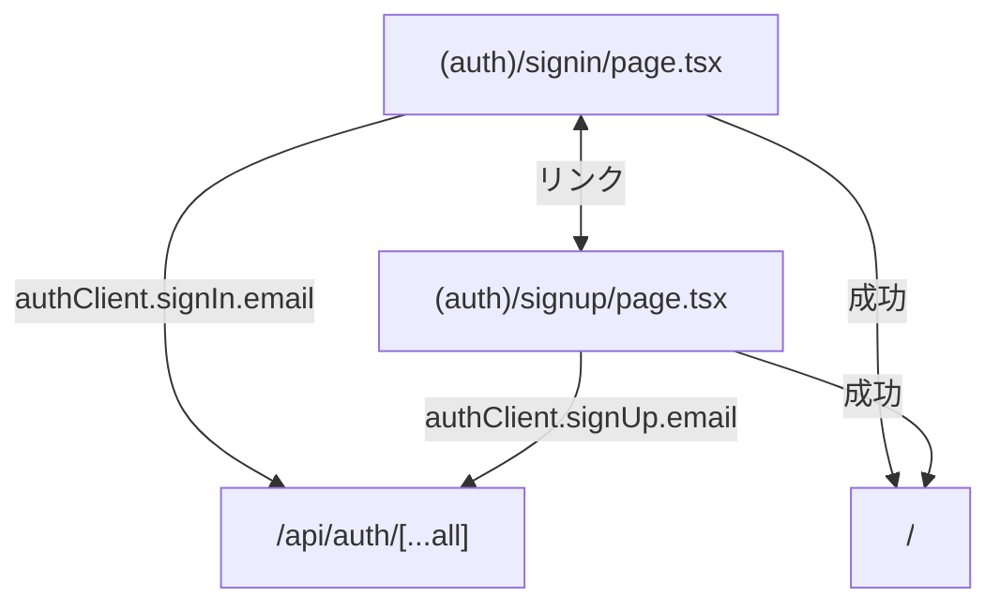

# Phase 1: Signin/Signup UI

> **Epic:** [AGENTS.md](./AGENTS.md)
> **Dependencies:** Phase 0 (auth server + client SDK)
> **Parallel with:** Phase 2
> **Blocks:** Phase 3

## Objective

Tailwind CSS でシンプルなサインイン・サインアップページを実装する。better-auth の React クライアント (`authClient`) を使い、`signIn.email()` / `signUp.email()` を呼ぶフォームを作る。サインアップではドメイン制限（`route06.co.jp`）をクライアント側でバリデーションする。

## What You're Building



## Deliverables

### 1. `apps/chat-app/app/(auth)/signin/page.tsx`

`"use client"` コンポーネント。以下の要素で構成する:

- **フォームフィールド**: email, password
- **送信ボタン**: `authClient.signIn.email()` を呼ぶ
- **成功時**: `router.push("/")` でリダイレクト
- **エラー表示**: `error` stateでメッセージ表示
- **サインアップリンク**: "アカウントを作成" → `/signup`
- **ローディング状態**: 送信中はボタンを `disabled` に

```tsx
"use client";

import { authClient } from "@/lib/auth-client";
import Link from "next/link";
import { useRouter } from "next/navigation";
import { type FormEvent, useState } from "react";

export default function SignInPage() {
	const router = useRouter();
	const [email, setEmail] = useState("");
	const [password, setPassword] = useState("");
	const [error, setError] = useState("");
	const [loading, setLoading] = useState(false);

	async function handleSubmit(e: FormEvent) {
		e.preventDefault();
		setError("");
		setLoading(true);

		const { error } = await authClient.signIn.email({
			email,
			password,
		});

		if (error) {
			setError(error.message ?? "ログインに失敗しました");
			setLoading(false);
			return;
		}

		router.push("/");
	}

	return (
		<div className="flex min-h-screen items-center justify-center bg-gray-950 px-4">
			<div className="w-full max-w-sm space-y-6">
				<div className="text-center">
					<h1 className="text-2xl font-semibold text-white">ログイン</h1>
					<p className="mt-2 text-sm text-gray-400">
						メールアドレスとパスワードでログイン
					</p>
				</div>

				<form onSubmit={handleSubmit} className="space-y-4">
					{error && (
						<div className="rounded-lg border border-red-500/30 bg-red-500/10 px-4 py-3 text-sm text-red-300">
							{error}
						</div>
					)}

					<div>
						<label htmlFor="email" className="block text-sm font-medium text-gray-300">
							メールアドレス
						</label>
						<input
							id="email"
							type="email"
							required
							value={email}
							onChange={(e) => setEmail(e.target.value)}
							className="mt-1 block w-full rounded-lg border border-gray-700 bg-gray-900 px-3 py-2 text-sm text-white placeholder:text-gray-500 focus:border-blue-500 focus:outline-none focus:ring-1 focus:ring-blue-500"
							placeholder="you@route06.co.jp"
						/>
					</div>

					<div>
						<label htmlFor="password" className="block text-sm font-medium text-gray-300">
							パスワード
						</label>
						<input
							id="password"
							type="password"
							required
							value={password}
							onChange={(e) => setPassword(e.target.value)}
							className="mt-1 block w-full rounded-lg border border-gray-700 bg-gray-900 px-3 py-2 text-sm text-white placeholder:text-gray-500 focus:border-blue-500 focus:outline-none focus:ring-1 focus:ring-blue-500"
							placeholder="••••••••"
						/>
					</div>

					<button
						type="submit"
						disabled={loading}
						className="w-full rounded-lg bg-blue-600 px-4 py-2 text-sm font-medium text-white transition hover:bg-blue-500 disabled:cursor-not-allowed disabled:opacity-50"
					>
						{loading ? "ログイン中..." : "ログイン"}
					</button>
				</form>

				<p className="text-center text-sm text-gray-400">
					アカウントをお持ちでないですか？{" "}
					<Link href="/signup" className="text-blue-400 hover:text-blue-300">
						アカウントを作成
					</Link>
				</p>
			</div>
		</div>
	);
}
```

### 2. `apps/chat-app/app/(auth)/signup/page.tsx`

signin と同じ構造だが以下が異なる:

- **追加フィールド**: name
- **ドメイン制限**: 送信前に `email.endsWith("@route06.co.jp")` をチェック。不正な場合はエラー表示
- **API呼び出し**: `authClient.signUp.email({ name, email, password })`
- **サインインリンク**: "既にアカウントをお持ちですか？" → `/signin`

```tsx
"use client";

import { authClient } from "@/lib/auth-client";
import Link from "next/link";
import { useRouter } from "next/navigation";
import { type FormEvent, useState } from "react";

const ALLOWED_DOMAIN = "route06.co.jp";

export default function SignUpPage() {
	const router = useRouter();
	const [name, setName] = useState("");
	const [email, setEmail] = useState("");
	const [password, setPassword] = useState("");
	const [error, setError] = useState("");
	const [loading, setLoading] = useState(false);

	async function handleSubmit(e: FormEvent) {
		e.preventDefault();
		setError("");

		if (!email.endsWith(`@${ALLOWED_DOMAIN}`)) {
			setError(`@${ALLOWED_DOMAIN} のメールアドレスのみ登録できます`);
			return;
		}

		setLoading(true);

		const { error } = await authClient.signUp.email({
			name,
			email,
			password,
		});

		if (error) {
			setError(error.message ?? "アカウント作成に失敗しました");
			setLoading(false);
			return;
		}

		router.push("/");
	}

	return (
		<div className="flex min-h-screen items-center justify-center bg-gray-950 px-4">
			<div className="w-full max-w-sm space-y-6">
				<div className="text-center">
					<h1 className="text-2xl font-semibold text-white">アカウント作成</h1>
					<p className="mt-2 text-sm text-gray-400">
						@{ALLOWED_DOMAIN} のメールアドレスで登録
					</p>
				</div>

				<form onSubmit={handleSubmit} className="space-y-4">
					{error && (
						<div className="rounded-lg border border-red-500/30 bg-red-500/10 px-4 py-3 text-sm text-red-300">
							{error}
						</div>
					)}

					<div>
						<label htmlFor="name" className="block text-sm font-medium text-gray-300">
							名前
						</label>
						<input
							id="name"
							type="text"
							required
							value={name}
							onChange={(e) => setName(e.target.value)}
							className="mt-1 block w-full rounded-lg border border-gray-700 bg-gray-900 px-3 py-2 text-sm text-white placeholder:text-gray-500 focus:border-blue-500 focus:outline-none focus:ring-1 focus:ring-blue-500"
							placeholder="山田太郎"
						/>
					</div>

					<div>
						<label htmlFor="email" className="block text-sm font-medium text-gray-300">
							メールアドレス
						</label>
						<input
							id="email"
							type="email"
							required
							value={email}
							onChange={(e) => setEmail(e.target.value)}
							className="mt-1 block w-full rounded-lg border border-gray-700 bg-gray-900 px-3 py-2 text-sm text-white placeholder:text-gray-500 focus:border-blue-500 focus:outline-none focus:ring-1 focus:ring-blue-500"
							placeholder="you@route06.co.jp"
						/>
					</div>

					<div>
						<label htmlFor="password" className="block text-sm font-medium text-gray-300">
							パスワード
						</label>
						<input
							id="password"
							type="password"
							required
							value={password}
							onChange={(e) => setPassword(e.target.value)}
							className="mt-1 block w-full rounded-lg border border-gray-700 bg-gray-900 px-3 py-2 text-sm text-white placeholder:text-gray-500 focus:border-blue-500 focus:outline-none focus:ring-1 focus:ring-blue-500"
							placeholder="••••••••（8文字以上）"
						/>
					</div>

					<button
						type="submit"
						disabled={loading}
						className="w-full rounded-lg bg-blue-600 px-4 py-2 text-sm font-medium text-white transition hover:bg-blue-500 disabled:cursor-not-allowed disabled:opacity-50"
					>
						{loading ? "作成中..." : "アカウントを作成"}
					</button>
				</form>

				<p className="text-center text-sm text-gray-400">
					既にアカウントをお持ちですか？{" "}
					<Link href="/signin" className="text-blue-400 hover:text-blue-300">
						ログイン
					</Link>
				</p>
			</div>
		</div>
	);
}
```

## Verification

1. **型チェック**:
   ```bash
   cd apps/chat-app && npx tsc --noEmit
   ```

2. **手動テスト**（Phase 0 完了 + DB設定後）:
   - `/signup` にアクセス → フォームが表示される
   - `gmail.com` のメールで送信 → ドメインエラーが表示される
   - `route06.co.jp` のメールで送信 → アカウントが作成される
   - `/signin` にアクセス → ログインできる
   - 成功後 `/` にリダイレクトされる

## Files to Create/Modify

| File | Action |
|---|---|
| `apps/chat-app/app/(auth)/signin/page.tsx` | **Modify** (空ファイル → signin フォーム実装) |
| `apps/chat-app/app/(auth)/signup/page.tsx` | **Modify** (空ファイル → signup フォーム実装) |

## Done Criteria

- [ ] signin ページにメール・パスワードフォームがある
- [ ] signup ページに名前・メール・パスワードフォームがある
- [ ] signup では `@route06.co.jp` ドメインのバリデーションがある
- [ ] 両ページ間のリンクが動作する
- [ ] エラー・ローディング状態が表示される
- [ ] TypeScript の型チェックが通る
- [ ] Update the status in [AGENTS.md](./AGENTS.md) to `✅ DONE`
