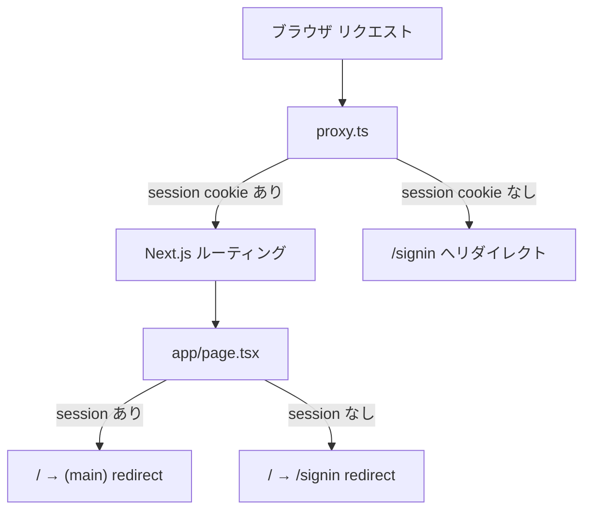

# Phase 2: Auth Protection + Routing

> **Epic:** [AGENTS.md](./AGENTS.md)
> **Dependencies:** Phase 0 (auth server setup)
> **Parallel with:** Phase 1
> **Blocks:** Phase 3

## Objective

Next.js 16 の `proxy.ts` で認証チェックを行い、未認証ユーザーを `/signin` へリダイレクトする。ルートページ (`app/page.tsx`) を認証状態に応じたリダイレクトハブにする。Chat API ルートを `(main)` Route Group の外に移動する。

## What You're Building



## Deliverables

### 1. `apps/chat-app/proxy.ts` を新規作成

Next.js 16 の proxy（旧 middleware）。`better-auth/cookies` の `getSessionCookie` を使い、Cookie の存在のみチェックする（DB呼び出しなし）。

`(main)` 配下のルートをマッチャーで保護する。`/api/auth` は除外する。

```ts
import { NextRequest, NextResponse } from "next/server";
import { getSessionCookie } from "better-auth/cookies";

export async function proxy(request: NextRequest) {
	const sessionCookie = getSessionCookie(request);

	if (!sessionCookie) {
		return NextResponse.redirect(new URL("/signin", request.url));
	}

	return NextResponse.next();
}

export const config = {
	matcher: [
		/*
		 * (main) 配下のルートを保護:
		 * - / のルートは app/page.tsx で個別にハンドリング
		 * - /api/auth は認証エンドポイントなので除外
		 * - /api/chat は認証済みユーザーのみ
		 */
		"/chats/:path*",
		"/api/chat/:path*",
	],
};
```

**注意**: Next.js 16 では `middleware.ts` の代わりに `proxy.ts` を使い、関数名も `middleware` ではなく `proxy` とする。

### 2. `apps/chat-app/app/page.tsx` を修正

サーバーコンポーネントとして、セッションの有無でリダイレクトする。

```tsx
import { getAuth } from "@/lib/auth";
import { headers } from "next/headers";
import { redirect } from "next/navigation";

export default async function Home() {
	const auth = getAuth();
	const session = await auth.api.getSession({
		headers: await headers(),
	});

	if (session) {
		redirect("/chats");
	}

	redirect("/signin");
}
```

`/chats` は `(main)/page.tsx` にマッピングされる…ではなく、`(main)/page.tsx` がそのまま新規チャット画面として `/` 以外のルートで使われる想定。ここはルーティング設計を再確認:

- `/` → `app/page.tsx` → セッションに応じてリダイレクト
- `/chats` → 新規チャットとしてもよいが、現状 `(main)/page.tsx` は `/` にマップされる

**Route Group のルーティング注意**: `(main)/page.tsx` は `app/page.tsx` と同じ `/` に解決されるため競合する。回避策として:

- `app/page.tsx` がリダイレクトハブとして機能する（レンダリングしない）
- `(main)/page.tsx` を削除し、`(main)/chats/page.tsx` を新規チャット画面にする

→ `(main)/page.tsx` を削除し、新規チャットは直接 `(main)/chats/page.tsx`（一覧 + 新規作成）にルーティングする方がシンプル。

**最終的なルーティング設計:**

| URL | File | 役割 |
|---|---|---|
| `/` | `app/page.tsx` | リダイレクトハブ（→ `/chats` or `/signin`） |
| `/signin` | `app/(auth)/signin/page.tsx` | ログインフォーム |
| `/signup` | `app/(auth)/signup/page.tsx` | サインアップフォーム |
| `/chats` | `app/(main)/page.tsx` | チャット一覧 + 新規チャット |
| `/chats/[id]` | `app/(main)/chats/[id]/page.tsx` | チャット詳細 |
| `/api/auth/*` | `app/api/auth/[...all]/route.ts` | better-auth API |
| `/api/chat` | `app/api/chat/route.ts` | Chat API |

**問題**: `(main)/page.tsx` は `/` にマップされる。`/chats` にマップするには `(main)` グループ自体のパスを変えるか、ファイル配置を変える必要がある。

**解決策**: Route Group `(main)` は `/` にマップされるので、`(main)/page.tsx` = `/` となる。`app/page.tsx` と競合する。

→ `app/page.tsx` を削除し、`(main)/page.tsx` 内でセッションチェック + リダイレクト or チャット一覧表示とする。あるいは、Route Group の外に `app/page.tsx` を置いてリダイレクト専用にし、`(main)/page.tsx` は削除。一覧は `(main)/chats/page.tsx` で提供する。

**採用する設計:**

```
app/
├── page.tsx                    → / : リダイレクトハブ（セッション確認 → /chats or /signin）
├── (auth)/signin/page.tsx      → /signin
├── (auth)/signup/page.tsx      → /signup
├── (main)/
│   ├── layout.tsx              → 2ペインレイアウト（サイドバー + メイン）
│   ├── chats/
│   │   ├── page.tsx            → /chats : 新規チャット画面
│   │   └── [id]/page.tsx       → /chats/[id] : チャット詳細
```

→ `(main)/page.tsx` を削除し、`(main)/chats/page.tsx` を新規作成する。

### 3. Chat API ルートの移動

`apps/chat-app/app/(main)/api/chat/route.ts` を `apps/chat-app/app/api/chat/route.ts` へ移動する。

```bash
mkdir -p apps/chat-app/app/api/chat
mv apps/chat-app/app/(main)/api/chat/route.ts apps/chat-app/app/api/chat/route.ts
```

移動後、`(main)/api/` ディレクトリが空になるので削除する。

ファイル内容は変更不要（`@/lib/agent` のパスエイリアスを使っているため）。

### 4. ルーティングの整理

- `apps/chat-app/app/(main)/page.tsx` を **削除**（`/` は `app/page.tsx` が担う）
- `apps/chat-app/app/(main)/chats/page.tsx` を **新規作成**（Phase 4 で実装。この Phase ではプレースホルダー）

```tsx
// apps/chat-app/app/(main)/chats/page.tsx
export default function ChatsPage() {
	return <div>新規チャット</div>;
}
```

## Verification

1. **型チェック**:
   ```bash
   cd apps/chat-app && npx tsc --noEmit
   ```

2. **手動テスト**:
   - 未ログイン状態で `/chats` にアクセス → `/signin` にリダイレクトされる
   - 未ログイン状態で `/` にアクセス → `/signin` にリダイレクトされる
   - ログイン状態で `/` にアクセス → `/chats` にリダイレクトされる
   - `/api/auth/get-session` にアクセス → 正常にレスポンスが返る（ブロックされない）

## Files to Create/Modify

| File | Action |
|---|---|
| `apps/chat-app/proxy.ts` | **Create** |
| `apps/chat-app/app/page.tsx` | **Modify** (リダイレクトハブ) |
| `apps/chat-app/app/api/chat/route.ts` | **Move** (`(main)/api/chat/route.ts` から) |
| `apps/chat-app/app/(main)/api/` | **Delete** (空ディレクトリ) |
| `apps/chat-app/app/(main)/page.tsx` | **Delete** |
| `apps/chat-app/app/(main)/chats/page.tsx` | **Create** (プレースホルダー) |

## Done Criteria

- [ ] `proxy.ts` が `/chats/*` と `/api/chat/*` を保護している
- [ ] `app/page.tsx` がセッション有無でリダイレクトする
- [ ] Chat API が `app/api/chat/route.ts` に移動されている
- [ ] `(main)/page.tsx` が削除され、`(main)/chats/page.tsx` が存在する
- [ ] TypeScript の型チェックが通る
- [ ] Update the status in [AGENTS.md](./AGENTS.md) to `✅ DONE`
