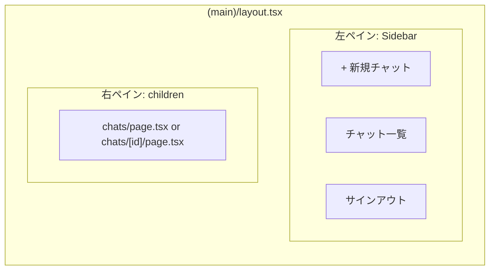

# Phase 3: 2-Pane Layout

> **Epic:** [AGENTS.md](./AGENTS.md)
> **Dependencies:** Phase 1, Phase 2
> **Parallel with:** —
> **Blocks:** Phase 4

## Objective

`(main)/layout.tsx` に2ペインレイアウトを実装する。左ペインはサイドバー（新規チャット作成ボタン、過去のチャット一覧、サインアウトボタン）、右ペインはメインコンテンツ（`children`）。サーバーコンポーネントで `auth.api.getSession()` を使いユーザー情報を取得し、Drizzle でチャット一覧を取得してサイドバーに表示する。

## What You're Building



## Deliverables

### 1. `apps/chat-app/db/schemas/index.ts` を修正

`app-schema` もエクスポートする:

```ts
export * from "./auth-schema";
export * from "./app-schema";
```

### 2. `apps/chat-app/db/relations/app-relations.ts` を新規作成

`chat` と `messages` のリレーション定義。既存の `auth-relations.ts` のパターンに従う。

```ts
import { defineRelations } from "drizzle-orm";
import * as schema from "../schemas";

export const appRelations = defineRelations(schema, (r) => ({
	chat: {
		user: r.one.user({
			from: r.chat.userId,
			to: r.user.id,
		}),
		messages: r.many.messages({
			from: r.chat.id,
			to: r.messages.chatId,
		}),
	},
	messages: {
		chat: r.one.chat({
			from: r.messages.chatId,
			to: r.chat.id,
		}),
	},
}));
```

### 3. `apps/chat-app/db/relations/index.ts` を修正

```ts
export * from "./auth-relations";
export * from "./app-relations";
```

### 4. `apps/chat-app/db/client.ts` を修正

`appRelations` も含める:

```ts
import { drizzle } from "drizzle-orm/libsql";
import { appRelations, authRelations } from "./relations";
import * as schema from "./schemas";

export const db = drizzle({
	connection: {
		url: process.env.DATABASE_URL ?? "",
		authToken: process.env.DATABASE_AUTH_TOKEN,
	},
	schema,
	relations: {
		...authRelations,
		...appRelations,
	},
});
```

### 5. `apps/chat-app/app/(main)/layout.tsx` を実装

サーバーコンポーネント。セッションチェック + チャット一覧取得 + 2ペインレイアウト。

サイドバーの構成:
- 上部: 「新規チャット」ボタン（`/chats` にリンク）
- 中部: チャット一覧（`/chats/[publicId]` にリンク）。`db` から `chat` テーブルを `userId` でフィルタし、`createdAt` 降順で取得
- 下部: ユーザー名表示 + サインアウトボタン

サインアウトボタンは Client Component として分離する（`authClient.signOut()` を呼ぶため）。

```tsx
import { getAuth } from "@/lib/auth";
import { db } from "@/db/client";
import { chat } from "@/db/schemas/app-schema";
import { eq, desc } from "drizzle-orm";
import { headers } from "next/headers";
import { redirect } from "next/navigation";
import Link from "next/link";
import { SignOutButton } from "./sign-out-button";

export default async function MainLayout({
	children,
}: {
	children: React.ReactNode;
}) {
	const auth = getAuth();
	const session = await auth.api.getSession({
		headers: await headers(),
	});

	if (!session) {
		redirect("/signin");
	}

	const chats = await db
		.select({
			id: chat.id,
			publicId: chat.publicId,
			createdAt: chat.createdAt,
		})
		.from(chat)
		.where(eq(chat.userId, session.user.id))
		.orderBy(desc(chat.createdAt));

	return (
		<div className="flex h-screen bg-gray-950">
			{/* サイドバー */}
			<aside className="flex w-64 flex-col border-r border-gray-800 bg-gray-900">
				<div className="p-4">
					<Link
						href="/chats"
						className="flex w-full items-center justify-center gap-2 rounded-lg border border-gray-700 px-4 py-2 text-sm text-gray-300 transition hover:bg-gray-800"
					>
						+ 新規チャット
					</Link>
				</div>

				<nav className="flex-1 overflow-y-auto px-2">
					<ul className="space-y-1">
						{chats.map((c) => (
							<li key={c.id}>
								<Link
									href={`/chats/${c.publicId}`}
									className="block rounded-lg px-3 py-2 text-sm text-gray-400 transition hover:bg-gray-800 hover:text-white"
								>
									Chat {c.publicId.slice(0, 8)}...
								</Link>
							</li>
						))}
					</ul>
				</nav>

				<div className="border-t border-gray-800 p-4">
					<p className="truncate text-sm text-gray-400">{session.user.name}</p>
					<SignOutButton />
				</div>
			</aside>

			{/* メインコンテンツ */}
			<main className="flex-1 overflow-hidden">
				{children}
			</main>
		</div>
	);
}
```

### 6. `apps/chat-app/app/(main)/sign-out-button.tsx` を新規作成

```tsx
"use client";

import { authClient } from "@/lib/auth-client";
import { useRouter } from "next/navigation";

export function SignOutButton() {
	const router = useRouter();

	return (
		<button
			type="button"
			onClick={async () => {
				await authClient.signOut();
				router.push("/signin");
			}}
			className="mt-2 w-full rounded-lg px-3 py-2 text-left text-sm text-gray-500 transition hover:bg-gray-800 hover:text-gray-300"
		>
			サインアウト
		</button>
	);
}
```

## Verification

1. **型チェック**:
   ```bash
   cd apps/chat-app && npx tsc --noEmit
   ```

2. **手動テスト**（Phase 0 + 1 + 2 完了後、DB設定済み）:
   - ログイン後、2ペインレイアウトが表示される
   - サイドバーに「新規チャット」ボタンがある
   - サイドバー下部にユーザー名とサインアウトボタンがある
   - サインアウトをクリック → `/signin` にリダイレクトされる

## Files to Create/Modify

| File | Action |
|---|---|
| `apps/chat-app/db/schemas/index.ts` | **Modify** (`app-schema` をエクスポート追加) |
| `apps/chat-app/db/relations/app-relations.ts` | **Create** |
| `apps/chat-app/db/relations/index.ts` | **Modify** (`app-relations` をエクスポート追加) |
| `apps/chat-app/db/client.ts` | **Modify** (`appRelations` を追加) |
| `apps/chat-app/app/(main)/layout.tsx` | **Modify** (2ペインレイアウト実装) |
| `apps/chat-app/app/(main)/sign-out-button.tsx` | **Create** |

## Done Criteria

- [ ] `db/schemas/index.ts` が `app-schema` をエクスポートしている
- [ ] `db/relations/app-relations.ts` が chat/messages のリレーションを定義している
- [ ] `db/client.ts` が `appRelations` を含んでいる
- [ ] `(main)/layout.tsx` が2ペインレイアウトを表示する
- [ ] サイドバーに新規チャットボタン、チャット一覧、サインアウトボタンがある
- [ ] TypeScript の型チェックが通る
- [ ] Update the status in [AGENTS.md](./AGENTS.md) to `✅ DONE`
