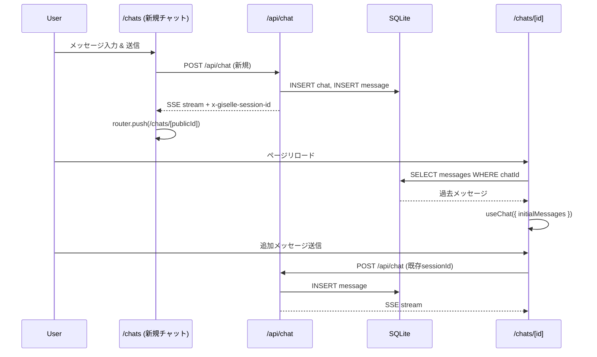

# Phase 4: Chat UI + Persistence

> **Epic:** [AGENTS.md](./AGENTS.md)
> **Dependencies:** Phase 3 (2-pane layout)
> **Parallel with:** —
> **Blocks:** —

## Objective

新規チャット画面とチャット詳細画面を実装する。Vercel AI SDK の `useChat` を使い、`minimum-demo/app/page.tsx` のパターンに基づいてChat UIを構築する。メッセージはチャットごとにSQLite（libSQL）に永続化し、ページリロード後も会話を再開できるようにする。

## What You're Building



## Deliverables

### 1. `apps/chat-app/app/api/chat/route.ts` を修正

既存のChat APIルートに認証チェックとDB永続化を追加する。

変更点:
- `getAuth().api.getSession()` でセッションを検証
- 新規チャットの場合: `chat` レコードを INSERT し、`publicId` をレスポンスヘッダに含める
- メッセージを `messages` テーブルに INSERT

```ts
import { type BrowserTools, browserTools } from "@giselles-ai/browser-tool";
import { giselle } from "@giselles-ai/giselle-provider";
import {
	consumeStream,
	convertToModelMessages,
	type InferUITools,
	streamText,
	type UIMessage,
	validateUIMessages,
} from "ai";
import { agent } from "@/lib/agent";
import { getAuth } from "@/lib/auth";
import { db } from "@/db/client";
import { chat, messages as messagesTable } from "@/db/schemas/app-schema";
import { eq } from "drizzle-orm";
import { headers } from "next/headers";

export async function POST(request: Request): Promise<Response> {
	const auth = getAuth();
	const session = await auth.api.getSession({
		headers: await headers(),
	});

	if (!session) {
		return new Response("Unauthorized", { status: 401 });
	}

	const body = await request.json();
	const sessionId = body.id ?? crypto.randomUUID();

	// chatId (publicId) に対応するDBレコードを取得 or 作成
	let chatRecord = await db
		.select()
		.from(chat)
		.where(eq(chat.publicId, sessionId))
		.then((rows) => rows[0]);

	if (!chatRecord) {
		const inserted = await db
			.insert(chat)
			.values({
				publicId: sessionId,
				userId: session.user.id as number,
			})
			.returning();
		chatRecord = inserted[0];
	}

	const uiMessages = await validateUIMessages<
		UIMessage<never, never, InferUITools<BrowserTools>>
	>({
		messages: body.messages,
		tools: browserTools,
	});

	// 最新のユーザーメッセージを永続化
	const lastUserMessage = uiMessages.filter((m) => m.role === "user").at(-1);
	if (lastUserMessage) {
		await db.insert(messagesTable).values({
			publicId: lastUserMessage.id,
			chatId: chatRecord.id,
			message: lastUserMessage,
		});
	}

	const result = streamText({
		model: giselle({ agent }),
		messages: await convertToModelMessages(uiMessages),
		tools: browserTools,
		providerOptions: {
			giselle: {
				sessionId,
			},
		},
		abortSignal: request.signal,
		async onFinish({ response }) {
			// アシスタントメッセージを永続化
			// response.messages にはアシスタントの応答が含まれる
			for (const msg of response.messages) {
				if (msg.role === "assistant") {
					await db.insert(messagesTable).values({
						publicId: crypto.randomUUID(),
						chatId: chatRecord.id,
						message: {
							id: crypto.randomUUID(),
							role: "assistant",
							parts: msg.content.map((part) => {
								if (part.type === "text") {
									return { type: "text" as const, text: part.text };
								}
								return part;
							}),
						} as UIMessage,
					});
				}
			}
		},
	});

	return result.toUIMessageStreamResponse({
		headers: {
			"x-giselle-session-id": sessionId,
			"x-giselle-chat-id": chatRecord.publicId,
		},
		consumeSseStream: consumeStream,
	});
}
```

**注意**: `onFinish` でのアシスタントメッセージ永続化は簡易的な実装。`UIMessage` 型への変換は実際のレスポンス構造に合わせて調整が必要な場合がある。最初の実装ではユーザーメッセージの永続化のみを行い、アシスタントメッセージの永続化は別途改善しても良い。

### 2. `apps/chat-app/app/(main)/chats/page.tsx` を実装

新規チャット画面。`useChat` を使い、最初のメッセージ送信時に `/chats/[id]` にリダイレクトする。

参考実装: `apps/minimum-demo/app/page.tsx`

```tsx
"use client";

import { useChat } from "@ai-sdk/react";
import { useBrowserToolHandler } from "@giselles-ai/browser-tool/react";
import {
	DefaultChatTransport,
	lastAssistantMessageIsCompleteWithToolCalls,
} from "ai";
import { useRouter } from "next/navigation";
import { type FormEvent, useState } from "react";

export default function NewChatPage() {
	const router = useRouter();
	const [input, setInput] = useState("");
	const [redirected, setRedirected] = useState(false);

	const browserTool = useBrowserToolHandler();

	const { status, messages, error, sendMessage, addToolOutput } = useChat({
		transport: new DefaultChatTransport({
			api: "/api/chat",
		}),
		sendAutomaticallyWhen: lastAssistantMessageIsCompleteWithToolCalls,
		...browserTool,
		onResponse(response) {
			const chatId = response.headers.get("x-giselle-chat-id");
			if (chatId && !redirected) {
				setRedirected(true);
				router.replace(`/chats/${chatId}`);
			}
		},
	});

	browserTool.connect(addToolOutput);

	const isBusy = status === "submitted" || status === "streaming";

	async function handleSubmit(e: FormEvent) {
		e.preventDefault();
		const trimmed = input.trim();
		if (!trimmed || isBusy) return;

		await sendMessage({ text: trimmed });
		setInput("");
	}

	return (
		<div className="flex h-full flex-col">
			<div className="flex-1 overflow-y-auto p-4">
				{messages.length === 0 ? (
					<div className="flex h-full items-center justify-center">
						<p className="text-gray-500">メッセージを入力して会話を始めましょう</p>
					</div>
				) : (
					<div className="mx-auto max-w-3xl space-y-4">
						{messages.map((message) => (
							<div
								key={message.id}
								className={`rounded-lg px-4 py-3 ${
									message.role === "user"
										? "ml-12 bg-blue-600/20 text-blue-100"
										: "mr-12 bg-gray-800 text-gray-200"
								}`}
							>
								{message.parts.map((part, i) => {
									if (part.type === "text") {
										return (
											<p key={`${message.id}-${i}`} className="whitespace-pre-wrap text-sm">
												{part.text}
											</p>
										);
									}
									return null;
								})}
							</div>
						))}
					</div>
				)}

				{error && (
					<div className="mx-auto mt-4 max-w-3xl rounded-lg border border-red-500/30 bg-red-500/10 px-4 py-3 text-sm text-red-300">
						{error.message}
					</div>
				)}
			</div>

			<div className="border-t border-gray-800 p-4">
				<form onSubmit={handleSubmit} className="mx-auto flex max-w-3xl gap-2">
					<input
						type="text"
						value={input}
						onChange={(e) => setInput(e.target.value)}
						placeholder="メッセージを入力..."
						className="flex-1 rounded-lg border border-gray-700 bg-gray-900 px-4 py-2 text-sm text-white placeholder:text-gray-500 focus:border-blue-500 focus:outline-none focus:ring-1 focus:ring-blue-500"
					/>
					<button
						type="submit"
						disabled={!input.trim() || isBusy}
						className="rounded-lg bg-blue-600 px-4 py-2 text-sm font-medium text-white transition hover:bg-blue-500 disabled:cursor-not-allowed disabled:opacity-50"
					>
						{isBusy ? "送信中..." : "送信"}
					</button>
				</form>
			</div>
		</div>
	);
}
```

### 3. `apps/chat-app/app/(main)/chats/[id]/page.tsx` を実装

チャット詳細ページ。サーバーコンポーネントでDBからメッセージを取得し、Client Component に `initialMessages` として渡す。

サーバー部分:

```tsx
import { db } from "@/db/client";
import { chat, messages } from "@/db/schemas/app-schema";
import { eq, asc } from "drizzle-orm";
import { notFound } from "next/navigation";
import { ChatDetail } from "./chat-detail";

export default async function ChatDetailPage({
	params,
}: {
	params: Promise<{ id: string }>;
}) {
	const { id } = await params;

	const chatRecord = await db
		.select()
		.from(chat)
		.where(eq(chat.publicId, id))
		.then((rows) => rows[0]);

	if (!chatRecord) {
		notFound();
	}

	const savedMessages = await db
		.select()
		.from(messages)
		.where(eq(messages.chatId, chatRecord.id))
		.orderBy(asc(messages.createdAt));

	const initialMessages = savedMessages.map((m) => m.message);

	return <ChatDetail chatId={chatRecord.publicId} initialMessages={initialMessages} />;
}
```

### 4. `apps/chat-app/app/(main)/chats/[id]/chat-detail.tsx` を新規作成

Client Component。`useChat` に `initialMessages` と `id`（sessionId として使う）を渡す。

```tsx
"use client";

import { useChat } from "@ai-sdk/react";
import { useBrowserToolHandler } from "@giselles-ai/browser-tool/react";
import {
	DefaultChatTransport,
	type UIMessage,
	lastAssistantMessageIsCompleteWithToolCalls,
} from "ai";
import { type FormEvent, useState } from "react";

export function ChatDetail({
	chatId,
	initialMessages,
}: {
	chatId: string;
	initialMessages: UIMessage[];
}) {
	const [input, setInput] = useState("");

	const browserTool = useBrowserToolHandler();

	const { status, messages, error, sendMessage, addToolOutput } = useChat({
		id: chatId,
		initialMessages,
		transport: new DefaultChatTransport({
			api: "/api/chat",
		}),
		sendAutomaticallyWhen: lastAssistantMessageIsCompleteWithToolCalls,
		...browserTool,
	});

	browserTool.connect(addToolOutput);

	const isBusy = status === "submitted" || status === "streaming";

	async function handleSubmit(e: FormEvent) {
		e.preventDefault();
		const trimmed = input.trim();
		if (!trimmed || isBusy) return;

		await sendMessage({ text: trimmed });
		setInput("");
	}

	return (
		<div className="flex h-full flex-col">
			<div className="flex-1 overflow-y-auto p-4">
				<div className="mx-auto max-w-3xl space-y-4">
					{messages.map((message) => (
						<div
							key={message.id}
							className={`rounded-lg px-4 py-3 ${
								message.role === "user"
									? "ml-12 bg-blue-600/20 text-blue-100"
									: "mr-12 bg-gray-800 text-gray-200"
							}`}
						>
							{message.parts.map((part, i) => {
								if (part.type === "text") {
									return (
										<p key={`${message.id}-${i}`} className="whitespace-pre-wrap text-sm">
											{part.text}
										</p>
									);
								}
								return null;
							})}
						</div>
					))}
				</div>

				{error && (
					<div className="mx-auto mt-4 max-w-3xl rounded-lg border border-red-500/30 bg-red-500/10 px-4 py-3 text-sm text-red-300">
						{error.message}
					</div>
				)}
			</div>

			<div className="border-t border-gray-800 p-4">
				<form onSubmit={handleSubmit} className="mx-auto flex max-w-3xl gap-2">
					<input
						type="text"
						value={input}
						onChange={(e) => setInput(e.target.value)}
						placeholder="メッセージを入力..."
						className="flex-1 rounded-lg border border-gray-700 bg-gray-900 px-4 py-2 text-sm text-white placeholder:text-gray-500 focus:border-blue-500 focus:outline-none focus:ring-1 focus:ring-blue-500"
					/>
					<button
						type="submit"
						disabled={!input.trim() || isBusy}
						className="rounded-lg bg-blue-600 px-4 py-2 text-sm font-medium text-white transition hover:bg-blue-500 disabled:cursor-not-allowed disabled:opacity-50"
					>
						{isBusy ? "送信中..." : "送信"}
					</button>
				</form>
			</div>
		</div>
	);
}
```

## Verification

1. **型チェック**:
   ```bash
   cd apps/chat-app && npx tsc --noEmit
   ```

2. **手動テスト**（全Phase完了 + DB設定済み）:
   - `/chats` にアクセス → 空のチャット画面が表示される
   - メッセージ入力 & 送信 → レスポンスがストリーミング表示される
   - 送信後、URLが `/chats/[id]` に変わる
   - ページをリロード → 過去のメッセージが表示される
   - サイドバーに新しいチャットが表示される
   - サイドバーのチャットをクリック → そのチャットに遷移する

## Files to Create/Modify

| File | Action |
|---|---|
| `apps/chat-app/app/api/chat/route.ts` | **Modify** (認証 + DB永続化追加) |
| `apps/chat-app/app/(main)/chats/page.tsx` | **Modify** (新規チャットUI実装) |
| `apps/chat-app/app/(main)/chats/[id]/page.tsx` | **Modify** (チャット詳細、サーバー側でメッセージ取得) |
| `apps/chat-app/app/(main)/chats/[id]/chat-detail.tsx` | **Create** (チャット詳細 Client Component) |

## Done Criteria

- [ ] 新規チャット画面でメッセージ送信ができる
- [ ] 送信後 `/chats/[id]` にリダイレクトされる
- [ ] チャット詳細ページで過去メッセージが表示される
- [ ] チャット詳細ページで会話を続けられる
- [ ] Chat API に認証チェックがある
- [ ] メッセージがDBに永続化されている
- [ ] TypeScript の型チェックが通る
- [ ] Update the status in [AGENTS.md](./AGENTS.md) to `✅ DONE`
