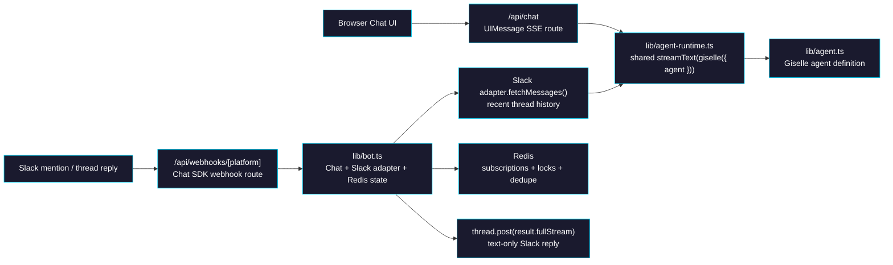
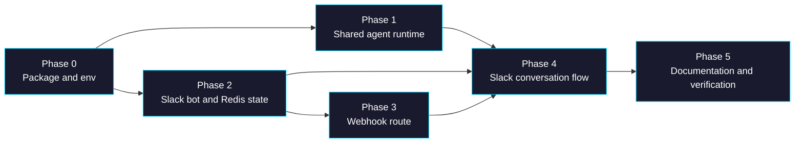

# Epic: Chat App Slack Chat SDK Integration

> **GitHub Epic:** TBD · **Sub-issues:** TBD (Phases 0–5)

## Goal

After this epic is complete, `apps/chat-app` will support two independent chat entrypoints backed by the same Giselle agent definition. The existing browser chat experience remains unchanged and continues to use the AI SDK UIMessage stream plus JSON Render. In parallel, Slack users can mention the same agent through Chat SDK webhooks, with Chat SDK handling subscription state and distributed locking via Redis while Slack conversation history is fetched on demand from Slack for prompt assembly.

## Why

- The current app exposes the agent only through the browser UI in [`apps/chat-app/app/(main)/chats/[id]/page.tsx`](/Users/satoshi/repo/giselles-ai/agent-container/apps/chat-app/app/(main)/chats/[id]/page.tsx) and [`apps/chat-app/app/api/chat/route.ts`](/Users/satoshi/repo/giselles-ai/agent-container/apps/chat-app/app/api/chat/route.ts).
- Reusing the same agent from Slack should not force a rewrite of the web chat transport or the JSON Render UI path.
- Chat SDK already provides the exact missing capabilities for Slack: webhook normalization, thread subscriptions, distributed locking, and AI SDK stream posting.

Benefits:
- One agent definition in [`apps/chat-app/lib/agent.ts`](/Users/satoshi/repo/giselles-ai/agent-container/apps/chat-app/lib/agent.ts) serves both browser chat and Slack.
- The Slack path stays KISS: text-only output, no tool UI protocol, no JSON Render coupling.
- Redis is used only for what Chat SDK actually needs here: subscriptions, locks, and dedupe.
- Future platforms can reuse the same runtime boundary after Slack is proven.

## Architecture Overview



## Package / Directory Structure

```text
apps/chat-app/
├── app/
│   ├── api/
│   │   ├── chat/route.ts                         ← EXISTING (modify: call shared runtime, keep web-specific stream behavior)
│   │   └── webhooks/
│   │       └── [platform]/
│   │           └── route.ts                      ← NEW (Chat SDK webhook entrypoint)
│   ├── (main)/
│   │   └── chats/
│   │       └── [id]/page.tsx                     ← EXISTING (reference only, browser UI remains)
├── lib/
│   ├── agent.ts                                  ← EXISTING (shared agent definition)
│   ├── agent-runtime.ts                          ← NEW (shared AI SDK runtime boundary)
│   ├── bot.ts                                    ← NEW (Chat SDK Chat instance + Slack adapter + Redis state)
│   └── slack-history.ts                          ← NEW (history fetch + AI message conversion helper)
├── package.json                                  ← MODIFY (Chat SDK + Slack + Redis dependencies)
└── README.md                                     ← MODIFY (document Slack webhook mode and env vars)

tasks/chat-app-slack-chat-sdk/
├── AGENTS.md                                     ← NEW (epic map)
├── phase-0-package-and-env.md                    ← NEW
├── phase-1-shared-agent-runtime.md               ← NEW
├── phase-2-slack-bot-and-state.md                ← NEW
├── phase-3-webhook-route.md                      ← NEW
├── phase-4-slack-conversation-flow.md            ← NEW
└── phase-5-documentation-and-verification.md     ← NEW
```

## Task Dependency Graph



Phase 1 and Phase 2 can run in parallel after Phase 0. Phase 3 depends only on Phase 2. Phase 4 is the integration join point.

## Task Status

| Phase | Task File | Status | Description |
|---|---|---|---|
| 0 | [phase-0-package-and-env.md](./phase-0-package-and-env.md) | ✅ DONE | Add Chat SDK dependencies and define the Slack/Redis environment contract |
| 1 | [phase-1-shared-agent-runtime.md](./phase-1-shared-agent-runtime.md) | ✅ DONE | Extract a shared AI SDK runtime that both web chat and Slack can call |
| 2 | [phase-2-slack-bot-and-state.md](./phase-2-slack-bot-and-state.md) | ✅ DONE | Create the Chat SDK bot with Slack adapter and Redis state |
| 3 | [phase-3-webhook-route.md](./phase-3-webhook-route.md) | ✅ DONE | Expose a Next.js webhook route for Chat SDK adapters |
| 4 | [phase-4-slack-conversation-flow.md](./phase-4-slack-conversation-flow.md) | ✅ DONE | Implement mention, subscription, history fetch, and streamed Slack replies |
| 5 | [phase-5-documentation-and-verification.md](./phase-5-documentation-and-verification.md) | ✅ DONE | Update project docs and verify local and Slack behavior end-to-end |

> **How to work on this epic:** Read this file first to understand the full architecture.
> Then check the status table above. Pick the first `🔲 TODO` task whose dependencies
> (see dependency graph) are `✅ DONE`. Open that task file and follow its instructions.
> When done, update the status in this table to `✅ DONE`.

## Key Conventions

- Monorepo: pnpm workspaces + Turborepo from [`package.json`](/Users/satoshi/repo/giselles-ai/agent-container/package.json)
- App framework: Next.js 16 App Router in [`apps/chat-app/package.json`](/Users/satoshi/repo/giselles-ai/agent-container/apps/chat-app/package.json)
- TypeScript: strict mode with `@/*` path alias in [`apps/chat-app/tsconfig.json`](/Users/satoshi/repo/giselles-ai/agent-container/apps/chat-app/tsconfig.json)
- Formatter/linter: Biome via `pnpm --filter chat-app lint`
- Existing web chat contract must remain intact: `useChat` + `DefaultChatTransport` + `createUIMessageStreamResponse`
- Slack path must stay text-only. Do not introduce JSON Render, UIMessage parts, or web-only tool rendering into the Chat SDK route.
- Redis is required for Chat SDK state in this epic, but message transcripts are not persisted to the app database.
- Prefer explicit helper boundaries over reusing the web route from Slack. Shared logic belongs in `lib/`, not inside route handlers.

## Existing Code Reference

| File | Relevance |
|---|---|
| [`apps/chat-app/lib/agent.ts`](/Users/satoshi/repo/giselles-ai/agent-container/apps/chat-app/lib/agent.ts) | Source of truth for the agent definition reused by web and Slack |
| [`apps/chat-app/app/api/chat/route.ts`](/Users/satoshi/repo/giselles-ai/agent-container/apps/chat-app/app/api/chat/route.ts) | Existing AI SDK route with auth, persistence, UIMessage validation, and JSON Render merge |
| [`apps/chat-app/app/(main)/chats/chat-ui.tsx`](/Users/satoshi/repo/giselles-ai/agent-container/apps/chat-app/app/(main)/chats/chat-ui.tsx) | Shows why the browser path cannot be collapsed into the Slack path |
| [`apps/chat-app/app/(main)/chats/[id]/page.tsx`](/Users/satoshi/repo/giselles-ai/agent-container/apps/chat-app/app/(main)/chats/[id]/page.tsx) | Confirms browser chat history is DB-backed and should remain unchanged |
| [`apps/chat-app/package.json`](/Users/satoshi/repo/giselles-ai/agent-container/apps/chat-app/package.json) | Current dependency set and available scripts |
| [`apps/chat-app/README.md`](/Users/satoshi/repo/giselles-ai/agent-container/apps/chat-app/README.md) | User-facing setup documentation that will need Slack/Redis additions |
| [`opensrc/repos/github.com/vercel/chat/examples/nextjs-chat/src/lib/bot.tsx`](/Users/satoshi/repo/giselles-ai/agent-container/opensrc/repos/github.com/vercel/chat/examples/nextjs-chat/src/lib/bot.tsx) | Canonical Chat SDK example with `thread.subscribe()`, `toAiMessages()`, and `thread.post(result.fullStream)` |
| [`opensrc/repos/github.com/vercel/chat/examples/nextjs-chat/src/app/api/webhooks/[platform]/route.ts`](/Users/satoshi/repo/giselles-ai/agent-container/opensrc/repos/github.com/vercel/chat/examples/nextjs-chat/src/app/api/webhooks/[platform]/route.ts) | Canonical Next.js webhook route pattern using `after()` |
| [`opensrc/repos/github.com/vercel/chat/packages/chat/src/from-full-stream.ts`](/Users/satoshi/repo/giselles-ai/agent-container/opensrc/repos/github.com/vercel/chat/packages/chat/src/from-full-stream.ts) | Confirms `thread.post()` accepts AI SDK `fullStream` and normalizes it |
| [`opensrc/repos/github.com/vercel/chat/packages/chat/src/ai.ts`](/Users/satoshi/repo/giselles-ai/agent-container/opensrc/repos/github.com/vercel/chat/packages/chat/src/ai.ts) | Source for `toAiMessages()` and attachment/message conversion behavior |
| [`opensrc/repos/github.com/vercel/chat/packages/adapter-slack/README.md`](/Users/satoshi/repo/giselles-ai/agent-container/opensrc/repos/github.com/vercel/chat/packages/adapter-slack/README.md) | Slack adapter environment contract and manifest requirements |
| [`opensrc/repos/github.com/vercel/chat/packages/state-redis/README.md`](/Users/satoshi/repo/giselles-ai/agent-container/opensrc/repos/github.com/vercel/chat/packages/state-redis/README.md) | Redis state adapter behavior and key prefix options |

## Domain-Specific Reference

### External docs URLs checked

| URL | Why it matters |
|---|---|
| [Chat SDK Introduction](https://chat-sdk.dev/docs) | Confirms Chat SDK core concepts, supported platforms, and Redis as the recommended production state backend |
| [Creating a Chat Instance](https://chat-sdk.dev/docs/usage) | Defines `Chat` construction, `state`, `webhooks`, and lock/dedupe options |
| [Streaming](https://chat-sdk.dev/docs/streaming) | Confirms `thread.post(result.fullStream)` and recommends `fullStream` over `textStream` |
| [State Adapter Overview](https://chat-sdk.dev/docs/state) | Confirms Redis responsibility boundaries: subscriptions, distributed locking, caching |
| [Slack bot with Next.js and Redis](https://chat-sdk.dev/docs/guides/slack-nextjs) | Provides the exact Next.js + Slack + Redis wiring pattern for this epic |
| [Adapters overview](https://chat-sdk.dev/adapters) | Entry point for adapter-specific docs and future platform expansion |

### Chat SDK contract summary for this epic

| Concern | Required decision |
|---|---|
| Platform | Slack only for the first rollout |
| Bot mode | Single-workspace Slack bot using `SLACK_BOT_TOKEN` + `SLACK_SIGNING_SECRET` |
| State backend | Redis via `@chat-adapter/state-redis` |
| Redis usage | Only subscriptions, distributed locks, and dedupe. No app-level transcript persistence |
| Prompt history source | Slack adapter `fetchMessages(thread.id, { limit })` on each turn |
| Output format | Text-only streamed reply via `thread.post(result.fullStream)` |
| Web chat behavior | Unchanged, including auth, DB persistence, and JSON Render stream merging |

### Proposed environment variables

| Variable | Required | Purpose |
|---|---|---|
| `REDIS_URL` | Yes | Chat SDK Redis state adapter connection |
| `SLACK_BOT_TOKEN` | Yes | Single-workspace Slack bot token |
| `SLACK_SIGNING_SECRET` | Yes | Slack webhook verification |
| `SLACK_BOT_USERNAME` | No | Optional override for `Chat.userName`; fallback should be deterministic |
| `SLACK_HISTORY_LIMIT` | No | Optional recent-message limit for prompt assembly; default should be defined in code |

### Session / thread identity rules

| Item | Rule |
|---|---|
| Slack session key | `slack:${thread.id}` |
| Browser session key | Existing browser `chatId` / `sessionId` behavior stays unchanged |
| Cross-channel sharing | Not part of this epic |
| DB persistence for Slack | Explicitly out of scope |
