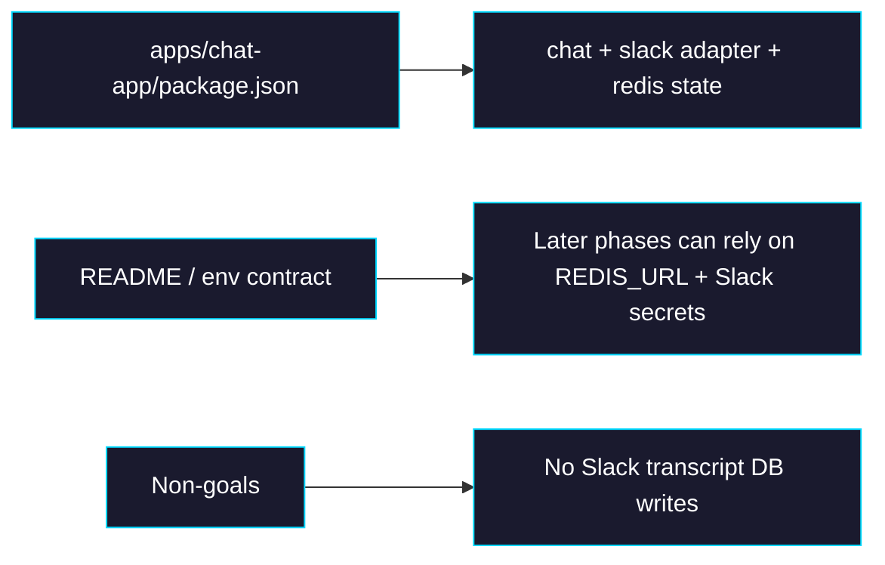

# Phase 0: Package and Environment Contract

> **GitHub Issue:** TBD · **Epic:** [AGENTS.md](./AGENTS.md)
> **Dependencies:** None
> **Parallel with:** None
> **Blocks:** Phase 1, Phase 2

## Objective

This phase prepares `apps/chat-app` to compile a Slack bot path without changing runtime behavior yet. It adds the Chat SDK dependencies, defines the environment-variable contract for Slack and Redis, and captures a clear non-goal boundary so later phases do not accidentally persist Slack transcripts to the app database.

## What You're Building



## Deliverables

### 1. [`apps/chat-app/package.json`](/Users/satoshi/repo/giselles-ai/agent-container/apps/chat-app/package.json)

Add the minimum Slack integration dependencies:

```json
{
  "dependencies": {
    "@chat-adapter/slack": "workspace:^ || compatible released version",
    "@chat-adapter/state-redis": "workspace:^ || compatible released version",
    "chat": "workspace:^ || compatible released version"
  }
}
```

Implementation notes:
- Match the repo's package-management strategy. If Chat SDK packages are consumed from npm rather than workspace, pin explicit versions.
- Do not add adapter packages for platforms that are out of scope.
- Do not add `@chat-adapter/state-memory`; production intent is Redis.

### 2. [`apps/chat-app/README.md`](/Users/satoshi/repo/giselles-ai/agent-container/apps/chat-app/README.md)

Extend the setup section with a Slack integration block:

```md
## Slack Integration

Required environment variables:

- `SLACK_BOT_TOKEN`
- `SLACK_SIGNING_SECRET`
- `REDIS_URL`

Optional:

- `SLACK_BOT_USERNAME`
- `SLACK_HISTORY_LIMIT`

Slack webhook endpoint:

- `POST /api/webhooks/slack`
```

Also add an explicit scope statement:

```md
Slack conversations are not persisted to the app database in this iteration.
Chat SDK uses Redis for subscriptions, locking, and deduplication only.
```

### 3. Dependency and env decision table

Record this table in the phase implementation notes or README update:

| Decision | Value |
|---|---|
| Slack auth mode | Single-workspace bot token |
| Redis role | Chat SDK state only |
| Transcript storage | Not stored in app DB |
| Prompt history source | Slack `fetchMessages()` |
| Output protocol | Text-only Slack stream |

## Verification

1. **Automated checks**
   Run `pnpm --filter chat-app typecheck`
   Run `pnpm --filter chat-app lint`

2. **Manual test scenarios**
   1. Open [`apps/chat-app/package.json`](/Users/satoshi/repo/giselles-ai/agent-container/apps/chat-app/package.json) → confirm only Slack-specific Chat SDK packages were added → no extra platform adapters are present.
   2. Open [`apps/chat-app/README.md`](/Users/satoshi/repo/giselles-ai/agent-container/apps/chat-app/README.md) → confirm Slack env vars and webhook endpoint are documented → transcript non-persistence is stated explicitly.

## Files to Create/Modify

| File | Action |
|---|---|
| [`apps/chat-app/package.json`](/Users/satoshi/repo/giselles-ai/agent-container/apps/chat-app/package.json) | **Modify** (add Chat SDK, Slack adapter, Redis state dependencies) |
| [`apps/chat-app/README.md`](/Users/satoshi/repo/giselles-ai/agent-container/apps/chat-app/README.md) | **Modify** (document Slack/Redis env contract and webhook endpoint) |

## Done Criteria

- [ ] Slack Chat SDK dependencies are declared in [`apps/chat-app/package.json`](/Users/satoshi/repo/giselles-ai/agent-container/apps/chat-app/package.json)
- [ ] README documents `REDIS_URL`, `SLACK_BOT_TOKEN`, and `SLACK_SIGNING_SECRET`
- [ ] README states that Slack transcripts are not stored in the app database
- [ ] `pnpm --filter chat-app typecheck` passes
- [ ] `pnpm --filter chat-app lint` passes
- [ ] Update the status in [AGENTS.md](./AGENTS.md) to `✅ DONE`
