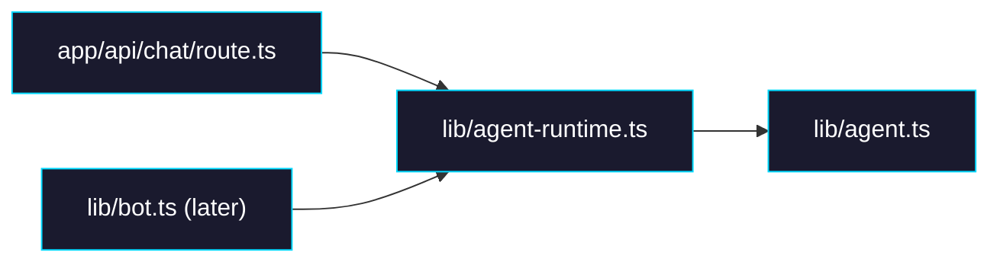

# Phase 1: Shared Agent Runtime

> **GitHub Issue:** TBD · **Epic:** [AGENTS.md](./AGENTS.md)
> **Dependencies:** Phase 0
> **Parallel with:** Phase 2
> **Blocks:** Phase 4

## Objective

This phase extracts the actual `streamText(giselle({ agent }))` call into a shared runtime helper so the browser chat route and the Slack bot do not duplicate model wiring. The web route must keep its current auth, DB, and UIMessage response behavior while delegating only the model invocation to the new shared helper.

## What You're Building



## Deliverables

### 1. [`apps/chat-app/lib/agent-runtime.ts`](/Users/satoshi/repo/giselles-ai/agent-container/apps/chat-app/lib/agent-runtime.ts)

Create a shared helper with a narrow contract:

```ts
import { giselle } from "@giselles-ai/giselle-provider";
import { streamText, type ModelMessage } from "ai";
import { agent } from "@/lib/agent";

export interface RunAgentOptions {
  messages: ModelMessage[];
  sessionId: string;
  abortSignal?: AbortSignal;
}

export function runAgent({
  messages,
  sessionId,
  abortSignal,
}: RunAgentOptions) {
  return streamText({
    model: giselle({ agent }),
    messages,
    providerOptions: {
      giselle: {
        sessionId,
      },
    },
    abortSignal,
  });
}
```

Rules:
- Keep this helper transport-agnostic. No auth, no DB, no `UIMessage`, no `pipeJsonRender`.
- Return the raw `streamText(...)` result so callers can choose `toUIMessageStreamResponse()` or `fullStream`.
- The only cross-channel identity this helper knows is `sessionId`.

### 2. [`apps/chat-app/app/api/chat/route.ts`](/Users/satoshi/repo/giselles-ai/agent-container/apps/chat-app/app/api/chat/route.ts)

Refactor the existing route to use `runAgent(...)` in place of the inline `streamText(...)` call.

Required change shape:

```ts
const result = runAgent({
  messages: await convertToModelMessages(messages),
  sessionId,
  abortSignal: request.signal,
});
```

Keep all existing browser-only behavior:
- session auth via better-auth
- chat record lookup/creation
- message persistence to `chat` / `message`
- `pipeJsonRender(result.toUIMessageStream())`
- `createUIMessageStreamResponse(...)`

### 3. Shared session ID contract

Document in code comments or nearby constants:

| Channel | Session ID |
|---|---|
| Browser | Existing `chatId` / request-derived session ID |
| Slack | `slack:${thread.id}` |

This makes it explicit that runtime reuse does not imply shared conversation storage.

## Verification

1. **Automated checks**
   Run `pnpm --filter chat-app typecheck`
   Run `pnpm --filter chat-app lint`

2. **Manual test scenarios**
   1. Browser chat open on [`apps/chat-app/app/(main)/chats/[id]/page.tsx`](/Users/satoshi/repo/giselles-ai/agent-container/apps/chat-app/app/(main)/chats/[id]/page.tsx) → send a message → response still streams and JSON Render content still appears.
   2. Inspect [`apps/chat-app/lib/agent-runtime.ts`](/Users/satoshi/repo/giselles-ai/agent-container/apps/chat-app/lib/agent-runtime.ts) → confirm no DB imports and no UI-specific imports exist.

## Files to Create/Modify

| File | Action |
|---|---|
| [`apps/chat-app/lib/agent-runtime.ts`](/Users/satoshi/repo/giselles-ai/agent-container/apps/chat-app/lib/agent-runtime.ts) | **Create** |
| [`apps/chat-app/app/api/chat/route.ts`](/Users/satoshi/repo/giselles-ai/agent-container/apps/chat-app/app/api/chat/route.ts) | **Modify** (delegate model execution to shared runtime) |

## Done Criteria

- [ ] Shared runtime exists and wraps `streamText(giselle({ agent }))`
- [ ] Browser route uses shared runtime without changing its existing external behavior
- [ ] Shared runtime stays free of DB, auth, and UI transport concerns
- [ ] `pnpm --filter chat-app typecheck` passes
- [ ] `pnpm --filter chat-app lint` passes
- [ ] Update the status in [AGENTS.md](./AGENTS.md) to `✅ DONE`
