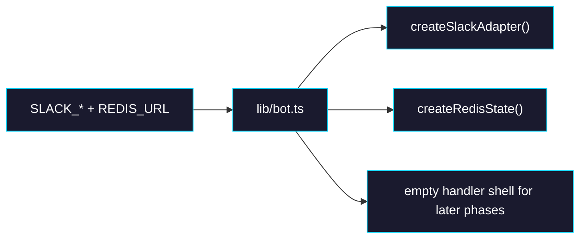

# Phase 2: Slack Bot and Redis State

> **GitHub Issue:** TBD · **Epic:** [AGENTS.md](./AGENTS.md)
> **Dependencies:** Phase 0
> **Parallel with:** Phase 1
> **Blocks:** Phase 3, Phase 4

## Objective

This phase adds the Chat SDK `Chat` instance for Slack and wires it to Redis-backed state. It defines the adapter, logger, key prefix, and bot username policy, but does not yet implement the actual Slack conversation logic.

## What You're Building



## Deliverables

### 1. [`apps/chat-app/lib/bot.ts`](/Users/satoshi/repo/giselles-ai/agent-container/apps/chat-app/lib/bot.ts)

Create the Chat SDK bot shell:

```ts
import { createSlackAdapter } from "@chat-adapter/slack";
import { createRedisState } from "@chat-adapter/state-redis";
import { Chat } from "chat";

function requiredEnv(name: string): string {
  const value = process.env[name]?.trim();
  if (!value) {
    throw new Error(`Missing required environment variable: ${name}`);
  }
  return value;
}

const botUserName = process.env.SLACK_BOT_USERNAME?.trim() || "giselle";

export const bot = new Chat({
  userName: botUserName,
  adapters: {
    slack: createSlackAdapter({
      botToken: requiredEnv("SLACK_BOT_TOKEN"),
      signingSecret: requiredEnv("SLACK_SIGNING_SECRET"),
    }),
  },
  state: createRedisState({
    url: requiredEnv("REDIS_URL"),
    keyPrefix: "chat-app-slack",
  }),
  logger: "info",
});
```

Rules:
- Stay in single-workspace mode. Do not add OAuth callback flow in this epic.
- Use a stable key prefix, not the Chat SDK default.
- Fail fast on missing env vars rather than silently creating a half-configured bot.

### 2. Handler placeholders

Register no-op or temporary handlers only if needed to satisfy type structure, but do not ship misleading behavior such as echo responses.

Preferred approach:

```ts
// Handlers will be registered in Phase 4 once shared runtime and
// history assembly are both available.
```

If the file must compile with imported helpers added later, keep the imports minimal.

### 3. Env and behavior table inside code comments or nearby docs

| Setting | Value |
|---|---|
| Adapter count | One: `slack` |
| State adapter | Redis |
| Redis key prefix | `chat-app-slack` |
| Lock behavior | Default `drop` unless a concrete need to override appears |
| Fallback streaming placeholder | Leave default; Slack uses native streaming anyway |

## Verification

1. **Automated checks**
   Run `pnpm --filter chat-app typecheck`
   Run `pnpm --filter chat-app lint`

2. **Manual test scenarios**
   1. Open [`apps/chat-app/lib/bot.ts`](/Users/satoshi/repo/giselles-ai/agent-container/apps/chat-app/lib/bot.ts) → confirm only Slack adapter is registered → no Teams/Discord/GitHub code exists.
   2. Review env handling → missing `REDIS_URL` or Slack secrets should throw immediately during bot construction, not fail later inside a webhook.

## Files to Create/Modify

| File | Action |
|---|---|
| [`apps/chat-app/lib/bot.ts`](/Users/satoshi/repo/giselles-ai/agent-container/apps/chat-app/lib/bot.ts) | **Create** |

## Done Criteria

- [ ] `lib/bot.ts` creates a single-platform Slack Chat SDK bot
- [ ] Redis state uses an explicit key prefix
- [ ] Required env vars are validated eagerly
- [ ] No OAuth or multi-workspace Slack logic is introduced
- [ ] `pnpm --filter chat-app typecheck` passes
- [ ] `pnpm --filter chat-app lint` passes
- [ ] Update the status in [AGENTS.md](./AGENTS.md) to `✅ DONE`
