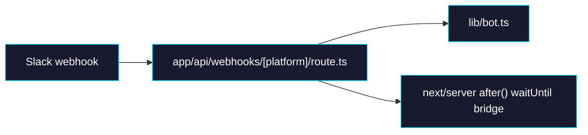

# Phase 3: Webhook Route

> **GitHub Issue:** TBD · **Epic:** [AGENTS.md](./AGENTS.md)
> **Dependencies:** Phase 2
> **Parallel with:** None
> **Blocks:** Phase 4

## Objective

This phase exposes the Slack webhook endpoint through the Next.js App Router. The route should be generic over the platform key even though only Slack is registered now, because that matches Chat SDK's typed `webhooks` API and keeps future platform expansion cheap without complicating the current implementation.

## What You're Building



## Deliverables

### 1. [`apps/chat-app/app/api/webhooks/[platform]/route.ts`](/Users/satoshi/repo/giselles-ai/agent-container/apps/chat-app/app/api/webhooks/[platform]/route.ts)

Create the webhook route using the Chat SDK example pattern:

```ts
import { after } from "next/server";
import { bot } from "@/lib/bot";

type Platform = keyof typeof bot.webhooks;

export async function POST(
  request: Request,
  { params }: { params: Promise<{ platform: string }> },
): Promise<Response> {
  const { platform } = await params;
  const handler = bot.webhooks[platform as Platform];

  if (!handler) {
    return new Response(`Unknown platform: ${platform}`, { status: 404 });
  }

  return handler(request, {
    waitUntil: (task) => after(() => task),
  });
}

export async function GET(
  _request: Request,
  { params }: { params: Promise<{ platform: string }> },
): Promise<Response> {
  const { platform } = await params;

  if (!(platform in bot.webhooks)) {
    return new Response(`Unknown platform: ${platform}`, { status: 404 });
  }

  return new Response(`${platform} webhook endpoint is active`, {
    status: 200,
  });
}
```

Notes:
- `POST` is mandatory. `GET` is optional but useful as a health check.
- Preserve the `after()` bridge because the docs and example rely on background completion after the HTTP response.
- Do not couple this route to browser auth or database logic.

### 2. Webhook contract notes

Document these invariants in comments or the phase PR:

| Invariant | Reason |
|---|---|
| Route path is `/api/webhooks/slack` | Matches Slack manifest request URL |
| Unknown platform returns `404` | Safer than silently accepting bad routes |
| `waitUntil` is always passed | Prevents premature termination on serverless runtimes |

## Verification

1. **Automated checks**
   Run `pnpm --filter chat-app typecheck`
   Run `pnpm --filter chat-app lint`

2. **Manual test scenarios**
   1. `GET /api/webhooks/slack` → returns `200` → response body says webhook endpoint is active.
   2. `GET /api/webhooks/unknown` → returns `404` → unknown platform is surfaced clearly.
   3. `POST /api/webhooks/slack` with a valid Slack event later in Phase 4 → handler should be reached without route-level auth errors.

## Files to Create/Modify

| File | Action |
|---|---|
| [`apps/chat-app/app/api/webhooks/[platform]/route.ts`](/Users/satoshi/repo/giselles-ai/agent-container/apps/chat-app/app/api/webhooks/[platform]/route.ts) | **Create** |

## Done Criteria

- [ ] Webhook route exists at `/api/webhooks/[platform]`
- [ ] Route delegates to `bot.webhooks[platform]`
- [ ] Unknown platforms return `404`
- [ ] `waitUntil` is bridged through `after()`
- [ ] `pnpm --filter chat-app typecheck` passes
- [ ] `pnpm --filter chat-app lint` passes
- [ ] Update the status in [AGENTS.md](./AGENTS.md) to `✅ DONE`
