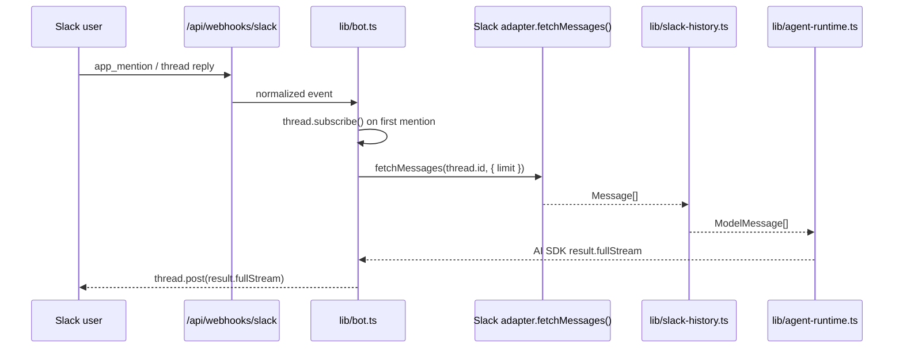

# Phase 4: Slack Conversation Flow

> **GitHub Issue:** TBD · **Epic:** [AGENTS.md](./AGENTS.md)
> **Dependencies:** Phase 1, Phase 2, Phase 3
> **Parallel with:** None
> **Blocks:** Phase 5

## Objective

This phase makes the Slack bot actually useful. It subscribes to mentioned threads, fetches recent Slack history for context, converts that history into AI SDK model messages, calls the shared Giselle runtime, and streams the text response back to Slack. No database persistence is added for Slack messages.

## What You're Building



## Deliverables

### 1. [`apps/chat-app/lib/slack-history.ts`](/Users/satoshi/repo/giselles-ai/agent-container/apps/chat-app/lib/slack-history.ts)

Create a focused helper for history collection and conversion:

```ts
import { toAiMessages, type AiMessage } from "chat";
import type { Thread } from "chat";

const DEFAULT_HISTORY_LIMIT = Number.parseInt(
  process.env.SLACK_HISTORY_LIMIT ?? "20",
  10,
);

export async function buildSlackPromptHistory(
  thread: Thread,
): Promise<AiMessage[]> {
  const result = await thread.adapter.fetchMessages(thread.id, {
    limit: Number.isFinite(DEFAULT_HISTORY_LIMIT) ? DEFAULT_HISTORY_LIMIT : 20,
  });

  return toAiMessages(result.messages);
}

export function createSlackSessionId(threadId: string): string {
  return `slack:${threadId}`;
}
```

Rules:
- Keep the helper Slack-path specific.
- Do not write to Drizzle tables here.
- Let Chat SDK's `toAiMessages()` handle normalization instead of reimplementing role mapping.

### 2. [`apps/chat-app/lib/bot.ts`](/Users/satoshi/repo/giselles-ai/agent-container/apps/chat-app/lib/bot.ts)

Add the actual handlers:

```ts
import { buildSlackPromptHistory, createSlackSessionId } from "@/lib/slack-history";
import { runAgent } from "@/lib/agent-runtime";

bot.onNewMention(async (thread) => {
  await thread.subscribe();

  const history = await buildSlackPromptHistory(thread);
  const result = runAgent({
    messages: history,
    sessionId: createSlackSessionId(thread.id),
  });

  await thread.post(result.fullStream);
});

bot.onSubscribedMessage(async (thread) => {
  const history = await buildSlackPromptHistory(thread);
  const result = runAgent({
    messages: history,
    sessionId: createSlackSessionId(thread.id),
  });

  await thread.post(result.fullStream);
});
```

Implementation details:
- `onNewMention` must call `thread.subscribe()` before returning.
- `onSubscribedMessage` must not re-subscribe; it assumes the state adapter already tracks the thread.
- Use `result.fullStream`, not `textStream`, because Chat SDK docs explicitly prefer `fullStream` for step separation.
- Keep replies text-only. Do not emit cards, `StreamChunk`, or JSON Render payloads.

### 3. Error handling policy

Wrap the runtime call to prevent silent failures:

```ts
try {
  // history + runAgent + thread.post
} catch (error) {
  console.error("Slack bot response failed", error);
  await thread.post("I hit an error while processing that message.");
}
```

Minimal policy table:

| Failure | Bot behavior |
|---|---|
| Redis unavailable at startup | throw on initialization |
| Slack history fetch fails | catch and reply with a generic error |
| Agent runtime fails | catch and reply with a generic error |
| Unknown webhook route | already handled in Phase 3 |

### 4. Non-goal guardrail

Confirm that [`apps/chat-app/app/api/chat/route.ts`](/Users/satoshi/repo/giselles-ai/agent-container/apps/chat-app/app/api/chat/route.ts) remains the only place where `chat` and `message` DB tables are touched for conversations. Phase 4 must not import Drizzle or app DB schema into Slack-specific files.

## Verification

1. **Automated checks**
   Run `pnpm --filter chat-app typecheck`
   Run `pnpm --filter chat-app lint`

2. **Manual test scenarios**
   1. Slack channel, bot invited, first `@mention` in a fresh thread → bot subscribes and streams a text reply → subsequent plain replies in the same thread trigger responses without re-mentioning.
   2. Slack thread with several recent messages → bot reply reflects the recent context → context comes from `fetchMessages`, not app DB.
   3. Simulated runtime failure → bot posts the generic error text → webhook does not crash silently.
   4. Browser chat still works → sending a message in the web UI still persists chat records and renders JSON UI parts.

## Files to Create/Modify

| File | Action |
|---|---|
| [`apps/chat-app/lib/slack-history.ts`](/Users/satoshi/repo/giselles-ai/agent-container/apps/chat-app/lib/slack-history.ts) | **Create** |
| [`apps/chat-app/lib/bot.ts`](/Users/satoshi/repo/giselles-ai/agent-container/apps/chat-app/lib/bot.ts) | **Modify** (add handlers, runtime invocation, and error handling) |

## Done Criteria

- [ ] First Slack mention subscribes the thread and returns an AI reply
- [ ] Subscribed thread replies continue the conversation without a new mention
- [ ] Slack prompt history is assembled from `fetchMessages()`
- [ ] Slack session ID uses the `slack:${thread.id}` convention
- [ ] No Slack transcript writes are added to the app database
- [ ] `pnpm --filter chat-app typecheck` passes
- [ ] `pnpm --filter chat-app lint` passes
- [ ] Update the status in [AGENTS.md](./AGENTS.md) to `✅ DONE`
