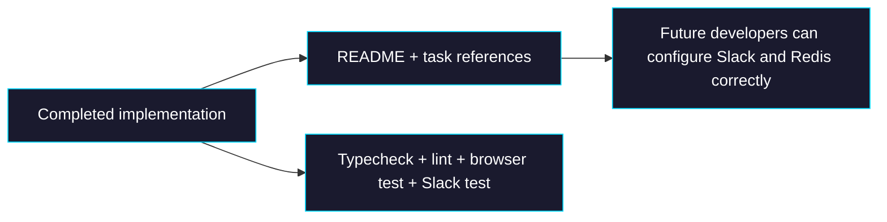

# Phase 5: Documentation and Verification

> **GitHub Issue:** TBD · **Epic:** [AGENTS.md](./AGENTS.md)
> **Dependencies:** Phase 4
> **Parallel with:** None
> **Blocks:** None

## Objective

This phase closes the loop: document how the Slack integration is configured and tested, record the exact external references used to justify the design, and verify that both chat surfaces behave correctly without regressing the existing browser flow.

## What You're Building



## Deliverables

### 1. [`apps/chat-app/README.md`](/Users/satoshi/repo/giselles-ai/agent-container/apps/chat-app/README.md)

Ensure the README ends in a usable operator guide. It should include:

```md
## Slack Setup

1. Configure `SLACK_BOT_TOKEN`, `SLACK_SIGNING_SECRET`, and `REDIS_URL`
2. Expose `POST /api/webhooks/slack`
3. Set Slack Event Subscriptions and Interactivity URLs to that endpoint
4. Invite the bot to a channel
5. Mention the bot to subscribe the thread
6. Continue replying in-thread for multi-turn conversation
```

Also include a concise limitation note:

```md
Current Slack integration streams text replies only.
Slack conversation transcripts are not persisted to the app database.
```

### 2. Verification checklist artifact

Record these exact checks in the docs or phase completion note:

| Check | Expected result |
|---|---|
| `pnpm --filter chat-app typecheck` | passes |
| `pnpm --filter chat-app lint` | passes |
| Browser UI chat | unchanged behavior |
| `GET /api/webhooks/slack` | returns healthy response |
| First Slack mention | subscribes thread and replies |
| Follow-up Slack reply | bot continues conversation |

### 3. Reference appendix

Preserve the design references in the implementation notes or README:

| Reference | Why it was used |
|---|---|
| [Chat SDK Streaming](https://chat-sdk.dev/docs/streaming) | `fullStream` recommendation and `thread.post()` behavior |
| [Chat SDK State Overview](https://chat-sdk.dev/docs/state) | Redis responsibility boundaries |
| [Slack Next.js Guide](https://chat-sdk.dev/docs/guides/slack-nextjs) | Next.js route and Slack wiring pattern |
| [`opensrc/repos/github.com/vercel/chat/examples/nextjs-chat/src/lib/bot.tsx`](/Users/satoshi/repo/giselles-ai/agent-container/opensrc/repos/github.com/vercel/chat/examples/nextjs-chat/src/lib/bot.tsx) | Local source mirror for event-handler patterns |
| [`opensrc/repos/github.com/vercel/chat/packages/chat/src/from-full-stream.ts`](/Users/satoshi/repo/giselles-ai/agent-container/opensrc/repos/github.com/vercel/chat/packages/chat/src/from-full-stream.ts) | Local proof that AI SDK `fullStream` is supported |

## Verification

1. **Automated checks**
   Run `pnpm --filter chat-app typecheck`
   Run `pnpm --filter chat-app lint`

2. **Manual test scenarios**
   1. Browser login and existing chat flow → action: open browser chat and send a message → expected: DB-backed web chat still works exactly as before.
   2. Slack health check → action: request `GET /api/webhooks/slack` → expected: route responds successfully.
   3. Slack first-touch conversation → action: mention bot in a channel thread → expected: bot subscribes and streams a text response.
   4. Slack continuation → action: post a normal reply in the same thread → expected: `onSubscribedMessage` handles it without another mention.
   5. Regression guard → action: inspect logs and database writes → expected: Slack path does not create `chat` or `message` table records.

## Files to Create/Modify

| File | Action |
|---|---|
| [`apps/chat-app/README.md`](/Users/satoshi/repo/giselles-ai/agent-container/apps/chat-app/README.md) | **Modify** (final Slack setup and verification guidance) |
| [`tasks/chat-app-slack-chat-sdk/AGENTS.md`](/Users/satoshi/repo/giselles-ai/agent-container/tasks/chat-app-slack-chat-sdk/AGENTS.md) | **Modify** (status updates as phases complete) |

## Done Criteria

- [ ] README contains Slack setup, webhook endpoint, and limitation notes
- [ ] Verification checklist has been run or explicitly marked pending with reason
- [ ] Browser chat regression has been checked manually
- [ ] Slack multi-turn flow has been checked manually
- [ ] No Slack transcript DB persistence was introduced
- [ ] `pnpm --filter chat-app typecheck` passes
- [ ] `pnpm --filter chat-app lint` passes
- [ ] Update the status in [AGENTS.md](./AGENTS.md) to `✅ DONE`
