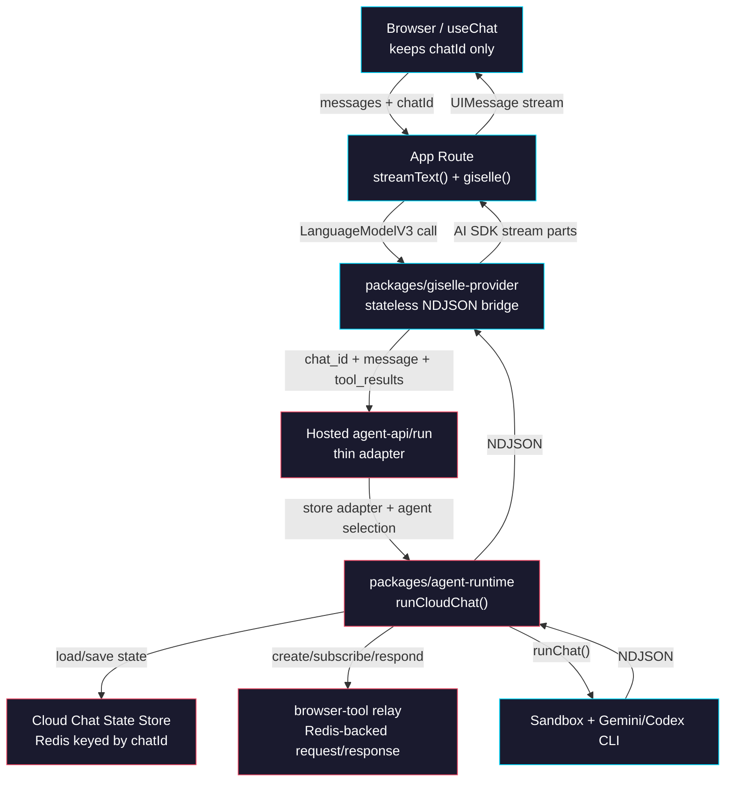
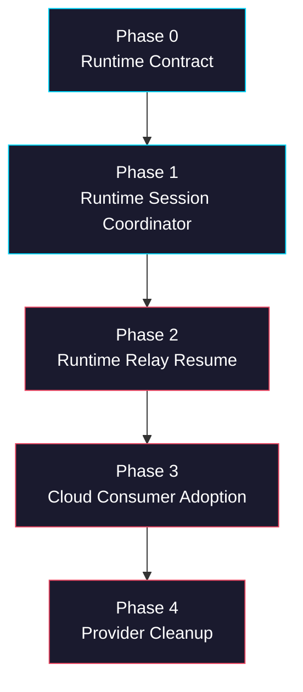

# Epic: Cloud-Owned Chat State in Agent Runtime

> **GitHub Epic:** TBD · **Sub-issues:** TBD (Phases 0–4)

## Goal

Move chat session ownership out of `@giselles-ai/giselle-provider` and into `@giselles-ai/agent-runtime`. After this epic is complete, the only cross-request identifier the browser and provider carry is the AI SDK `chatId`. `agent-runtime` owns the state model, relay resume flow, and same-instance live-connection handling; the hosted Cloud route is a thin adapter that supplies Redis storage, auth, rate limiting, and agent selection.

## Why

The previous plan pointed implementation at the wrong legacy area and led Codex to add business logic in the wrong place. The real long-term seam is `@giselles-ai/agent-runtime`: that is where the shared session coordinator should live, and where `giselles-ai/giselle` should consume it.

- `@giselles-ai/giselle-provider` should not own relay credentials, pending tool bookkeeping, or cross-request resume state.
- The browser should not round-trip opaque runtime fields like `sandbox_id` or `relay_token`.
- `agent-runtime` already owns the sandbox and CLI orchestration boundary, so chat state belongs there.
- The hosted Cloud route should stay small: validate input, select the agent, provide Redis storage, call runtime.
- Relay request subscription and tool-result resume are Cloud/runtime concerns because the browser tool is Cloud-owned.

## Architecture Overview



## Package / Directory Structure

```text
tasks/
└── cloud-owned-chat-state/                          # NEW epic plan
    ├── AGENTS.md
    ├── phase-0-runtime-contract.md
    ├── phase-1-runtime-session-coordinator.md
    ├── phase-2-runtime-relay-resume.md
    ├── phase-3-cloud-consumer-adoption.md
    └── phase-4-provider-cleanup.md

packages/
├── agent-runtime/
│   └── src/
│       ├── cloud-chat-state.ts                     # NEW - chat_id state types + reducers
│       ├── cloud-chat.ts                           # NEW - chat coordinator entrypoint
│       ├── cloud-chat-relay.ts                     # NEW - relay request/response helpers
│       ├── cloud-chat-live.ts                      # NEW - same-instance live connection cache
│       ├── chat-run.ts                             # EXISTING - sandbox runner reused by cloud-chat
│       ├── agents/
│       │   ├── gemini-agent.ts                     # EXISTING - unchanged agent command factory
│       │   └── codex-agent.ts                      # EXISTING - unchanged agent command factory
│       └── index.ts                                # EXISTING - export new Cloud APIs
├── browser-tool/
│   └── src/relay/
│       ├── index.ts                                # EXISTING - widen public server-side relay surface
│       ├── request-subscription.ts                 # NEW - public relay subscription/response wrapper
│       └── relay-store.ts                          # EXISTING - Redis primitives reused internally
└── giselle-provider/
    └── src/
        ├── giselle-agent-model.ts                  # EXISTING - simplify to stateless bridge
        ├── types.ts                                # EXISTING - chat_id + tool_results contract
        ├── ndjson-mapper.ts                        # EXISTING - keep NDJSON -> AI SDK mapping
        ├── index.ts                                # EXISTING - remove session-state exports
        ├── session-state.ts                        # DELETED
        ├── session-manager.ts                      # DELETED
        └── relay-http.ts                           # DELETED

apps/
├── demo/
│   └── app/
│       ├── api/chat/route.ts                       # EXISTING - stop reconstructing session state
│       └── _lib/giselle-chat-transport.ts          # EXISTING - stop injecting sessionState
└── minimum-demo/
    └── app/
        ├── chat/route.ts                           # EXISTING - same cleanup as demo
        └── _lib/giselle-chat-transport.ts          # EXISTING - same cleanup as demo

giselles-ai/giselle/                                # UPSTREAM consumer repo, not this workspace
└── apps/studio.giselles.ai/app/agent-api/
    ├── _lib/chat-state-store.ts                    # NEW - Redis adapter over agent-runtime store interface
    ├── run/route.ts                                # EXISTING - thin adapter around runCloudChat()
    └── relay/[[...relay]]/route.ts                 # EXISTING - relay endpoint stays in browser-tool

opensrc/repos/github.com/giselles-ai/giselle/       # READ-ONLY source reference
└── ...                                             # Use for reading only, never as the implementation target
```

## Task Dependency Graph



- Phase 0 defines the pure types and reducer rules all later phases use.
- Phase 1 creates the runtime-owned session coordinator, but explicitly stops before tool resume.
- Phase 2 moves relay subscription and tool-result resume into runtime.
- Phase 3 is the downstream Cloud consumer patch in `giselles-ai/giselle`.
- Phase 4 removes the now-obsolete provider and demo-layer state plumbing.

## Task Status

| Phase | Task File | Status | Description |
|---|---|---|---|
| 0 | [phase-0-runtime-contract.md](./phase-0-runtime-contract.md) | ✅ DONE | Define chat_id request contract, state schema, and pure reducers in `agent-runtime` |
| 1 | [phase-1-runtime-session-coordinator.md](./phase-1-runtime-session-coordinator.md) | 🔲 TODO | Add `runCloudChat()` and persist state updates around `runChat()` |
| 2 | [phase-2-runtime-relay-resume.md](./phase-2-runtime-relay-resume.md) | 🔲 TODO | Move relay subscription, pending tool state, and tool-result resume into runtime |
| 3 | [phase-3-cloud-consumer-adoption.md](./phase-3-cloud-consumer-adoption.md) | 🔲 TODO | Wire the hosted `agent-api/run` route to `runCloudChat()` with a Redis adapter |
| 4 | [phase-4-provider-cleanup.md](./phase-4-provider-cleanup.md) | 🔲 TODO | Remove provider-owned session state and simplify demo transports/routes |

> **How to work on this epic:** Read this file first to understand the full architecture.
> Then check the status table above. Pick the first `🔲 TODO` task whose dependencies
> (see dependency graph) are `✅ DONE`. Open that task file and follow its instructions.
> When done, update the status in this table to `✅ DONE`.

## Key Conventions

- The monorepo uses `pnpm` workspaces and `turbo`; package-local validation still uses the package scripts directly.
- `packages/agent-runtime` is the primary implementation target for this epic.
- `packages/browser-tool/src/relay` remains the source of Redis-backed relay primitives; runtime should consume a public relay surface, not deep-import app-specific code.
- `packages/giselle-provider` should only translate prompt/tool-result input into Cloud requests and translate NDJSON back to AI SDK parts.
- `opensrc/` is read-only source reference. Do not implement the feature there.
- Use generic `agentSessionId` naming in runtime state, not `geminiSessionId`, because the same flow applies to Gemini and Codex.

## Existing Code Reference

| File | Relevance |
|---|---|
| `README.md` | Confirms `@giselles-ai/agent-runtime` is the current runtime package naming and architecture |
| `packages/agent-runtime/src/chat-run.ts` | Current sandbox orchestration primitive that `runCloudChat()` should wrap |
| `packages/agent-runtime/src/agents/gemini-agent.ts` | Shows current request fields and browser relay env injection for Gemini |
| `packages/agent-runtime/src/agents/codex-agent.ts` | Shows current request fields and browser relay env injection for Codex |
| `packages/browser-tool/src/relay/index.ts` | Current public relay export surface that needs widening |
| `packages/browser-tool/src/relay/relay-store.ts` | Canonical Redis relay behavior, pending request lifecycle, and response validation |
| `packages/browser-tool/src/relay/relay-handler.ts` | Example of how the relay package consumes its own internal primitives |
| `packages/giselle-provider/src/giselle-agent-model.ts` | Current provider-owned resume logic that will be removed in Phase 4 |
| `packages/giselle-provider/src/ndjson-mapper.ts` | Existing NDJSON event mapping that should remain intact |
| `apps/demo/app/api/chat/route.ts` | Current route reconstructing session state from provider metadata |
| `apps/demo/app/_lib/giselle-chat-transport.ts` | Current client transport injecting provider-owned session state |
| `opensrc/repos/github.com/giselles-ai/giselle/apps/studio.giselles.ai/app/agent-api/run/route.ts` | Read-only reference for the downstream Cloud consumer route |

## Domain-Specific Reference

### Responsibility Split

| Layer | Owns | Must Not Own |
|---|---|---|
| Browser / `useChat` | `chatId`, user messages, tool outputs | `session_id`, `sandbox_id`, relay credentials, pending request bookkeeping |
| `@giselles-ai/giselle-provider` | Prompt extraction, tool-result extraction, NDJSON -> AI SDK mapping | Redis state, relay subscribe/respond, hot/cold resume |
| `@giselles-ai/agent-runtime` | Chat state reducer, session coordinator, live connection cache, relay request/response mapping | API auth, rate limiting, Redis client configuration |
| Hosted `agent-api/run` route | Auth, rate limit, request validation, Redis adapter, agent selection | Chat state machine logic |
| `@giselles-ai/browser-tool/relay` | Redis-backed relay transport primitives | Chat-level state keyed by `chatId` |

### End-State Stored Session Record

| Field | Purpose | Owner |
|---|---|---|
| `chatId` | Stable key shared by browser, provider, and Cloud | Browser + runtime |
| `agentSessionId` | Resume identifier for Gemini/Codex CLI session | Runtime |
| `sandboxId` | Reuse the existing sandbox across requests | Runtime |
| `relay.sessionId` | Relay session identifier for browser tool traffic | Runtime |
| `relay.token` | Relay authorization token | Runtime |
| `relay.url` | Hosted relay endpoint | Runtime |
| `relay.expiresAt` | Relay freshness check | Runtime |
| `pendingTool.requestId` | Match tool results to the paused relay request | Runtime |
| `pendingTool.requestType` | Distinguish snapshot vs execute response shape | Runtime |
| `pendingTool.toolName` | Match AI SDK tool result to relay response mapping | Runtime |
| `updatedAt` | TTL refresh / debugging | Runtime + store adapter |

### Request Contract Delta

| Area | Current Provider-Managed Design | End State |
|---|---|---|
| Cross-request key | `providerSessionId` plus provider metadata | `chat_id` only |
| Follow-up resume | Client round-trips `sessionState` | Runtime loads state from Cloud Redis |
| Tool resume | Provider subscribes to relay and posts `relay.respond` | Runtime subscribes and responds |
| Cloud route | Creates relay session and streams `runChat()` directly | Calls `runCloudChat()` and supplies store adapter |
| Demo transports | Inject hidden metadata into request body | Send plain AI SDK request body keyed by `id` |
