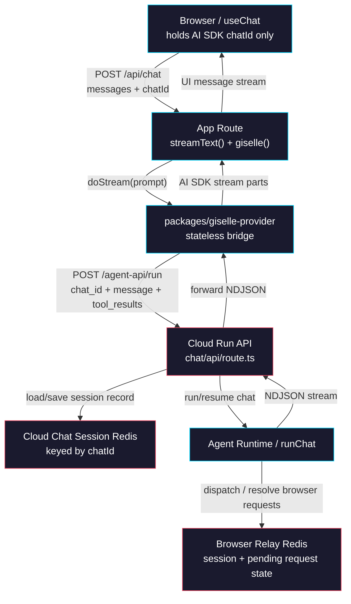
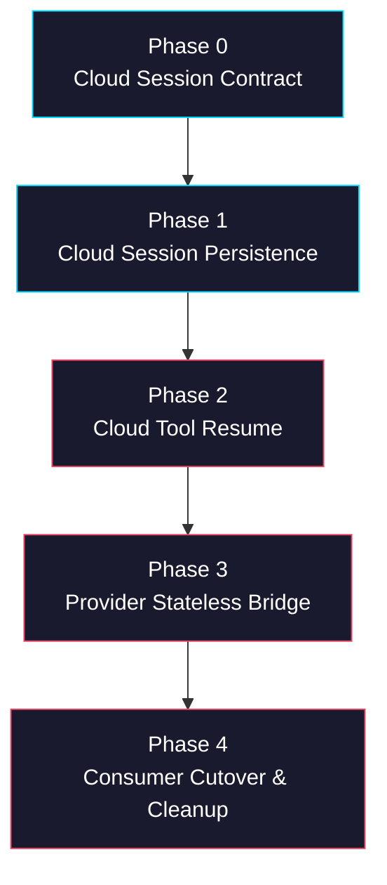

# Epic: Cloud-Owned Chat State & Tool Resume

> **GitHub Epic:** TBD · **Sub-issues:** TBD (Phases 0–4)

## Goal

Move chat session ownership out of `@giselles-ai/giselle-provider` and into the Cloud run API. After this epic is complete, the AI SDK `chatId` is the only cross-request identifier the client and provider need to carry. The Cloud API stores and resumes all opaque execution state in Redis, including `session_id`, `sandbox_id`, relay credentials, and the currently pending browser tool call. The provider becomes a stateless NDJSON-to-AI-SDK bridge that forwards `chat_id`, `message`, and client tool results to Cloud.

## Why

The current design spreads one logical session across three layers: the browser, the provider, and the Cloud API. That creates two failure modes at once: provider-local state can be lost across instances, and client round-tripping can silently drop opaque fields. Moving ownership into Cloud brings the state back to the place that already owns relay infrastructure and tool resume.

- Cloud already has Redis through `@giselles-ai/browser-tool/relay`, so it is the natural place to persist opaque session state.
- The provider should not need to understand relay credentials or pending request bookkeeping.
- The browser should not carry internal runtime state like `relay_token` or `sandbox_id`.
- Cross-instance resume becomes a Cloud concern instead of a provider concern.
- The AI SDK `chatId` can become the single stable key across retries, follow-ups, and tool resumes.
- Hosted `studio.giselles.ai` and the local `sandbox-agent/web` route can converge on the same state model.

## Architecture Overview



## Package / Directory Structure

```text
tasks/
└── cloud-owned-chat-state/                           # NEW epic plan
    ├── AGENTS.md
    ├── phase-0-cloud-session-contract.md
    ├── phase-1-cloud-session-persistence.md
    ├── phase-2-cloud-tool-resume.md
    ├── phase-3-provider-stateless-bridge.md
    └── phase-4-consumer-cutover-cleanup.md

sandbox-agent/web/
└── app/agents/[slug]/snapshots/[snapshotId]/chat/api/
    ├── route.ts                                      # EXISTING - local Cloud run route
    ├── chat-session-state.ts                         # NEW - session record schema + reducers
    ├── chat-session-store.ts                         # NEW - Redis CRUD keyed by chatId
    └── relay-tool-resume.ts                          # NEW - tool_result -> relay response mapping

packages/browser-tool/src/relay/
├── index.ts                                          # EXISTING - export resume helpers for Cloud route
├── relay-store.ts                                    # EXISTING - Redis-backed relay primitives
└── relay-handler.ts                                  # EXISTING - kept as-is

packages/giselle-provider/src/
├── giselle-agent-model.ts                            # EXISTING - simplify to stateless Cloud client
├── ndjson-mapper.ts                                  # EXISTING - keep event -> stream part mapping
├── types.ts                                          # EXISTING - Cloud request payload changes
├── session-state.ts                                  # DELETED - no client round-trip state
├── session-manager.ts                                # DELETED - no provider-owned session store
└── relay-http.ts                                     # DELETED - no provider-owned relay transport

apps/demo/app/
├── api/chat/route.ts                                 # EXISTING - remove metadata/session fallback
└── _lib/giselle-chat-transport.ts                    # EXISTING - stop injecting sessionState

apps/minimum-demo/app/
├── chat/route.ts                                     # EXISTING - same cleanup as demo
└── _lib/giselle-chat-transport.ts                    # EXISTING - same cleanup as demo

opensrc/repos/github.com/giselles-ai/giselle/
└── apps/studio.giselles.ai/app/agent-api/
    ├── run/route.ts                                  # EXISTING REFERENCE - hosted parity target
    └── relay/[[...relay]]/route.ts                   # EXISTING REFERENCE - keep as-is
```

## Task Dependency Graph



- The work is intentionally sequential because each phase removes assumptions from the previous layer.
- Phase 0 defines the contract and store shape used by all later phases.
- Phase 2 is the pivot point where tool resume ownership moves from provider to Cloud.

## Task Status

| Phase | Task File | Status | Description |
|---|---|---|---|
| 0 | [phase-0-cloud-session-contract.md](./phase-0-cloud-session-contract.md) | 🔲 TODO | Define `chat_id` contract and create Cloud Redis session store primitives |
| 1 | [phase-1-cloud-session-persistence.md](./phase-1-cloud-session-persistence.md) | 🔲 TODO | Persist session, sandbox, and relay state in Cloud during streamed runs |
| 2 | [phase-2-cloud-tool-resume.md](./phase-2-cloud-tool-resume.md) | 🔲 TODO | Accept client tool results in Cloud and resolve relay resume internally |
| 3 | [phase-3-provider-stateless-bridge.md](./phase-3-provider-stateless-bridge.md) | 🔲 TODO | Remove provider-owned session state and send only `chat_id` + tool results |
| 4 | [phase-4-consumer-cutover-cleanup.md](./phase-4-consumer-cutover-cleanup.md) | 🔲 TODO | Remove client/session metadata plumbing and delete obsolete provider files |

> **How to work on this epic:** Read this file first to understand the full architecture.
> Then check the status table above. Pick the first `🔲 TODO` task whose dependencies
> (see dependency graph) are `✅ DONE`. Open that task file and follow its instructions.
> When done, update the status in this table to `✅ DONE`.

## Key Conventions

- Monorepo uses `pnpm` workspaces with `turbo` for root builds.
- `packages/giselle-provider` builds with `tsup` and validates with `tsc -p tsconfig.json --noEmit`.
- `sandbox-agent/web` is a Next.js 16 app with `moduleResolution: "bundler"` and `strict: true`.
- `apps/demo` and `apps/minimum-demo` use AI SDK UI (`ai@6.0.68`, `@ai-sdk/react@3.0.70`).
- `packages/browser-tool/src/relay/relay-store.ts` is the canonical Redis + relay behavior reference.
- During migration, keep Cloud request bodies backward-compatible long enough for provider cutover, then remove legacy fields in Phase 4.
- `opensrc/` is a source reference only; local `sandbox-agent/web` is the implementation target in this repo.

## Existing Code Reference

| File | Relevance |
|---|---|
| `packages/giselle-provider/src/giselle-agent-model.ts` | Current provider-owned resume logic that will be deleted or simplified |
| `packages/giselle-provider/src/session-state.ts` | Current client round-trip state payload; replacement target |
| `packages/giselle-provider/src/relay-http.ts` | Current provider-side hosted relay transport; replacement target |
| `packages/giselle-provider/src/ndjson-mapper.ts` | Existing NDJSON event mapping that should survive the migration |
| `packages/browser-tool/src/relay/relay-store.ts` | Redis relay primitives, pending request lifecycle, and authorized session checks |
| `packages/browser-tool/src/relay/index.ts` | Public relay surface that Cloud route should extend instead of duplicating logic |
| `sandbox-agent/web/app/agents/[slug]/snapshots/[snapshotId]/chat/api/route.ts` | Local Cloud run route that should become the single owner of session state |
| `opensrc/repos/github.com/giselles-ai/giselle/apps/studio.giselles.ai/app/agent-api/run/route.ts` | Hosted Cloud route reference that should converge to the same contract |
| `apps/demo/app/api/chat/route.ts` | Current app route still reconstructing session state from request metadata |
| `apps/demo/app/_lib/giselle-chat-transport.ts` | Current transport injecting provider session state into outgoing bodies |

## Domain-Specific Reference

### End-State Ownership Matrix

| Value | Source | Stored By | Sent By Browser | Used By |
|---|---|---|---|---|
| `chatId` | AI SDK `useChat` | Browser + Cloud key | ✅ Yes | Provider and Cloud |
| `session_id` | Cloud `init` event | Cloud Redis | ❌ No | Cloud only |
| `sandbox_id` | Cloud `sandbox` event | Cloud Redis | ❌ No | Cloud only |
| `relay_session_id` | Cloud `relay.session` event | Cloud Redis | ❌ No | Cloud only |
| `relay_token` | Cloud `relay.session` event | Cloud Redis | ❌ No | Cloud only |
| `relay_url` | Cloud `relay.session` event | Cloud Redis | ❌ No | Cloud only |
| `pending_tool_call_id` | Browser-tool request event | Cloud Redis | ❌ No | Cloud only |
| `pending_tool_name` | Browser-tool request event | Cloud Redis | ❌ No | Cloud only |
| `tool_results[]` | Browser `addToolOutput()` | Request body only | ✅ Yes | Cloud only |

### Cloud Request Contract Delta

| Contract Area | Current | End State |
|---|---|---|
| Session key | `session_id` / `sandbox_id` body fields | `chat_id` only |
| Resume state storage | Provider memory + client metadata round-trip | Cloud Redis keyed by `chat_id` |
| Browser tool resume | Provider posts `relay.respond` | Cloud resolves relay response internally |
| Provider responsibility | Session store + relay transport + NDJSON mapping | NDJSON mapping + Cloud request shaping only |
| Browser responsibility | Preserve opaque provider state | Preserve `chatId` and tool outputs only |

### Pending Tool Event Mapping

| Incoming Cloud Event | Client Tool Name | Cloud Redis Pending State |
|---|---|---|
| `snapshot_request` | `getFormSnapshot` | `pending_tool_name = "getFormSnapshot"` |
| `execute_request` | `executeFormActions` | `pending_tool_name = "executeFormActions"` |
| `tool_use` with `tool_name = "getFormSnapshot"` | `getFormSnapshot` | Same as above |
| `tool_use` with `tool_name = "executeFormActions"` | `executeFormActions` | Same as above |

