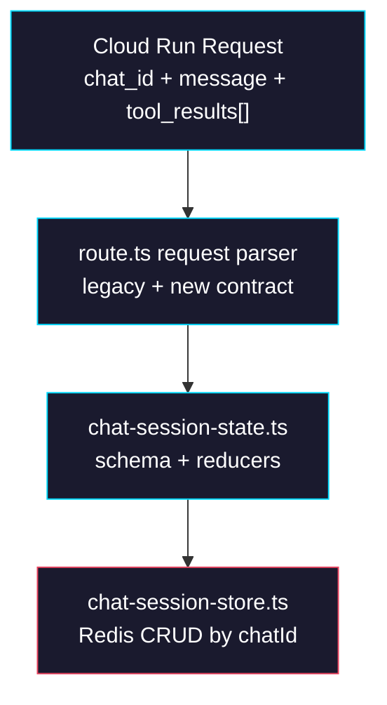

# Phase 0: Cloud Session Contract

> **GitHub Issue:** TBD · **Epic:** [AGENTS.md](./AGENTS.md)
> **Dependencies:** None
> **Parallel with:** None
> **Blocks:** Phase 1

## Objective

Define the Cloud-owned session contract before touching runtime behavior. This phase introduces a Redis-backed chat session record keyed by AI SDK `chatId`, plus request/response schema changes that let Cloud accept client tool results without exposing any opaque state to the browser. The goal is to establish stable types and storage primitives that later phases can wire into the run route.

## What You're Building



## Deliverables

### 1. `sandbox-agent/web/app/agents/[slug]/snapshots/[snapshotId]/chat/api/chat-session-state.ts`

Create a Cloud-owned session schema and event reducer module. This file should be pure and dependency-light so the route can test or reason about state transitions without opening Redis connections.

```ts
import { z } from "zod";

export const cloudToolResultSchema = z.object({
  tool_name: z.string().min(1),
  tool_call_id: z.string().min(1),
  state: z.enum(["output-available", "output-error"]).default("output-available"),
  output: z.unknown().optional(),
  error_text: z.string().optional(),
});

export const cloudChatSessionRecordSchema = z.object({
  chatId: z.string().min(1),
  sessionId: z.string().min(1).optional(),
  sandboxId: z.string().min(1).optional(),
  relaySessionId: z.string().min(1).optional(),
  relayToken: z.string().min(1).optional(),
  relayUrl: z.string().url().optional(),
  pendingToolCallId: z.string().min(1).nullable().optional(),
  pendingToolName: z.string().min(1).nullable().optional(),
  updatedAt: z.number().int().nonnegative(),
});

export type CloudToolResult = z.infer<typeof cloudToolResultSchema>;
export type CloudChatSessionRecord = z.infer<typeof cloudChatSessionRecordSchema>;

export function mergeCloudChatSession(
  base: CloudChatSessionRecord | undefined,
  patch: Partial<CloudChatSessionRecord>,
): CloudChatSessionRecord;

export function reduceStreamEventToSessionPatch(
  event: Record<string, unknown>,
): Partial<CloudChatSessionRecord> | undefined;
```

Required reducer behavior:

| Event | Patch |
|---|---|
| `init` | `sessionId` |
| `sandbox` | `sandboxId` |
| `relay.session` | `relaySessionId`, `relayToken`, `relayUrl` |
| `snapshot_request` | `pendingToolCallId`, `pendingToolName = "getFormSnapshot"` |
| `execute_request` | `pendingToolCallId`, `pendingToolName = "executeFormActions"` |
| `tool_use` for browser-owned tools | Same pending tool fields as above |
| `tool_result` for a pending browser-owned tool | Clear pending fields if the tool was completed within Cloud |

### 2. `sandbox-agent/web/app/agents/[slug]/snapshots/[snapshotId]/chat/api/chat-session-store.ts`

Create a Redis-backed CRUD layer keyed by `chatId`.

```ts
import Redis from "ioredis";
import type { CloudChatSessionRecord } from "./chat-session-state";

export const CLOUD_CHAT_SESSION_TTL_SEC = 10 * 60;

export async function loadCloudChatSession(
  chatId: string,
): Promise<CloudChatSessionRecord | null>;

export async function saveCloudChatSession(
  record: CloudChatSessionRecord,
): Promise<void>;

export async function patchCloudChatSession(
  chatId: string,
  patch: Partial<CloudChatSessionRecord>,
): Promise<CloudChatSessionRecord>;

export async function deleteCloudChatSession(chatId: string): Promise<void>;
```

Redis key convention:

```text
giselle:cloud-chat:{chatId}
```

Use the same env var candidates as `packages/browser-tool/src/relay/relay-store.ts`:

- `REDIS_URL`
- `REDIS_TLS_URL`
- `KV_URL`
- `UPSTASH_REDIS_TLS_URL`
- `UPSTASH_REDIS_URL`

Decision matrix for Redis ownership:

| Option | Pros | Cons | Choose |
|---|---|---|---|
| Export raw Redis client from `browser-tool` | Single client implementation | Leaks browser-tool internals into Cloud state storage | No |
| Add `ioredis` directly in `sandbox-agent/web` | Explicit Cloud ownership, easy testing, no relay package coupling | One extra dependency in app package | Yes |

### 3. `sandbox-agent/web/app/agents/[slug]/snapshots/[snapshotId]/chat/api/route.ts`

Extend request validation so Cloud accepts the future contract while still supporting current fields during migration.

Expected request shape after this phase:

```ts
type ChatRequestBody = {
  message?: string;
  chat_id?: string;
  tool_results?: Array<{
    tool_name: string;
    tool_call_id: string;
    state?: "output-available" | "output-error";
    output?: unknown;
    error_text?: string;
  }>;
  session_id?: string;       // legacy, temporary
  sandbox_id?: string;       // legacy, temporary
  relay_session_id?: string; // legacy, temporary
  relay_token?: string;      // legacy, temporary
  agent_type?: string;
  snapshot_id?: string;
};
```

Migration rule for this phase:

- `chat_id` becomes required for internal logic.
- Legacy fields stay accepted so existing provider calls do not break before Phase 3.
- Route parsing should normalize to one internal object with both `chatId` and legacy fallbacks.

## Verification

1. **Automated checks**
   Run `pnpm --dir sandbox-agent/web exec tsc --noEmit`.
2. **Manual test scenarios**
   1. Missing `chat_id` -> send a POST without `chat_id` -> expect a 400/422 response with a clear validation error.
   2. Invalid `tool_results` payload -> send `tool_results: {}` -> expect request validation failure.
   3. Valid migration payload -> send `chat_id`, `message`, and legacy `session_id` -> expect the request parser to accept it.

## Files to Create/Modify

| File | Action |
|---|---|
| `sandbox-agent/web/app/agents/[slug]/snapshots/[snapshotId]/chat/api/chat-session-state.ts` | **Create** |
| `sandbox-agent/web/app/agents/[slug]/snapshots/[snapshotId]/chat/api/chat-session-store.ts` | **Create** |
| `sandbox-agent/web/app/agents/[slug]/snapshots/[snapshotId]/chat/api/route.ts` | **Modify** (add `chat_id` + `tool_results` request contract) |
| `sandbox-agent/web/package.json` | **Modify** (add `ioredis` if the store owns its own Redis client) |

## Done Criteria

- [ ] Cloud session record schema exists and models pending browser-tool state
- [ ] Redis CRUD module exists and is keyed by `chatId`
- [ ] Cloud route accepts `chat_id` and `tool_results`
- [ ] `pnpm --dir sandbox-agent/web exec tsc --noEmit` passes
- [ ] Update the status in [AGENTS.md](./AGENTS.md) to `✅ DONE`

