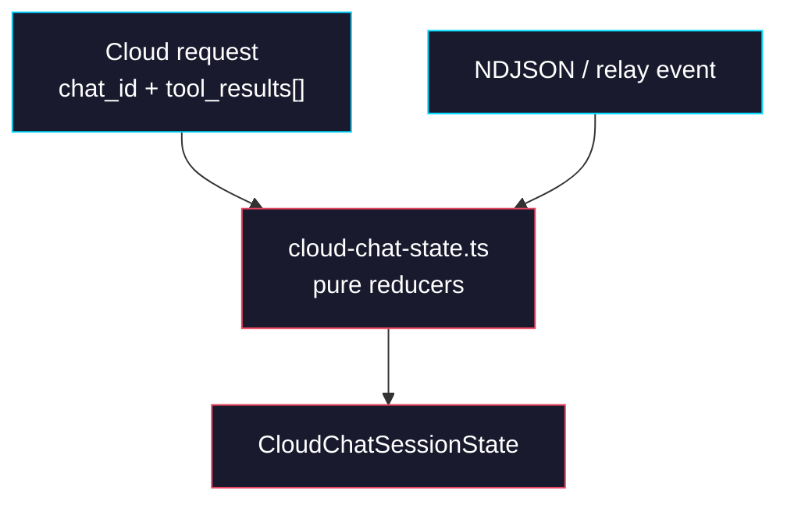

# Phase 0: Runtime Contract

> **GitHub Issue:** TBD · **Epic:** [AGENTS.md](./AGENTS.md)
> **Dependencies:** None
> **Parallel with:** None
> **Blocks:** Phase 1, Phase 2, Phase 3, Phase 4

## Objective

Define the chat-session contract in `packages/agent-runtime` before any Redis or route work starts. This phase creates the shared request types, state schema, and pure reducer helpers that later phases use. It deliberately does not touch the hosted route or provider layers.

## What You're Building



## Deliverables

### 1. `packages/agent-runtime/src/cloud-chat-state.ts`

Create the runtime-owned state model and pure helpers. Keep this file side-effect-free so it can be unit-tested without Redis, Sandbox, or HTTP.

```ts
import type { RelayRequest } from "@giselles-ai/browser-tool";
import type { BaseChatRequest } from "./chat-run";

export type CloudToolName = "getFormSnapshot" | "executeFormActions";

export type CloudToolResult = {
  toolCallId: string;
  toolName: CloudToolName;
  output: unknown;
};

export type CloudChatRequest = BaseChatRequest & {
  chat_id: string;
  tool_results?: CloudToolResult[];
};

export type CloudRelaySession = {
  sessionId: string;
  token: string;
  url: string;
  expiresAt: number;
};

export type PendingToolState = {
  requestId: string;
  requestType: RelayRequest["type"];
  toolName: CloudToolName;
};

export type CloudChatSessionState = {
  chatId: string;
  agentSessionId?: string;
  sandboxId?: string;
  relay?: CloudRelaySession;
  pendingTool?: PendingToolState | null;
  updatedAt: number;
};

export type CloudChatSessionPatch = {
  agentSessionId?: string;
  sandboxId?: string;
  relay?: CloudRelaySession;
  pendingTool?: PendingToolState | null;
};

export interface CloudChatStateStore {
  load(chatId: string): Promise<CloudChatSessionState | null>;
  save(state: CloudChatSessionState): Promise<void>;
  delete(chatId: string): Promise<void>;
}

export function toolNameFromRelayRequest(
  request: RelayRequest,
): CloudToolName {
  return request.type === "snapshot_request"
    ? "getFormSnapshot"
    : "executeFormActions";
}

export function reduceCloudChatEvent(
  event: Record<string, unknown>,
): CloudChatSessionPatch | null {
  if (event.type === "init" && typeof event.session_id === "string") {
    return { agentSessionId: event.session_id };
  }

  if (event.type === "sandbox" && typeof event.sandbox_id === "string") {
    return { sandboxId: event.sandbox_id };
  }

  if (
    event.type === "relay.session" &&
    typeof event.sessionId === "string" &&
    typeof event.token === "string" &&
    typeof event.relayUrl === "string" &&
    typeof event.expiresAt === "number"
  ) {
    return {
      relay: {
        sessionId: event.sessionId,
        token: event.token,
        url: event.relayUrl,
        expiresAt: event.expiresAt,
      },
    };
  }

  if (
    (event.type === "snapshot_request" || event.type === "execute_request") &&
    typeof event.requestId === "string"
  ) {
    return {
      pendingTool: {
        requestId: event.requestId,
        requestType: event.type,
        toolName:
          event.type === "snapshot_request"
            ? "getFormSnapshot"
            : "executeFormActions",
      },
    };
  }

  return null;
}

export function applyCloudChatPatch(input: {
  chatId: string;
  now: number;
  base?: CloudChatSessionState | null;
  patch?: CloudChatSessionPatch | null;
}): CloudChatSessionState {
  return {
    chatId: input.chatId,
    agentSessionId: input.patch?.agentSessionId ?? input.base?.agentSessionId,
    sandboxId: input.patch?.sandboxId ?? input.base?.sandboxId,
    relay: input.patch?.relay ?? input.base?.relay,
    pendingTool:
      input.patch?.pendingTool !== undefined
        ? input.patch.pendingTool
        : input.base?.pendingTool,
    updatedAt: input.now,
  };
}
```

Use the reducer rules below exactly.

| Incoming event | Patch result |
|---|---|
| `init.session_id` | Set `agentSessionId` |
| `sandbox.sandbox_id` | Set `sandboxId` |
| `relay.session` | Replace the whole `relay` object |
| `snapshot_request` | Set `pendingTool` to `getFormSnapshot` |
| `execute_request` | Set `pendingTool` to `executeFormActions` |
| Any other event | No patch |

### 2. `packages/agent-runtime/src/cloud-chat-state.test.ts`

Add unit tests around the pure helpers before any coordinator code is introduced.

```ts
describe("cloud-chat-state", () => {
  it("maps init events to agentSessionId patches", () => {});
  it("maps sandbox events to sandboxId patches", () => {});
  it("maps relay.session events to relay patches", () => {});
  it("maps snapshot_request to getFormSnapshot pending state", () => {});
  it("maps execute_request to executeFormActions pending state", () => {});
  it("preserves chatId while applying patches", () => {});
  it("supports clearing pendingTool with null", () => {});
});
```

The tests should assert the generic `agentSessionId` naming. Do not reintroduce `geminiSessionId`.

### 3. `packages/agent-runtime/src/index.ts`

Export the new contract surface from the package root.

```ts
export {
  applyCloudChatPatch,
  reduceCloudChatEvent,
  toolNameFromRelayRequest,
  type CloudChatRequest,
  type CloudChatSessionPatch,
  type CloudChatSessionState,
  type CloudChatStateStore,
  type CloudRelaySession,
  type CloudToolName,
  type CloudToolResult,
  type PendingToolState,
} from "./cloud-chat-state";
```

Keep the existing `runChat`, `createGeminiAgent`, and `createCodexAgent` exports untouched.

## Verification

1. **Automated checks**
   Run:
   ```bash
   pnpm --filter @giselles-ai/agent-runtime typecheck
   pnpm --filter @giselles-ai/agent-runtime test
   pnpm --filter @giselles-ai/agent-runtime build
   ```
2. **Manual test scenarios**
   1. `init` event object -> `reduceCloudChatEvent()` -> patch contains only `agentSessionId`
   2. `snapshot_request` event object -> `reduceCloudChatEvent()` -> patch contains `pendingTool.toolName = "getFormSnapshot"`
   3. Existing state + `{ pendingTool: null }` patch -> `applyCloudChatPatch()` -> returned state clears `pendingTool` but keeps `chatId`

## Files to Create/Modify

| File | Action |
|---|---|
| `packages/agent-runtime/src/cloud-chat-state.ts` | **Create** |
| `packages/agent-runtime/src/cloud-chat-state.test.ts` | **Create** |
| `packages/agent-runtime/src/index.ts` | **Modify** (export the new Cloud contract surface) |

## Done Criteria

- [ ] `CloudChatRequest`, `CloudChatSessionState`, and `CloudChatStateStore` exist in `agent-runtime`
- [ ] Reducer helpers cover `init`, `sandbox`, `relay.session`, `snapshot_request`, and `execute_request`
- [ ] The state model uses `agentSessionId`, not `geminiSessionId`
- [ ] `pnpm --filter @giselles-ai/agent-runtime typecheck` passes
- [ ] `pnpm --filter @giselles-ai/agent-runtime test` passes
- [ ] Update the status in [AGENTS.md](./AGENTS.md) to `✅ DONE`
