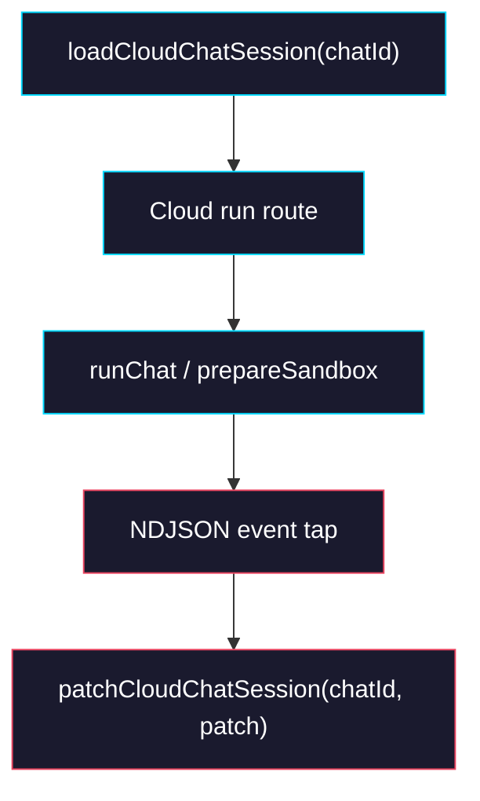

# Phase 1: Cloud Session Persistence

> **GitHub Issue:** TBD · **Epic:** [AGENTS.md](./AGENTS.md)
> **Dependencies:** Phase 0
> **Parallel with:** None
> **Blocks:** Phase 2

## Objective

Make the Cloud run route the canonical owner of session, sandbox, and relay state during a streamed run. After this phase, the route can load an existing record by `chatId`, pass stored runtime IDs into the agent, and update Redis as NDJSON events stream back. The outward stream stays backward-compatible so the provider can keep working while the Cloud store takes over silently.

## What You're Building



## Deliverables

### 1. `sandbox-agent/web/app/agents/[slug]/snapshots/[snapshotId]/chat/api/route.ts`

Update the route so `chat_id` is the first lookup key and Redis state is authoritative when present.

Expected control flow:

```ts
const storedSession = await loadCloudChatSession(chatId);

const effectiveSession = {
  sessionId: storedSession?.sessionId ?? parsed.data.session_id,
  sandboxId: storedSession?.sandboxId ?? parsed.data.sandbox_id,
  relaySessionId: storedSession?.relaySessionId ?? parsed.data.relay_session_id,
  relayToken: storedSession?.relayToken ?? parsed.data.relay_token,
  relayUrl: storedSession?.relayUrl,
};
```

Rules:

- On first request for a `chatId`, create or upsert a minimal record immediately.
- On follow-up requests, prefer Redis values over request body values.
- Create a new relay session only when the stored record does not already have valid relay credentials.
- Continue forwarding `relay.session`, `sandbox`, and `init` events to callers during migration, even though Cloud now stores them.

### 2. `sandbox-agent/web/app/agents/[slug]/snapshots/[snapshotId]/chat/api/chat-session-state.ts`

Add an NDJSON event reducer or helper that can be called from the route while forwarding the stream.

Suggested helper:

```ts
export function maybeParseNdjsonEvent(
  text: string,
): Record<string, unknown> | undefined;

export function reduceStreamEventToSessionPatch(
  event: Record<string, unknown>,
): Partial<CloudChatSessionRecord> | undefined;
```

The route should call this reducer for every JSON event it forwards and persist patches without mutating the forwarded payload.

### 3. `sandbox-agent/web/app/agents/[slug]/snapshots/[snapshotId]/chat/api/chat-session-store.ts`

Support partial updates during the stream. `patchCloudChatSession()` must:

- Load the existing record.
- Merge the patch.
- Refresh TTL.
- Preserve fields not present in the patch.
- Stamp `updatedAt`.

Expected merge behavior:

| Existing Field | New Patch | Result |
|---|---|---|
| `sessionId = abc` | `undefined` | keep `abc` |
| `relayToken = old` | `new` | replace with `new` |
| `pendingToolCallId = req-1` | `null` | clear to `null` |

## Verification

1. **Automated checks**
   Run `pnpm --dir sandbox-agent/web exec tsc --noEmit`.
2. **Manual test scenarios**
   1. First turn -> send `chat_id = chat-1` with no legacy session fields -> expect a Redis record to be created and populated after `init`/`sandbox`/`relay.session`.
   2. Follow-up turn -> send the same `chat_id` with no `session_id` or `sandbox_id` -> expect Cloud to reuse the stored values and not create a fresh sandbox session.
   3. Relay reuse -> send the same `chat_id` twice before TTL expiry -> expect Cloud not to mint a second relay session for the same chat.

## Files to Create/Modify

| File | Action |
|---|---|
| `sandbox-agent/web/app/agents/[slug]/snapshots/[snapshotId]/chat/api/route.ts` | **Modify** (load stored session, reuse stored runtime IDs, persist stream patches) |
| `sandbox-agent/web/app/agents/[slug]/snapshots/[snapshotId]/chat/api/chat-session-state.ts` | **Modify** (NDJSON parsing + stream reducer helpers) |
| `sandbox-agent/web/app/agents/[slug]/snapshots/[snapshotId]/chat/api/chat-session-store.ts` | **Modify** (partial patch support and TTL refresh) |

## Done Criteria

- [ ] Cloud route loads runtime state by `chatId`
- [ ] Streamed `init`, `sandbox`, and `relay.session` events update Redis
- [ ] Relay sessions are reused for the same active `chatId`
- [ ] `pnpm --dir sandbox-agent/web exec tsc --noEmit` passes
- [ ] Update the status in [AGENTS.md](./AGENTS.md) to `✅ DONE`

