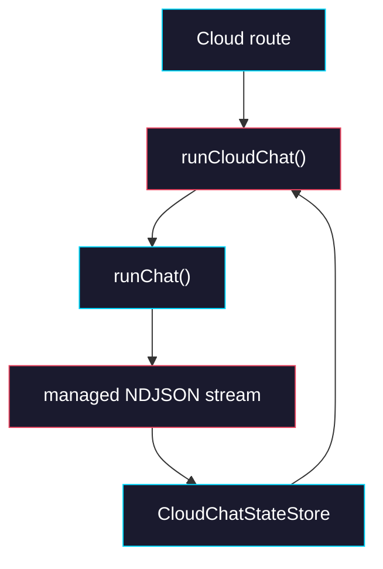

# Phase 1: Runtime Session Coordinator

> **GitHub Issue:** TBD · **Epic:** [AGENTS.md](./AGENTS.md)
> **Dependencies:** Phase 0
> **Parallel with:** None
> **Blocks:** Phase 2, Phase 3, Phase 4

## Objective

Build `runCloudChat()` in `packages/agent-runtime` as the new chat entrypoint that loads stored state by `chatId`, prepares the runtime input for `runChat()`, creates a relay session, and persists NDJSON-derived session patches while streaming. This phase stops short of tool-result resume; if a stored session has a pending tool, the runtime should fail fast and leave the actual resume logic for Phase 2.

## What You're Building



## Deliverables

### 1. `packages/agent-runtime/src/cloud-chat.ts`

Create the runtime coordinator around `runChat()`. This file is where the state machine starts to become real.

```ts
import { runChat, type BaseChatRequest, type ChatAgent, type RunChatInput } from "./chat-run";
import {
  applyCloudChatPatch,
  reduceCloudChatEvent,
  type CloudChatRequest,
  type CloudChatSessionState,
  type CloudChatStateStore,
} from "./cloud-chat-state";

export type RelaySessionFactoryResult = {
  sessionId: string;
  token: string;
  expiresAt: number;
};

export type RunChatImpl<TRequest extends BaseChatRequest> = (
  input: RunChatInput<TRequest>,
) => Promise<Response>;

export type CloudChatDeps<TRequest extends BaseChatRequest> = {
  store: CloudChatStateStore;
  relayUrl: string;
  createRelaySession: () => Promise<RelaySessionFactoryResult>;
  runChatImpl?: RunChatImpl<TRequest>;
  now?: () => number;
};

export async function runCloudChat<
  TRequest extends BaseChatRequest & {
    relay_session_id?: string;
    relay_token?: string;
  },
>(input: {
  chatId: string;
  request: Omit<
    TRequest,
    "session_id" | "sandbox_id" | "relay_session_id" | "relay_token"
  > &
    Pick<CloudChatRequest, "tool_results">;
  agent: ChatAgent<TRequest>;
  signal: AbortSignal;
  deps: CloudChatDeps<TRequest>;
}): Promise<Response> {
  const now = input.deps.now?.() ?? Date.now();
  const existing = await input.deps.store.load(input.chatId);

  if (existing?.pendingTool) {
    throw new Error(
      `Chat ${input.chatId} is paused on ${existing.pendingTool.requestId}; tool resume lands in Phase 2.`,
    );
  }

  const relaySession = await input.deps.createRelaySession();
  const runtimeInput = {
    ...input.request,
    session_id: existing?.agentSessionId,
    sandbox_id: existing?.sandboxId,
    relay_session_id: relaySession.sessionId,
    relay_token: relaySession.token,
  } as TRequest;

  const response = await (input.deps.runChatImpl ?? runChat)({
    agent: input.agent,
    signal: input.signal,
    input: runtimeInput,
  });

  return createManagedCloudResponse({
    chatId: input.chatId,
    relayUrl: input.deps.relayUrl,
    relaySession,
    baseState: existing,
    now,
    response,
    store: input.deps.store,
  });
}
```

The stream wrapper created by `createManagedCloudResponse()` must do three things:

1. Prepend a `relay.session` NDJSON event so downstream consumers still see the same event shape.
2. Parse each NDJSON object with `reduceCloudChatEvent()` and save the updated state to `store`.
3. Preserve the original response body order and headers.

Use this decision table exactly in Phase 1.

| Stored state | Incoming `tool_results` | Runtime action |
|---|---|---|
| None | Empty or absent | Start a fresh run |
| `agentSessionId` + `sandboxId`, no `pendingTool` | Empty or absent | Follow-up run using stored session + sandbox |
| Any state with `pendingTool` | Empty or absent | Throw explicit "resume lands in Phase 2" error |
| Any state with `pendingTool` | Present | Throw the same explicit error for now |

### 2. `packages/agent-runtime/src/cloud-chat.test.ts`

Add coordinator tests that stub `runChat()` and assert state persistence through the managed stream wrapper.

```ts
describe("runCloudChat", () => {
  it("starts a new chat when no stored state exists", async () => {});
  it("reuses agentSessionId and sandboxId for follow-up requests", async () => {});
  it("prepends relay.session before downstream NDJSON events", async () => {});
  it("persists init and sandbox events into the store", async () => {});
  it("fails fast when a stored session still has pendingTool", async () => {});
});
```

The tests should use an in-memory fake store that implements `CloudChatStateStore`. Do not introduce Redis in this phase.

### 3. `packages/agent-runtime/src/index.ts`

Export the new runtime coordinator surface.

```ts
export {
  runCloudChat,
  type CloudChatDeps,
  type RelaySessionFactoryResult,
  type RunChatImpl,
} from "./cloud-chat";
```

## Verification

1. **Automated checks**
   Run:
   ```bash
   pnpm --filter @giselles-ai/agent-runtime typecheck
   pnpm --filter @giselles-ai/agent-runtime test
   pnpm --filter @giselles-ai/agent-runtime build
   ```
2. **Manual test scenarios**
   1. No stored state -> `runCloudChat()` -> outgoing `runChat()` input omits `session_id` and `sandbox_id`
   2. Stored state with `agentSessionId = sess-1`, `sandboxId = sbx-1` -> `runCloudChat()` -> outgoing `runChat()` input includes both IDs
   3. Managed stream receives `init`, `sandbox`, `relay.session` -> store -> saved state contains all three values under the same `chatId`

## Files to Create/Modify

| File | Action |
|---|---|
| `packages/agent-runtime/src/cloud-chat.ts` | **Create** |
| `packages/agent-runtime/src/cloud-chat.test.ts` | **Create** |
| `packages/agent-runtime/src/index.ts` | **Modify** (export `runCloudChat`) |

## Done Criteria

- [ ] `runCloudChat()` exists and wraps `runChat()` without introducing Redis client code
- [ ] Managed streaming persists session patches by `chatId`
- [ ] Follow-up requests reuse stored `agentSessionId` and `sandboxId`
- [ ] Pending-tool sessions fail fast with an explicit error until Phase 2
- [ ] `pnpm --filter @giselles-ai/agent-runtime typecheck` passes
- [ ] `pnpm --filter @giselles-ai/agent-runtime test` passes
- [ ] Update the status in [AGENTS.md](./AGENTS.md) to `✅ DONE`
