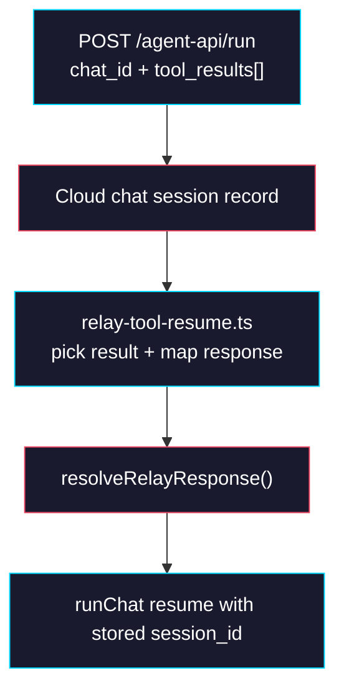

# Phase 2: Cloud Tool Resume

> **GitHub Issue:** TBD · **Epic:** [AGENTS.md](./AGENTS.md)
> **Dependencies:** Phase 1
> **Parallel with:** None
> **Blocks:** Phase 3

## Objective

Move pending browser-tool resume handling into Cloud. After this phase, the Cloud route accepts client `tool_results`, resolves the pending relay response internally using Redis-backed relay primitives, clears pending state in the chat session record, and then resumes the underlying agent using stored `session_id` and `sandbox_id`. The provider no longer needs relay credentials or pending request bookkeeping after this cutover.

## What You're Building



## Deliverables

### 1. `packages/browser-tool/src/relay/index.ts`

Expose the relay response helper needed by Cloud. The run route should not have to speak HTTP to its sibling relay endpoint just to resolve a pending request.

Expected export surface:

```ts
export {
  createRelaySession,
  dispatchRelayRequest,
  resolveRelayResponse,
  toRelayError,
} from "./relay-store";
```

`dispatchRelayRequest` is optional but useful for symmetry and future server-side browser automation.

### 2. `sandbox-agent/web/app/agents/[slug]/snapshots/[snapshotId]/chat/api/relay-tool-resume.ts`

Create a helper module that validates the pending request against the current request body and maps client tool results to the relay response shape.

```ts
import type { RelayResponse } from "@giselles-ai/browser-tool";
import type {
  CloudChatSessionRecord,
  CloudToolResult,
} from "./chat-session-state";

export function findPendingToolResult(input: {
  session: CloudChatSessionRecord;
  toolResults: CloudToolResult[];
}): CloudToolResult;

export function toRelayResponse(input: {
  pendingToolName: string;
  pendingToolCallId: string;
  toolResult: CloudToolResult;
}): RelayResponse;
```

Mapping table:

| Pending Tool | Tool Result Shape | Relay Response |
|---|---|---|
| `getFormSnapshot` | `{ output: { fields } }` | `{ type: "snapshot_response", requestId, fields }` |
| `executeFormActions` | `{ output: { report } }` | `{ type: "execute_response", requestId, report }` |
| Any tool with `state = "output-error"` | `{ error_text }` | `{ type: "error_response", requestId, message }` |

### 3. `sandbox-agent/web/app/agents/[slug]/snapshots/[snapshotId]/chat/api/route.ts`

Update the route to resolve pending browser-tool work before starting or resuming the agent stream.

Expected flow:

```ts
if (parsed.data.tool_results?.length) {
  const session = await loadCloudChatSession(chatId);
  assertPendingTool(session);

  const toolResult = findPendingToolResult({
    session,
    toolResults: parsed.data.tool_results,
  });

  await resolveRelayResponse({
    sessionId: session.relaySessionId,
    token: session.relayToken,
    response: toRelayResponse({
      pendingToolName: session.pendingToolName!,
      pendingToolCallId: session.pendingToolCallId!,
      toolResult,
    }),
  });

  await patchCloudChatSession(chatId, {
    pendingToolCallId: null,
    pendingToolName: null,
  });
}
```

The route must keep pending state accurate by persisting both relay-native events and browser-owned `tool_use` events:

- `snapshot_request`
- `execute_request`
- `tool_use` where `tool_name` is `getFormSnapshot`
- `tool_use` where `tool_name` is `executeFormActions`

This explicit dual handling is important because current Cloud variants do not always emit the same browser-tool event family.

## Verification

1. **Automated checks**
   Run `pnpm --filter @giselles-ai/browser-tool typecheck`.
   Run `pnpm --dir sandbox-agent/web exec tsc --noEmit`.
2. **Manual test scenarios**
   1. Browser tool pause -> start a chat that triggers `getFormSnapshot` -> expect pending tool fields to be written in the chat session record.
   2. Tool resume -> POST the same `chat_id` with `tool_results` for the pending call -> expect Cloud to call `resolveRelayResponse`, clear pending state, and continue the conversation.
   3. Wrong tool result -> send a tool result with a mismatched `tool_call_id` -> expect a 4xx response and unchanged pending state.

## Files to Create/Modify

| File | Action |
|---|---|
| `packages/browser-tool/src/relay/index.ts` | **Modify** (export `resolveRelayResponse` and related helpers needed by Cloud) |
| `sandbox-agent/web/app/agents/[slug]/snapshots/[snapshotId]/chat/api/relay-tool-resume.ts` | **Create** |
| `sandbox-agent/web/app/agents/[slug]/snapshots/[snapshotId]/chat/api/route.ts` | **Modify** (accept `tool_results`, resolve relay responses, clear pending state) |
| `sandbox-agent/web/app/agents/[slug]/snapshots/[snapshotId]/chat/api/chat-session-state.ts` | **Modify** (persist pending tool information from stream events) |

## Done Criteria

- [ ] Cloud can resume browser-tool requests using `tool_results` and stored relay credentials
- [ ] Pending tool state is stored and cleared in Cloud Redis
- [ ] `resolveRelayResponse` is available on the public relay surface used by Cloud
- [ ] `pnpm --filter @giselles-ai/browser-tool typecheck` passes
- [ ] `pnpm --dir sandbox-agent/web exec tsc --noEmit` passes
- [ ] Update the status in [AGENTS.md](./AGENTS.md) to `✅ DONE`

