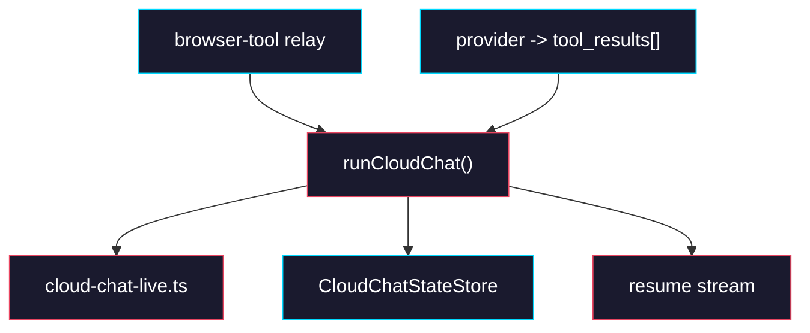

# Phase 2: Runtime Relay Resume

> **GitHub Issue:** TBD · **Epic:** [AGENTS.md](./AGENTS.md)
> **Dependencies:** Phase 1
> **Parallel with:** None
> **Blocks:** Phase 3, Phase 4

## Objective

Move relay subscription, pending-tool bookkeeping, and tool-result resume into `packages/agent-runtime`. After this phase, runtime can pause on a browser tool request, persist the pending request under `chatId`, accept `tool_results[]` on the next request, resolve the relay response itself, and continue by either reusing an in-memory live connection or cold-resuming with stored `agentSessionId` and `sandboxId`.

## What You're Building



## Deliverables

### 1. `packages/browser-tool/src/relay/request-subscription.ts`

Expose a public server-side relay subscription surface from `@giselles-ai/browser-tool/relay` so runtime can subscribe to relay requests without reaching into app code.

```ts
import { relayRequestSchema, type RelayRequest, type RelayResponse } from "../types";
import {
  assertRelaySession,
  createRelaySubscriber,
  relayRequestChannel,
  resolveRelayResponse,
} from "./relay-store";

export type RelayRequestSubscription = {
  nextRequest(): Promise<RelayRequest>;
  close(): Promise<void>;
};

export async function createRelayRequestSubscription(input: {
  sessionId: string;
  token: string;
}): Promise<RelayRequestSubscription> {
  await assertRelaySession(input.sessionId, input.token);
  const subscriber = createRelaySubscriber();
  const channel = relayRequestChannel(input.sessionId);
  await subscriber.subscribe(channel);

  return {
    nextRequest() {
      return new Promise<RelayRequest>((resolve, reject) => {
        const onMessage = (_channel: string, message: string) => {
          const parsed = relayRequestSchema.safeParse(JSON.parse(message));
          if (!parsed.success) {
            return;
          }
          cleanup();
          resolve(parsed.data);
        };

        const onError = (error: unknown) => {
          cleanup();
          reject(error);
        };

        const cleanup = () => {
          subscriber.off("message", onMessage);
          subscriber.off("error", onError);
        };

        subscriber.on("message", onMessage);
        subscriber.on("error", onError);
      });
    },
    async close() {
      await subscriber.unsubscribe(channel).catch(() => undefined);
      await subscriber.quit().catch(() => subscriber.disconnect());
    },
  };
}

export async function sendRelayResponse(input: {
  sessionId: string;
  token: string;
  response: RelayResponse;
}): Promise<void> {
  await resolveRelayResponse(input);
}
```

Also modify `packages/browser-tool/src/relay/index.ts` to export:

```ts
export {
  createRelayRequestSubscription,
  sendRelayResponse,
  type RelayRequestSubscription,
} from "./request-subscription";
```

The runtime should import only from the public relay entrypoint after this phase.

### 2. `packages/agent-runtime/src/cloud-chat-live.ts`

Move the provider-style hot-resume cache into runtime.

```ts
import type { RelayRequestSubscription } from "@giselles-ai/browser-tool/relay";

export type LiveCloudConnection = {
  reader: ReadableStreamDefaultReader<Uint8Array>;
  buffer: string;
  textBlockOpen: boolean;
  relaySubscription: RelayRequestSubscription | null;
};

const liveConnections = new Map<string, LiveCloudConnection>();

export function getLiveCloudConnection(
  chatId: string,
): LiveCloudConnection | undefined {
  return liveConnections.get(chatId);
}

export function saveLiveCloudConnection(
  chatId: string,
  connection: LiveCloudConnection,
): void {
  liveConnections.set(chatId, connection);
}

export async function removeLiveCloudConnection(
  chatId: string,
): Promise<void> {
  const connection = liveConnections.get(chatId);
  liveConnections.delete(chatId);
  await connection?.relaySubscription?.close().catch(() => undefined);
}
```

### 3. `packages/agent-runtime/src/cloud-chat-relay.ts`

Add the request/response mapping layer so runtime can translate between relay traffic and AI SDK tool results without involving the provider.

```ts
import type { RelayRequest, RelayResponse } from "@giselles-ai/browser-tool";
import type { CloudToolResult, PendingToolState } from "./cloud-chat-state";

export function relayRequestToPendingTool(
  request: RelayRequest,
): PendingToolState {
  return {
    requestId: request.requestId,
    requestType: request.type,
    toolName:
      request.type === "snapshot_request"
        ? "getFormSnapshot"
        : "executeFormActions",
  };
}

export function relayRequestToNdjsonEvent(
  request: RelayRequest,
): Record<string, unknown> {
  return request;
}

export function toolResultToRelayResponse(input: {
  pending: PendingToolState;
  result: CloudToolResult;
}): RelayResponse {
  if (input.pending.requestType === "snapshot_request") {
    return {
      type: "snapshot_response",
      requestId: input.pending.requestId,
      fields:
        typeof input.result.output === "object" &&
        input.result.output &&
        "fields" in (input.result.output as Record<string, unknown>)
          ? ((input.result.output as Record<string, unknown>).fields as RelayResponse["fields"])
          : (input.result.output as RelayResponse["fields"]),
    };
  }

  return {
    type: "execute_response",
    requestId: input.pending.requestId,
    report:
      typeof input.result.output === "object" &&
      input.result.output &&
      "report" in (input.result.output as Record<string, unknown>)
        ? ((input.result.output as Record<string, unknown>).report as RelayResponse["report"])
        : (input.result.output as RelayResponse["report"]),
  };
}
```

Use this mapping table exactly.

| Pending request type | Expected tool name | Relay response type |
|---|---|---|
| `snapshot_request` | `getFormSnapshot` | `snapshot_response` |
| `execute_request` | `executeFormActions` | `execute_response` |

### 4. `packages/agent-runtime/src/cloud-chat.ts`

Extend `runCloudChat()` to support both pause and resume.

The core behavior change is:

1. Open a relay request subscription when relay credentials are available.
2. While consuming NDJSON, race the stream reader against `relaySubscription.nextRequest()`.
3. When a relay request arrives:
   - emit the same request as NDJSON
   - persist `pendingTool`
   - save the live connection under `chatId`
   - close the outward response so the browser receives an AI SDK tool call
4. On the next `runCloudChat()` call with `tool_results[]`:
   - load stored `pendingTool`
   - find the matching tool result by `toolCallId`
   - call `sendRelayResponse()`
   - clear `pendingTool`
   - continue from a live connection when present
   - otherwise cold-resume with stored `agentSessionId` and `sandboxId`

Model the new runtime branch with code shaped like this:

```ts
if (stored?.pendingTool) {
  const result = findMatchingToolResult(
    input.request.tool_results ?? [],
    stored.pendingTool.requestId,
  );
  if (!result || !stored.relay) {
    throw new Error(`Missing tool result for ${stored.pendingTool.requestId}`);
  }

  await sendRelayResponse({
    sessionId: stored.relay.sessionId,
    token: stored.relay.token,
    response: toolResultToRelayResponse({
      pending: stored.pendingTool,
      result,
    }),
  });

  await input.deps.store.save(
    applyCloudChatPatch({
      chatId: input.chatId,
      base: stored,
      patch: { pendingTool: null },
      now: input.deps.now?.() ?? Date.now(),
    }),
  );

  const hot = getLiveCloudConnection(input.chatId);
  if (hot) {
    return continueManagedCloudResponseFromLiveConnection(...);
  }
}
```

### 5. `packages/agent-runtime/src/cloud-chat.test.ts`

Expand the coordinator tests to cover pause and both resume paths.

```ts
describe("runCloudChat relay resume", () => {
  it("pauses on snapshot_request and stores pendingTool", async () => {});
  it("uses a hot live connection when the same instance still holds the stream", async () => {});
  it("cold-resumes with stored agentSessionId and sandboxId when no live connection exists", async () => {});
  it("fails when tool_results does not contain the pending requestId", async () => {});
  it("clears pendingTool after sendRelayResponse succeeds", async () => {});
});
```

## Verification

1. **Automated checks**
   Run:
   ```bash
   pnpm --filter @giselles-ai/browser-tool typecheck
   pnpm --filter @giselles-ai/browser-tool test
   pnpm --filter @giselles-ai/agent-runtime typecheck
   pnpm --filter @giselles-ai/agent-runtime test
   pnpm --filter @giselles-ai/agent-runtime build
   ```
2. **Manual test scenarios**
   1. First request emits `snapshot_request` -> runtime saves `pendingTool` and outward stream ends with a tool call
   2. Second request includes matching `tool_results[]` on the same instance -> runtime uses the live connection and continues the stream
   3. Second request includes matching `tool_results[]` on a different instance -> runtime reloads state, sends relay response, and cold-resumes with stored IDs

## Files to Create/Modify

| File | Action |
|---|---|
| `packages/browser-tool/src/relay/request-subscription.ts` | **Create** |
| `packages/browser-tool/src/relay/index.ts` | **Modify** (export the server-side relay subscription surface) |
| `packages/agent-runtime/src/cloud-chat-live.ts` | **Create** |
| `packages/agent-runtime/src/cloud-chat-relay.ts` | **Create** |
| `packages/agent-runtime/src/cloud-chat.ts` | **Modify** (pause/resume, relay subscription, live connection logic) |
| `packages/agent-runtime/src/cloud-chat.test.ts` | **Modify** (cover hot/cold resume) |

## Done Criteria

- [ ] Runtime subscribes to relay requests without provider help
- [ ] Pending tool state is stored under `chatId` and cleared after successful resume
- [ ] Hot resume works through runtime-owned live connections
- [ ] Cold resume works from stored `agentSessionId` and `sandboxId`
- [ ] `pnpm --filter @giselles-ai/browser-tool test` passes
- [ ] `pnpm --filter @giselles-ai/agent-runtime test` passes
- [ ] Update the status in [AGENTS.md](./AGENTS.md) to `✅ DONE`
