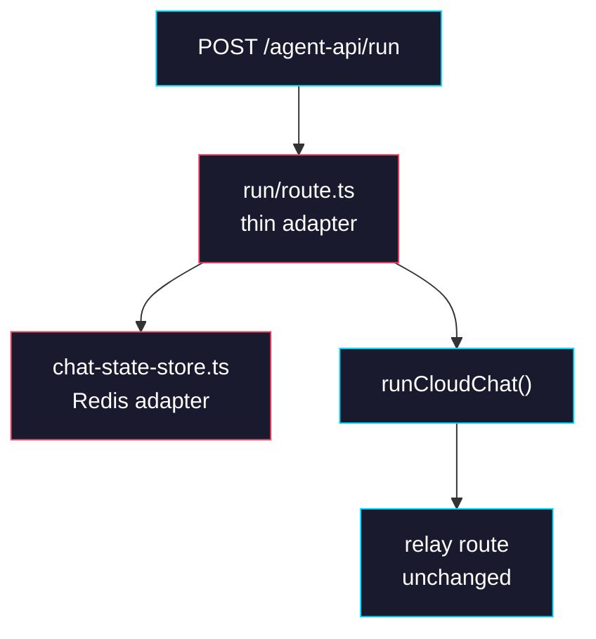

# Phase 3: Cloud Consumer Adoption

> **GitHub Issue:** TBD · **Epic:** [AGENTS.md](./AGENTS.md)
> **Dependencies:** Phase 2
> **Parallel with:** None
> **Blocks:** Phase 4

## Objective

Adopt the new runtime API in the hosted `giselles-ai/giselle` Cloud consumer. This phase is intentionally for the upstream `giselles-ai/giselle` repo, not for `agent-container/opensrc`. The `agent-api/run` route should keep auth, rate limiting, request validation, document merging, and agent selection, but all chat-session behavior must move behind `runCloudChat()`.

## What You're Building



## Deliverables

### 1. `apps/studio.giselles.ai/app/agent-api/_lib/chat-state-store.ts`

Create the Redis adapter for the runtime store interface in the upstream `giselles-ai/giselle` repo.

```ts
import Redis from "ioredis";
import type {
  CloudChatSessionState,
  CloudChatStateStore,
} from "@giselles-ai/agent-runtime";

const REDIS_URL_ENV_CANDIDATES = [
  "REDIS_URL",
  "REDIS_TLS_URL",
  "KV_URL",
  "UPSTASH_REDIS_TLS_URL",
  "UPSTASH_REDIS_URL",
] as const;

const DEFAULT_TTL_SEC = 60 * 60;

declare global {
  var __cloudChatStateRedis: Redis | undefined;
}

function getRedis(): Redis {
  if (!globalThis.__cloudChatStateRedis) {
    const url = REDIS_URL_ENV_CANDIDATES
      .map((name) => process.env[name]?.trim())
      .find(Boolean);
    if (!url) {
      throw new Error("Missing Redis URL for Cloud chat state.");
    }
    globalThis.__cloudChatStateRedis = new Redis(url, {
      maxRetriesPerRequest: 2,
    });
  }
  return globalThis.__cloudChatStateRedis;
}

function key(chatId: string): string {
  return `cloud-chat:${chatId}`;
}

export class RedisCloudChatStateStore implements CloudChatStateStore {
  async load(chatId: string): Promise<CloudChatSessionState | null> {
    const raw = await getRedis().get(key(chatId));
    return raw ? (JSON.parse(raw) as CloudChatSessionState) : null;
  }

  async save(state: CloudChatSessionState): Promise<void> {
    await getRedis().set(
      key(state.chatId),
      JSON.stringify(state),
      "EX",
      DEFAULT_TTL_SEC,
    );
  }

  async delete(chatId: string): Promise<void> {
    await getRedis().del(key(chatId));
  }
}
```

Keep the store adapter here. Do not move `ioredis` into `agent-runtime`.

### 2. `apps/studio.giselles.ai/app/agent-api/run/route.ts`

Replace the direct `createRelaySession()` + `runChat()` wiring with a call to `runCloudChat()`.

```ts
import { createRelaySession } from "@giselles-ai/browser-tool/relay";
import {
  createCodexAgent,
  createGeminiAgent,
  runCloudChat,
  type CloudToolResult,
} from "@giselles-ai/agent-runtime";

const requestSchema = z.object({
  chat_id: z.string().min(1),
  message: z.string().min(1),
  document: z.string().optional(),
  tool_results: z
    .array(
      z.object({
        toolCallId: z.string().min(1),
        toolName: z.enum(["getFormSnapshot", "executeFormActions"]),
        output: z.unknown(),
      }),
    )
    .optional(),
  snapshot_id: z.string().min(1).optional(),
  agent_type: z.enum(["gemini", "codex"]),
});

const store = new RedisCloudChatStateStore();

return runCloudChat({
  chatId: parsed.data.chat_id,
  request: {
    message,
    tool_results: parsed.data.tool_results as CloudToolResult[] | undefined,
    snapshot_id: parsed.data.snapshot_id,
  },
  agent,
  signal: request.signal,
  deps: {
    store,
    relayUrl,
    createRelaySession,
  },
});
```

Keep the existing auth, rate limit, and `document` merge logic exactly where it is. Delete local helper code that only existed to prepend `relay.session` manually; runtime now owns that.

### 3. `apps/studio.giselles.ai/package.json`

Make the dependency surface match the new route implementation.

```json
{
  "dependencies": {
    "@giselles-ai/agent-runtime": "workspace:*",
    "@giselles-ai/browser-tool": "workspace:*",
    "ioredis": "catalog:"
  }
}
```

If the repo snapshot still imports the legacy runtime package name, replace that import path with `@giselles-ai/agent-runtime` in the route code during this phase.

### 4. `apps/studio.giselles.ai/app/agent-api/relay/[[...relay]]/route.ts`

No behavior change is required here. Keep the relay endpoint as:

```ts
import { createRelayHandler } from "@giselles-ai/browser-tool/relay";

export const { GET, POST, OPTIONS } = createRelayHandler();
```

The only action item is to confirm it does not need new app-specific logic after runtime starts owning resume.

## Verification

1. **Automated checks**
   Run in the `giselles-ai/giselle` repo root:
   ```bash
   pnpm --dir apps/studio.giselles.ai check-types
   pnpm --dir apps/studio.giselles.ai test
   ```
2. **Manual test scenarios**
   1. First request with `chat_id` and no `tool_results` -> route -> returns streamed response and writes state into Redis
   2. Second request with same `chat_id` and matching `tool_results` -> route -> runtime resumes without any provider-owned metadata
   3. Follow-up user request with same `chat_id` and no `tool_results` -> route -> runtime continues the same CLI session via stored `agentSessionId` and `sandboxId`

## Files to Create/Modify

| File | Action |
|---|---|
| `apps/studio.giselles.ai/app/agent-api/_lib/chat-state-store.ts` | **Create** |
| `apps/studio.giselles.ai/app/agent-api/run/route.ts` | **Modify** (use `runCloudChat()` and accept `chat_id` + `tool_results`) |
| `apps/studio.giselles.ai/package.json` | **Modify** (ensure `@giselles-ai/agent-runtime` and `ioredis` are present) |
| `apps/studio.giselles.ai/app/agent-api/relay/[[...relay]]/route.ts` | **Verify only** (no business logic change expected) |

## Done Criteria

- [ ] The hosted `agent-api/run` route delegates chat-state behavior to `runCloudChat()`
- [ ] Redis state is keyed by `chat_id`
- [ ] The route no longer manually manages relay-session NDJSON injection
- [ ] The relay route stays a thin `createRelayHandler()` wrapper
- [ ] `pnpm --dir apps/studio.giselles.ai check-types` passes in the upstream repo
- [ ] `pnpm --dir apps/studio.giselles.ai test` passes in the upstream repo
- [ ] Update the status in [AGENTS.md](./AGENTS.md) to `✅ DONE`
