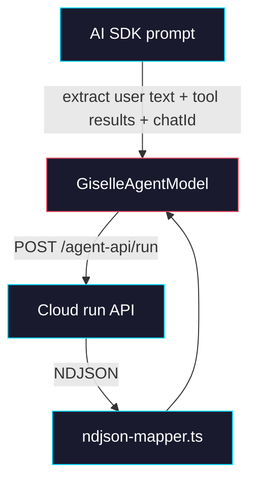

# Phase 3: Provider Stateless Bridge

> **GitHub Issue:** TBD · **Epic:** [AGENTS.md](./AGENTS.md)
> **Dependencies:** Phase 2
> **Parallel with:** None
> **Blocks:** Phase 4

## Objective

Strip `@giselles-ai/giselle-provider` down to a stateless Cloud client. After this phase, the provider no longer stores session state, does not subscribe to relay SSE, and does not emit raw session metadata to the AI SDK UI layer. Its only cross-request input is the AI SDK `chatId`, and its only resume payload is the current set of client `tool_results`.

## What You're Building



## Deliverables

### 1. `packages/giselle-provider/src/types.ts`

Update the Cloud request dependency contract so the provider sends `chatId` and client tool results instead of opaque session state.

```ts
type ConnectCloudApiParams = {
  endpoint: string;
  chatId: string;
  message: string;
  toolResults?: Array<{
    toolName: string;
    toolCallId: string;
    state: "output-available" | "output-error";
    output?: unknown;
    errorText?: string;
  }>;
  agentType?: string;
  snapshotId?: string;
  headers?: Record<string, string>;
  signal?: AbortSignal;
};
```

`GiselleSessionState`, `SessionMetadata`, and provider-owned `RelaySubscription` state should be removed from the public surface unless still needed strictly for stream processing internals.

### 2. `packages/giselle-provider/src/giselle-agent-model.ts`

Collapse the current new-session / hot-resume / cold-resume branching into one Cloud request flow:

```ts
async doStream(options) {
  const chatId =
    getGiselleSessionIdFromProviderOptions(options.providerOptions) ??
    crypto.randomUUID();

  const connection = await this.connectCloudApi({
    chatId,
    message: this.extractUserMessage(options.prompt),
    toolResults: this.extractToolResults(options.prompt),
    ...
  });

  return this.consumeNdjsonStream(connection);
}
```

Required simplifications:

- Remove provider-owned `sessionState` extraction and merge logic.
- Remove provider-owned `relay.respond` handling.
- Remove `globalThis` live connection ownership.
- Keep NDJSON text/tool mapping intact.
- Continue to emit `x-giselle-session-id`, but it now represents the stable AI SDK chat id rather than a provider-managed resume token.

### 3. `packages/giselle-provider/src/ndjson-mapper.ts`

Keep the mapper, but make browser-tool detection tolerant of both Cloud event families.

Required support:

| Cloud Event | AI SDK Part |
|---|---|
| `snapshot_request` | `tool-call(getFormSnapshot)` |
| `execute_request` | `tool-call(executeFormActions)` |
| `tool_use` with `tool_name = "getFormSnapshot"` | `tool-call(getFormSnapshot)` |
| `tool_use` with `tool_name = "executeFormActions"` | `tool-call(executeFormActions)` |

This phase should not emit provider-owned raw metadata for session state anymore.

### 4. `packages/giselle-provider/src/index.ts` and deleted files

Delete obsolete provider-owned state modules and exports:

- `src/session-state.ts`
- `src/session-manager.ts`
- `src/relay-http.ts`

Update exports and tests accordingly.

## Verification

1. **Automated checks**
   Run `pnpm --filter @giselles-ai/giselle-provider test`.
   Run `pnpm --filter @giselles-ai/giselle-provider typecheck`.
   Run `pnpm --filter @giselles-ai/giselle-provider build`.
2. **Manual test scenarios**
   1. Fresh chat -> send a normal first-turn message -> expect the provider to send `chat_id` and no session-state payload.
   2. Browser tool follow-up -> send a tool result turn -> expect the provider to send `tool_results[]` and no relay credentials.
   3. Streamed browser tool event -> Cloud emits `tool_use` for `getFormSnapshot` -> expect the provider to surface an AI SDK tool call.

## Files to Create/Modify

| File | Action |
|---|---|
| `packages/giselle-provider/src/types.ts` | **Modify** (change Cloud request contract to `chatId` + `toolResults`) |
| `packages/giselle-provider/src/giselle-agent-model.ts` | **Modify** (remove provider-owned resume state and relay transport) |
| `packages/giselle-provider/src/ndjson-mapper.ts` | **Modify** (support both browser-tool event families and stop emitting session raw values) |
| `packages/giselle-provider/src/index.ts` | **Modify** (remove state-management exports) |
| `packages/giselle-provider/src/session-state.ts` | **Delete** |
| `packages/giselle-provider/src/session-manager.ts` | **Delete** |
| `packages/giselle-provider/src/relay-http.ts` | **Delete** |
| `packages/giselle-provider/src/__tests__/giselle-agent-model.test.ts` | **Modify** (assert `chatId`/`toolResults` payloads instead of session-state round-trip) |

## Done Criteria

- [ ] Provider no longer owns session, relay, or pending tool state
- [ ] Provider sends only `chatId`, `message`, and `toolResults` to Cloud
- [ ] Browser-tool NDJSON events still map to AI SDK tool calls
- [ ] `pnpm --filter @giselles-ai/giselle-provider test` passes
- [ ] `pnpm --filter @giselles-ai/giselle-provider typecheck` passes
- [ ] `pnpm --filter @giselles-ai/giselle-provider build` passes
- [ ] Update the status in [AGENTS.md](./AGENTS.md) to `✅ DONE`

