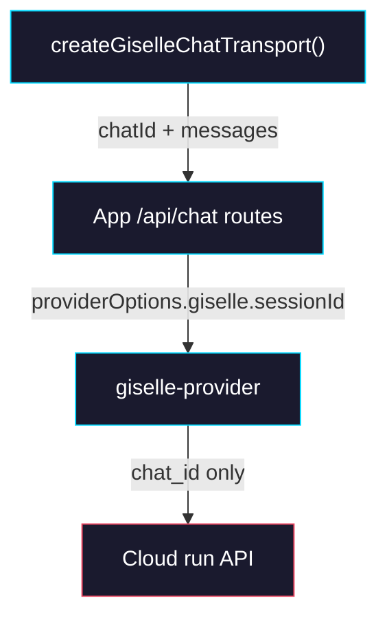

# Phase 4: Consumer Cutover & Cleanup

> **GitHub Issue:** TBD · **Epic:** [AGENTS.md](./AGENTS.md)
> **Dependencies:** Phase 3
> **Parallel with:** None
> **Blocks:** None

## Objective

Remove the last client and app-route assumptions about provider-owned session state. After this phase, demo apps and minimum-demo no longer attach or recover `sessionState` metadata, app routes no longer synthesize metadata from raw parts, and the codebase treats Cloud as the sole owner of opaque chat state. This phase also documents the parity work needed for the hosted `studio.giselles.ai` route.

## What You're Building



## Deliverables

### 1. `apps/demo/app/api/chat/route.ts` and `apps/minimum-demo/app/chat/route.ts`

Remove all session-state fallback logic and message metadata plumbing that existed only to carry provider-owned opaque state.

Expected simplification:

```ts
providerOptions: {
  giselle: {
    sessionId,
  },
}
```

Delete:

- `getLatestGiselleSessionStateFromMessages(...)`
- `getGiselleSessionStateFromProviderOptions(...)`
- `getGiselleSessionStateFromRawValue(...)`
- `createGiselleMessageMetadata(...)`
- `messageMetadata: ({ part }) => ...`

### 2. `apps/demo/app/_lib/giselle-chat-transport.ts` and `apps/minimum-demo/app/_lib/giselle-chat-transport.ts`

Stop injecting session-state payloads into outgoing bodies. The helper may still exist for centralizing providerOptions or future request metadata, but it should become a thin wrapper.

Expected shape:

```ts
return new DefaultChatTransport({
  api: input.api,
  body: input.body,
});
```

If the helper remains, document clearly that it only exists to keep the call sites uniform.

### 3. Consumer pages and parity checklist

Verify every `useChat()` caller still works with `chatId`-only providerOptions.

Pages to inspect:

- `apps/demo/app/external-agent/page.tsx`
- `apps/demo/app/gemini-browser-tool/page.tsx`
- `apps/demo/app/codex-browser-tool/page.tsx`
- `apps/demo/app/demo/spreadsheet/page.tsx`
- `apps/minimum-demo/app/page.tsx`

Hosted parity note:

- Mirror the Cloud route contract changes into `opensrc/repos/github.com/giselles-ai/giselle/apps/studio.giselles.ai/app/agent-api/run/route.ts`.
- `opensrc/` is excluded from local Next typecheck, so parity must be validated separately in that repo.

## Verification

1. **Automated checks**
   Run `pnpm --filter demo typecheck`.
   Run `pnpm --dir apps/minimum-demo exec tsc --noEmit`.
   Run `pnpm --filter @giselles-ai/giselle-provider test`.
2. **Manual test scenarios**
   1. Demo browser tool flow -> open demo app, trigger a browser tool, complete it -> expect a single chat to continue without client-held session metadata.
   2. Minimum-demo flow -> send a message, then trigger a browser tool follow-up -> expect no new session bootstrap loop.
   3. Hard refresh mid-chat -> reload the page and continue with the same AI SDK chat id -> expect Cloud to resume using Redis without requiring client session metadata.

## Files to Create/Modify

| File | Action |
|---|---|
| `apps/demo/app/api/chat/route.ts` | **Modify** (remove provider session-state recovery and message metadata plumbing) |
| `apps/minimum-demo/app/chat/route.ts` | **Modify** (same as demo route) |
| `apps/demo/app/_lib/giselle-chat-transport.ts` | **Modify** (remove session-state injection) |
| `apps/minimum-demo/app/_lib/giselle-chat-transport.ts` | **Modify** (remove session-state injection) |
| `apps/demo/app/external-agent/page.tsx` | **Modify** (verify `useChat` still relies on `chatId` only) |
| `apps/demo/app/gemini-browser-tool/page.tsx` | **Modify** (same verification/call-site cleanup) |
| `apps/demo/app/codex-browser-tool/page.tsx` | **Modify** (same verification/call-site cleanup) |
| `apps/demo/app/demo/spreadsheet/page.tsx` | **Modify** (same verification/call-site cleanup) |
| `apps/minimum-demo/app/page.tsx` | **Modify** (same verification/call-site cleanup) |

## Done Criteria

- [ ] Demo and minimum-demo routes no longer reconstruct provider session state
- [ ] Transport helpers no longer inject opaque provider metadata
- [ ] Browser-tool demos still work with `chatId` only
- [ ] `pnpm --filter demo typecheck` passes
- [ ] `pnpm --dir apps/minimum-demo exec tsc --noEmit` passes
- [ ] `pnpm --filter @giselles-ai/giselle-provider test` passes
- [ ] Update the status in [AGENTS.md](./AGENTS.md) to `✅ DONE`
