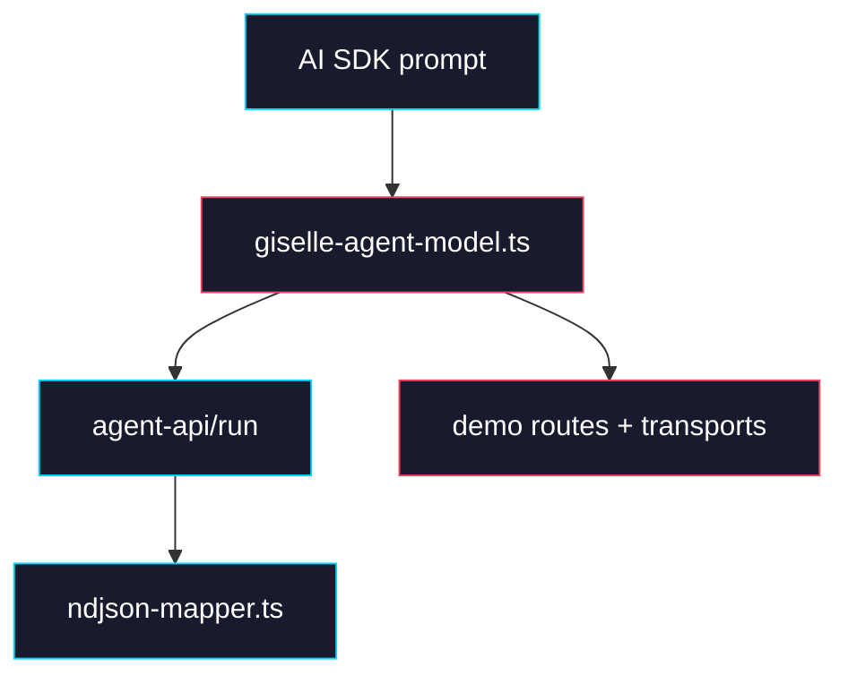

# Phase 4: Provider Cleanup

> **GitHub Issue:** TBD · **Epic:** [AGENTS.md](./AGENTS.md)
> **Dependencies:** Phase 3
> **Parallel with:** None
> **Blocks:** None

## Objective

Remove provider-owned session state and relay plumbing now that Cloud/runtime owns the whole resume flow. After this phase, `@giselles-ai/giselle-provider` sends only `chat_id`, `message`, optional `document`, and `tool_results[]`; the demo apps stop reconstructing hidden metadata; and the obsolete provider files are deleted.

## What You're Building



## Deliverables

### 1. `packages/giselle-provider/src/types.ts`

Delete the provider-owned session and relay types. Replace them with the slim Cloud request contract.

```ts
export type CloudToolResult = {
  toolCallId: string;
  toolName: string;
  output: unknown;
};

export type ConnectCloudApiParams = {
  endpoint: string;
  chatId: string;
  message: string;
  document?: string;
  toolResults?: CloudToolResult[];
  agentType?: string;
  snapshotId?: string;
  headers?: Record<string, string>;
  signal?: AbortSignal;
};

export type ConnectCloudApiResult = {
  reader: ReadableStreamDefaultReader<Uint8Array>;
  response: Response;
};

export type GiselleProviderDeps = {
  connectCloudApi: (
    params: ConnectCloudApiParams,
  ) => Promise<ConnectCloudApiResult>;
};
```

Remove these types entirely from the package:

- `GiselleSessionState`
- `SessionMetadata`
- `RelaySubscription`
- `LiveConnection`

### 2. `packages/giselle-provider/src/giselle-agent-model.ts`

Simplify the model so it no longer tries to own resume logic.

The resulting flow should be:

1. Read the AI SDK `chatId` from `providerOptions.giselle.sessionId`.
2. Extract the latest user message.
3. Extract all `tool-result` parts from the prompt.
4. POST one Cloud request with `chat_id`, `message`, and `tool_results`.
5. Stream NDJSON through `mapNdjsonEvent()` with no provider-owned hot/cold resume branches.

Shape the default Cloud request like this:

```ts
body: JSON.stringify({
  type: "agent.run",
  chat_id: params.chatId,
  message: params.message,
  document: params.document,
  tool_results: params.toolResults,
  agent_type: params.agentType,
  snapshot_id: params.snapshotId,
})
```

Delete these methods and branches from `GiselleAgentModel`:

- `resumeStream()`
- any `sessionState` extraction or merge
- any live-connection handling
- any relay subscription or `sendRelayResponse()` handling

Keep these helpers:

- `extractUserMessage()`
- `extractToolResults()`
- `consumeNdjsonStream()`
- `mapNdjsonEvent()` integration

### 3. `packages/giselle-provider/src/index.ts`

Collapse the public API to the parts that still make sense after Cloud owns session state.

```ts
import { GiselleAgentModel } from "./giselle-agent-model";
import type { GiselleProviderOptions } from "./types";

export type { MapResult, NdjsonMapperContext } from "./ndjson-mapper";
export {
  createMapperContext,
  extractJsonObjects,
  finishStream,
  mapNdjsonEvent,
} from "./ndjson-mapper";
export { GiselleAgentModel };

export function giselle(options: GiselleProviderOptions): GiselleAgentModel {
  return new GiselleAgentModel(options);
}

export type {
  CloudToolResult,
  ConnectCloudApiParams,
  ConnectCloudApiResult,
  GiselleProviderDeps,
  GiselleProviderOptions,
} from "./types";
```

Delete these files and all their exports/usages:

- `packages/giselle-provider/src/session-state.ts`
- `packages/giselle-provider/src/session-manager.ts`
- `packages/giselle-provider/src/relay-http.ts`

Also delete their dedicated test files:

- `packages/giselle-provider/src/__tests__/session-state.test.ts`
- `packages/giselle-provider/src/__tests__/session-manager.test.ts`

### 4. `packages/giselle-provider/src/__tests__/giselle-agent-model.test.ts`

Rewrite the provider tests around the new Cloud-owned contract.

Add or update cases for:

```ts
it("posts chat_id and tool_results to Cloud", async () => {});
it("does not require round-tripped sessionState for follow-up user messages", async () => {});
it("streams snapshot_request and execute_request as tool calls without provider relay logic", async () => {});
it("does not emit raw session-state parts", async () => {});
```

Keep the existing NDJSON mapper tests in `ndjson-mapper.test.ts`; they still describe the outward event shape.

### 5. `apps/demo/app/api/chat/route.ts` and `apps/minimum-demo/app/chat/route.ts`

Remove route-side reconstruction of hidden provider metadata. The route should pass only the AI SDK chat id as the provider session id.

Delete imports and code related to:

- `createGiselleMessageMetadata`
- `getLatestGiselleSessionStateFromMessages`
- `getGiselleSessionStateFromProviderOptions`
- `getGiselleSessionStateFromRawValue`

The route-level provider options should collapse to:

```ts
providerOptions: {
  giselle: {
    sessionId,
  },
},
```

and `messageMetadata` should either be removed or return `undefined` for all parts.

### 6. `apps/demo/app/_lib/giselle-chat-transport.ts` and `apps/minimum-demo/app/_lib/giselle-chat-transport.ts`

Stop injecting session-state metadata into outgoing chat bodies.

Replace the custom transport body builder with the plain transport configuration:

```ts
import { DefaultChatTransport, type UIMessage } from "ai";

export function createGiselleChatTransport<UI_CHAT_MESSAGE extends UIMessage>(input: {
  api: string;
  body?: Record<string, unknown>;
}): DefaultChatTransport<UI_CHAT_MESSAGE> {
  return new DefaultChatTransport<UI_CHAT_MESSAGE>({
    api: input.api,
    body: input.body,
  });
}
```

The AI SDK `id` field already carries the `chatId`; nothing else should be appended.

## Verification

1. **Automated checks**
   Run:
   ```bash
   pnpm --filter @giselles-ai/giselle-provider typecheck
   pnpm --filter @giselles-ai/giselle-provider test
   pnpm --filter @giselles-ai/giselle-provider build
   pnpm --filter demo typecheck
   pnpm --dir apps/minimum-demo exec tsc --noEmit
   ```
2. **Manual test scenarios**
   1. First user request with chat id `chat-1` -> provider -> Cloud request body contains `chat_id = "chat-1"` and no `sessionState`
   2. Tool-result follow-up on the same chat -> provider -> Cloud request body contains `chat_id = "chat-1"` and matching `tool_results[]`
   3. Normal follow-up user message after a completed tool run -> provider -> Cloud request body contains only `chat_id` and `message`, with no hidden metadata in the browser request body

## Files to Create/Modify

| File | Action |
|---|---|
| `packages/giselle-provider/src/types.ts` | **Modify** (chat_id + tool_results contract only) |
| `packages/giselle-provider/src/giselle-agent-model.ts` | **Modify** (remove provider-owned resume logic) |
| `packages/giselle-provider/src/index.ts` | **Modify** (remove session-state exports) |
| `packages/giselle-provider/src/session-state.ts` | **Delete** |
| `packages/giselle-provider/src/session-manager.ts` | **Delete** |
| `packages/giselle-provider/src/relay-http.ts` | **Delete** |
| `packages/giselle-provider/src/__tests__/giselle-agent-model.test.ts` | **Modify** |
| `packages/giselle-provider/src/__tests__/session-state.test.ts` | **Delete** |
| `packages/giselle-provider/src/__tests__/session-manager.test.ts` | **Delete** |
| `apps/demo/app/api/chat/route.ts` | **Modify** (remove metadata round-trip logic) |
| `apps/minimum-demo/app/chat/route.ts` | **Modify** (remove metadata round-trip logic) |
| `apps/demo/app/_lib/giselle-chat-transport.ts` | **Modify** (plain transport body) |
| `apps/minimum-demo/app/_lib/giselle-chat-transport.ts` | **Modify** (plain transport body) |

## Done Criteria

- [ ] `giselle-provider` no longer stores or exports provider-owned session state
- [ ] Cloud requests contain `chat_id` and `tool_results[]` instead of opaque resume fields
- [ ] Demo routes and transports stop reconstructing hidden metadata
- [ ] Session-state helper files and tests are deleted
- [ ] `pnpm --filter @giselles-ai/giselle-provider test` passes
- [ ] `pnpm --filter demo typecheck` passes
- [ ] `pnpm --dir apps/minimum-demo exec tsc --noEmit` passes
- [ ] Update the status in [AGENTS.md](./AGENTS.md) to `✅ DONE`
